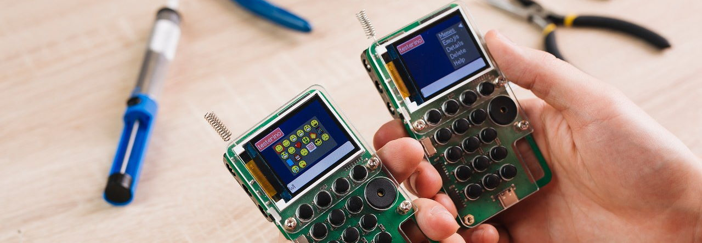

# CircuitMess Tutorials

Dieses GitHub Repository enthält deutsche Übersetzungen von Bauanleitungen und Nutzerhandbüchern
ausgewählter Bastelkits von [CircuitMess](https://circuitmess.com/).

Die deutschen Übersetzungen für die **Wacky Robot Bausätze** sind inzwischen auch auf der
offiziellen [CircuitMess Guides Homepage](https://learn.circuitmess.com/resources/guides) verfügbar
(Links siehe Tabelle).

## Wacky Robot Bausätze

| Markdown (DE)                      | PDF (DE)              | CircuitMess Guides (EN)                                                                                             | CircuitMess Guides (DE)                                                                                                      |
|------------------------------------|-----------------------|---------------------------------------------------------------------------------------------------------------------|------------------------------------------------------------------------------------------------------------------------------|
| [CAPACITRON](capacitron/README.md) | [PDF](CAPACITRON.pdf) | [CAPACITRON, The Wacky Robot Build Guide](https://learn.circuitmess.com/resources/guides/en/capacitron-build-guide) | [Bauanleitung - CAPACITRON, der verrückte Roboter](https://learn.circuitmess.com/resources/guides/de/capacitron-build-guide) |
| [MR. BEE](bee/README.md)           | [PDF](BEE.pdf)        | [MR. BEE, The Wacky Robot Build Guide](https://learn.circuitmess.com/resources/guides/en/mrbee-build-guide)         | [Bauanleitung - MR. BEE, der verrückte Roboter](https://learn.circuitmess.com/resources/guides/de/mrbee-build-guide)         |
| [BOB](bob/README.md)               | [PDF](BOB.pdf)        | [BOB, The Wacky Robot Build Guide](https://learn.circuitmess.com/resources/guides/en/bob-build-guide)               | [Bauanleitung - BOB, der verrückte Roboter](https://learn.circuitmess.com/resources/guides/de/bob-build-guide)               |
| [RESISTRON](resistron/README.md)   | [PDF](RESISTRON.pdf)  | [RESISTRON, The Wacky Robot Build Guide](https://learn.circuitmess.com/resources/guides/en/resistron-build-guide)   | [Bauanleitung - RESISTRON, der verrückte Roboter](https://learn.circuitmess.com/resources/guides/de/resistron-build-guide)   |
| [MARV](marv/README.md)             | [PDF](MARV.pdf)       | [MARV, The Wacky Robot Build Guide](https://learn.circuitmess.com/resources/guides/en/marv-build-guide)             | [Bauanleitung - MARV, der verrückte Roboter](https://learn.circuitmess.com/resources/guides/de/marv-build-guide)             |

## Chatter

In Arbeit

| Markdown (DE)                                   | PDF (DE)                 | CircuitMess Guides (EN)                                                                      |
|-------------------------------------------------|--------------------------|----------------------------------------------------------------------------------------------|
| [Chatter Bauanleitung](chatter/build/README.md) | [PDF](CHATTER-Build.pdf) | [Chatter Build Guide](https://learn.circuitmess.com/resources/guides/en/chatter-build-guide) |
| -                                               | -                        | [Chatter Usage Guide](https://learn.circuitmess.com/resources/guides/en/chatter-usage-guide) |

## Copyright

Die Rechte an den originalen englischen Texten inkl. der verwendeten Bilder
sowie den verlinkten deutschen Übersetzungen liegen bei CircuitMess.
