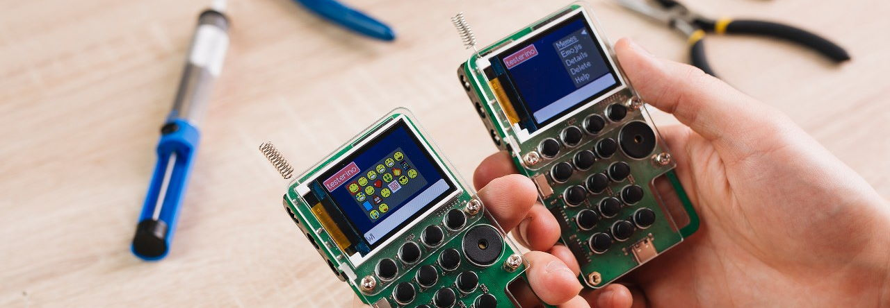
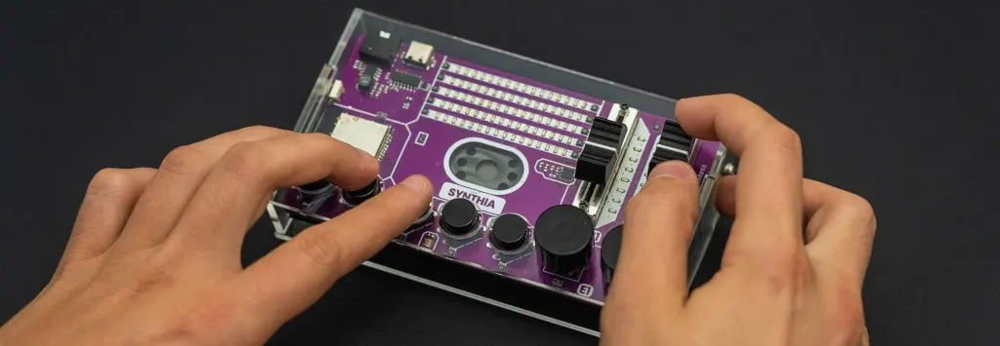

# CircuitMess Tutorials

Dieses GitHub Repository enthält deutsche Übersetzungen von Bauanleitungen und Nutzerhandbüchern
ausgewählter Bastelkits von [CircuitMess](https://circuitmess.com/).

Die Anleitungen können über die unten angegebenen Links online gelesen werden.  
Außerdem stehen automatisch generierte [PDFs zum Download](https://github.com/ramdacxp/circuitmess-tutorials/releases) zur Verfügung.

## Wacky Robot Bausätze

Die deutschen Übersetzungen der **Wacky Robot Bausätze** sind inzwischen auch auf der offiziellen [CircuitMess Guides Homepage](https://learn.circuitmess.com/resources/guides) verfügbar.

Deutsche Übersetzungen:

* [CAPACITRON](tutorials/robots/capacitron/README.md)
* [MR. BEE](tutorials/robots/bee/README.md)
* [BOB](tutorials/robots/bob/README.md)
* [RESISTRON](tutorials/robots/resistron/README.md)
* [MARV](tutorials/robots/marv/README.md)

Die Übersetzungen basieren auf diesen CircuitMess Guides (englisch):

* [CAPACITRON, The Wacky Robot Build Guide](https://learn.circuitmess.com/resources/guides/en/capacitron-build-guide)
* [MR. BEE, The Wacky Robot Build Guide](https://learn.circuitmess.com/resources/guides/en/mrbee-build-guide)
* [BOB, The Wacky Robot Build Guide](https://learn.circuitmess.com/resources/guides/en/bob-build-guide)
* [RESISTRON, The Wacky Robot Build Guide](https://learn.circuitmess.com/resources/guides/en/resistron-build-guide)
* [MARV, The Wacky Robot Build Guide](https://learn.circuitmess.com/resources/guides/en/marv-build-guide)

## Chatter

Deutsche Übersetzungen:

* [Chatter Bauanleitung](tutorials/chatter/build/README.md)
* [Chatter Benutzerhandbuch](tutorials/chatter/usage/README.md)
* [Chatter's Aufbau und Komponentenübersicht](tutorials/chatter/anatomy/README.md)
* [Chatter Programmierung - Erste Schritte](tutorials/chatter/coding/README.md)

Die Übersetzungen basieren auf diesen CircuitMess Guides (englisch):

* [Chatter Build Guide](https://learn.circuitmess.com/resources/guides/en/chatter-build-guide)
* [Usage Guide](https://learn.circuitmess.com/resources/guides/en/chatter-usage-guide)
* [Chatter Anatomy Guide](https://learn.circuitmess.com/resources/guides/en/chatter-anatomy-guide)
* [Chatter coding - first steps](https://learn.circuitmess.com/resources/guides/en/chatter-coding)

## Synthia

Deutsche Übersetzungen:

* [Synthia Bauanleitung](tutorials/synthia/build/README.md)
* [Synthia Benutzerhandbuch](tutorials/synthia/usage/README.md)

Die Übersetzungen basieren auf diesen CircuitMess Guides (englisch):

* [Synthia Build Guide](https://learn.circuitmess.com/resources/guides/en/synthia-build-guide/)
* [Synthia Usage Guide](https://learn.circuitmess.com/resources/guides/en/synthia-usage-guide)

## Copyright

Die Rechte an den originalen englischen Texten inkl. der verwendeten Bilder
sowie den verlinkten deutschen Übersetzungen liegen bei CircuitMess.
