# Bauanleitung - BOB, der verrückte Roboter

* [Einführung](#einführung)
* [Hier sind die Werkzeuge!](#hier-sind-die-werkzeuge)
* [Zusammenbau](#zusammenbau)

## Einführung

### Aller Anfang ist leicht

**Willkommen bei BOBs Bauanleitung!**
Wenn du dieser Bauanleitung folgst, lernst du, wie du deinen eigenen verrückten
Roboter - **BOB!** - zusammenbauen kannst.

BOB ist ein auch für Anfänger geeigneter 16-teiliger Bausatz.
Mit BOB lernst du das Löten und die Leuchtdioden (LEDs) kennen.

#### Altersgruppe

Dieser Bausatz ist geeignet ab einem Alter von 9 Jahren.
Achte darauf, dass dir ein Erwachsener beim Zusammenbau hilft.
Es ist in Ordnung, um um Hilfe bitten.

#### Aufbauzeit

Für den vollständigen Zusammenbau deines BOB solltest du etwa **1 Stunde** einplanen.

#### Benötigte Fertigkeiten

Du musst keine besonderen Fähigkeiten haben, um dich an diesem Selbstbauprojekt zu versuchen. Das Hauptziel ist es, Spaß zu haben und etwas Neues zu lernen.

### Woraus besteht der Bausatz?

Lass' uns alle Teile des Bausatzes kennen lernen!

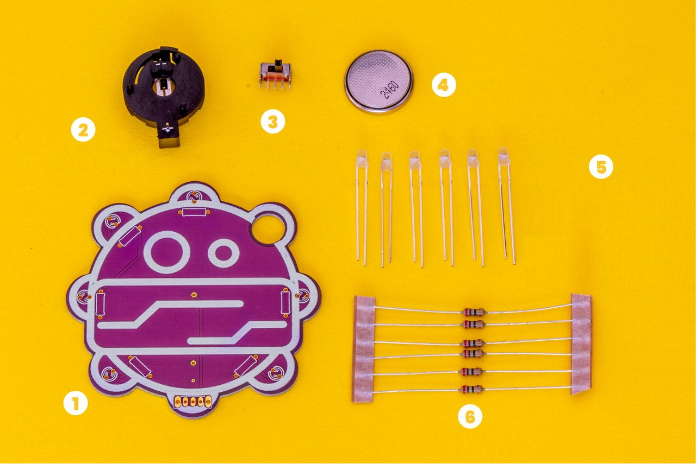

Falls etwas fehlen sollte, kontaktiere uns bitte über die Email Adresse [contact@circuitmess.com](mailto:contact@circuitmess.com). Bitte schicke uns ein Foto von allem, was im Karton war, und wir werden uns so schnell wie möglich bei dir zurück melden, um das Problem zu lösen.

Hier ist die Liste der Bauteile:

1. Leiterplatte
2. Batteriehalter
3. Schalter
4. 3V Knopfzellenbatterie
5. 3mm Leuchtdioden (RGB-LEDs) mit eingebautem Farbwechselchip
6. Widerstände

### Kleines Elektronik 1x1

Lass uns etwas über die unterschiedlichen Bauteile erfahren!

#### 1. Leiterplatte

Das lila Ding, das du in deinem Bausatz hast, heißt Leiterplatte.
Fachleute nennen es auch Platine oder PCB. Das ist die Abkürzung für die englische Bezeichnung *printed circuit board*.

Eine Leiterplatte ist eine laminierte Sandwichstruktur aus leitenden und isolierenden Schichten.

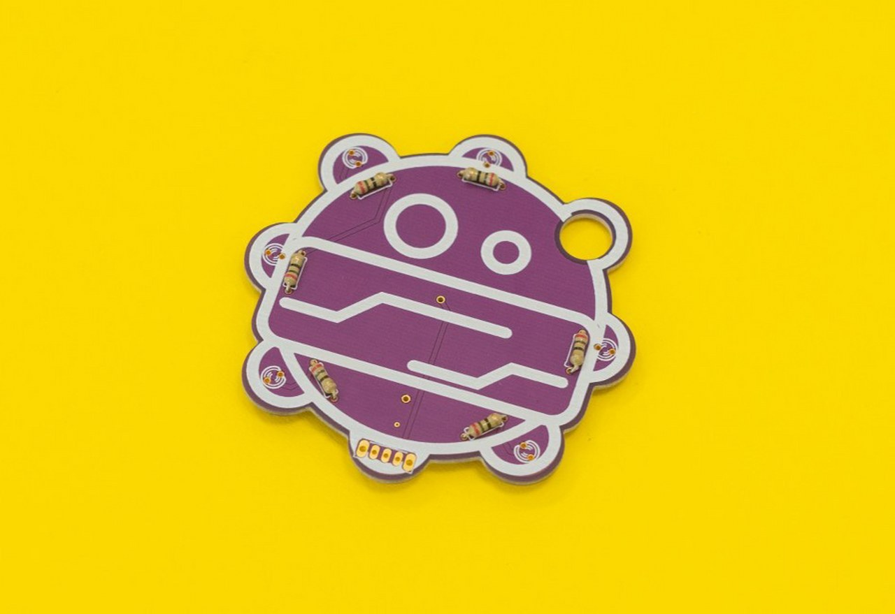

##### Was macht sie?

Eine Leiterplatte hat zwei Funktionen:

* Sie hält alle elektronischen Bauteile an ihrem Platz.
* Sie stellt die elektrischen Verbindungen zwischen den elektronischen Bauteilen her.

**Dank der Leiterplatte können alle elektronischen Bauteile quasi als Team zusammenarbeiten.**

##### Was sind das für winzige Linien auf meiner Leiterplatte?

Sie sorgen dafür, dass elektrische Ladungen zwischen den Bauteilen fließen können. Auf diese Weise werden die elektronischen Bauteile mit Strom versorgt und können mithilfe von Elektrizität clevere Dinge tun.

##### Woraus besteht meine Leiterplatte?

Leiterplatten werden in der Regel aus mit Glasfasern verstärkten und mit Epoxid beschichteten Platten hergestellt. Diese werden auch als "FR4"-Platten bezeichnet.

Die FR4-Platten werden als isolierendes, nicht leitendes Material verwendet.
Kupfer hingegen wird als leitendes Material eingesetzt.

**Wenn ein Material leitfähig ist, leitet es Elektrizität. Die elektrische Ladung kann leicht durch dieses Material fließen.**

FR4 und Kupfer werden in dünnen Lagen zusammengefügt. So entsteht dann eine Leiterplatte.

##### Wo werden Leiterplatten verwendet?

Sie werden überall verwendet! In deinem Telefon, im Laptop, in deinem Kühlschrank, in Klimaanlagen. Im Grunde besitzt jedes elektronische Gerät, das du benutzt, spezielle Leiterplatten, die es zum Funktionieren bringen.

##### Wusstest du das?

**Die Leiterplatte ist eine der wichtigsten Erfindungen der letzten 100 Jahre.**

Ohne sie wäre es nicht möglich, in den Weltraum zu fliegen.

**Leiterplatten wurden von Paul Eisler erfunden.**

Er erfand sie in den 1930er Jahren. Die Vorläufer der heutigen Leiterplatten gibt es aber schon seit dem Zeitalter der Grammophone und Röhrenradios, nur in einer etwas anderen Form.

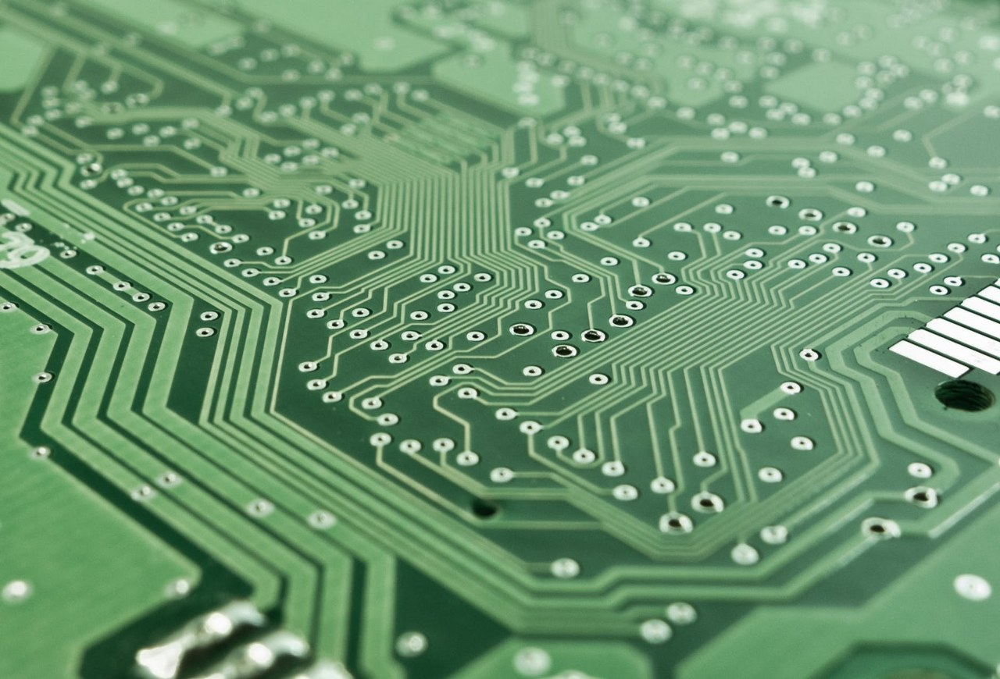

#### 2. Widerstände

Widerstände sind die grundlegendsten elektronischen Bauteile, die in fast jedem elektronischen Gerät zu finden sind. Sie gehören zur Kategorie der passiven elektronischen Bauteile.

Passive elektronische Bauteile erzeugen keine elektrische Energie und benötigen keine elektrische Energie, um zu funktionieren. Sie verändern lediglich den Fluss der elektrischen Energie auf ihre eigene Art und Weise.

Die Widerstände, die du im Bausatz erhalten hast, haben eine zylindrische Form und zwei winzige Metallbeine. Wir nennen diese Beinchen "**Bauteilanschlüsse**".

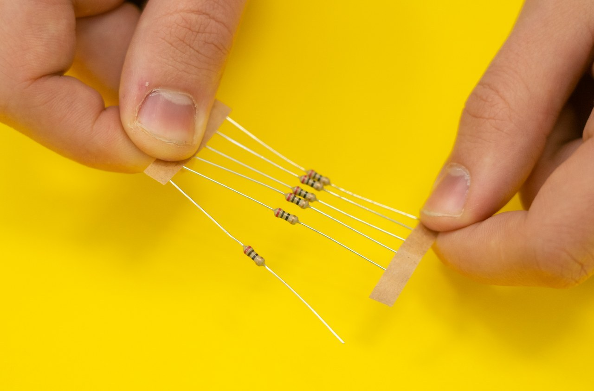

##### Ohmscher Widerstand

Widerstände haben die Eigenschaft des **Ohmschen Widerstands** - sie verringern die Menge an elektrischer Energie, die durch den Stromkreis fließt. Sie "widerstehen" dem Fluss der elektrischen Energie.

Die Einheit des Widerstands heißt Ohm und wurde nach dem deutschen Physiker **Georg Simon Ohm** benannt.

Widerstände werden u. a. dazu verwendet, den Stromfluss durch einen elektronischen Schaltkreis zu regulieren.

Der genaue Wert eines Widerstands wird mit einem Gerät namens Ohmmeter gemessen.

##### Womit könnten wir das vergleichen?

Wenn wir eine Analogie zu Wasser herstellen, das durch Rohre fließt, ist der Widerstand ein dünnes Rohr, das den Wasserdurchfluss reduziert.

**Wissenschaftler und Ingenieure haben für jedes einzelne elektronische Bauteil verschiedene Symbole erfunden.**

Dies ist ein elektronisches Symbol für einen Widerstand:

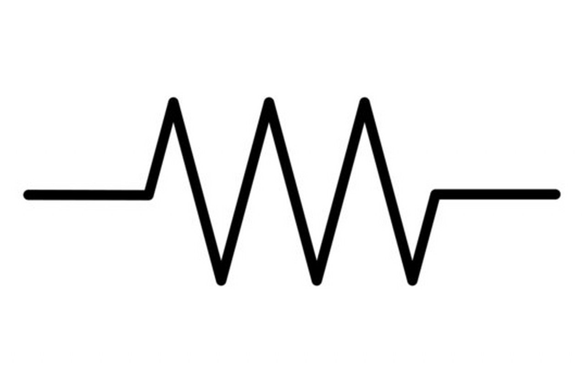

Das ist Georg Simon Ohm:

#### 3. Knopfzellenbatterie

Eine Batterie ist eine elektrische Energiequelle, die aus elektrochemischen Zellen besteht. Jeder Batterie besteht aus Chemikalien. Diese Chemikalien verursachen chemische Reaktionen und erzeugen elektrische Energie.

Unsere Batterie wurde aus einem Material namens Lithium hergestellt.

Siehst du die kleine Aufschrift "3V" auf der Batterie? Das bedeutet "drei Volt".

**Volt ist die Maßeinheit für die elektrische Spannung.**

Die Volt-Zahl ist auf fast jeder Batterie angegeben, da sie eine der wichtigsten Informationen über die Batterie ist.

Die Spannung ist eine Art "Druck", der die Ladung durch einen Stromkreis treibt.

**Verschiedene elektronische Geräte haben unterschiedliche Batterien mit unterschiedlichen Spannungen.**

Ein Mobiltelefon hat zum Beispiel eine Batterie mit 3,7 Volt, ein Auto hat eine Batterie mit einer Spannung von 12 Volt.

**Nützlicher Tipp:** Die spezielle Batteriegröße und das Modell unserer Batterie wird als **CR2032-Knopfzelle** bezeichnet.

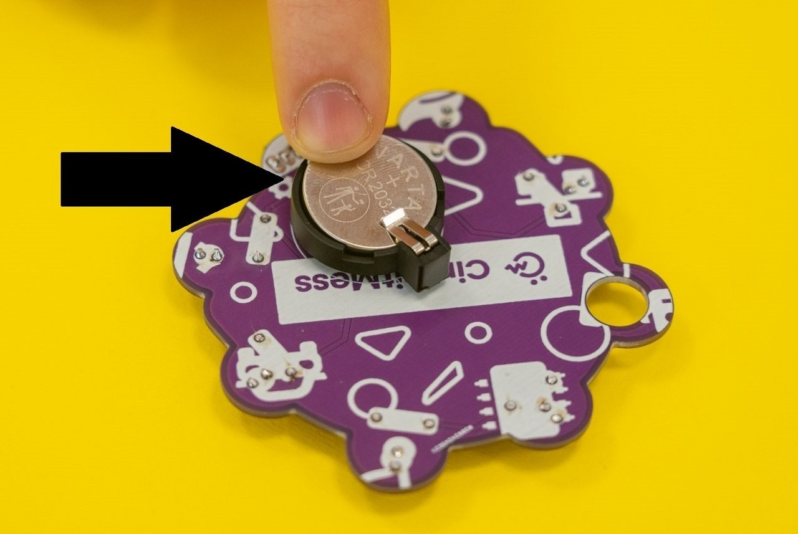

#### 4. Batteriehalter

Der Batteriehalter ist ein elektronisches Bauteil aus Kunststoff mit zwei federnden Metallbeinen. Er dient dazu, die Knopfzellenbatterie an ihrem Platz zu halten und sie mit dem Rest der elektronischen Schaltung zu verbinden.

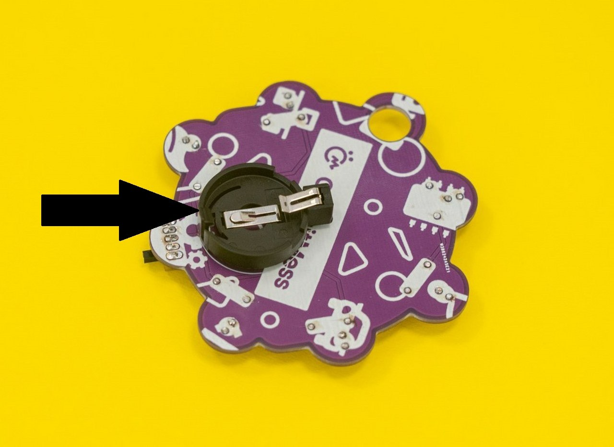

#### 5. Schalter

Mit dem Schalter, den wir in unserem Bausatz haben, können wir das Gerät ein- und ausschalten. Hierfür muss einfach der Griff nach links oder rechts bewegt werden.

Ein Schalter steuert den Stromfluss zu einem elektrischen Gerät - mit anderen Worten, er verbindet und trennt einen Stromkreis.

Schalter werden in fast jedem elektronischen Gerät verwendet. Man findet sie in Mobiltelefonen, Computern, Klimaanlagen usw.

**Historischer Fakt:** Ein elektrischer Schalter wurde 1884 von John Henry Holmes erfunden, der ihn zum Ein- und Ausschalten von Lampen verwendete.

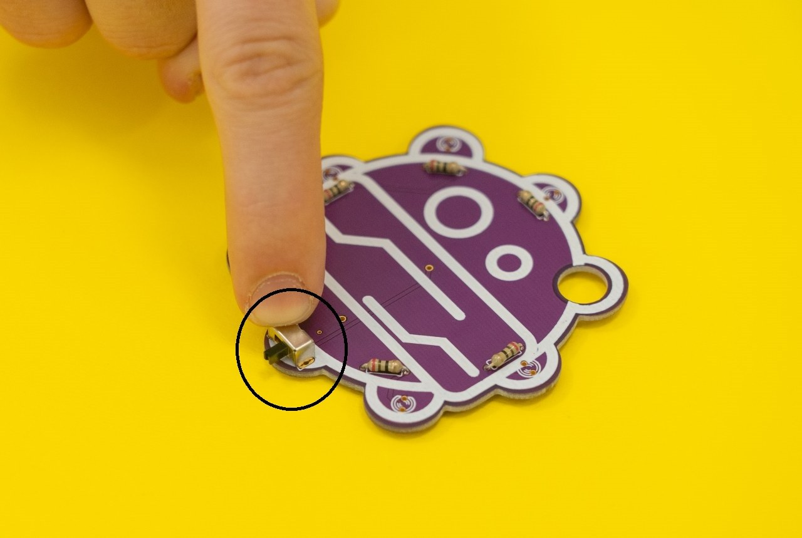

#### 6. Leuchtdioden (3mm RGB-LEDs) mit eingebautem Farbwechselchip

Das Beste an BOB sind die RGB-LEDs, die ihm einen einzigartigen Look verleihen. Sobald du ihn einschaltest, leuchtet er in verschiedenen Farben.

##### Was bewirken LEDs?

LED steht für **Licht emittierende Dioden**.
LEDs wandeln elektrische Energie in sichtbares Licht um.

Dies ist ein elektronisches Symbol für eine Leuchtdiode:

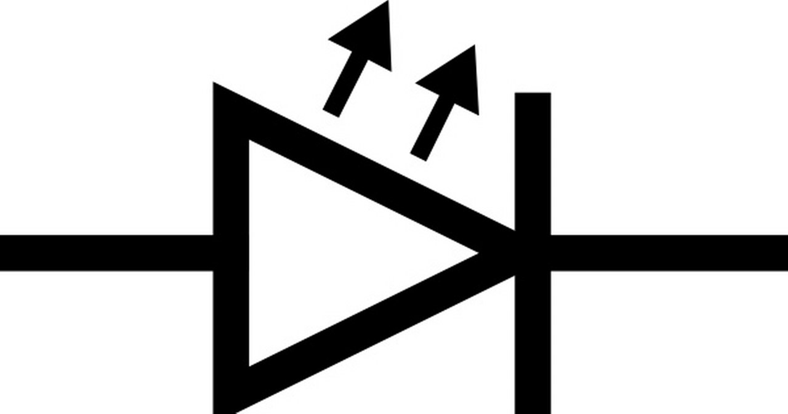

**RGB** im Namen steht für **Rot, Grün und Blau**.

Das bedeutet, dass diese besonderen Leuchtdioden in drei verschiedenen Farben leuchten können.

Unsere LEDs sind etwas ganz Besonderes, denn sie haben einen winzigen eingebauten Chip, der die Farbe der LED ändert. Wenn du genau in eine LED schaust, siehst du einen schwarzen Punkt - den Chip, der die Farben steuert.

**Achte bitte darauf, dass du die LEDs richtig in die Platine einsetzt!**

**Achtung - LEDs müssen richtig gepolt werden!**

Leuchtdioden (LEDs) sind polarisiert. Das bedeutet, dass sie den Strom nur in eine Richtung fließen lassen.
Aus diesem Grund musst du darauf achten, wie du deine LED in der elektronischen Schaltung platzierst.

Die winzigen Metallbeine jeder LED **sind nicht gleich lang**. Dies kennzeichnet die Polarität!

* Der positive Beinchen ist länger (wir nennen es Anode), und
* das kürzere Beinchen ist negativ (er hat einen lustigen Namen - Kathode).

**Die elektrische Energie fließt von der Anode zur Kathode und nicht in die entgegengesetzte Richtung.**

Wenn du die LED falsch herum anbringst, wird sie nicht leuchten, weil die elektrische Energie nicht durch sie hindurchfließen kann.

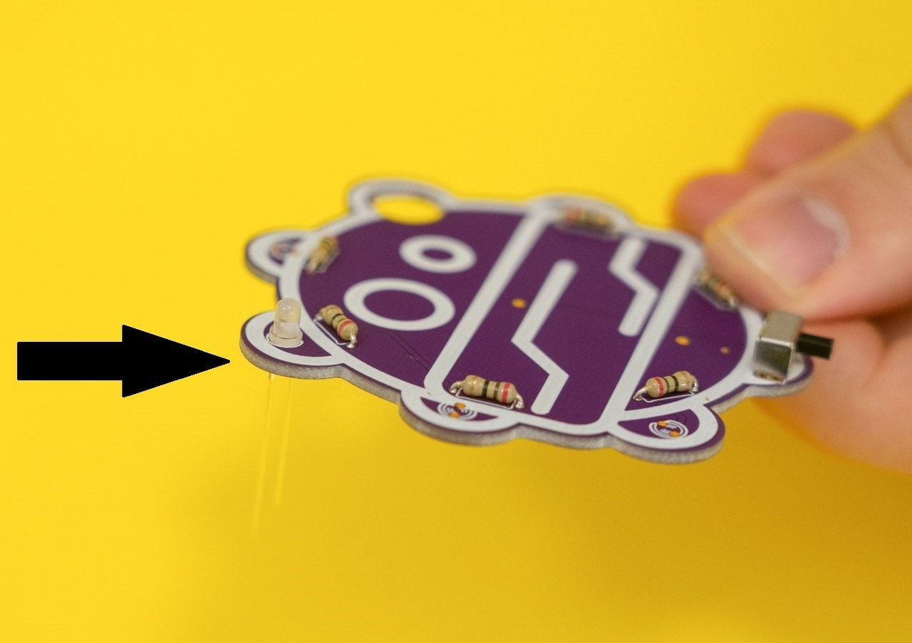

##### Widerstände und LEDs sind ein gutes Team!

LEDs können beschädigt werden, wenn sie zu viel Energie erhalten.

Oh nein! Die Knopfzellenbatterie, die mit deinem BOB geliefert wird, ist zu viel für die armen kleinen LEDs. Aber keine Sorge, **wir haben Widerstände zur Rettung geschickt!**

**Historischer Fakt:** Der russische Erfinder Oleg Wladimirowitsch Losev stellte 1927 die erste LED her.

##### Wusstest du schon?

LED-Lampen sind die effizienteste Art von Lampen.

Im Gegensatz zu normalen "alten" Glühbirnen, die 90% ihrer Energie in Form von Wärme abgeben, nutzen LEDs die Energie sehr viel effizienter und vergeuden nur sehr wenig Wärme.

## Hier sind die Werkzeuge!

Lass uns deinen verrückten Roboter zusammenbauen! Zuerst brauchen wir ein paar Werkzeuge!

### Lötkolben

Für den Zusammenbau reicht ein einfacher Lötkolben aus.

Wenn du allerdings vorhast, in die Welt der Heimwerkerprojekte einzutauchen, solltest du dir einen teureren Lötkolben mit mehr Funktionen zulegen.

**Außerdem brauchst du einen Lötkolbenständer** und eine kleine Rolle mit kolophoniumhaltigem Lot bzw. Lötzinn.

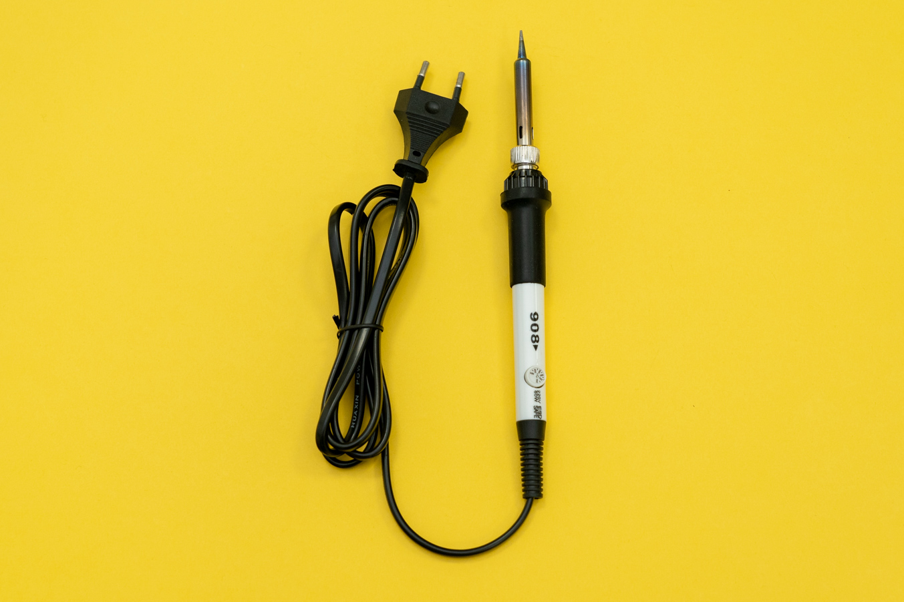

### Lötschwamm

Zu deinem Löt-Werkzeug sollte auch ein **Schwamm** gehören, mit dem du die Spitze deines Lötkolbens säubern kannst. Achte darauf, dass der Schwamm nicht tropfnass oder knochentrocken ist - er sollte feucht sein.

### Seitenschneider

Ein Seitenschneider dient zum Kürzen von Metallbeinchen oder Drähten.

Wir bevorzugen die auf dem Bild gezeigte Zange (Plato, Modell 170), aber auch jedes andere Modell ist geeignet.

## Zusammenbau

### Wie löte ich richtig?

Eines der Dinge, die du beim Zusammenbau von Bobs tun wirst, ist löten!

Hast du das schon einmal gemacht? Wenn nicht, empfehlen wir, dir die folgenden Links anzusehen, die zu nützlichen Anleitungen und Blogs zum Thema Löten führen. Du wirst nur 10 Minuten brauchen, um dich in die Materie einzuarbeiten und zu verstehen, wie es gemacht wird.

Hier sind die Links (englisch):

* [Adafruits Video Tutorial mit Collin Cunningham](https://www.youtube.com/watch?v=QKbJxytERvg) - Ein Tutorial mit Collin Cunningham, einem super charismatischen Elektronik-Guru.
* [Adafruits Löt Tutorial](https://learn.adafruit.com/adafruit-guide-excellent-soldering?view=all) - Ein großartiges und ausführliches Video-Tutorial. Ein absolutes Muss, auch wenn Du schon weißt, wie man lötet. Besonders zu empfehlen ist der Abschnitt "Häufige Fehler beim Löten" am Ende.
* [Sparkfuns Video-Tutorial zum Löten](https://www.youtube.com/watch?v=f95i88OSWB4) - Ein weiteres gut gemachtes Video-Tutorial zum Thema Löten.
* [Sparkfuns Standard Soldering Tutorial](https://learn.sparkfun.com/tutorials/how-to-solder-through-hole-soldering) - Ein detailliertes Tutorial von Sparkfun.

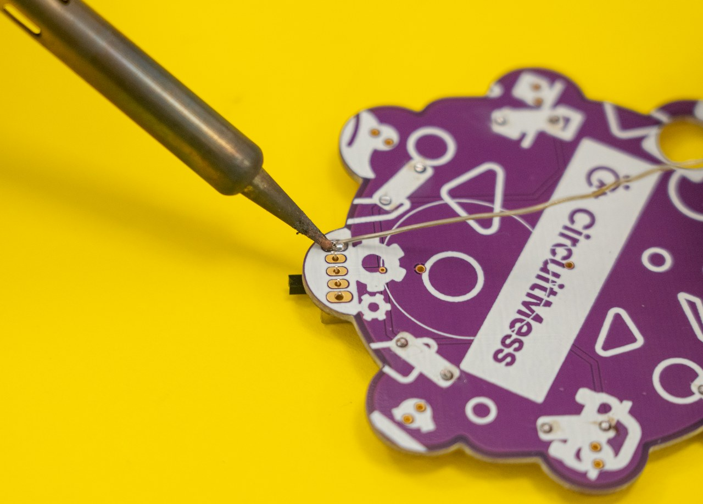

Hier ist ein großartiges Bild von Adafruit Industries, das dir beim Löten helfen kann (danke Adafruit!):

* Cold Joint - Kalte Lötstelle
* Insufficient Wetting - Unzureichende "Benetzung" des Lötstelle; zu wenig Lot
* Too Much Solder - Zu viel Lot

### Regeln

Dies sind die Regeln für das Löten, die Sie jedes Mal befolgen sollten:

* **Atme niemals die Dämpfe ein, die der Lötkolben produziert!**
* **Der Lötkolben wird heiß! Berühre nicht die Spitze des Lötkolbens!**
  Auch wenn der Lötkolben ausgeschaltet oder ganz von der Stromquelle getrennt ist, kann er noch sehr heiß sein und daher bei Berührung sehr unangenehme Schmerzen verursachen.
  Halte den Lötkolben immer so, dass die Spitze von deinen Händen weg zeigt.
  Wenn du mit dem Löten fertig bist, trenne den Lötkolben von der Stromquelle und lasse ihn mindestens fünf Minuten abkühlen, bevor du ihn wieder verstaust.
* **Reinige den Lötkolben!**
  Verwende den Schwamm häufig und reinige deinen Lötkolben, wenn du einfach und problemlos löten möchtest.
  Halte dazu ein Ende des Schwamms vorsichtig mit einer Hand fest und wische die Spitze des Lötkolbens am anderen Ende des Schwamms ab, um das überschüssige Lot zu entfernen. Wiederhole dies so lange bis die Spitze des Lötkolbens schön sauber ist.
* **Prüfe deine Lötstellen. Zweimal!** (mindestens)
* **Bewahre den Lötkolben auf dem Ständer auf**, wenn du ihn nicht benutzt.
* **Verwende die richtige Menge Lötzinn!**
  Achte darauf, dass du gerade genug Lot verwendest. Nicht zu viel, aber auch nicht zu wenig, denn beides kann dazu führen, dass dein Bausatz dann nicht funktioniert.
* **Lass keine Lot-Rests auf der Platine!**
  Das Lötzinn sollte sich nur auf den Teilen befinden, an denen die Stifte mit der Platine verbunden sind. Halte den Rest der Platine sauber!

**Bitte lies dir diese Regeln jetzt noch ein paar Mal durch, damit du sie niocht vergisst!**

Wenn du diese Regeln befolgst, sollte das Löten für dich ein Kinderspiel sein.

### Verwendung des Lötkolbens

Der Lötkolben ist sehr einfach zu benutzen, wenn er richtig eingesetzt wird.

#### Schritt 1 - Einstecken

Lege den Lötkolben auf einen Lötkolbenständer und schließen Sie ihn an eine Steckdose an.

#### Schritt 2 - Wähle die richtige Temperatur

Stelle die Temperatur auf 350 °C ein, indem du den Temperaturregler am Lötkolben drehst.
Achte darauf, dass der kleine schwarze Pfeil auf die richtige Temperatur zeigt, wie auf dem Foto zu sehen.

Dein Lötkolben ist jetzt einsatzbereit, aber lass ihm ein bis zwei Minuten Zeit, damit er sich aufheizen kann.

#### Schritt 3 - Vergiss nicht, ihn auszuschalten, wenn du fertig bist

Wenn du mit dem Löten fertig bist, ziehe den Stecker aus der Steckdose, um den Lötkolben auszuschalten.

Bitte benutze den Metallständer immer dann, wenn du den Lötkolben nicht benutzt.
Damit stellst du sicher, dass deine Unterlage oder die Platine nicht verbrennen.

Achte darauf, nach dem Ausschalten die Spitze des Lötkolbens mindestens fünf Minuten lang nicht zu berühren.

