# Chatter Bauanleitung

* [Einführung](#einführung)
* [Hier sind die Werkzeuge!](#hier-sind-die-werkzeuge)
* [Zusammenbau](#zusammenbau)
* [Wie geht's weiter?](#)

## Einführung

### Aller Anfang ist leicht

**Willkommen bei der CircuitMess Chatter Bauanleitung!**

In dieser Bauanleitung erfährst du, wie du ein Kommunikationsgerät zusammen baust, mit dem du drahtlos und verschlüsselt kommunizieren kannst.
Mit Chatter lernst du, wie du deinen privaten SMS-Kommunikator erstellst, wie LoRa funktioniert, wie du benutzerdefinierte Apps programmierst und auf deinen Chatter lädst und was Privatsphäre im Jahr 2022 bedeutet.

#### Altersgruppe

Wie auf der Schachtel beschrieben, ist Chatter für alle **ab 11 Jahren** geeignet.

Du solltest einige der Montageschritte mit Vorsicht angehen - also sorge dafür, dass ein Erwachsener einspringt, wenn du später beim Löten oder Anziehen der Schrauben Hilfe brauchst. Es ist in Ordnung, wenn du um Hilfe bittest.

Aber keine Sorge! Wir gehen den Zusammenbau Schritt für Schritt durch und geben dabei einige nützliche Tipps. Wir geben dir einen Hinweis, wenn du beim Zusammenbau etwas Wichtiges beachten musst.

#### Aufbauzeit

Für den vollständigen Zusammenbau deines Chatters solltest du **etwa 4 Stunden** einplanen.

Natürlich hängt die Montagezeit von deinen Vorkenntnissen und deiner Erfahrung ab. Wenn du noch keine Erfahrung hast, mach' dir keine Sorgen! Es kann sein, dass du etwas länger brauchst, um dich einzuarbeiten und die anfänglichen Schwierigkeiten zu überwinden.

#### Benötigte Fertigkeiten

Du musst keine besonderen Fertigkeiten haben, um dich an diesem Selbstbauprojekt zu versuchen.

Das Hauptziel ist es, Spaß zu haben und etwas Neues zu lernen.

Also pass gut auf, lies alle Anweisungen und mach' dich bereit Spaß zu haben!
Dies ist eine großartige Gelegenheit und dein erster Schritt in deiner großen Ingenieurskarriere.

#### Lernen mit Chatter

Wie bereits erwähnt, wirst du in den folgenden Stunden mit Chatter einige nützliche Dinge lernen.

Diese Punkte hier wirst du lernen:

* Wie du dir deinen eigenen privaten SMS-Kommunikator erstellst
* Was Privatsphäre im Jahr 2022 bedeutet und wie du digital kommunizieren kannst ohne das Internet zu verwenden
* Wie LoRa funktioniert
* Wie Chatter Nachrichten verschlüsselt und entschlüsselt und wie er sich mit anderen Chattern verbindet
* Wie man eigene Apps programmiert und auf seinen Chatter lädt

### Woraus besteht der Bausatz?

Lass' uns alle Teile kennen lernen, die du bekommen hast!

Öffne deine Chatter-Box und überprüfe, ob alle Komponenten enthalten sind. Lege alles auf eine saubere Oberfläche, vergleiche die Teile mit dem Foto und der Liste weiter unten.

Sollte etwas fehlen, kontaktiere uns bitte unter **<contact@circuitmess.com>**. Bitte schicke uns ein Foto von allem, was im Karton war, und wir werden uns so schnell wie möglich bei dir melden, um das Problem zu lösen.

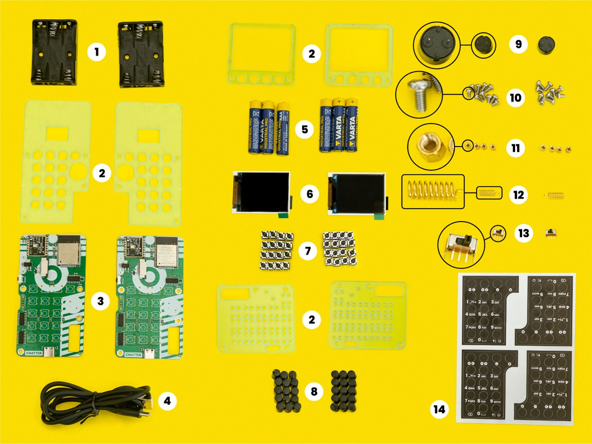

Hier ist die Liste der Komponenten:

1. Batteriehalterungen
2. Acryl-Gehäuse
3. Platine mit eingebautem Kommunikationsmodul
4. USB-C-Kabel für die Programmierung
5. Batterien
6. Display-Platine
7. Taster
8. Tastenkappen
9. Piezo-Summer
10. Metallbolzen
11. Abstandshalter aus Messing
12. Antenne
13. Ein-/Aus-Schalter
14. Aufkleber

## Hier sind die Werkzeuge!

### Benötigte Werkzeuge

In diesem Kapitel erklären wir dir, welche Werkzeuge du für den Zusammenbau deines Chatter benötigst.

Wenn du das **CircuitMess Tools-Paket** besitzt und vor dir liegen hast - dann solltest du bereit sein!

Falls du den Chatter-Bausatz ohne das Werkzeugpaket erhalten hast, ist dies ein guter Zeitpunkt, um sich einige der Werkzeuge auszuleihen oder sie zu kaufen.

Die folgenden, unbedingt benötigten Werkzeuge sind unverzichtbar, wenn du elektronische Geräte zusammenbaust, reparierst oder modifizierst und sind das Handwerkszeug für jeden Maker/Hardware-Hacker/Modder/Elektriker.

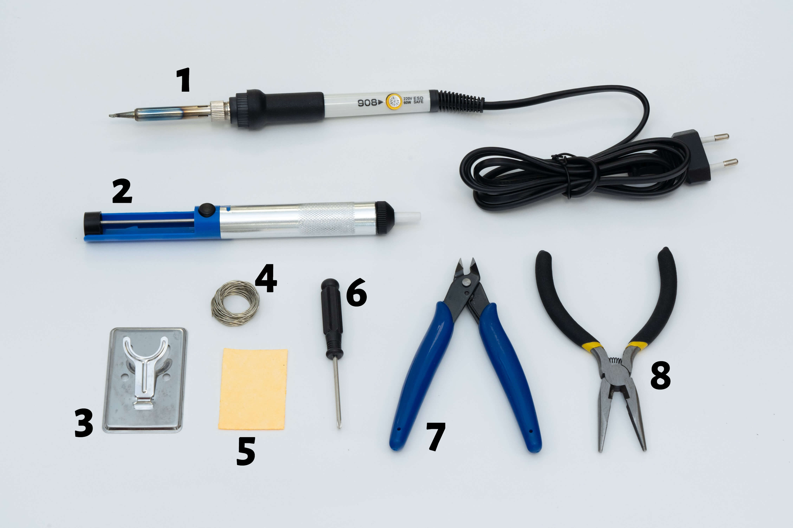

1. Lötkolben
2. Entlöt-Vakuumwerkzeug (Lötsauger)
3. Lötkolbenständer
4. Eine kleine Rolle mit kolophoniumhaltigem Lot
5. Reinigungsschwamm
6. Kreuzschlitzschraubendreher
7. Seitenschneider
8. Spitzzange

#### Lötkolben

Dies ist das wichtigste Werkzeug im Arsenal eines Bastlers.

Für den Zusammenbau von Chatter reicht jeder Lötkolben der Einstiegsklasse aus.

Wenn du vor hast, in die Welt der Heimwerkerprojekte einzutauchen, solltest du einen teureren Lötkolben mit mehr Funktionen in Betracht ziehen. Lötkolben mit austauschbaren Spitzen sind zum Beispiel besonders nützlich, wenn du viel mit kleineren Bauteilen arbeiten möchtest.

Im nächsten Kapitel findest du eine Anleitung zum richtigen Löten und zur Pflege deines Lötkolbens.

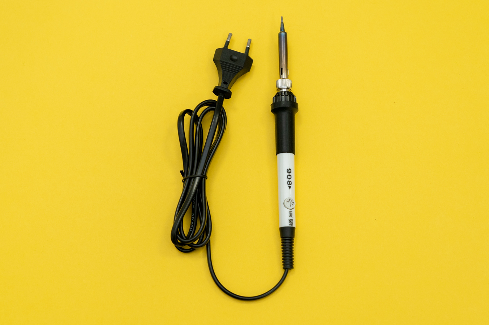

#### Lötschwamm

Dieses kleine Stück macht nicht viel her, bis man es in Wasser einweicht. Dann verwandelt es sich in einen super Lötzinn-Reinigungsschwamm! Benutze ihn, nachdem du ein paar Lötstellen gelötet hast, um das überschüssige Lot von der Spitze deines Lötkolbens zu entfernen. Achte darauf, dass der Schwamm weder tropfnass noch staubtrocken ist - er sollte feucht sein.

#### Seitenschneider

Mit einem Seitenschneider wie diesem kannst du die Beine von gelöteten Bauteilen abschneiden und Drähte kürzen.

Wir bevorzugen die auf dem Bild gezeigte Zange (Plato, Modell 170), aber auch jedes andere Modell ist geeignet.

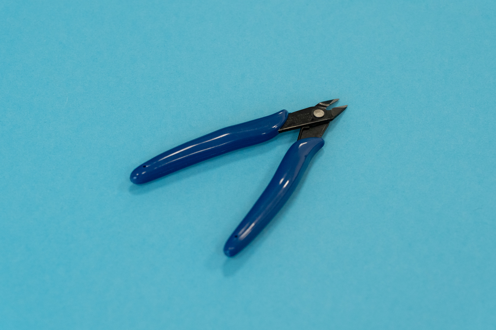

#### Spitzzange

Eine solche Zange brauchst du beim Zusammenbau des Gehäuses oder beim Einstecken kniffliger Stecker!

Sie ist generell hilfreich bei feinmechanischen Arbeiten.

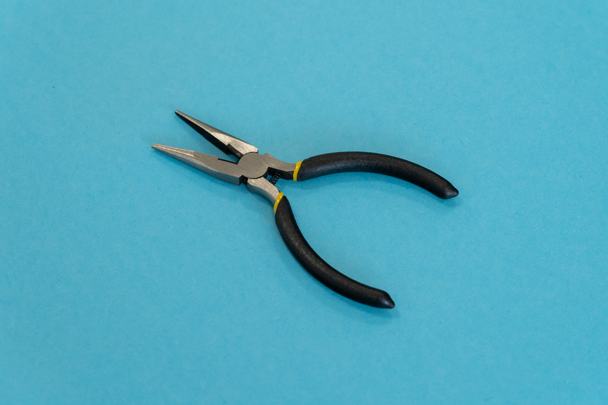

#### Kreuzschlitz - Schraubendreher

Für die Montage des Gehäuses benötigst du diesen Kreuzschlitzschraubendreher.

Ein handelsüblicher 2,0 mm - Kreuzschlitzschraubendreher sollte ausreichen.

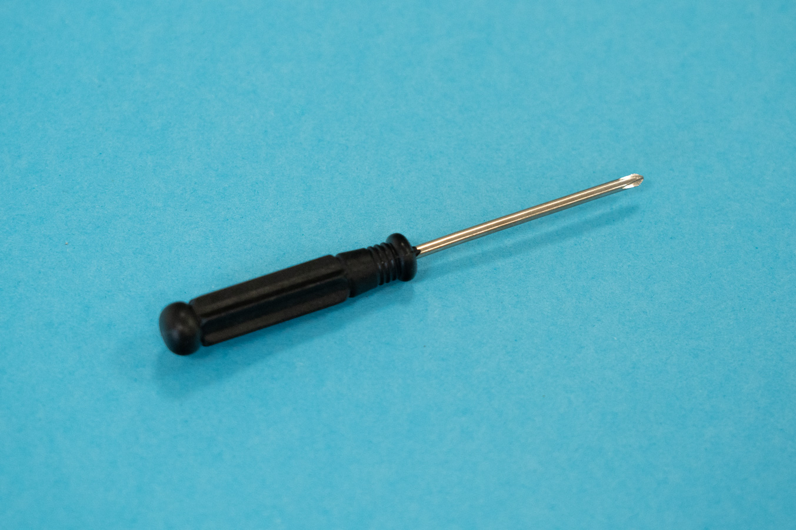

#### Entlöt-Vakuumwerkzeug (Lötsauger)

Dieses Werkzeug ist nützlich, um Lötfehler zu beseitigen. Für die Montage selbst ist es nicht notwendig.

Wenn du vor hast, in Zukunft etwas zu hacken, zu modden oder Hardware zu reparieren, ist es immer eine gute Idee, dieses Werkzeug zu haben.

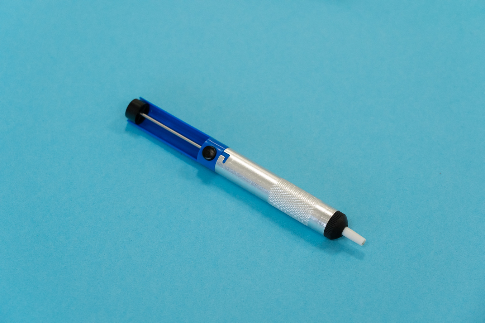

### Zusätzliche nützliche Werkzeuge

#### Helfende dritte Hand mit Lupe

Dies könnte deine Löterfahrung ein wenig angenehmer machen, besonders wenn du kompliziertere Projekte durchführen möchtest.

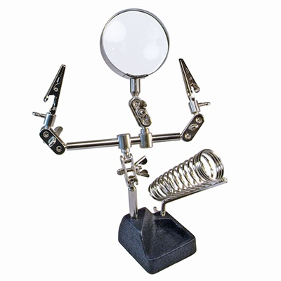

#### Multimeter

Ein Multimeter kann für viele Dinge verwendet werden: zum Prüfen kniffliger Verbindungen, zum Messen der Batteriespannung, zum Testen von Widerständen und Kondensatoren, zum Messen des Stromverbrauchs und vielem mehr.

Es ist ein nützliches Werkzeug, wenn du herausfinden willst, was bei einem Elektronik-Bausatz schief gelaufen ist.

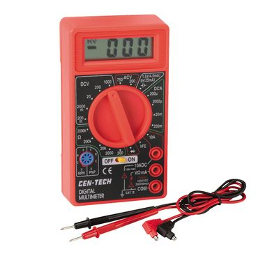

#### Lötdocht

Du kannst den Lötdocht zusammen mit dem Entlöt-Vakuumwerkzeug verwenden, um Lötfehler zu beseitigen. Lege ihn einfach auf die fehlerhafte Lötstelle und drücke mit einem heißen Lötkolben darauf. Dann saugt er das überschüssige Lot auf wie ein Schwamm!

Nützlich zum Korrigieren von Lötstellen, die mit einem Lötsauger nicht leicht zu erreichen sind.

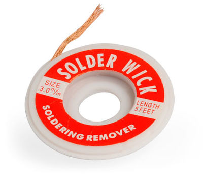

## Zusammenbau

### Einführung in das Löten

Eines der Dinge, die du beim Zusammenbau deines Chatters tun wirst, ist löten!

Hast du das schon einmal gemacht? Wenn nicht, empfehlen wir, dir die folgenden Links anzusehen, die zu nützlichen Anleitungen und Blogs zum Thema Löten führen. Du wirst nur 10 Minuten brauchen, um dich in die Materie einzuarbeiten und um zu verstehen, wie es gemacht wird.

Hier sind die Links (englisch):

* [Adafruits Video Tutorial mit Collin Cunningham](https://www.youtube.com/watch?v=QKbJxytERvg) - Ein Tutorial mit Collin Cunningham, einem super charismatischen Elektronik-Guru.
* [Adafruits Löt Tutorial](https://learn.adafruit.com/adafruit-guide-excellent-soldering?view=all) - Ein großartiges und ausführliches Video-Tutorial. Ein absolutes Muss, auch wenn Du schon weißt, wie man lötet. Besonders zu empfehlen ist der Abschnitt "Häufige Fehler beim Löten" am Ende.
* [Sparkfuns Video-Tutorial zum Löten](https://www.youtube.com/watch?v=f95i88OSWB4) - Ein weiteres gut gemachtes Video-Tutorial zum Thema Löten.
* [Sparkfuns Standard Soldering Tutorial](https://learn.sparkfun.com/tutorials/how-to-solder-through-hole-soldering) - Ein detailliertes Tutorial von Sparkfun.

### Löt-Regeln

Es gibt einige Regeln für das Löten, die jeder, unabhängig von seinem Kenntnisstand, stets beachten sollte:

* **Atme niemals die Dämpfe ein, die der Lötkolben produziert!**
  Diese können gefährlich sein, also atme sie bitte nicht ein.

* **Berühre niemals die Spitze des Lötkolbens!**
  Auch wenn der Lötkolben ausgeschaltet oder ganz von der Stromquelle getrennt ist, kann er noch sehr heiß sein und daher bei Berührung sehr unangenehme Schmerzen verursachen.
  Halte den Lötkolben immer so, dass die Spitze von deinen Händen weg zeigt.
  Wenn du mit dem Löten fertig bist, trenne den Lötkolben von der Stromquelle und lasse ihn mindestens fünf Minuten abkühlen, bevor du ihn wieder verstaust.

* **Reinige den Lötkolben!**
  Der Schwamm ist dein bester Freund beim Löten. Verwende ihn häufig und reinige deinen Lötkolben, wenn du einfach und problemlos löten möchtest.
  Halte dazu ein Ende des Schwamms vorsichtig mit einer Hand fest und wische die Spitze des Lötkolbens am anderen Ende des Schwamms ab, um das überschüssige Lot zu entfernen. Wiederhole dies so lange bis die Spitze des Lötkolbens schön sauber ist.

* **Prüfe deine Lötstellen. Zweimal!** (mindestens)
  Die meisten Fehlfunktionen in der Welt der Elektronik sind auf schlechte Lötstellen zurückzuführen. Unabhängig davon, ob es sich um dein erstes oder 100. Lötprojekt handelt solltest du deine Lötstellen immer mehrmals überprüfen, bevor du zum nächsten Schritt übergehst.

* **Bewahre den Lötkolben auf dem Ständer auf**, wenn du ihn nicht benutzt.

* **Verwende die richtige Menge Lötzinn!**
  Achte darauf, dass du gerade genug Lot verwendest. Nicht zu viel, aber auch nicht zu wenig, denn beides kann dazu führen, dass dein Bausatz dann nicht funktioniert.

* **Lass keine Lot-Reste auf der Platine!**
  Das Lötzinn sollte sich nur auf den Teilen befinden, an denen die Stifte mit der Platine verbunden sind. Halte den Rest der Platine sauber! Kleine Löttropfen auf der ganzen Platine sind ein absolutes Tabu!

**Bitte lies dir diese Regeln jetzt noch ein paar Mal durch, damit du sie nicht vergisst!**

Verwende dieses Foto, um eine Vorstellung von guten und schlechten Lötstellen zu bekommen (Danke an Adafruit für dieses tolle Foto!):

* Cold Joint - Kalte Lötstelle
* Insufficient Wetting - Unzureichende "Benetzung" des Lötstelle; zu wenig Lot
* Too Much Solder - Zu viel Lot
* OK - Super. Alles richtig!

Wenn du diese Regeln befolgst, sollte dir das Löten leicht von der Hand gehen.

### Verwendung des Lötkolbens

Der Lötkolben ist sehr einfach zu benutzen, aber nur, wenn er richtig benutzt wird.

Wenn du das CircuitMess-Werkzeugpaket mit deinem Chatter-Bausatz gekauft hast, hast du einen weißen Lötkolben mit einem Temperaturregler erhalten.

Erinnerst du dich an die zuvor erwähnten Regeln? Gut! Lass uns jetzt die Anweisungen zur Verwendung des Lötkolbens durchgehen...

Wenn du deinen Lötkolben zum ersten Mal benutzt oder Hilfe bei der Reinigung der Spitze brauchst, schau dir unser (englisches) [Video-Tutorial](https://www.youtube.com/watch?v=JPFH4m-Pa00) an.

#### Schritt 1 - Einstecken

Lege den Lötkolben auf einen Lötkolbenständer und schließen Sie ihn an eine Steckdose an.

#### Schritt 2 - Wähle die richtige Temperatur

Stelle die Temperatur auf **350 °C** ein, indem du den Temperaturregler am Lötkolben drehst.
Achte darauf, dass der kleine schwarze Pfeil auf die richtige Temperatur zeigt, wie auf dem Foto zu sehen.

Dein Lötkolben ist jetzt einsatzbereit, aber lass ihm ein bis zwei Minuten Zeit, damit er sich aufheizen kann.

#### Schritt 3 - Vergiss nicht, ihn auszuschalten, wenn du fertig bist

Wenn du mit dem Löten fertig bist, ziehe den Stecker aus der Steckdose, um den Lötkolben auszuschalten.

Bitte benutze den Metallständer immer dann, wenn du den Lötkolben nicht benutzt.
Damit stellst du sicher, dass deine Unterlage oder die Platine nicht verbrennen.

**Achte darauf, nach dem Ausschalten die Spitze des Lötkolbens mindestens fünf Minuten lang nicht zu berühren.**

### Teil 1 - Löten der Bauteile

Jetzt, wo du weißt, wie man lötet, können wir es gleich ausprobieren. Bist du bereit?

Schau' dir vor dem Löten noch einmal unser Video-Tutorial an, um sicher zu gehen, dass du alles richtig machst.

#### Ein/Aus-Schalter

Die ersten Komponenten, die wir verwenden werden, sind Platine und Schalter.

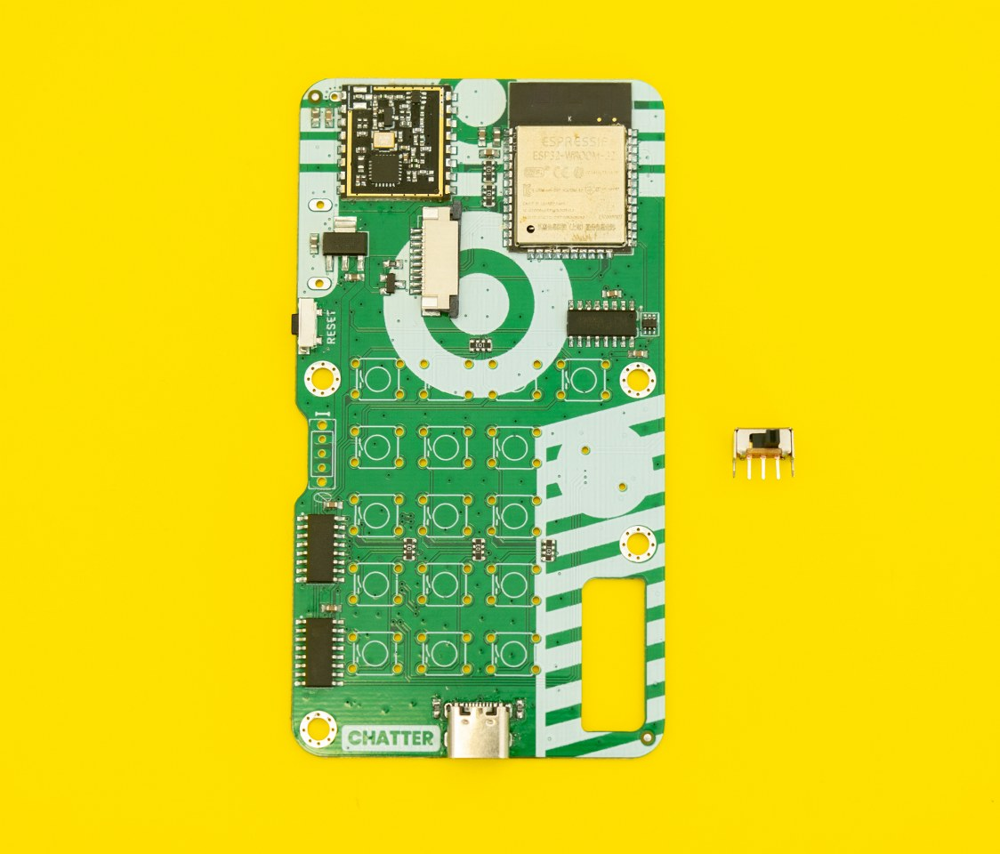

Bevor du dieses Teil einlötest, versuche es ein paar Mal umzuschalten.Jedes Mal, wenn sich der Zustand des Schalters ändert, solltest du ein leises Klicken hören. Bis jetzt macht er noch nichts, aber schon bald wird er deinem Chatter Leben einhauchen, wann immer du es möchtest.

Nimm den Schalter und stecke die Stifte durch die Löcher, so dass der Schalter auf dem vorderen Teil der Platine liegt und die Stifte hinten herausragen.

Der Einbau kann ein wenig Kraft erfordern. Versuche mit dem Schalter leicht hin- und her zu wackeln bis er richtig passt.

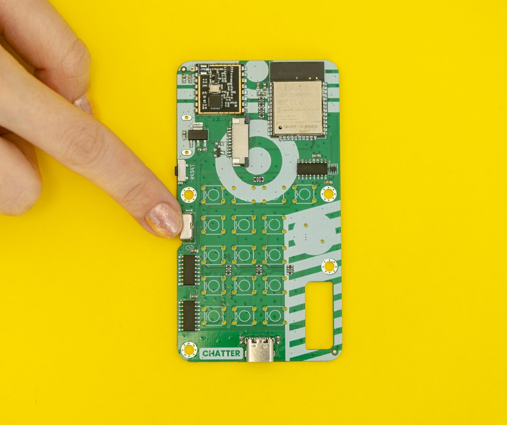

Wenn alles in Ordnung zu sein scheint, drehe die Leiterplatte um.

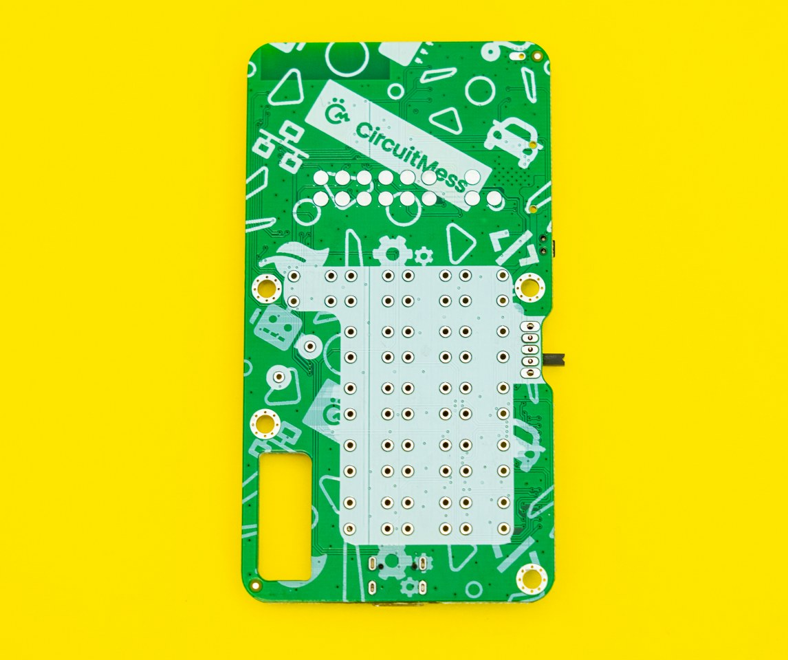

Nimm den Lötkolben vom Ständer und beginne die Stifte an der richtigen Stelle einzulöten.

Das Löten dieser Stifte erfordert ein wenig mehr Präzision, da sie dicht beieinander liegen, so dass es viel leichter ist, sie versehentlich zu überbrücken.

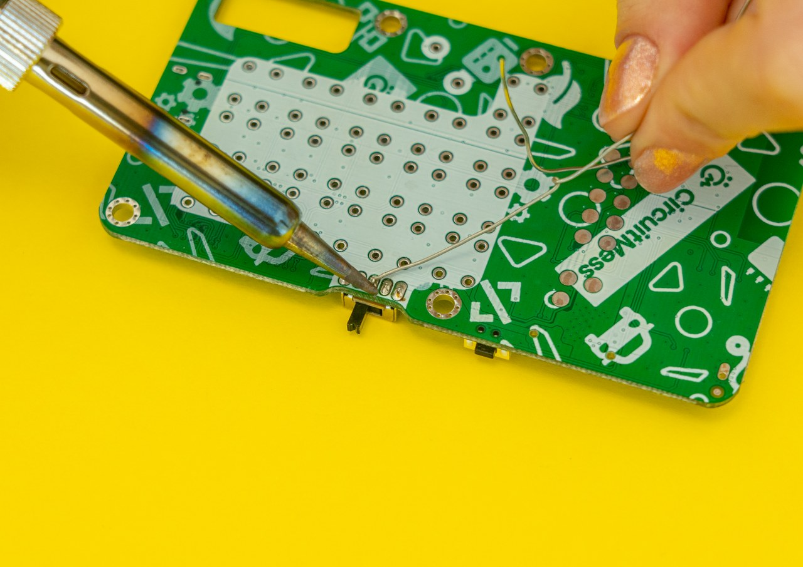

Vergiss nicht, den Schalter an beide Chatter zu löten!

Wir haben gleichzeitig gelötet, aber du kannst auch erst den einen Chatter und dann den anderen anlöten.

So sollten die Lötstellen jetzt aussehen:

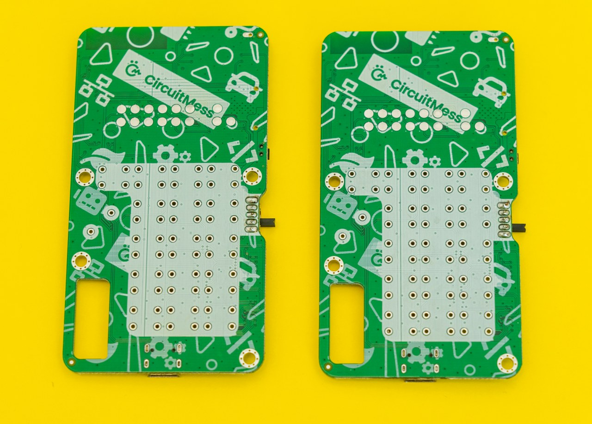

#### Taster

Jetzt ist es an der Zeit, die **Taster** zu verlöten!

Taster sind die am häufigsten verwendeten Eingabegeräte, und es gibt insgesamt 13 von ihnen auf jedem Chatter.

Die Tasten bestehen aus zwei Teilen - **den mechanischen Tastern und den Tastenkappen**. Die Taster funktionieren auch ohne die Kappen, aber wenn man sie mit den Kappen drückt, fühlt sich das viel schöner an und sie sehen viel cooler aus.

Wie auch immer, wir lassen die Kappen erst einmal beiseite und konzentrieren uns auf das Löten der Taster.

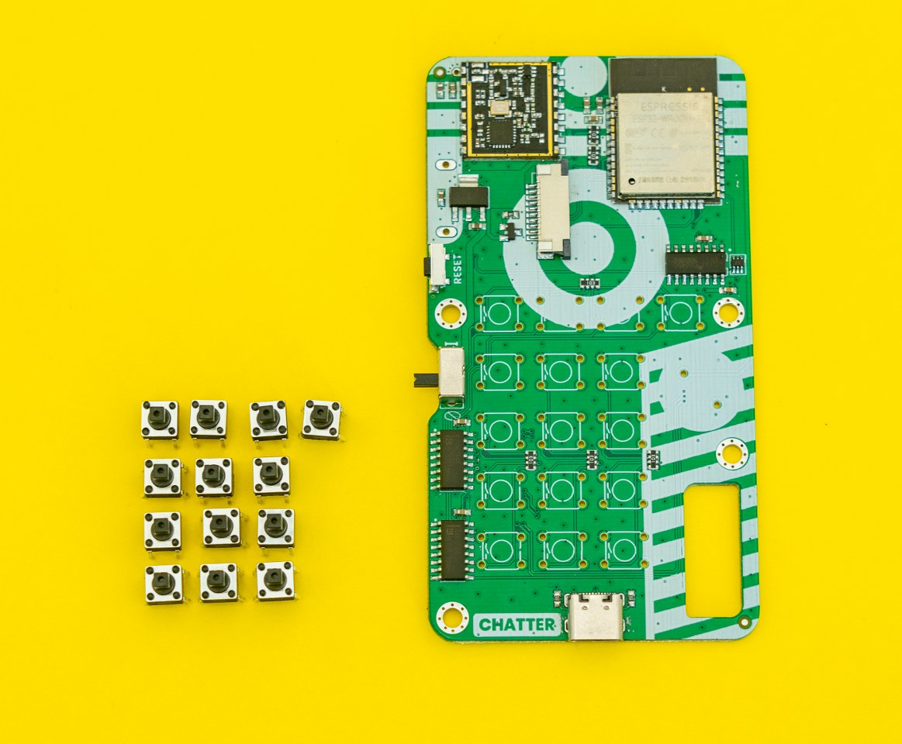

Als Erstes musst du jeden einzelnen Taster auf der Platine platzieren. Sie sollten vertikal auf der Platine platziert werden.

**Vergewissere dich vor dem Einlöten der Taster, dass sie senkrecht auf der Platine stehen. Dies ist sehr wichtig, da du sonst Probleme haben wirst, die Leiterplatte in das Gehäuse einzubauen, wenn die Tasten schief sind.**

Nachdem du die Bauteile an den richtigen Stellen platziert hast (Stifte durch die winzigen Löcher), lege die Leiterplatte vor dir auf die Arbeitsfläche und nimm den Lötkolben zur Hand.

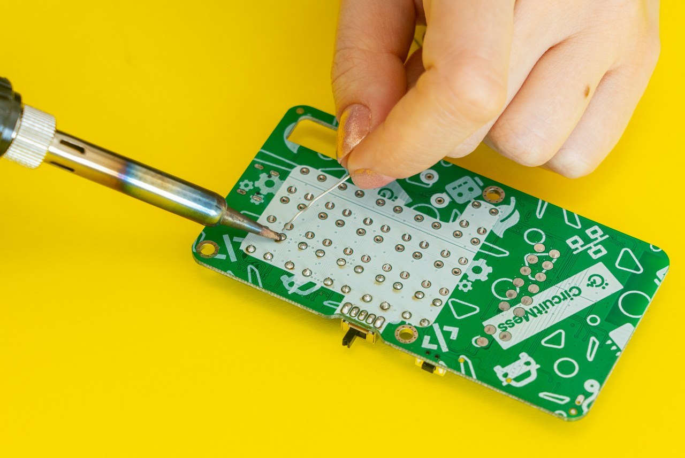

So sollte die Leiterplatte aussehen, nachdem du alle Taster eingelötet hast. Prüfe bitte, ob du alle Tasten drücken kannst.

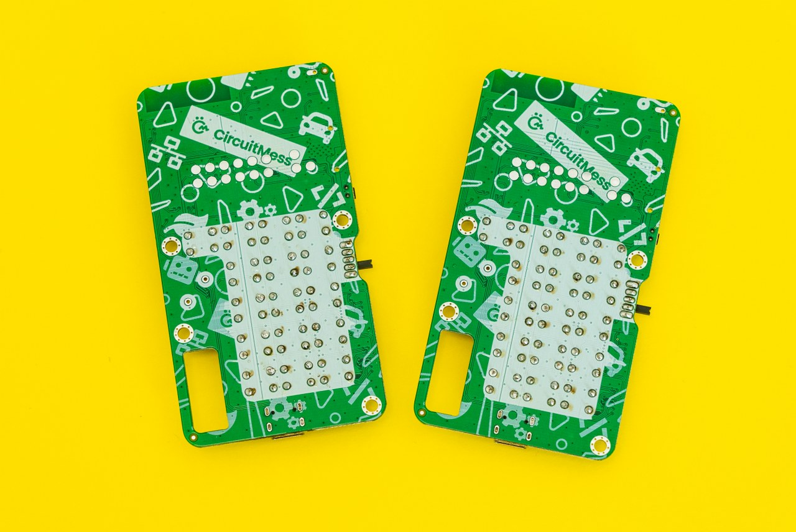

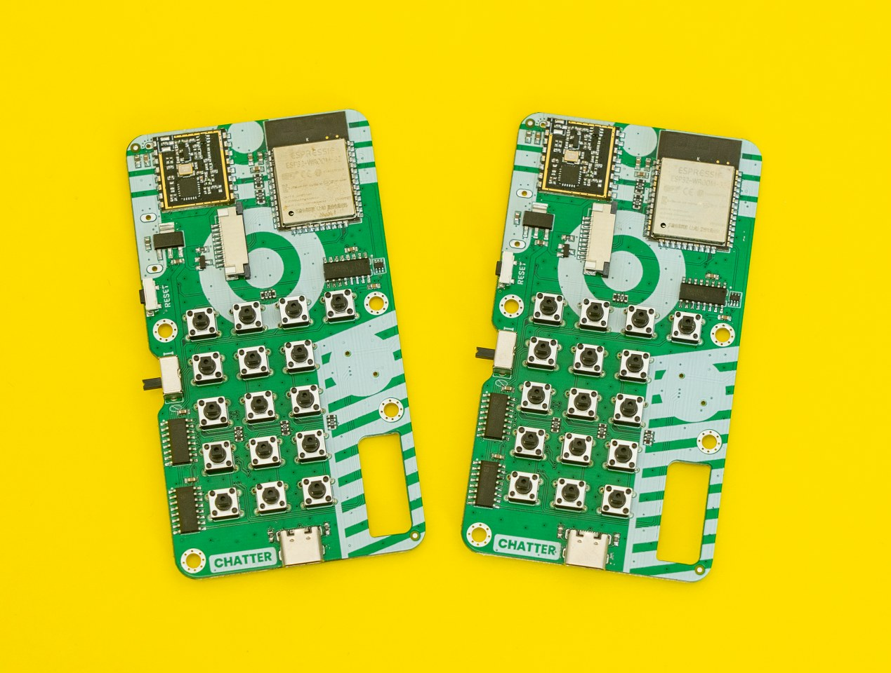

#### Piezo-Summer

Als nächstes werden wir einen Summer anlöten.

Der **Piezo-Summer** auf dem Gerät kann viele verschiedene Pieptöne, Summtöne und andere verrückte Geräusche erzeugen.

Er ist nicht so leistungsfähig wie ein echter Lautsprecher, aber er ist trotzdem ein nützliches Bauteil, wenn man nur einige Geräusche erzeugen will.

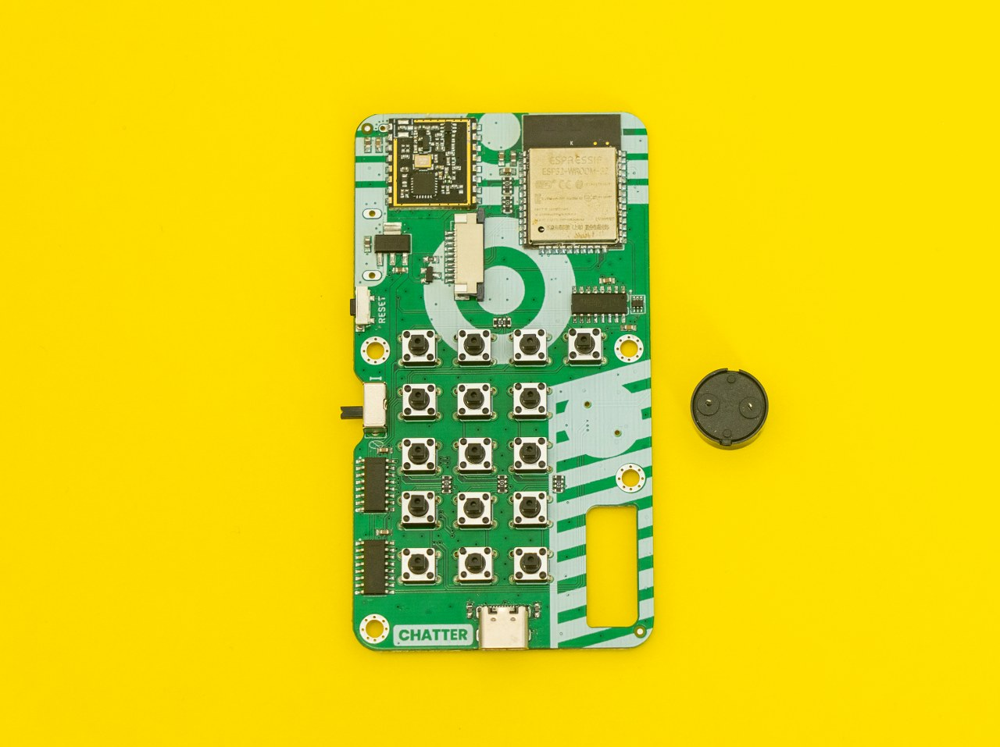

Und noch einmal ist es Zeit zum Löten!

Die Position des Summers ist nicht wichtig. Stecke die Stifte einfach in die Löcher der Leiterplatte.

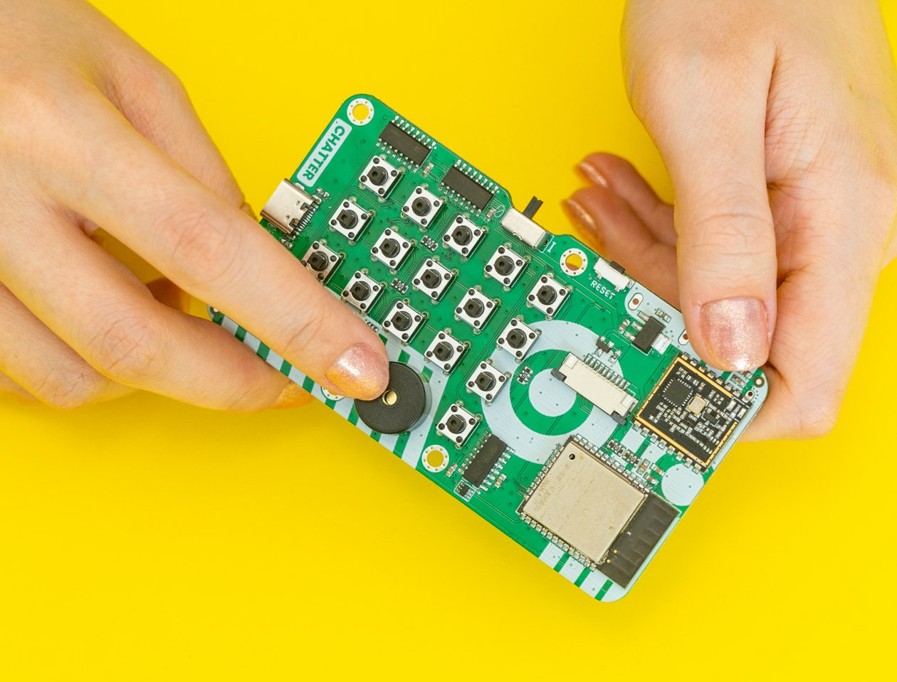

Achte darauf, die Lötkolbenspitze zwischen dem Löten der Stifte zu reinigen. Achte auch darauf, die Stifte nicht zu überbrücken.

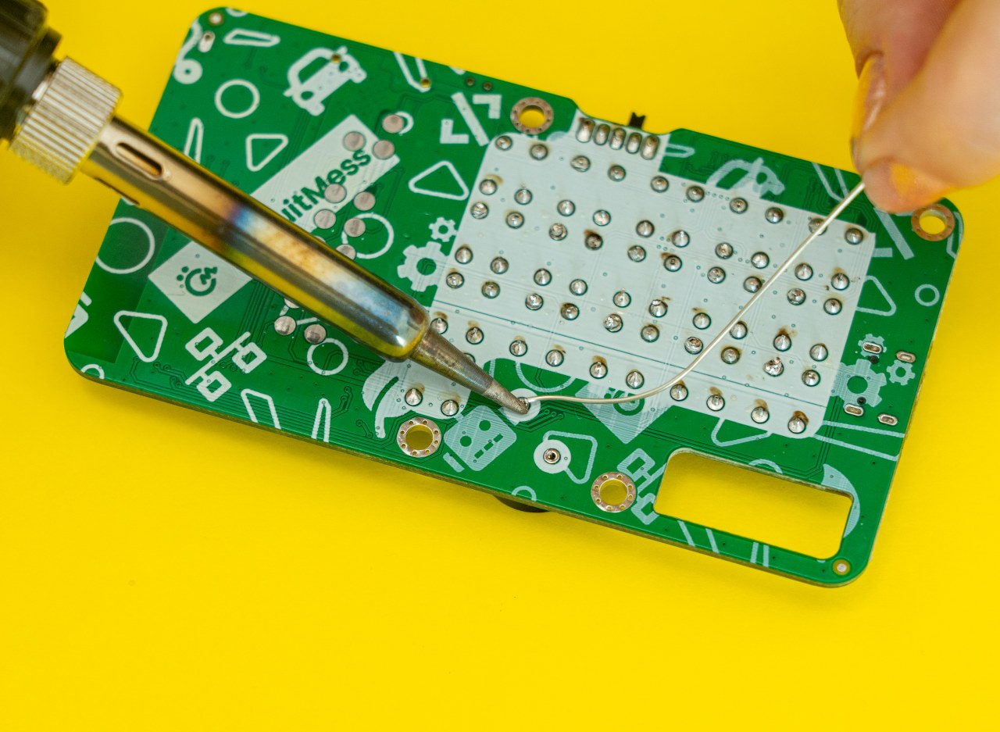

So sollten deine Chatter im Moment aussehen:

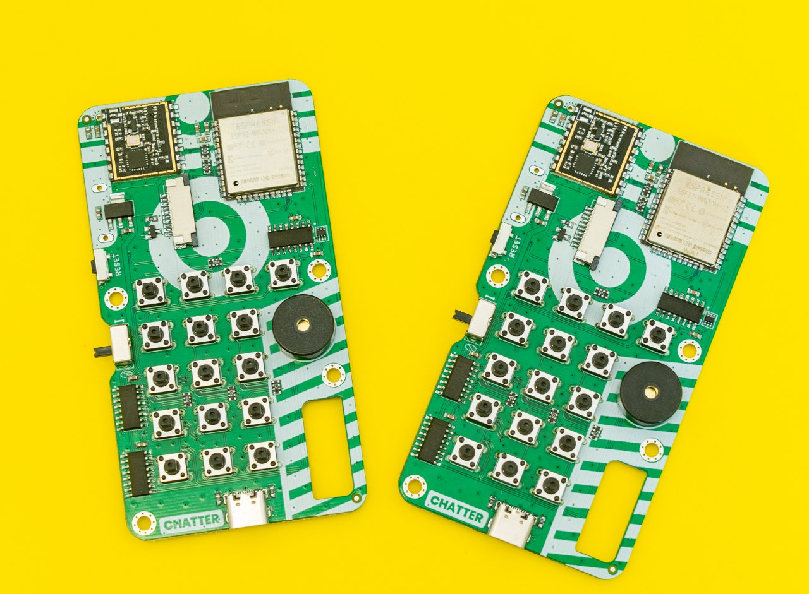

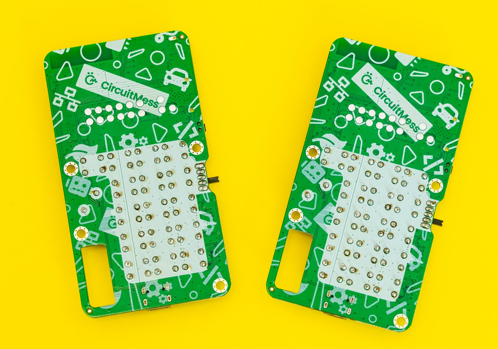

