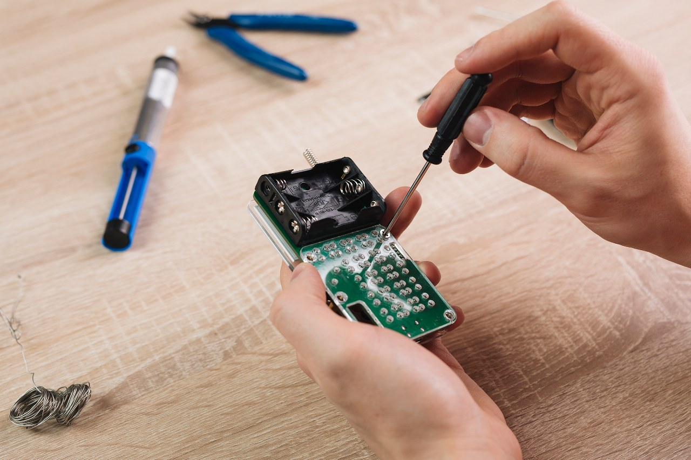
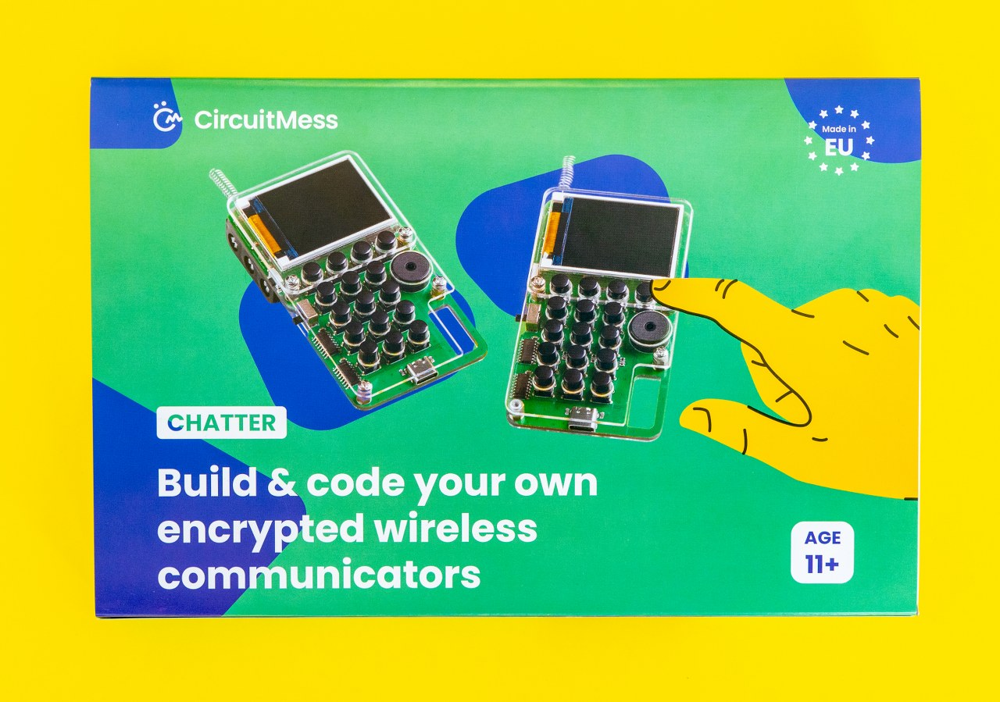

# Chatter Bauanleitung

* [Einführung](#einführung)
* [Hier sind die Werkzeuge!](#hier-sind-die-werkzeuge)
* [Zusammenbau](#zusammenbau)
* [Wie geht's weiter?](#)

## Einführung

### Aller Anfang ist leicht

**Willkommen bei der CircuitMess Chatter Bauanleitung!**

In dieser Bauanleitung erfährst du, wie du ein Kommunikationsgerät zusammen baust, mit dem du drahtlos und verschlüsselt kommunizieren kannst.
Mit Chatter lernst du, wie du deinen privaten SMS-Kommunikator erstellst, wie LoRa funktioniert, wie du benutzerdefinierte Apps programmierst und auf deinen Chatter lädst und was Privatsphäre im Jahr 2022 bedeutet.

#### Altersgruppe

Wie auf der Schachtel beschrieben, ist Chatter für alle **ab 11 Jahren** geeignet.

Du solltest einige der Montageschritte mit Vorsicht angehen - also sorge dafür, dass ein Erwachsener einspringt, wenn du später beim Löten oder Anziehen der Schrauben Hilfe brauchst. Es ist in Ordnung, wenn du um Hilfe bittest.

Aber keine Sorge! Wir gehen den Zusammenbau Schritt für Schritt durch und geben dabei einige nützliche Tipps. Wir geben dir einen Hinweis, wenn du beim Zusammenbau etwas Wichtiges beachten musst.

#### Aufbauzeit

Für den vollständigen Zusammenbau deines Chatters solltest du **etwa 4 Stunden** einplanen.

Natürlich hängt die Montagezeit von deinen Vorkenntnissen und deiner Erfahrung ab. Wenn du noch keine Erfahrung hast, mach' dir keine Sorgen! Es kann sein, dass du etwas länger brauchst, um dich einzuarbeiten und die anfänglichen Schwierigkeiten zu überwinden.

#### Benötigte Fertigkeiten

Du musst keine besonderen Fertigkeiten haben, um dich an diesem Selbstbauprojekt zu versuchen.

Das Hauptziel ist es, Spaß zu haben und etwas Neues zu lernen.

Also pass gut auf, lies alle Anweisungen und mach' dich bereit Spaß zu haben!
Dies ist eine großartige Gelegenheit und dein erster Schritt in deiner großen Ingenieurskarriere.

#### Lernen mit Chatter

Wie bereits erwähnt, wirst du in den folgenden Stunden mit Chatter einige nützliche Dinge lernen.

Diese Punkte hier wirst du lernen:

* Wie du dir deinen eigenen privaten SMS-Kommunikator erstellst
* Was Privatsphäre im Jahr 2022 bedeutet und wie du digital kommunizieren kannst ohne das Internet zu verwenden
* Wie LoRa funktioniert
* Wie Chatter Nachrichten verschlüsselt und entschlüsselt und wie er sich mit anderen Chattern verbindet
* Wie man eigene Apps programmiert und auf seinen Chatter lädt

### Woraus besteht der Bausatz?

Lass' uns alle Teile kennen lernen, die du bekommen hast!

