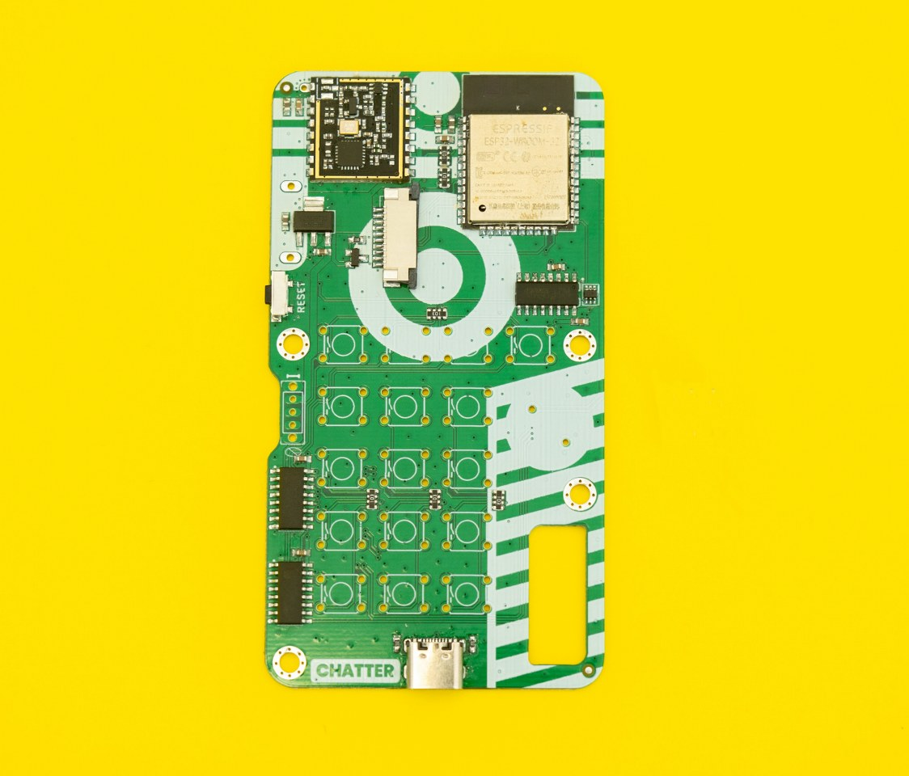
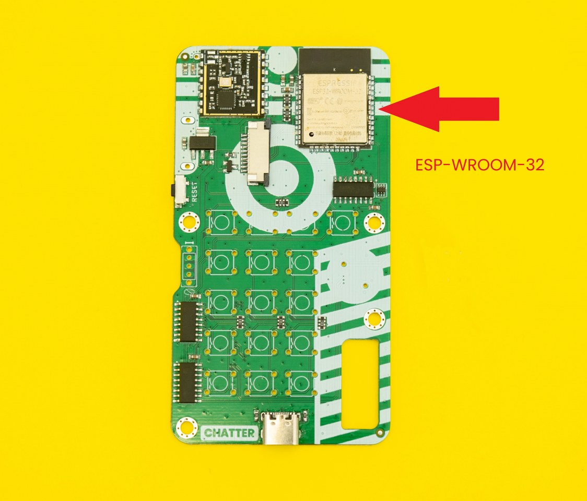
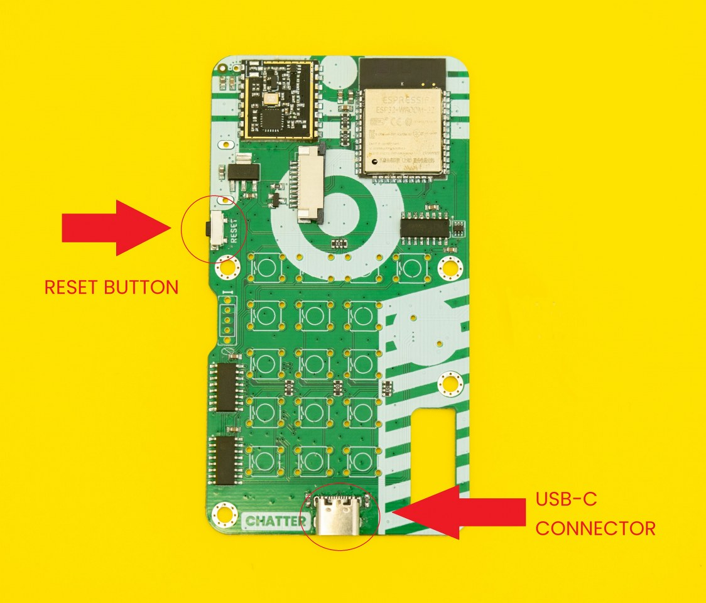
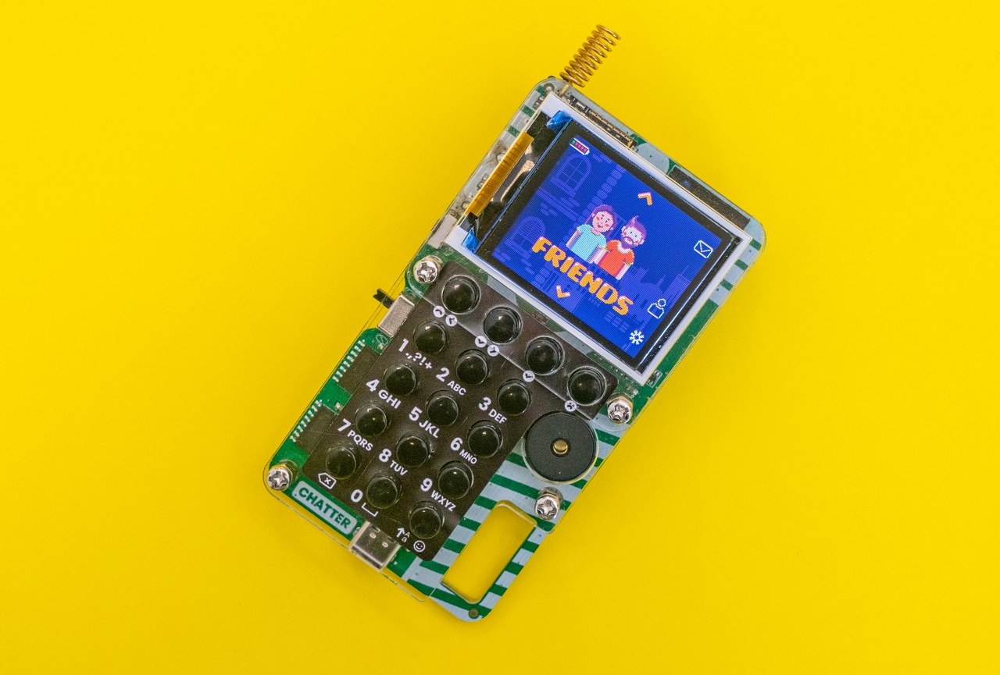
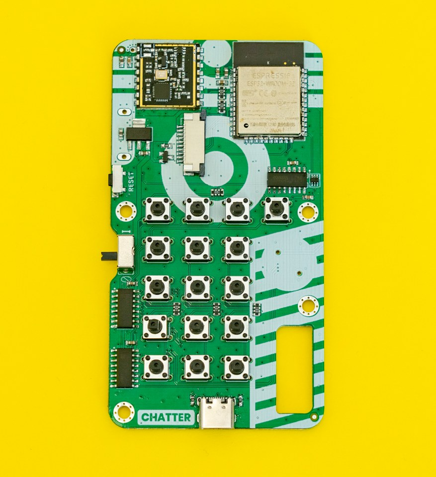
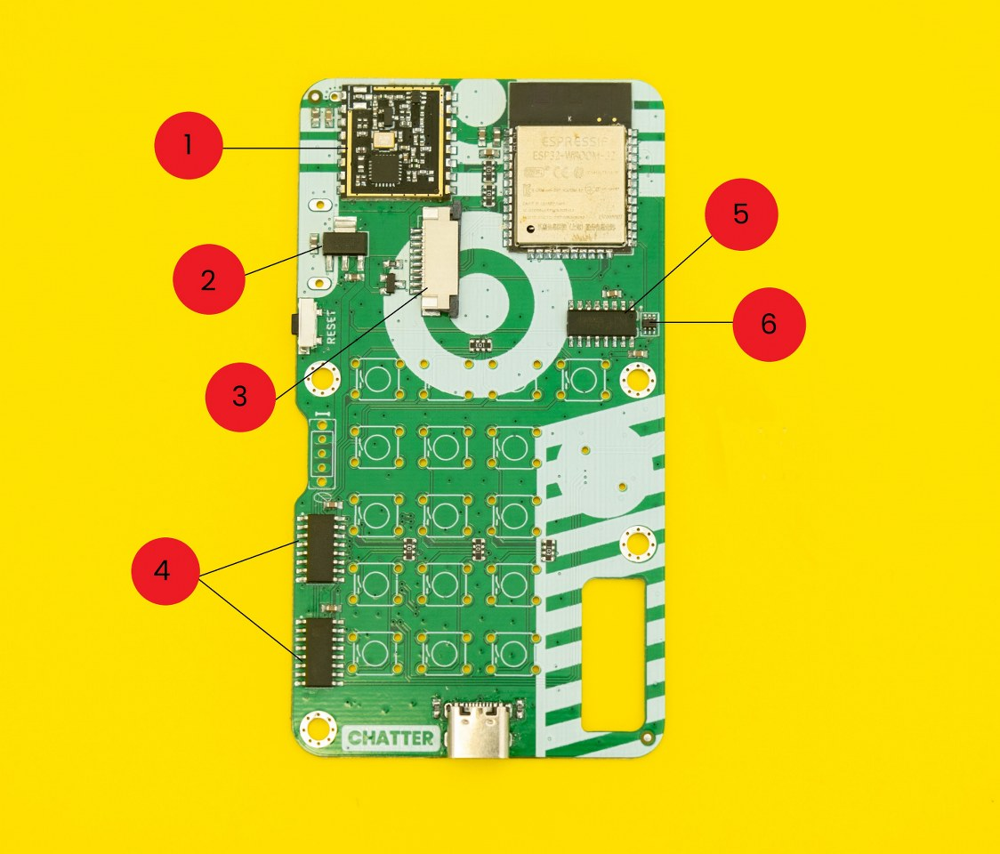
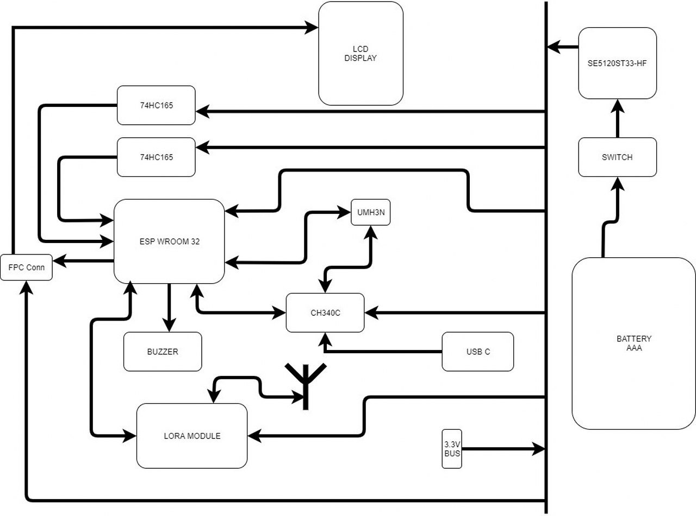

# Chatter's Aufbau und Komponentenübersicht

* [Innerer Aufbau von Chatter](#innerer-aufbau-von-chatter)
* [Entdecke die Mikrochips](#entdecke-die-mikrochips)
* [Chatter's Blockdiagramm](#chatters-blockdiagramm)

## Innerer Aufbau von Chatter

### Willkommen beim Leitfaden zum inneren Aufbau von Chatter!

Unabhängig davon, ob du deinen Chatter bereits zusammengebaut hast oder nicht, wird dies hier ein hilfreicher Leitfaden sein, in welchem du etwas mehr über die verlöteten Komponenten, kleine Verbindungen und Treiberbausteine erfahren wirst.

Wir beginnen mit den größeren Bauteilen und gehen später auf die kleineren Bauteile ein.

### Erkundung der Hauptplatine

Es wäre falsch, mit etwas anderem zu beginnen als mit der Hauptplatine selbst. Deshalb präsentieren wir dir den Star des Abends...

**PCB steht für Printed Circuit Board**. Diese Glasfaserplatine ist mit Kupferbahnen, Schutzlack und Isoliermaterial versehen.  
Dank der vielen Kupferleitungen auf der Platine können alle angeschlossenen oder aufgelöteten Bauteile miteinander kommunizieren.

Ohne sie könnte der Summer nicht vibrieren, wenn man eine Textnachricht erhält, der Bildschirm würde nicht auf Eingaben reagieren und man könnte keine Nachricht mit den Tasten schreiben.

Genau wie bei anderen CircuitMess-Geräten wie Nibble oder Spencer wollen wir, dass unsere Komponenten nicht nur wunderbar funktionieren, sondern auch cool aussehen! Deshalb haben wir ein paar lustige Muster entworfen, die du auf der Rückseite der Platine sehen kannst.

### ESP-WROOM-32

Dieser Mikrocontroller steuert alles, und man könnte sagen, dass er das Gehirn von Chatter ist. ESP-WROOM-32 ist ein leistungsfähiges Modul, das hauptsächlich für Toncodierung und Musik-Streaming verwendet wird. In Anbetracht seiner Fähigkeiten ist es preisgünstig.

ESP-WROOM-32 ist nicht nur für die Toncodierung bekannt, sondern steuert auch die Anzeige von Bildern auf dem Bildschirm sowie die Drucktasten.

Aufgrund seiner Komplexität und Empfindlichkeit ist dieses Modul bereits mit der Hauptplatine von Chatter verbunden.

* [ESP-WROOM-32 Datenblatt](https://www.espressif.com/sites/default/files/documentation/esp32-wroom-32_datasheet_en.pdf) (englisch)

### Reset-Knopf

Diese Taste ist ziemlich selbsterklärend - die Reset-Taste dient zum Zurücksetzen des gesamten Hauptprogramms. Das kann nützlich sein, falls die Anzeige auf dem Bildschirm "eingefroren" ist (was hoffentlich nie passiert) oder wenn sich dein Chatter aufgrund seines Batteriesparprogramms ausgeschaltet hat.

### USB-C Anschluss

Dieser Anschluss an der Oberseite der Hauptplatine dient zum Aufladen und zur Verbindung von Chatter mit dem Computer.

Sobald du Chatter an deinen PC angeschlossen hast, kannst du ihn in CircuitBlocks programmieren. CircuitBlocks ist eine grafische Programmieroberfläche, die Neulingen den Einstieg in die Embedded-Programmierung erleichtert.

### Bildschirm

Der Bildschirm von Chatter ist mit einer eigenen kleinen Platine verbunden, die an die Hauptplatine gelötet ist. Es gibt keine Pins, die gelötet werden müssen (anders als bei unseren anderen Geräten), sondern nur ein kleines orangefarbenes Kabel, das mit der Hauptplatine verbunden werden muss.

Aber keine Sorge! Die Anleitungen, die diesen Schritt erklären, sind recht einfach, so dass wir hoffen, dass du den Zusammenbau genießen wirst.

Auf diesem Bildschirm siehst du die Textnachrichten, die du erhalten wirst, alle Einstellungen und coole Funktionen, die du etwas später in CircuitBlocks programmieren kannst.

### Knöpfe

Mit diesen Tastern kannst Du durch das Menü von Chatter navigieren, Nachrichten schreiben und versenden und vieles mehr!

## Entdecke die Mikrochips

### 1. LoRa-Modul

LoRa ist eine drahtlose Funktechnologie, die eine große Reichweite, einen geringen Stromverbrauch und eine sichere Datenübertragung bietet.

### 2. Chip SE5120ST33-HF

Dieser Chip sorgt dafür, dass die Energie aus den Batterien zur Hauptplatine gelangt und den Chatter antreibt.

### 3. FC5-Anschluss

Über diesen Stecker wird der Bildschirm mit der Hauptplatine verbunden.

### 4. Chip 74HC165

Diese Chips sorgen dafür, dass du Textnachrichten schreiben und mit den Tastern durch das Menü blättern kannst.

### 5. Chip CH340C

Dank dieses kleinen Kerls kann Chatter über USB mit deinem Computer kommunizieren!

### 6. Chip UMH3NFHATN

Mit diesem Chip kann Chatter zwischen dem Arbeitsmodus (*Run Mode*) und dem Programmiermodus umschalten!

### Kondensatoren und Widerstände

Die übrigen kleinen Bauteile sind Kondensatoren und Widerstände.
Sie sind die Hauptbestandteile von so ziemlich jedem elektronischen Gerät auf der Welt.
Sie werden verwendet, um den Stromfluss in einem Kreis zu steuern.

Es gibt einige Stellen auf der Platine, an denen sich diese Bauteile befinden, hauptsächlich um das ESP-WROOM-32-Modul herum, beim Bildschirm und bei den wichtigen Chips.

## Chatter's Blockdiagramm

Dies ist das Blockdiagramm von Chatter.

Wirf einen Blick auf die schematische Darstellung unten und untersuche sie im Detail.

Es zeigt, wie die Komponenten wie EPS-WROOM-32, Bildschirm, Summer und Taster angeschlossen sind. Es wird auch erklärt, wie die Signal der verschiedenen Eingänge von den verschiedenen Treibern angenommen und verarbeitet werden und wie sie die Ausgänge beeinflussen.

Jetzt, da du weißt, was die einzelnen Komponenten auf der Hauptplatine sind, kannst du deinen Chatter zusammenbauen.

Schaue dir die Chatter-Bauanleitung hier an:
[Chatter-Bauanleitung](https://learn.circuitmess.com/resources/guides/de/chatter-build-guide)
