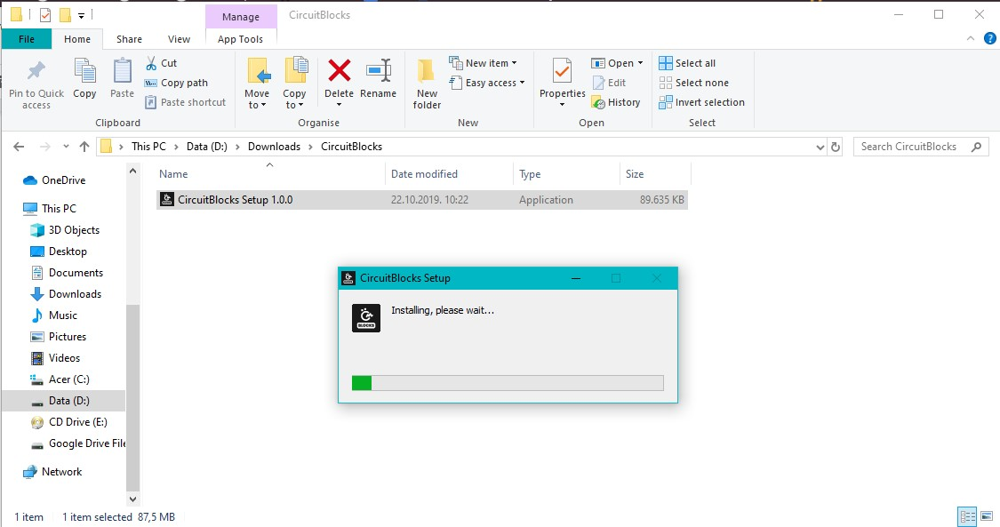
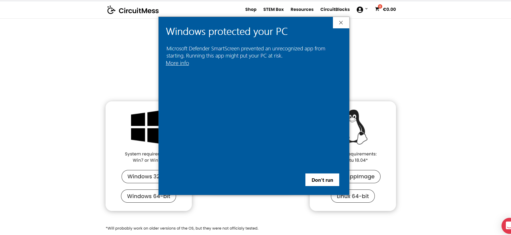
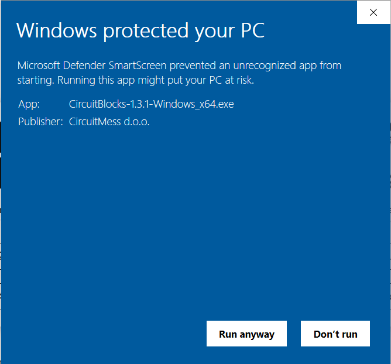
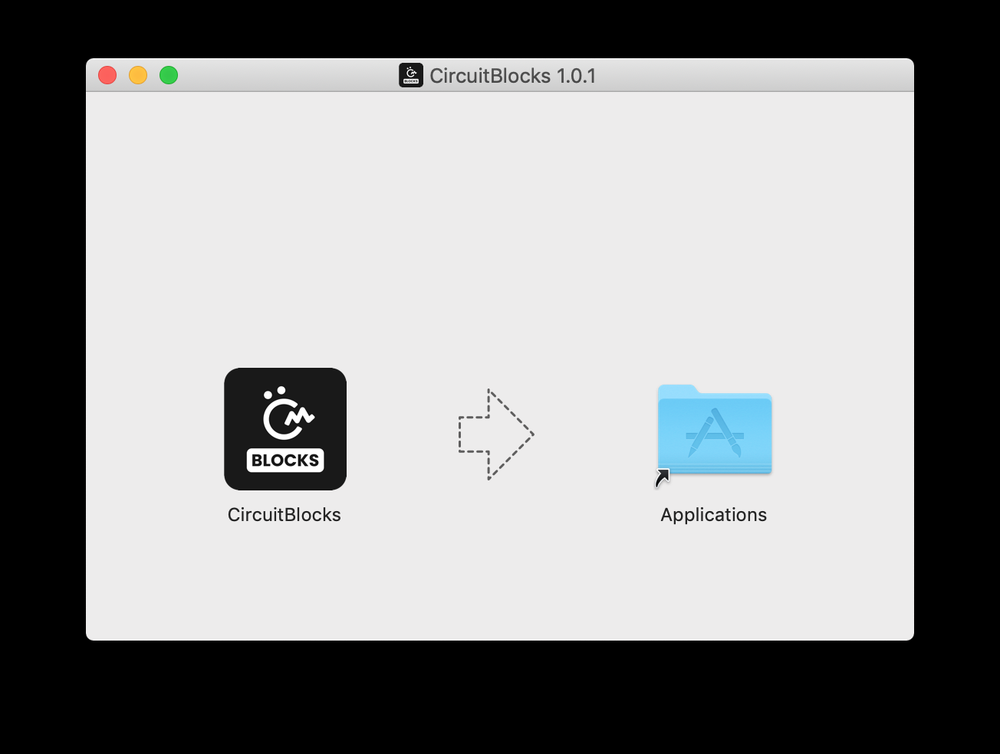
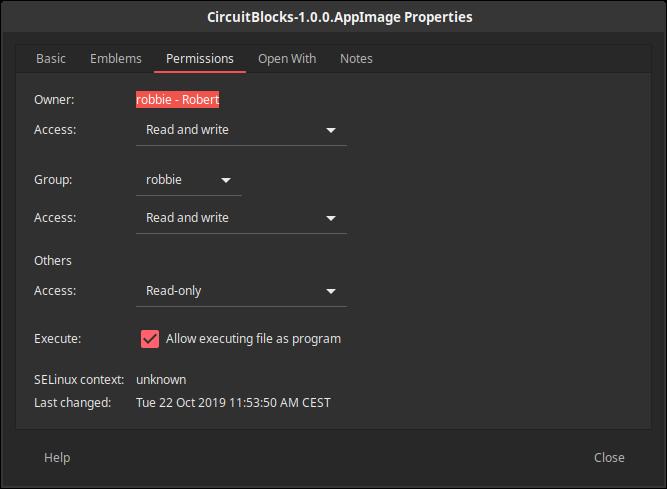

# Chatter Programmierung - Erste Schritte

* [Einführung](#einführung)
* [Los geht's! Schritt für Schritt](#los-gehts-schritt-für-schritt)
* [Wiederherstellen der Basis-Firmware von Chatter](#wiederherstellen-der-basis-firmware-von-chatter)

## Einführung

### Installation

#### Willkommen zum Chatter-Programmiertutorial

Vielen Dank für deine Unterstützung von CircuitMess und willkommen zum Chatter-Programmiertutorial.

Wir werden **CircuitBlocks** für die Programmierung deiner neu zusammengebauten verschlüsselnden drahtlosen Kommunikatoren verwenden.

CircuitBlocks ist eine von uns entwickelte, maßgeschneiderte Programmier-App.
Du wirst deinen Chatter in der grafischen, blockbasierten Programmieroberfläche von CircuitBlocks programmieren, die dir bei deinen ersten Schritten in der Welt der Datenverarbeitung helfen wird.

CircuitBlocks läuft derzeit auf Windows-, Linux- und Mac OS-Computern.

#### Wenn du einen Windows-Computer hast

1. **Gehe auf die [CircuitBlocks-Download-Seite](https://circuitmess.com/pages/download)**

2. **Lade die neueste Version für Windows herunter** - Prüfe dabei, ob du eine 32- oder 64-Version hast. Öffne dazu die "Einstellungen" App, klicke auf die Option "System" und suche Sie den Abschnitt "Info". Hier siehst du den Systemtyp.

3. Starte die heruntergeladene Datei mit dem Namen "CircuitBlocks" durch einen Doppelklick.

4. CircuitBlocks wird automatisch installiert und eine neue Desktop-Verknüpfung wird erstellt.

**Dein PC ist nicht gefährdet!**

Es besteht die Möglichkeit, dass eine Meldung erscheint, die besagt, dass dein PC gefährdet ist, wenn du versuchst CircuitBlocks zu installieren. Mach' dir keine Sorgen! Diese Meldung wird manchmal angezeigt - unabhängig davon, ob CircuitBlocks sicher ist.

Wie du mit dieser Meldung umgehen kannst, erfährst du in den folgenden Anweisungen.

Diese Meldung erhältst du möglicherweise bei der Installation von CircuitBlock auf deinem PC. Windows meldet eine Bedrohung, obwohl das Programm sicher heruntergeladen und ausgeführt werden kann. Bitte fahre mit der Installation fort, indem Du auf die Option *"Mehr Informationen"* (bzw. *"More info"* in englisch) klickst.

Nachdem du auf die Option *"Weitere Informationen"* geklickt hast, sollte am unteren Rand des Fensters die Option *"Trotzdem ausführen"* (in englisch: *"Run anyway"*) erscheinen.
Klicke auf die Option *"Trotzdem ausführen"* und fahre mit der Installation fort.

#### Wenn du einen Mac Computer hast

1. **Gehe auf die [CircuitBlocks-Download-Seite](https://circuitmess.com/pages/download)**

2. **Lade die neueste Version für MacOs herunter** - Eine Datei mit dem Namen "CircuitBlocks-1.0.1-Mac.dmg" oder ähnlichem sollte heruntergeladen werden.

3. Verschiebe die Datei in den Ordner "Programme".

4. CircuitBlocks wird automatisch installiert.

#### Wenn du einen Linux Computer hast

Es gibt zwei Möglichkeiten, CircuitBlocks unter Linux zu installieren.

**Linux 64-bit:**

1. **Gehe auf die [CircuitBlocks-Download-Seite](https://circuitmess.com/pages/download)**

2. Klicke auf den Download-Button **"Linux 64-bit"**

3. Unter Ubuntu startest du die Installation einfach per Doppelklick auf die Datei.  
   Bei anderen Linux-Distributionen öffne das Terminal und führe folgenden Befehl aus:  
   `sudo dpkg -i <Pfad zur heruntergeladenen Datei .deb>`

4. CircuitBlocks wird automatisch installiert und ein Desktop-Eintrag wird erstellt.

**Eigenständiges AppImage:**

1. **Gehe auf die [CircuitBlocks-Download-Seite](https://circuitmess.com/pages/download)**

2. Klicke auf den Download-Button **"Linux AppImage"**

3. Klicke mit der **rechten Maustaste** auf die Datei und wähle **"Eigenschaften"**

4. Gehen auf die Seite *"Berechtigungen"* (bzw. in englisch: *"Permissions"*) und setze ein Häkchen bei *"Ausführen der Datei als Programm zulassen"* (bzw. *"Allow executing file as program"*).

5. Doppelklicke die Datei und die Installation wird automatisch abgeschlossen.

Solltest du Probleme mit der Installation haben, wende dich bitte per E-Mail an contact@circuitmess.com und sende uns einen Screenshot des Problems sowie alle relevanten Informationen.

### Die Grundlagen

Todo

## Los geht's! Schritt für Schritt

Todo

## Wiederherstellen der Basis-Firmware von Chatter

Todo
