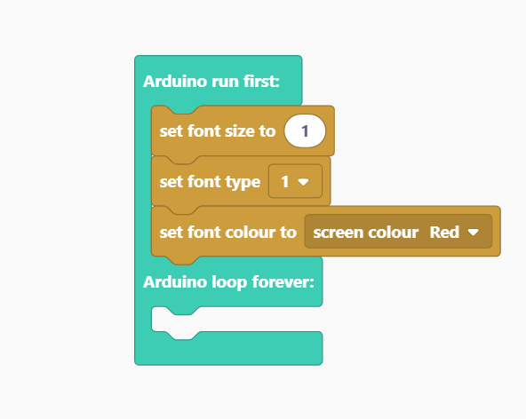
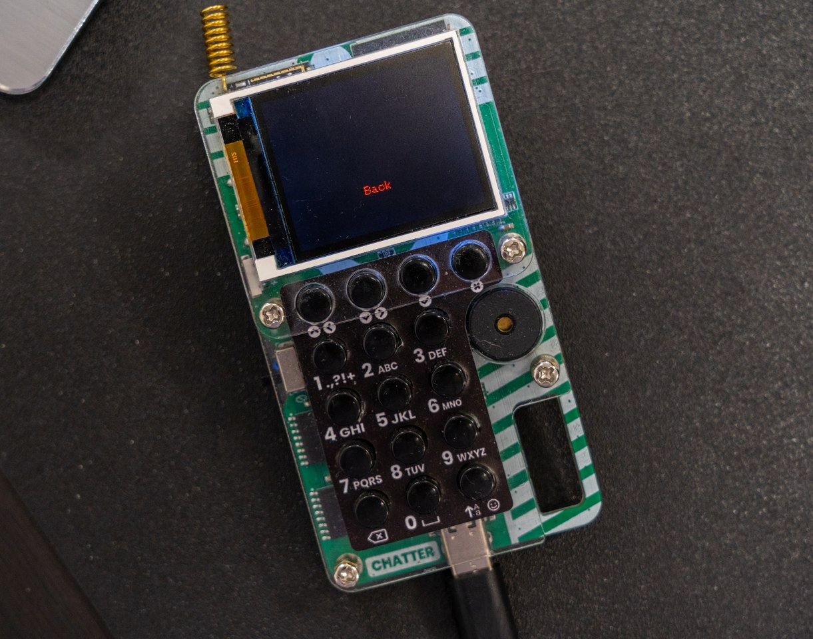
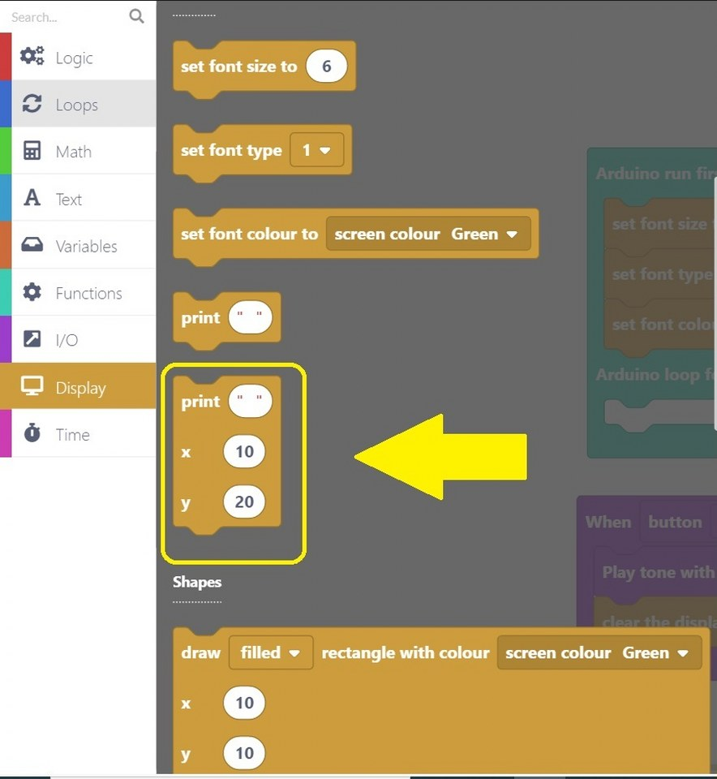
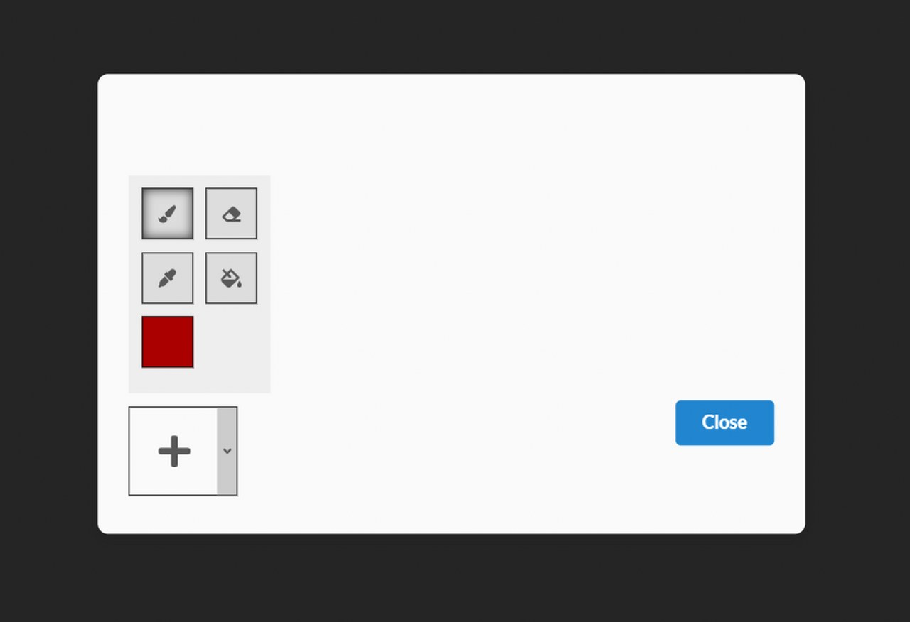

# Chatter Programmierung - Erste Schritte

* [Einführung](#einführung)
* [Los geht's! Schritt für Schritt](#los-gehts-schritt-für-schritt)
* [Wiederherstellen der Basis-Firmware von Chatter](#wiederherstellen-der-basis-firmware-von-chatter)

## Einführung

### Installation

#### Willkommen zum Chatter-Programmiertutorial

Vielen Dank für deine Unterstützung von CircuitMess und willkommen zum Chatter-Programmiertutorial.

Wir werden **CircuitBlocks** für die Programmierung deiner neu zusammengebauten, verschlüsselnden, drahtlosen Kommunikatoren verwenden.

CircuitBlocks ist eine von uns entwickelte, maßgeschneiderte Programmier-App.
Du wirst deinen Chatter in der grafischen, blockbasierten Programmieroberfläche von CircuitBlocks programmieren, die dir bei deinen ersten Schritten in der Welt der Datenverarbeitung helfen wird.

CircuitBlocks läuft derzeit auf Windows-, Linux- und Mac OS-Computern.

#### Wenn du einen Windows-Computer hast

1. **Gehe auf die [CircuitBlocks-Download-Seite](https://circuitmess.com/pages/download)**

2. **Lade die neueste Version für Windows herunter** - Prüfe dabei, ob du eine 32- oder 64-Version hast. Öffne dazu die "Einstellungen" App, klicke auf die Option "System" und suche den Abschnitt "Info". Hier siehst du den Systemtyp.

3. Starte die heruntergeladene Datei mit dem Namen "CircuitBlocks" durch einen Doppelklick.

4. CircuitBlocks wird automatisch installiert und eine neue Desktop-Verknüpfung wird erstellt.

**Dein PC ist nicht gefährdet!**

Es besteht die Möglichkeit, dass eine Meldung erscheint, die besagt, dass dein PC gefährdet ist, wenn du versuchst CircuitBlocks zu installieren. Mach' dir keine Sorgen! Diese Meldung wird manchmal angezeigt - unabhängig davon, ob CircuitBlocks sicher ist.

Wie du mit dieser Meldung umgehen kannst, erfährst du in den folgenden Anweisungen.

Diese Meldung erhältst du möglicherweise bei der Installation von CircuitBlocks auf deinem PC. Windows meldet eine Bedrohung, obwohl das Programm sicher heruntergeladen und ausgeführt werden kann. Bitte fahre mit der Installation fort, indem Du auf die Option *"Mehr Informationen"* (bzw. *"More info"* in englisch) klickst.

Nachdem du auf die Option *"Weitere Informationen"* geklickt hast, sollte am unteren Rand des Fensters die Option *"Trotzdem ausführen"* (in englisch: *"Run anyway"*) erscheinen.
Klicke auf die Option *"Trotzdem ausführen"* und fahre mit der Installation fort.

#### Wenn du einen Mac Computer hast

1. **Gehe auf die [CircuitBlocks-Download-Seite](https://circuitmess.com/pages/download)**

2. **Lade die neueste Version für MacOs herunter** - Eine Datei mit dem Namen "CircuitBlocks-1.0.1-Mac.dmg" oder ähnlichem sollte heruntergeladen werden.

3. Verschiebe die Datei in den Ordner "Programme".

4. CircuitBlocks wird automatisch installiert.

#### Wenn du einen Linux Computer hast

Es gibt zwei Möglichkeiten, CircuitBlocks unter Linux zu installieren.

**Linux 64-bit:**

1. **Gehe auf die [CircuitBlocks-Download-Seite](https://circuitmess.com/pages/download)**

2. Klicke auf den Download-Button **"Linux 64-bit"**

3. Unter Ubuntu startest du die Installation einfach per Doppelklick auf die Datei.  
   Bei anderen Linux-Distributionen öffne das Terminal und führe folgenden Befehl aus:  
   `sudo dpkg -i <Pfad zur heruntergeladenen Datei .deb>`

4. CircuitBlocks wird automatisch installiert und ein Desktop-Eintrag wird erstellt.

**Eigenständiges AppImage:**

1. **Gehe auf die [CircuitBlocks-Download-Seite](https://circuitmess.com/pages/download)**

2. Klicke auf den Download-Button **"Linux AppImage"**

3. Klicke mit der **rechten Maustaste** auf die Datei und wähle **"Eigenschaften"**

4. Gehen auf die Seite *"Berechtigungen"* (bzw. in englisch: *"Permissions"*) und setze ein Häkchen bei *"Ausführen der Datei als Programm zulassen"* (bzw. *"Allow executing file as program"*).

5. Doppelklicke die Datei und die Installation wird automatisch abgeschlossen.

Solltest du Probleme mit der Installation haben, wende dich bitte per E-Mail an contact@circuitmess.com und sende uns einen Screenshot des Problems sowie alle relevanten Informationen.

### Die Grundlagen

#### Benutzeroberfläche

Wenn du CircuitBlocks öffnest, siehst du ein Fenster, das wie oben gezeigt aussieht.

Es ist ziemlich einfach - Du kannst ein **neues Projekt (wir nennen Projekte auf englisch auch "Sketches")** beginnen, indem Sie auf die Schaltfläche "Neues Projekt" (englisch "New project") klickst.

**Gespeicherte Projekte** werden direkt neben dieser Schaltfläche angezeigt und du kannst jederzeit darauf zugreifen.

Wenn du auf ein Problem mit CircuitBlocks stößt, klicke bitte auf den Link "**Fehlerbericht senden**" (auf englisch "Send error report") am unteren Rand des Hauptbildschirms. Hierbei erhältst du dann eine Fehlermeldungsnummer. Bitte kontaktiere uns über contact@circuitmess.com und gib diese Fehlermeldungsnummer an, damit wir dir weiterhelfen können.

#### Erstellen eines neuen Projekts (Sketch)

Klicke auf die große Schaltfläche "Neues Projekt" (englisch "New project").

Nun bekommst du die Möglichkeit, das Gerät und den Projekttyp auszuwählen.

* Für das Gerät wähle bitte: **Chatter**.
* Für den Typ des Sketches wähle bitte: **Block**.

Drücke die Schaltfläche "Erstellen" (englisch "**Create**").

Es erscheint ein Bildschirm, der wie folgt aussieht:

Am oberen Rand des Bildschirms befindet sich eine **Symbolleiste** mit einigen Schaltflächen.

Die **Blockauswahlleiste** befindet sich ganz links - Du kannst Blöcke von dort nehmen und sie in den "Zeichenbereich" in der Mitte des Bildschirms ziehen.

In der Mitte des Bildschirms wirst du deinen Programmcode mit bunten Blöcken "zeichnen".

Auf der rechten Seite des Bildschirms siehst du, wie der in der **Programmiersprache C++** geschriebene Code auf magische Weise von selbst erscheint, wenn du die bunten Blöcke in die Mitte ziehst.

**C++** ist eine der beliebtesten Programmiersprachen, aber sie ist ziemlich komplex, wenn du noch nie programmiert hast.

Deshalb haben wir CircuitBlocks entwickelt - hier kannst du bunte Blöcke, die Teile des Codes darstellen, mit der Maus verschieben und ablegen und sehen, wie dein Programm in C++ aussehen würde. Wenn du erfahren genug bist, kannst du direkt zur textuellen Programmierung in C++ wechseln, ohne dass du bunte Blöcke benötigst.

#### Symbolleiste

Im Folgenden wird kurz erklärt, was die Schaltflächen in der Symbolleiste des Fensters bewirken:

1. **Zurück zum Hauptmenü** - bringt dich zum Startbildschirm zurück, ohne zu speichern.

2. **Speichern/Speichern unter** - speichert dein Projekt. Achte darauf, diese Schaltfläche von Zeit zu Zeit und vor dem Schließen von CircuitBlocks zu drücken.

3. **Chatter-Verbindungsanzeige** - Der rote Punkt wird grün, wenn dein Chatter über ein USB-Kabel mit deinem Computer verbunden ist.

4. **Sprite-Editor** - zum Zeichnen von Bildern, die du auf deinem Chatter verwenden  möchtest.

5. **Exportieren in Binärform** - speichert eine Binärdatei deines Programmcodes auf deinem Computer. Dies ist eine fortgeschrittene Funktion, die du vorerst nicht brauchen wirst.

6. **Serieller Monitor** - Diese Schaltfläche öffnet ein Fenster, das wir den "Seriellen Monitor" nennen. "Seriell" ist ein Spitzname für eine Art der Kommunikation, die zwischen Chatter und deinem Computer stattfindet. In diesem Fenster kannst du später die Nachrichten sehen, die von Chatter an deinen Computer über den USB-Anschluss gesendet werden.

7. **Code schließen** - Mit dieser Schaltfläche kannst du das Code-Fenster auf der rechten Seite des Bildschirms schließen oder wieder öffnen. Dies ist nützlich, wenn du mehr Platz auf dem Bildschirm benötigst, um deine farbigen Blöcke zu sehen.

8. **Ausführen** (englisch "Run") - Diese Schaltfläche übersetzt den in CircuitBlocks erstellten Code in Maschinencode, den Chatter versteht (beep boop beep boop 1011100101) und sendet den Code über den USB-Anschluss an deinen Chatter.

#### Code-Fenster

Das so genannte "Code-Fenster" besteht aus den folgenden Teilen:

1. **Haupt-Code-Bildschirm** - in C++ geschriebener (Programm-)Code erscheint hier, wenn du bunte Blöcke auf der linken Seite des Bildschirms einfügst.
  Du wirst sehen, dass einige Teile des Codes in lustigen Farben eingefärbt sind.
  Programmierer nennen dies *Syntaxhervorhebung*. Im Grunde werden verschiedene Kategorien von Codebefehlen unterschiedlich eingefärbt, damit Programmierer den Code leichter verstehen können.

2. **Umschalter für helles/dunkles Farbschema** - mit dieser Schaltfläche kannst du die Hintergrund- und Textfarbe des Codefensters umschalten.

3. **Erweitern** - dehnt das Codefenster auf den gesamten Bildschirm aus. Drücke die Taste erneut, um es wieder auf den halben Bildschirm zu verkleinern.

4. **Schließen** - schließt das Code-Fenster, dieselbe Funktion wie die Schaltfläche "Code schließen" in der Symbolleiste.

#### Zeichenbereich

Auf dem Zeichenbereich geschieht die Magie.

Er besteht aus den folgenden Teilen:

1. **Suchleiste** - gib hier den Namen einer Komponente (in englisch) ein, nach der du suchst.

2. **Komponentenauswahl** - die Blöcke sind hier in verschiedene Kategorien unterteilt.
  Jeder Kategorie ist eine bestimmte Farbe zugewiesen.

3. **Zeichenfläche** - ziehe die Blöcke aus der Komponentenauswahl und lege sie in der Zeichenfläche ab. Auf diese Weise wird der Code erstellt. Kinderleicht!

4. **Zentrierwerkzeug** - wenn du dich beim Scrollen durch die Zeichenfläche verirrst, drücke diese Taste. Dadurch wird die Anzeige auf die Blöcke zentriert, die du auf der Zeichenfläche abgelegt hast.

5. **Zoom-Tasten** - zum Vergrößern und Verkleinern der Zeichenfläche.

### Arten von Blöcken

In CircuitBlocks gibt es insgesamt **neun** Blocktypen. Jeder von ihnen wird durch seine Farbe dargestellt. Jeder Block wird in Code übersetzt, der dann kompiliert und auf deinen Chatter hochgeladen wird, genau wie auf jeder Arduino-basierten Plattform.  

Jeden Blocktyp kannst du anklicken um einen Bereich zu öffnen, von dem du die zugehörigen Blöcke per Drag & Drop in die Zeichenfläche ziehen kannst.

Wenn du auf "Mehr" (englisch: "More") drückst, werden noch mehr Blöcke sichtbar, die nicht so häufig verwendet werden.

Es gibt zwei Hauptfunktionen in jedem Arduino-Code - `void setup()` und `void loop()`.

Alles, was in der Funktion `void setup()` enthalten ist, wird **nur einmal** ausgeführt. Sie wird hauptsächlich dazu verwendet, die Software zu starten, Variablen zu initialisieren und zu deklarieren und Funktionen auszuführen, die nur einmal ausgeführt werden müssen (z.B. der Intro-Bildschirm in einem Videospiel).

Die **Schleife** `void loop()` ist der Ort, an dem sich alles andere abspielt. Sie führt im Grunde jedes Stückchen Code darin wiederholt aus (die Geschwindigkeit hängt vom Gerät ab - stellen dir einfach vor, sie wäre ultraschnell!)

Jeder Block, den du einfügst, wird automatisch in die Funktion `void loop()` eingefügt.

Wenn du etwas in die Funktion `void setup()` einfügen möchtest, musst du den Hauptblock aus **Functions** herausziehen und deine Blöcke nach Belieben darin platzieren, aber dazu etwas später mehr.  

#### Elliptische Blöcke

Elliptische Blöcke stellen Variablen dar. Ob es sich nun um ganze Zahlen, Zeichenketten oder andere Variablentypen (außer Boolesche) handelt, sie alle sind an der gleichen Form zu erkennen.

Außerdem geben größere Blöcke mit elliptischer Form entweder Integer- oder Float-Werte zurück.

Wann immer du kreisförmige "Löcher" in einigen Blöcken findest, kannst du Variablen einfügen. Dies ist am häufigsten in Vergleichs- oder Aktionsblöcken zu finden.

#### Dreieckige Blöcke

Dreieckige Blöcke stellen boolesche Variablen dar.

Sowohl Variablen (wahr und falsch) als auch Funktionen, die boolesche Werte zurückgeben, haben die gleiche Form.

Unabhängig von der Farbe gibt jeder dieser Blöcke entweder `true` (wahr) oder `false` (falsch) zurück.

Für dreieckige "Löcher" müssen boolesche Blöcke eingefügt werden.

#### Programmbausteine

Alles andere sind im Grunde Programmbausteine (englisch "building blocks").
Das sind Funktionen, die keinen Rückgabewert haben.
Sowohl elliptische als auch dreieckige Blöcke müssen zunächst innerhalb der Programmbausteine platziert werden, um als Teil des Programms zu fungieren.

Sie haben eine bestimmte "Puzzle"-Form und können ineinander gestapelt werden.

Der **Hauptbaustein** befindet sich im Abschnitt "Funktionen" (englisch "Functions").

Es gibt im Grunde zwei Hauptbausteinabschnitte:

* "**Arduino run first**" für alles, was zuerst ausgeführt werden soll (der Code landet in `void setup()`) und
* "**Arduino loop forever**" für die Anteile, die innerhalb der Arduino-Schleife immer wieder wiederholt werden sollen (in `void loop()`).

#### Blöcke einfügen

Dies ist nun der wichtigste Teil.

Der ganze Sinn der blockbasierten Programmierumgebung ist das Verbinden von Blöcken und deren Platzierung in einem anderen Block.

Das alles geschieht durch einfaches **Drag-and-Drop**, also das Verschieben der Blöcke mit der Maus.

Hier ist ein Beispiel für ein Programm, welches die Variable `Var` auf `1` setzt und dann erhöht, solange sie kleiner als `10` ist.

Am Ende des Programms wird `Var`den Wert `10`haben.

Dies ist nur ein einfaches Beispiel, und die Blockbildung wird in den folgenden Kapiteln näher erläutert.

### Blocktypen

CircuitBlocks bietet insgesamt neun Blocktypen.
Wir haben sie so organisiert, dass du alles mit maximal zwei Klicks finden kannst.

Die Typen selbst sind ziemlich selbsterklärend, aber wir werden sie alle durchgehen, um ein besseres Verständnis für das ganze Konzept zu bekommen.

Einige der Typen bieten **zusätzliche Blöcke** (im Menü "Mehr", englisch "More"), mit Funktionen, die nicht so häufig verwendet werden, aber dennoch nützlich sein können.

#### Logik (Logic)

Hier befindet sich die Basis für jeden Code.

Jede **Wenn/Dann**-Funktion (if, if-else, else), Vergleiche, Und/Oder/Nicht, Wahr/Falsch und andere logische Operatoren.  

#### Schleifen (Loops)

Schleifen sind Funktionen, die alles, was sie enthalten, eine bestimmte Zeit lang wiederholen.

Sie können an Bedingungen geknüpft sein und so lange wiederholt werden, wie die Bedingung erfüllt ist, oder eine vorher festgelegte Anzahl von Wiederholungen haben.

#### Mathematik (Math)

So ziemlich jede mathematische Funktion ist hier zu finden. Von grundlegenden Operationen bis hin zum Runden von Zahlen und der Arbeit mit Winkeln wirst du in sekundenschnelle deinen inneren Einstein oder Pythagoras wecken!

#### Text

Zeichenketten, Zeichen und Zeichenkettenmanipulation. Ein großartiger Ort, um neuen Text zu erstellen und ihn in deinen Programme zu implementieren.

#### Variablen (Variables)

Erstelle eine Variable beliebigen Typs und lege ihren Namen und den gewünschten Wert fest. CircuitBlocks erkennt den Variablentyp (`int, double, string, boolean`) automatisch, so dass du dir darüber keine Gedanken machen musst.

#### Funktionen (Functions)

Die Arduino-Hauptfunktion (die wir [im vorherigen Kapitel](#programmbausteine) erklärt hatten) befindet sich hier.

Du kannst auch eigene Funktionen erstellen, die dann als einer der Hauptbestandteile deines Programms eingefügt werden können.

#### Eingabe/Ausgabe (Input/Output)

Alles, was die Komponenten von Chatter betrifft, befindet sich hier.

#### Bildschirm (Display)

Nun, all diese Blöcke sind wirklich nutzlos, solange man auf dem Bildschirm nichts sieht!

Hier wird die ganze Magie in farbige Pixel übersetzt. Mit diesen Blöcken kannst du so viel gestalten.

#### Zeit (Time)

Verzögerungen, Timer und andere zeitbezogene Dinge, ideal für die Erstellung cooler Animationen und Videospiele.

#### Suchleiste

Über den Blocktypen befindet sich eine **Suchleiste**, die dir die Suche nach einem bestimmten Block erleichtert, den du einfach nicht finden kannst.

Gib einfach (in englisch) ein, was dir in den Sinn kommt, und alle Blöcke, die etwas mit dem Suchbegriff zu tun haben, werden auf der rechten Seite angezeigt.

Nun kann man wirklich nicht sagen, dass es unmöglich ist, etwas zu finden.

Du hast alles über die Blöcke gelernt!
Es ist an der Zeit, zur nächsten Lektion überzugehen...

## Los geht's! Schritt für Schritt

### Lass uns auf den Bildschirm schreiben!

Jetzt geht's zur Sache!

Bevor es los gehen kann, musst du deinen Chatter an den USB-Anschluss deines Computers anschließen und ihn einschalten.

Wenn alles in Ordnung ist, sollte CircuitBlocks "Chatter connected" anzeigen.

Wenn CircuitBlocks deinen Chatter nicht erkannt hat, überprüfe bitte, ob das USB-Kabel richtig eingesteckt ist und ob du einen funktionierenden USB-Anschluss an deinem Computer verwendest.

Wenn CircuitBlocks dann deinen Chatter immer noch nicht erkennt, ist möglicherweise etwas mit der Treiberinstallation auf deinem Computer schief gelaufen. Treiber sind diese kleinen Programme, die deinem Computer helfen, mit Chatter zu kommunizieren, und sie verhalten sich manchmal komisch. Wenden dich per E-Mail an contact@circuitmess.com, wenn dein Computer deinen Chatter nicht erkennt.

**Lasst uns etwas schreiben!**

Wir werden die Dinge so einfach wie möglich angehen.

Das erste, was wir lernen werden, ist, wie man den **Bildschirm von Chatter löscht** und darauf **schreibt**!

Dazu benötigen wir nur Blöcke eines einzigen Blocktypes: Bildschrim (Display).
Bitte klicke auf den genannten Blocktyp und wähle "Schriftgröße auf 6 setzen" (englisch "set font size to").

Sobald du auf den Block klickst, erscheint er im **Zeichenbereich** und du musst ihn in den bläulichen "**Arduino run first**"-Block ziehen.

Wir finden, dass die Schriftgröße 6 zu groß sein könnte, also haben wir sie in 1 geändert. Du kannst das tun, indem du einfach die "6" löschst und stattdessen "1" einträgst.

Einfach, nicht wahr?

Als Nächstes müssen wir eine **Schriftart** festlegen. Den Block "set font size" findest du ebenfalls im Abschnitt "Display".

Die Schriftart muss nicht geändert werden, aber wenn du experimentieren möchtest, kannst du das gerne tun!

Das dritte Element, das wir aus dem Abschnitt "Display" verwenden werden, ist der Block "**Schriftfarbe auf Bildschirmfarbe setzen**" (englisch "set font colour to screen colour").

Anstelle der vorausgewählten Farbe grün ("Green") wählen wir als Schriftfarbe Marineblau (englisch "Navy").

Du kannst jede beliebige Farbe wählen die du magst.

Dein Programm sollte jetzt wie folgt aussehen:

Nachdem du nun alle erforderlichen Größen, Farben und Schriftarten eingestellt hast, ist es an der Zeit, den **Bildschirm zu löschen** und komplett mit einer bestimmten Farbe zu füllen, damit der anzuzeigende Satz (oder das Wort) deutlich zu sehen ist.

Wie im vorherigen Block kannst Du jede beliebige Farbe wählen.

Klicke auf den eingekreisten Block und ziehe ihn in den Arduino-Run-First-Block wie die anderen Blöcke.

Wie du sehen kannst, haben wir beschlossen, dass der Bildschirm grün (englisch: "Green") sein soll.

Lass uns den Hauptteil unseres Programms beginnen - schreibe einen Satz (oder ein Wort), dass auf dem Bildschirm erscheinen soll.

Um das zu tun, musst du diesen Block verwenden:

Wie du sehen kannst, gibt es drei weiße Kreise in die man etwas eintragen kann.

* Der erste (neben "**print**") bestimmt den Satz, der auf dem Bildschirm erscheinen soll.
* Die **X- und Y-Koordinaten** geben an, wo der Text auf dem Bildschirm erscheinen soll.

Wir haben uns entschieden, "Hallo, Welt!" auf den Bildschirm zu schreiben, aber wir haben die Koordinaten beibehalten.

Das letzte, was du nun noch tun musst, ist auf einen "draw sprite to display"-Block zu klicken.

Wir müssen diesen Block verwenden, um sicherzustellen, dass dieser Code auf dem Bildschirm angezeigt wird.

Klicke nun auf die große rote Schaltfläche Ausführen ("**Run**") und warte, bis der Code kompiliert ist!

Beim ersten Mal kann es bis zu einer Minute dauern, bis der Code kompiliert ist. Aber keine Sorge, danach sollte das Kompilieren schneller gehen.

Wenn du auf die Schaltfläche Ausführen klickst, erscheint eine rote Linie unter der Symbolleiste, die den Prozentsatz des kompilierten Codes anzeigt. Sobald der Code kompiliert ist, wird dein Chatter neu gestartet, der Bildschirm wird grün und in der Farbe Marine erscheint ein Text, der sagt: "Hallo, Welt!"

So wie auf dem Foto unten sollte es aussehen:

### Klick, klick ...

Nun, da du bereits ein oder zwei Dinge über CircuitBlocks weißt, ist es Zeit für **einen etwas fortgeschritteneren Sketch** bzw. Programm.

Die ersten paar Dinge, die wir tun müssen, sind die gleichen wie im vorherigen Sketch.

Gehe zum Abschnitt "**Anzeige**" und klicken Sie auf den Block "**Schriftgröße einstellen auf**".

Auch hier setzen wir die **Schriftgröße auf 1**.

Als Nächstes muss eine **Schriftart** festgelegt werden.

Wie du bereits weißt, findest du diesen Block ebenfalls im Abschnitt Anzeige.

Klicke auf den Block und ziehen ihn auf den Zeichenbereich.

Und jetzt legen wir die **Schriftfarbe** fest.

Du kannst jede beliebige Farbe wählen, aber wir haben uns für Rot entschieden.

Nachdem wir nun die Schrift eingestellt haben, wollen wir ändern, was passiert, wenn ein bestimmtes Ereignis ausgelöst wird.

Wenn du die Tasten von Chatter drückst, löst du damit ein bestimmtes Ereignis aus.

Glücklicherweise haben wir dafür einen speziellen Block definiert, der sich im Abschnitt **I/O** befindet. I/O steht für "**Input/Output**", also "Eingabe/Ausgabe".

Die Knöpfe von Chatter sind die sogenannten Eingabegeräte, weil sie beim Drücken einen elektrischen Impuls an den Computer von Chatter senden. Chatter's Bildschirm ist ein Beispiel für ein Ausgabegerät, weil Chatter Signale an ihn sendet, um Informationen anzuzeigen.

Du musst diesen violetten Block mit dem Namen "Wenn die linke Taste gedrückt wird" (englisch: "**When button left gets pressed**") finden. Platziere den Block auf dem Zeichenbereich.

Wie du siehst, haben wir uns entschieden, mit der **rechten Taste** (englisch: "button right") zu beginnen. Also ändere schnell die Taste, um mit uns Schritt zu halten.

Gehe dann zurück zum Abschnitt Anzeige und suche wieder den Block "**Anzeige mit Bildschirmfarbe löschen**".

Ziehe diesen Block in den **violetten I/O-Block**.

Du hast also Chatter ein Kommando gegeben, welches ausgeführt wird, wenn die rechte Taste gedrückt wird. Als erstes führt es nun dazu, dass das Display schwarz wird.

Der nächste Block, nach dem wir suchen werden, ist der Textausgabeblock "print" (mit den drei weißen Kreisen, die den Text und die Koordinaten bestimmen).

Ziehe ihn in den violetten I/O-Block.

Ändere den Text "Rechts" und die Koordinaten in 120 und 60.

Und wie du bereits gelernt hast, musst du, damit dieser Code funktioniert, einen "**draw sprite to display**"-Block einfügen.

Nun müssen wir den gleichen Code für die restlichen Tasten verwenden. Am einfachsten ist es, den bereits erstellten Block zu duplizieren.

Um den Block zu **duplizieren**, klicke mit der rechten Maustaste auf den lila Teil des Blocks. Im Menü sollte "**duplicate 5 blocks**" (also "5 Blöcke duplizieren") stehen. Klicke darauf, und es sollte ein identischer Block erstellt werden.

Ziehe ihn in den Zeichenbereich und ändere ihn leicht ab.

Jetzt werden wir programmieren, was passiert, wenn die **linke Taste gedrückt** ("button left") wird.

Wir haben uns dafür entschieden, die Farbe des Bildschirms schwarz zu lassen, aber wir werden jetzt "Links" auf dem Bildschirm ausgeben.

Außerdem haben wir die **Koordinaten** des Textes auf **x=10** und **y=60** geändert.

Am Ende gibt es wieder einen "draw sprite to display"-Block, um sicherzustellen, dass der Code auf dem Bildschirm erscheint.

Du musst diese fünf Blöcke noch dreimal duplizieren.

Lass uns zunächst die Taste programmieren, die man verwendet, um im Chatter auf die vorherige Anzeige **zurück**zukehren (Zurück auf englisch: "back").

Wie du sehen kannst, haben wir uns entschieden, "**Back**" anzuzeigen und die Koordinaten **x=65** und **y=90** zu setzen.

Jetzt werden wir zwei Duplikate für die Eingabetaste erstellen.

Ein Programmteil wird entscheiden, was passiert, wenn die **Eingabetaste** (englisch "Enter") **gedrückt** wird (englisch: "gets pressed"), und der andere Programmteil wird bestimmen, was passiert, wenn die Eingabetaste **losgelassen** wird (englisch: "gets released").

Vergewissere dich, dass auf dem Block, den du beim Loslassen der Eingabetaste verwendest "Enter release" und auf dem anderen "Enter press" steht.

**Überprüfe die Koordinaten auf dem Foto oben.**

Wenn alle I/O-Blöcke erstellt sind, ist es Zeit, zum Block "**Arduino run first**" zurückzukehren.

Öffne den Abschnitt "Display" und wähle dort den Block "clear the display with screen color Black".

Klicke auf den Block, ziehe ihn auf den Zeichenbereich und platziere ihn im "Arduino run first" Teil des Programms.

Das nächste, was wir brauchen, ist ebenfalls einer der bekannten Blöcke.

Wähle aus dem Abschnitt "Anzeige" den Textausgabe-Block "Print" aus.
Wir brauchen zwei davon - aber du kannst den zweiten einfach duplizieren.

Dein Programm sollte nun wie folgt aussehen:

Achte darauf, dass im einen Block "Press one of the" und im anderen "top row buttons!" steht. In deutsch könnte man schreiben: "**Drücke eine der**" und "**oberen Tasten!**"

Bitte überprüfe auch die Koordinaten, die wir für jeden Block angegeben haben.

Warum haben wir die beiden letzten Sätze ausgegeben?

Wir haben uns dafür entschieden, sie anzuzeigen, damit der Code besser und übersichtlicher aussieht. Wenn sich dein Chatter nach der Übersetzung des Codes einschaltet, erscheint als erstes der Text "Drücke eine der oberen Tasten!". Danach kannst du diese Tasten tatsächlich drücken und überprüfen, ob der Rest deines Programms richtig funktioniert.

Stelle sicher, dass du am Ende des Abschnitts "Arduino run first" einen "**draw sprite to display**"-Block einfügst, damit der Text erscheint.

Ta-daa!

**Drücke die große rote Schaltfläche in der Toolbar, warten bis der Code kompiliert ist und teste die Tasten.**

Sobald der Code kompiliert ist, startet dein Chatter neu und der Bildschirm wird rot mit einem schwarzen Text, der besagt: "Drücke eine der oberen Tasten!".

Du kannst nun wie gesagt eine der Tasten der obersten Reihe drücken. Sobald du eine der Tasten drückst, wird der Bildschirm schwarz.

Jede Taste gibt einen anderen Text aus, der besagt, welche Taste du gedrückt hast. Wenn du also die rechte Taste drückst, wird auf dem Bildschirm "rechts" angezeigt und wenn du die linke Taste drückst, wird "links" angezeigt. Außerdem haben wir die Koordinaten so gesetzt, dass die rechte Taste den Text auf der rechten Seite anzeigt und die linke Taste den Text auf der linken Seite.

Mit der Eingabetaste verhält es sich etwas anders. Wie du sehen kannst, haben wir die gleichen Koordinaten beibehalten, aber im Gegensatz zu den anderen Tasten haben wir diese zweimal verwendet - zum Drücken und Loslassen. Wenn Du also die Eingabetaste drückst, erscheint auf dem Bildschirm "Enter press". Wenn du die Eingabetaste loslässt, erscheint auf dem Bildschirm "Enter release".

Auf den Fotos unten kannst du sehen, was passieren soll:

### Buzzzzzer - der Summer

Wir wollen lernen, was man mit dem **Piezo-Summer** macht, den du auf deinen Chatter gelötet hast.

Wie das Wort schon sagt, wird der Summer zur Erzeugung von Summtönen verwendet.

Wir werden eine sehr ähnliches Programm wie das letzte erstellen, **aber dieses Mal wird das Drücken der Tasten einen bestimmten Ton aus dem Summer auslösen**.

#### Fangen wir an!

Für den Anfang öffne den Bereich "Display" und klicke auf den Block "Schriftgröße einstellen auf".

Auch hier ändern wir die Schriftgröße auf 1, wie bei den letzten beiden Programmen.

Als nächstes müssen wir eine **Schriftart** festlegen - über einen weiteren Block aus dem Abschnitt "Display".

Klicke auf den Block und ziehe ihn auf die Zeichenbereich.

Und jetzt legen wir die **Schriftfarbe** fest.

Diesmal wählen wir die Schriftart **Gelb** (englisch: yellow).

Nun, da wir eine Schrift eingestellt haben, können wir ändern, **was mit dem Summer passiert, wenn eine bestimmte Taste gedrückt oder losgelassen wird**.

Wie im vorherigen Programm verwenden wir Blöcke aus dem Abschnitt **I/O**, um zu bestimmen, was passiert, wenn bestimmte Tasten gedrückt werden.

Wir stellen dir einen neuen Block vor. Er hat die Bezeichnung "**Ton mit Frequenz von 1000 Hz für 500 Millisekunden abspielen**" - auf englisch: "Play tone with frequency 1000 Hz for 500 milliseconds"

Klicke auf den Block und ziehe ihn auf den Zeichenbereich.

Wir haben die **Millisekunden** auf **200** geändert, aber du kannst den Ton so lang oder kurz machen, wie du magst.

Wir löschen die Anzeige in lila, sobald wir die rechte Taste drücken.

Du kannst auswählen, was auf dem Display angezeigt werden soll, sobald die Taste gedrückt wird.

Zum Beispiel kann der Bildschirm "**boop**" anzeigen, wenn wir die **rechte Taste** drücken.

**Vergiss die Koordinaten nicht!**  
Setzen wir x auf 65 und y auf 60.

Und zum Schluss ziehe den "**draw sprite to display**"-Block auf den Zeichenbereich damit das Programm funktioniert.

Erste Taste - FERTIG!

Da wir die gleichen Blöcke öfter benötigen, können wir sie einfach duplizieren.

Lass uns eine Taste nach der anderen programmieren.

Der erste neue Block wird ausgeführt, wenn eine **linke Taste** gedrückt wird.

Wir haben uns entschieden, diesmal einen Ton mit einer Frequenz von 2000 Hz abzuspielen, aber wir haben die gleiche Zeitspanne beibehalten, für die wir diesen Ton abspielen werden.

Die Farbe des Bildschirms bleibt lila, aber wir zeigen diesmal "Beep" an.

**Duplizieren wir den Block noch einmal.**

Jetzt verwenden wir die Zurück-Taste und verwenden einen Ton mit einer Frequenz von 3000 Hz für 50 Millisekunden. In der Zwischenzeit wird auf dem Bildschirm "Ding" angezeigt.

Beachte, dass wir die Koordinaten für alle Ausgaben gleich gelassen haben.

Ja, du hast es richtig erraten!

Es ist an der Zeit, weitere Blöcke zu duplizieren.

Die letzte Taste, die wir verwenden werden, ist die **Eingabetaste**.

In diesem Programm werden wir nichts beim Loslassen dieser Taste machen.

Wenn du die Enter-Taste drückst, spielt der Buzzer **150 Millisekunden** lang einen Ton mit einer Frequenz von **100 Hz**. Während der Ton abgespielt wird, erscheint auf dem Bildschirm die Meldung "**Buzz**".

**Toll!**

**Wir haben alle vier Tasten von Chatters erster Tastenreihe benutzt.**

Wir sollten etwas mit dem Bildschirm machen, sobald Chatter eingeschaltet wird. Das Beste, was wir tun können, ist zu schreiben, was als nächstes auf dem Bildschirm passieren wird.

Dazu müssen wir in den **Abschnitt Display** wechseln und einige Blöcke verwenden.

Als Erstes müssen wir den Bildschirm mit seiner aktuellen Farbe füllen damit der bisher angezeigte Text verschwindet.

Dazu verwenden wir diesen Block:

Dieser Block muss in den Bereich "**Arduino run first**" des Hauptblocks gezogen werden.

Da wir den Bildschirm gelöscht haben, ist es nun an der Zeit, etwas darauf zu schreiben.

Ziehe den eingekreisten Block in den Abschnitt "Arduino run first".

Du benötigst zwei dieser Blöcke, damit der Text schön in der Mitte des Bildschirms platziert wird.

Der Text, der auf dem Bildschirm angezeigt wird, sobald du deinen Chatter einschaltest, lautet also: "**Press one of the top row buttons!**" ("Drücke eine der Tasten der oberen Reihe!"). Im Grunde ist dies wie eine Anleitung auf dem Bildschirm.

Und wir hoffen, du weißt, was am Ende stehen muss.
Der "**draw sprite to display**"-Block!

**Du hast es geschafft!**  
**Herzlichen Glückwunsch!**

Drücke den großen roten Ausführen-Knopf ("Run"), warte, bis der Code kompiliert ist und probiere ihn aus.

Sobald der Code kompiliert ist, sollte dein Chatter neu starten und der Bildschirm wird gelb mit dem lila Slogan "Drücke einen der Knöpfe in der oberen Reihe!".

Wenn du dies tust und auf eine der Tasten drückst, werden Töne vom Buzzer abgespielt. Je nachdem, auf welche Taste du gedrückt hast, ist die Tonfrequenz unterschiedlich und die Dauer des Tons ändert sich.

Außerdem wird mit jeder Taste ein anderer Text auf dem Bildschirm angezeigt.

Auf den folgenden Fotos kannst du sehen, wie der Bildschirm jeweils aussehen sollte:

### Bilder zeichnen

Zu Beginn dieses Handbuchs haben wir ein cooles kleines Tool namens Sprite-Editor (Symbol Pinsel in der Symbolleiste) erwähnt.

Jetzt werden wir lernen, wie man es benutzt.

Wenn du einen ByteBoi hast kennst du sich schon aus. Es hat sich nichts geändert. Du kannst die Bilder auf die selbe Weise zeichnen und auf dem Bildschirm anzeigen. Aber wenn du hier neu bist, kommen jetzt die Zeichenstunden.

In der Computergrafik ist ein Sprite ein zweidimensionales Bild oder eine Animation, die in eine größere Szene integriert ist.

Suche zunächst das Pinselsymbol in der Symbolleiste.

Es öffnet sich ein Fenster, wie auf dem Foto unten zu sehen:

Schauen wir uns an, was die einzelnen Symbole bedeuten.

1. **Pinsel** - damit kannst du malen, was du willst.

2. **Radierer** - du verwendest ihn, um Fehler zu löschen.

3. **Farbwähler** - wähle eine Farbe aus dem Bild aus und zeichne damit.

4. **Mit Farbe ausfüllen** - fülle das gesamte Bild oder einen Teil des Bildes mit einer anderen Farbe aus.

5. **Farbpalette** - hier kannst du wählen, welche Farbe zum Zeichnen verwenden werden soll.

6. **Neues Bild** - wenn du auf der Pluszeichen (+) klickst, wird ein leeres Fenster für dein neues Bild angezeigt. Wenn du jedoch auf den nach unten zeigenden Pfeil klickst, siehst du alle vorher erstellten Bilder.

7. **Schließen** / **Close** - wenn du mit der Zeichnung fertig bist, drücke auf diese große blaue Schaltfläche.

Dies ist das leere Fenster, das du am Anfang jeder Zeichnung sehen wirst.

Du kannst malen, was du willst, und es später auf dem Bildschirm deines Chatter anzeigen.

Wenn du nicht zeichnen willst, aber gerne ein paar coole Bilder auf deinem Chatter hättest, kannst du immer ein vorgefertigtes Bild wählen.

Vielleicht möchtest du die vorgefertigten Bilder bearbeiten und sie verbessern. Kein Problem, klick einfach auf das Bild, das du verbessern möchtest, und fang an zu zeichnen!

Ich habe mich zum Beispiel entschieden, einen Weihnachtsbaum zu zeichnen, wollte aber keinen Baum von Grund auf zeichnen. Also nahm ich einen vorgefertigten Baum und zeichnete Weihnachtsornamente darauf.

Außerdem wollte ich nicht, dass mein Baum einen Allerweltsnamen hat, also habe ich ihn in Weihnachtsbaum umbenannt.

Wenn du deine Zeichnung umbenennen möchtest, solltest du wissen, dass der Name nicht mit einer Zahl beginnen darf und dass zwischen den Wörtern keine Leerzeichen sein dürfen.

Ein weiterer Tipp ist, dass du die Auflösung deines Sprites in der oberen linken Ecke ändern kannst.

**Die Auflösung** ist die Größe eines Sprites, und sie wird in Pixeln gemessen.

**Ein Pixel** ist das kleinste kontrollierbare Element eines Bildes, das auf dem Bildschirm dargestellt wird.

**Tolle Arbeit!**

Du kannst versuchen, mit leeren Bildern zu starten und von Grund auf deine Icons neu zu erstellen.

## Wiederherstellen der Basis-Firmware von Chatter

Wenn du mit dem Programmieren fertig bist und deinen Chatter einfach wieder "normal" machen willst, musst du seine Basis-Firmware wiederherstellen.

Das ist ganz einfach: Schließe deinen Chatter an den USB-Anschluss deines Computers an und drücke die Schaltfläche "Firmware wiederherstellen" (englisch: Restore firmware) oben rechts.

Du wirst in einem Fenster aufgefordert, das Gerät auszuwählen, für das du die Firmware wiederherstellen möchtest.

Wähle hier natürlich **Chatter**.

Warte ein paar Sekunden, und dein Chatter wird wieder wie gewohnt funktionieren.

Du musst dies immer dann tun, wenn du mit der Programmierung deines Chatters fertig bist und wenn du möchtest, dass er seine ursprünglichen Funktionalität zurückerhält.

### Wie geht's weiter?

Du hast das Ende unseres Chatter-Tutorials erreicht, Herzlichen Glückwunsch!

Wir hoffen, du bist genauso gespannt wie wir auf die Zukunft von Chatter, denn es gibt so viele coole Dinge, die wir in den zukünftigen Firmware- und CircuitBlocks-Updates damit machen wollen.

In der Zwischenzeit kannst du auf eigene Faust weiterforschen und uns zeigen, was du mit deinem Chatter gemacht hast, indem du es im [CircuitMess-Community-Forum](https://community.circuitmess.com/?_ga=2.183484449.682055333.1647717467-1474995974.1636355834) oder über unseren [Discord-Kanal](https://discord.com/channels/765164309655060480/771790668036833280) teilst.

Wenn du Hilfe mit deinem Gerät brauchst, wende dich wie immer an uns über contact@circuitmess.com, und wir werden dir so schnell wie möglich helfen.

Vielen Dank und mach' weiter so!
