# Chatter's Benutzerhandbuch

* [Finde dich zurecht...](#finde-dich-zurecht)
  * [Einrichtung](#einrichtung)
  * [Einstellungen](#einstellungen)
* [Lass uns Nachrichten schicken!](#lass-uns-nachrichten-schicken)
  * [Freunde hinzufügen](#freunde-hinzufügen)
  * [Nachrichten verschicken](#nachrichten-verschicken)

## Finde dich zurecht...

### Einrichtung

Willkommen zum Chatter-Benutzerhandbuch!

Hoffentlich hattest du Spaß beim Zusammenbauen deiner Chatter.
Bist du bereit, ein bisschen mehr zu erfahren?
Wir zeigen dir in diesem Benutzerhandbuch, wie du deine Chatter benutzen kannst.

#### Chatter einschalten

Benutze den Schalter auf der linken Seite von Chatter und schalte ihn ein, indem du den Schalter nach oben schiebst.

Hier ist das Foto, das dir erklärt, was die einzelnen Tasten und Schalter bedeuten.

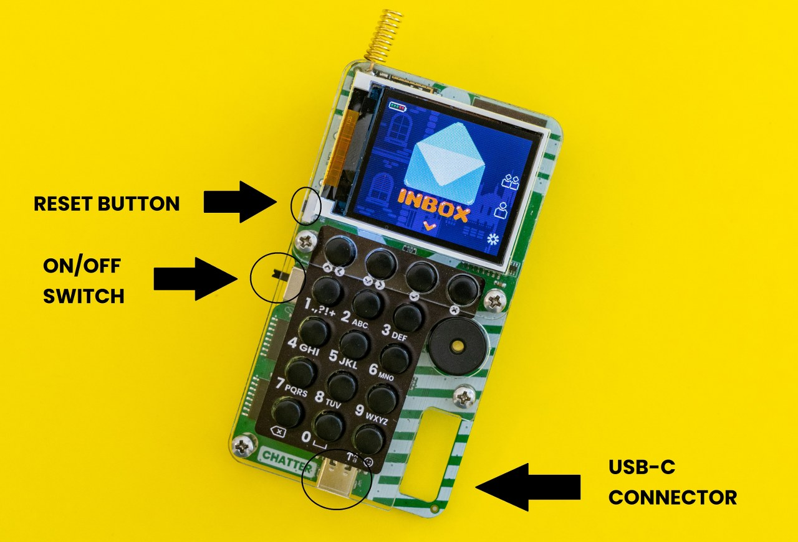

* *Reset Button:* Taste zum Neustarten von Chatter
* *On/Off Switch:* Schalter zum Ein-/Ausschalten
* *USB-C Connector:* USB-C Buchse zur Verbindung mit einem Computer

#### Erstes Mal?

Wenn du deinen Chatter zum ersten Mal einschaltest, solltest du den Hardware-Test sehen.

Das ist eine coole Software, mit der du sicherstellen kannst, dass du deinen Chatter richtig zusammengebaut hast! Folge einfach bei jedem Schritt den Anweisungen auf dem Bildschirm und überprüfe im Zweifelsfall deine Lötstellen!

Dies ist das Erste, was du sehen wirst, wenn du den Chatter einschaltest. Dieser Test soll sicherstellen, dass alle Knöpfe richtig verlötet sind.

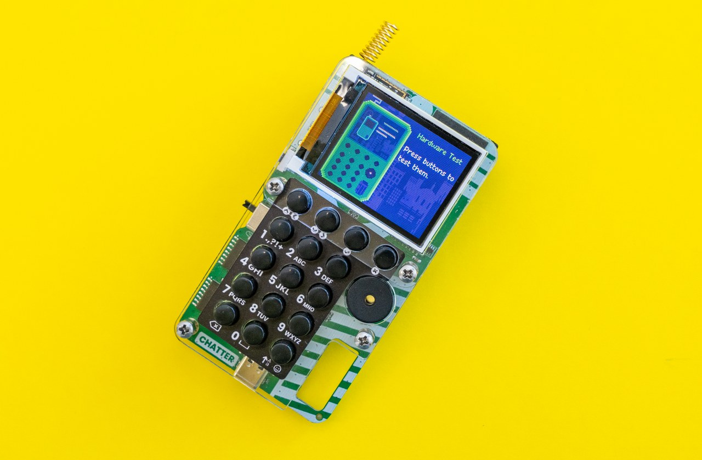

Du solltest alle sechzehn Tasten deines Chatters, die du angelötet hast, mindestens ein Mal drücken. Wenn die Taste richtig funktioniert, sollte der Kreis, der diese Taste darstellt, grün werden. Wenn einer der Kreise nicht grün wird, funktioniert diese Taste nicht. In diesem Fall solltest du die Lötstellen der entsprechenden Taste überprüfen.

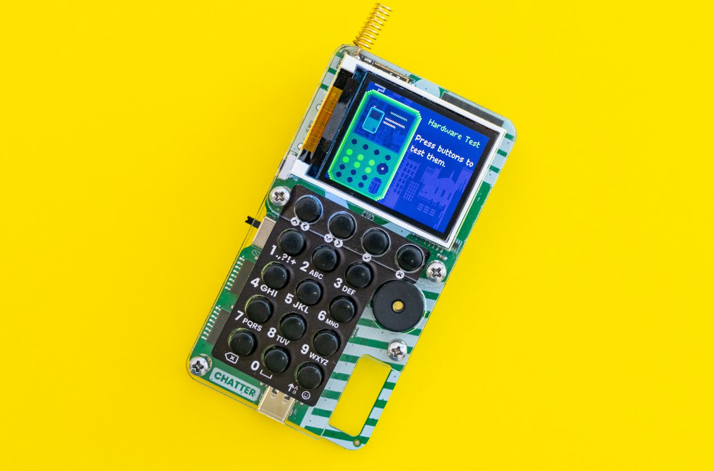

Nachdem alle Kreise auf dem Bildschirm grün geworden sind, beginnt der Summer Töne abzuspielen.

Auf der rechten Seite des Bildschirms siehst du eine Meldung, die dir erklärt, was du sehen und hören solltest und was du als nächstes tun musst.

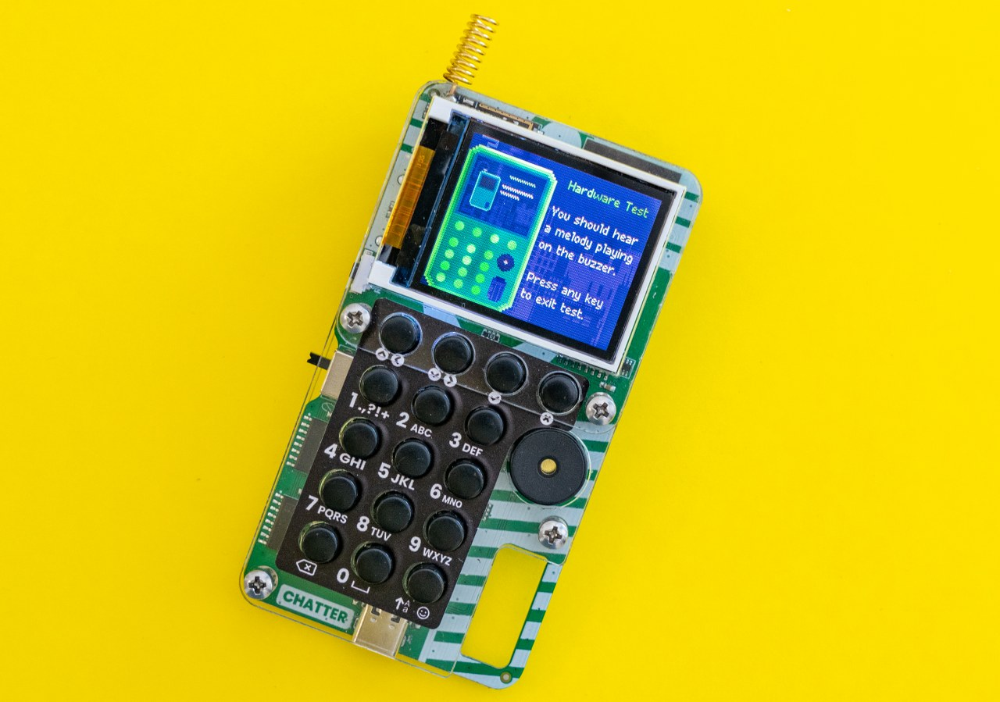

Wenn alle Kreise grün sind und du die Töne hörst - drücke einen beliebigen Knopf, um den Test zu beenden!

#### Batterie leer? Lass uns die Batterien wechseln!

Wie du wahrscheinlich schon weißt, hat Chatter keine wiederaufladbare Batterie, sondern 3 AAA-Batterien, die gewechselt werden müssen, wenn die Meldung "Achtung! Batterien schwach!" erscheint (auf englisch: *"Warning! Batteries low!"*).

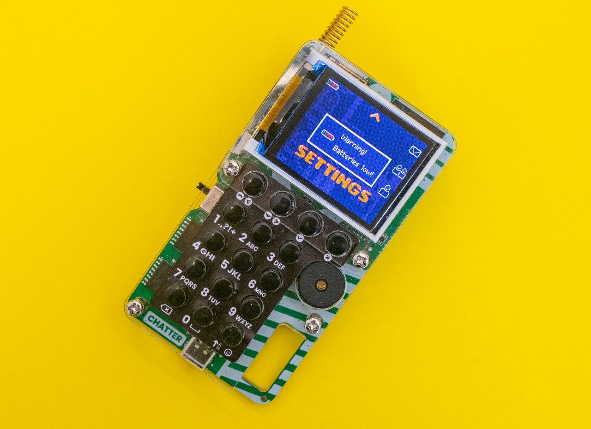

#### Schauen wir uns die Knöpfe an...

Wenn du die Aufkleber aus dem Bausatz benutzt hast, hast du wahrscheinlich eine Vorstellung davon, was jeder einzelne Knopf macht.

Aber wir sind hier, um jeden Schritt genau zu erklären.

In der ersten Reihe siehst du vier Knöpfe, während jede weitere Reihe aus drei Knöpfen besteht. Diese vier Tasten werden **zum Blättern im Menü verwendet**.

Die erste Taste links dient zum Beispiel dazu, nach oben oder links zu gehen, die zweite nach unten oder rechts, die dritte entspricht der Eingabetaste auf Ihrem PC (zum Eingeben und Bestätigen von Aktionen), und die vierte wird zum Verlassen des Menüs verwendet.

Die nächsten drei Reihen bestehen aus Testeb, die zum **Schreiben von Nachrichten** verwendet werden.

Und zu guter Letzt besteht die letzte Reihe aus der **Löschtaste** (ganz links), der **Leertaste/0-Taste** (in der Mitte) und der **Großbuchstaben-/Memes-Taste** (ganz rechts).

Es ist wirklich einfach, alle diese Tasten zu benutzen. Wenn du den ersten Buchstaben der Taste verwenden möchtest, drücke sie nur einmal; wenn du den zweiten Buchstaben verwenden möchtest, drücke zwei mal auf die Taste, und wenn du den dritten Buchstaben verwenden möchten, drücke drei mal.

Wenn du die **letzte Schaltfläche** in der letzten Reihe (**die mit dem Smiley**) lange gedrückt hältst, erhältst du Zugang zu einem geheimen **Meme-Menü**.

#### Navigiere durch das Menü von Chatter

Jetzt, wo du weißt, was die einzelnen Schaltflächen bedeuten, können wir das Menü überprüfen!

Als Erstes siehst du den Posteingang (englisch *Inbox*) in Form eines Briefumschlags,
dann den Bereich für Freunde (*Friends*),
gefolgt von deinem Profil (*Profile*) und den Einstellungen (*Settings*).

Wir werden diese Menüpunkte in den folgenden Kapiteln detailliert beschreiben!

### Einstellungen

Wenn du den Einstellungsmodus im Menü deines Chatter aufrufst, kannst du die Lautstärke, die Helligkeit, den Ruhezustand, die Ausschaltzeit und vieles mehr einstellen.

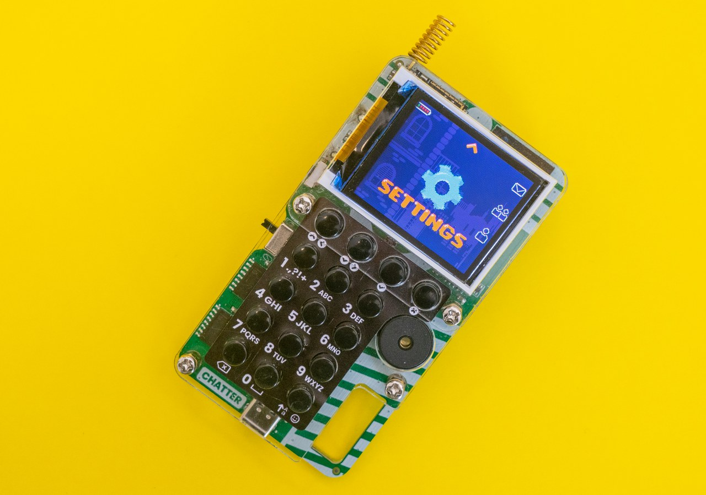

So sieht das Einstellungsmenü aus:

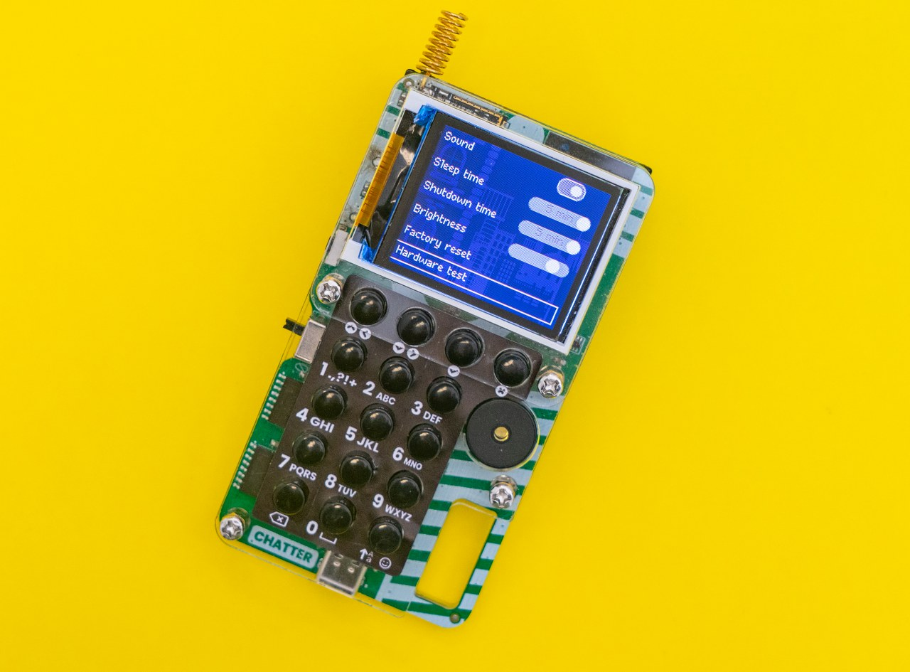

1. *Sound* / **Ton** - Hier kannst du den Ton ein- und ausschalten.

2. *Sleep time* / **Ruhezeit** - Nach welcher Zeit soll der Bildschirm ausgeschaltet werden; dies spart Energie. Du kannst die Ruhezeit anpassen oder diese Einstellung deaktivieren. Wenn sich dein Bildschirm ausschaltet, drücke eine beliebige Taste, und er wird wieder eingeschaltet.

3. *Shutdown time* / **Abschaltzeit** - Nach welcher Zeit soll sich das Gerät ausschalten; was auch Energie spart. Wenn sich dein Gerät ausschaltet, kannst du es mit einer Taste oder der Reset-Taste wieder einschalten. Außerdem schaltet sich das Gerät automatisch ein, wenn du eine Nachricht erhältst.

4. *Brightness* / **Helligkeit** - Zum Einstellen der Helligkeit des Bildschirms.

5. *Factory reset* / **Werkseinstellungen** - Wie bei einem echten Telefon kannst du mit dieser Einstellung alles auf dem Gerät löschen.

6. *Hardware test* / **Hardwaretest** - Führe diesen Test durch, wenn du den Verdacht hast, dass eine Komponente nicht so funktioniert, wie sie sollte. Falls du den Test nicht erfolgreich zu Ende durchführen kannst solltest du deine Lötstellen überprüfen. Wenn du Hilfe benötigst um deinen Chatter wieder zum Laufen zu bringen, kontaktiere uns einfach über contact@circuitmess.com.

## Lass uns Nachrichten schicken!

### Freunde hinzufügen

Schauen wir uns zwei sehr coole Funktionen an, die Chatter bietet!

Das sind das **Erstellen deines Profils** und das **Hinzufügen von Freunden**.

#### Benutzerprofil

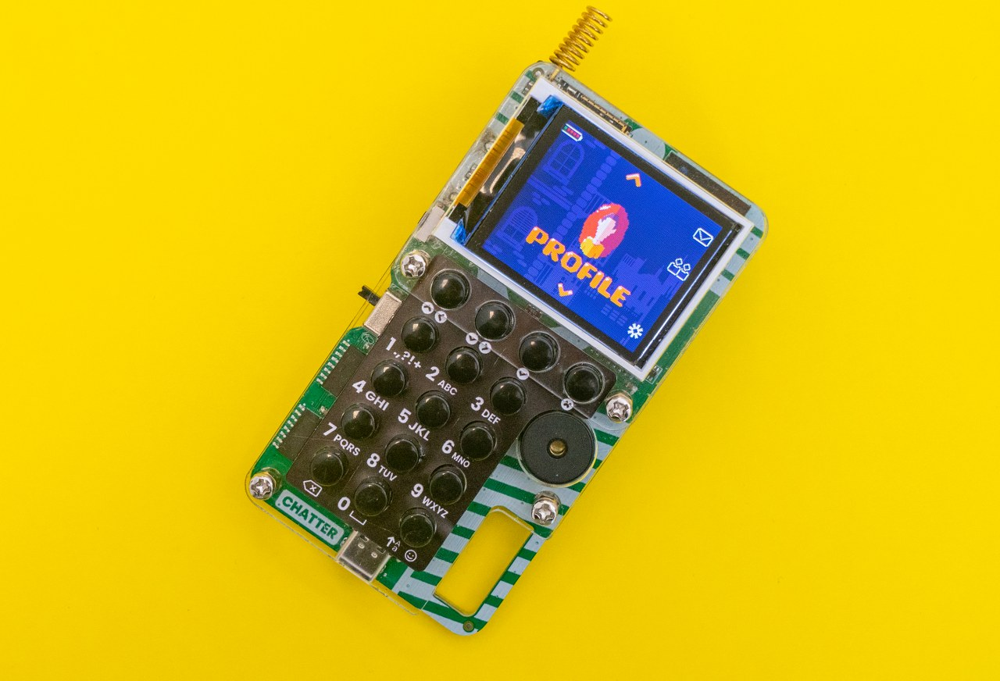

Klicke auf diese coole Funktion, um dein Profil zu erstellen.

Nach dem Öffnen sollte es so aussehen (bis auf den Namen und die Statistiken!):

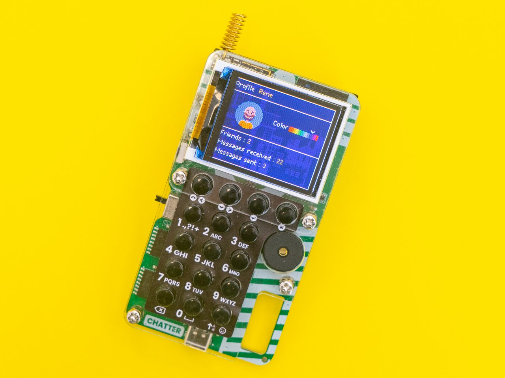

Wie du sehen kannst, kannst Du deinen Namen eintragen sowie die Chat-Farbe und dein Avatar-Foto anpassen.

Hier sind alle verfügbaren Avatar-Fotos, aus dehnen du wählen kannst!

Du kannst die genannten Dinge ändern, indem du sie anklickst und dann änderst. Nachdem du den Avatar und die gewünschte Farbe ausgewählt hast, klicke noch einmal auf die Schaltfläche mit dem Häkchen.

Hast du dein Profil angepasst? Sehr gut!

#### Lass uns ein paar Freunde hinzufügen!

Verwende die Taste **[x]**, um das Profil-Menü zu verlassen, und du findest dich im Hauptmenü wieder. Suche den Menüpunkt "Freunde" (englisch *"Friends"*) und öffne ihn.

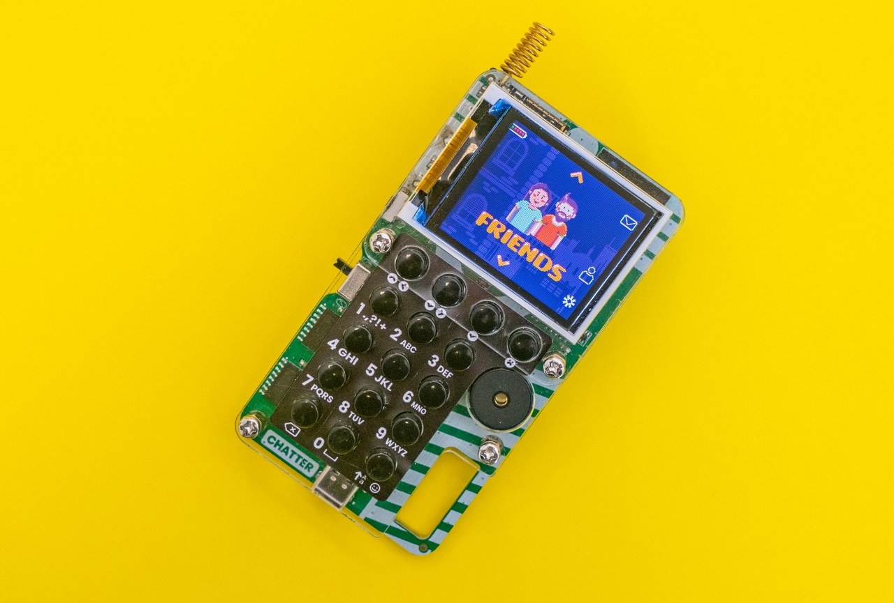

Sobald der Menüpunkt ausgewählt wurde, sieht der Bildschirm wie folgt aus:

Das linke Chatter zeigt, was du siehst, wenn du noch keine Freunde hinzugefügt hast.
Der rechte Chatter zeigt, wie der Bildschirm aussieht, wenn du bereits einige Freunde hinzugefügt hast.

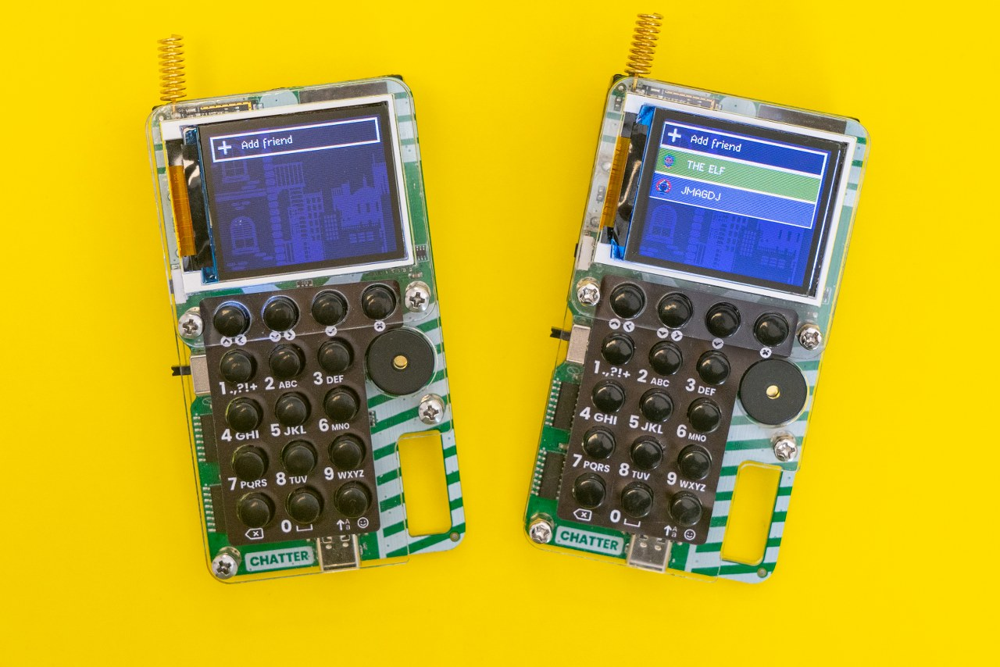

Nach Auswahl von "+ Freund hinzufügen" (*"+ Add friend"*), suchen die Chatter andere Geräte und finden schnell den nächsten Freund!

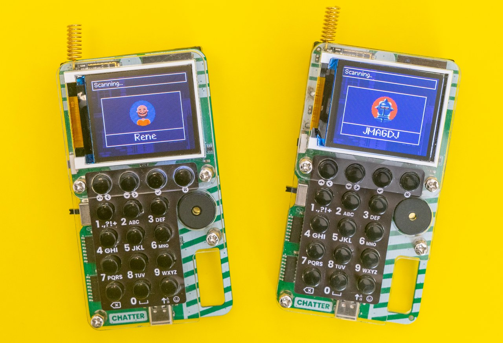

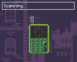

Bevor ihr Freunde werdet, müsst ihr euch gegenseitig hinzufügen und die Freundschaftsanfrage bestätigen (ganz ähnlich wie bei Facebook).

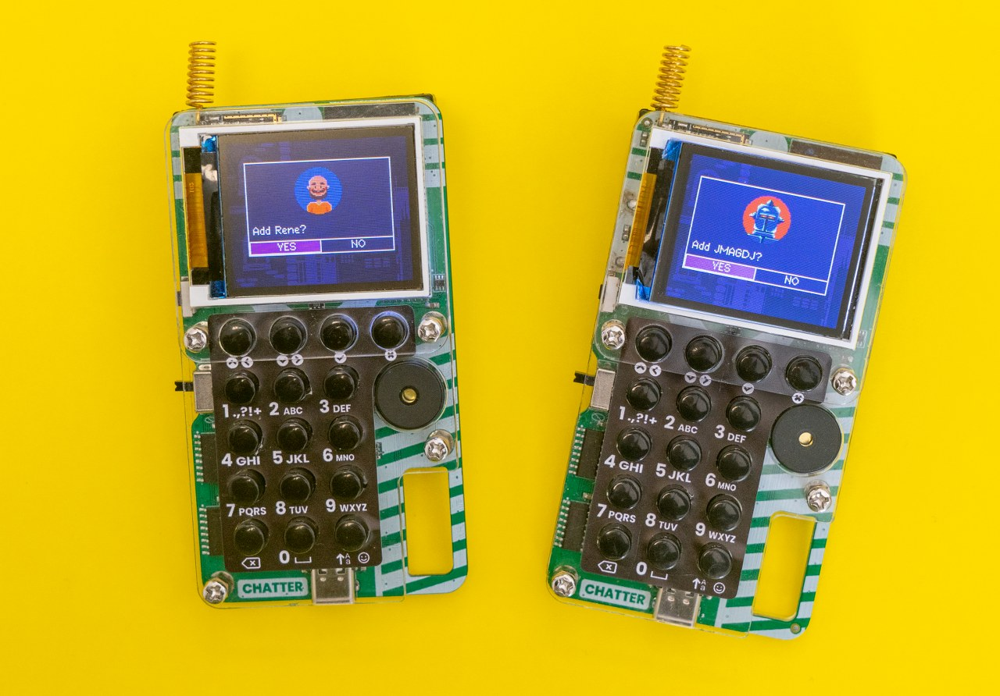

Sobald ihr euch gegenseitig hinzugefügt habt, werden die Chatter eine Kopplung (englisch *Pairing*) durchführen.

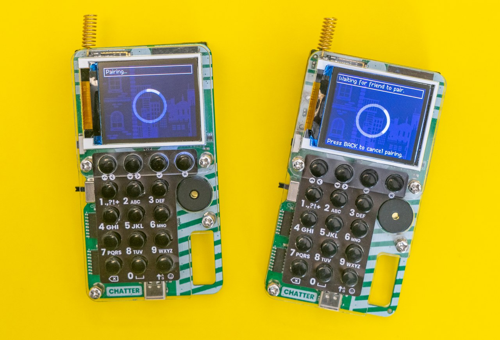

Es erscheint eine Meldung "Kopplung erfolgreich" (*"Pairing successful"*) und voila!

**Du hast jetzt einen Freund!**

Bereite dich auf all die lustigen Texte und Memes vor, die du gleich verschicken wirst!

### Nachrichten verschicken

Zu guter Letzt sehen wir uns an, was wir im **Posteingang** (englisch *Inbox*) tun können!

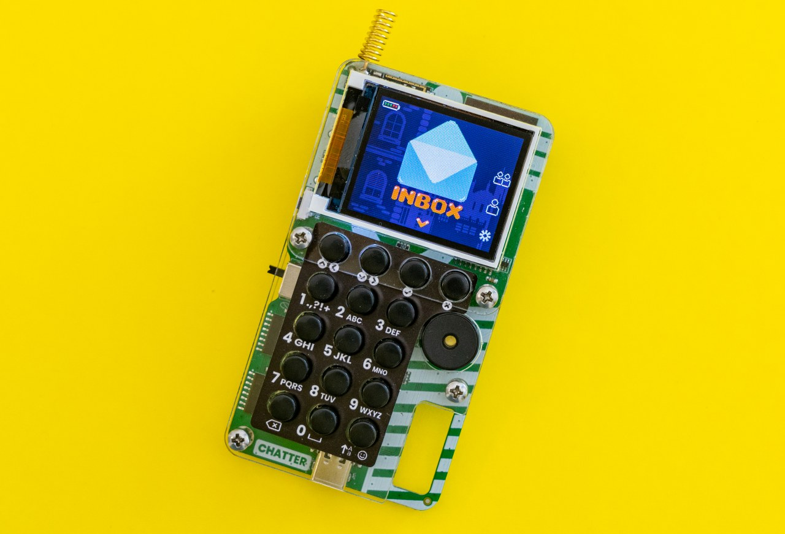

Wenn du bereits Nachrichten mit einem Freund ausgetauscht hast, siehst du sofort die Themen.

Falls das noch nicht der Fall ist, kannst du einen Chat mit deinem neu hinzugefügten Freund beginnen.

Sobald du einen Chat begonnen hast, sieht er so aus:

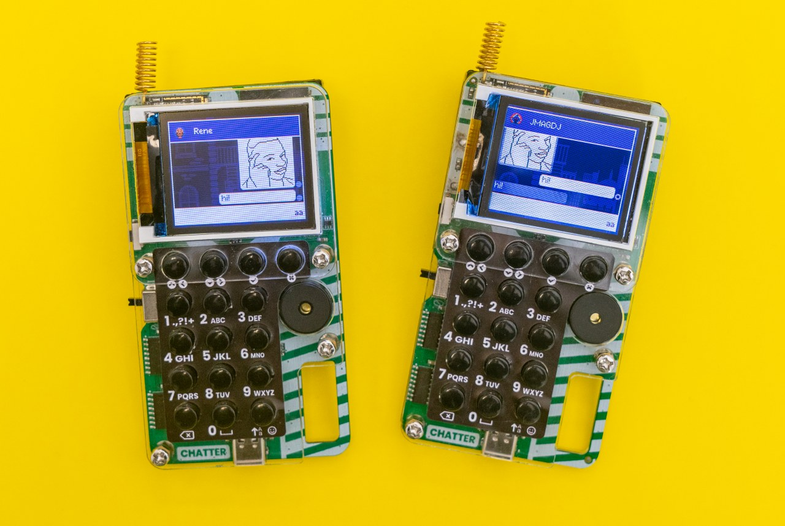

Wie du sehen kannst, gibt es neben der Nachricht einen **gefüllten und einen ungefüllten Kreis**. Der ausgefüllte Kreis bedeutet, dass die Nachricht zugestellt wurde, der nicht ausgefüllte Kreis bedeutet, dass sie noch nicht zugestellt wurde.

Wenn die Nachricht nicht zugestellt wurde, liegt das wahrscheinlich daran, dass der andere Chatter zu weit entfernt oder ausgeschaltet ist.

Du kannst dies jedoch beheben, indem du auf die nicht zugestellte Nachricht klickst und die Option "**Nachricht erneut senden**" (englisch *"Resend message"*) auswählst!

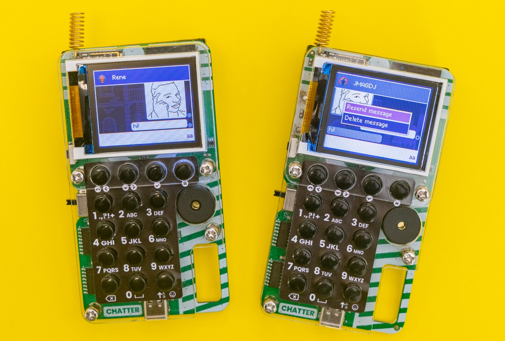

Wie du auf dem Foto sehen kannst, gibt es auch eine Option zum **Löschen** der Nachricht (englisch "*Delete message*").

Wir haben unsere nicht zugestellte Nachricht erneut gesendet, und jetzt sieht unser Chat so aus:

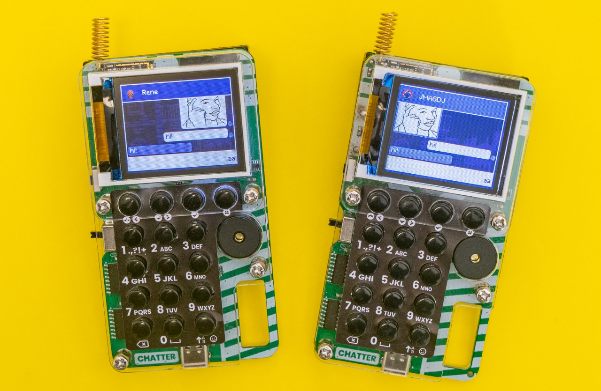

Und als Letztes möchten wir dir erklären, wie du **Memes** zum Chat hinzufügen kannst.

Siehst du die letzte Taste in der letzten Reihe? Die mit dem Smiley-Gesicht? Sehr gut!

Klicke darauf (aber halte die Taste ein paar Sekunden lang gedrückt).

Jetzt solltest du ein geheimes Meme-Menü vor dir sehen.
Viel Spaß beim Benutzen!

### Jetzt sollte alles bereit sein!

Wenn du Fragen oder Anmerkungen hast, kontaktiere uns bitte unter contact@circuitmess.com.
Wir werden dir so schnell wie möglich helfen.

Da du nun weißt, wie du deine Chatter nutzen kannst, ist der nächste Schritt die **Programmierung einiger benutzerdefinierter Funktionen**.

Die Programmieranleitung ist noch nicht hochgeladen, aber wir arbeiten daran!

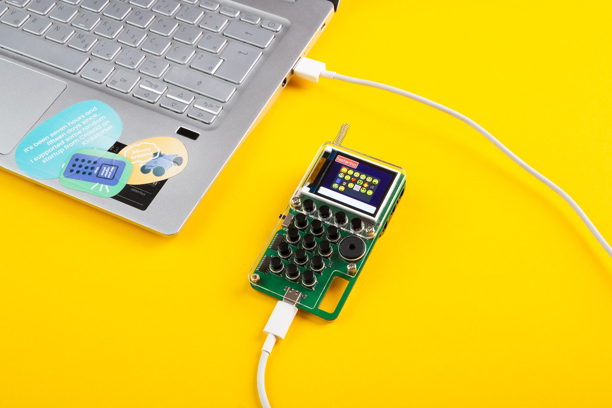
