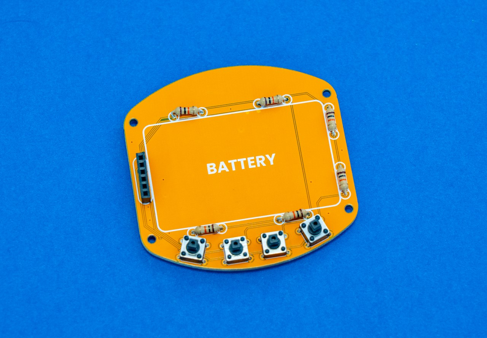
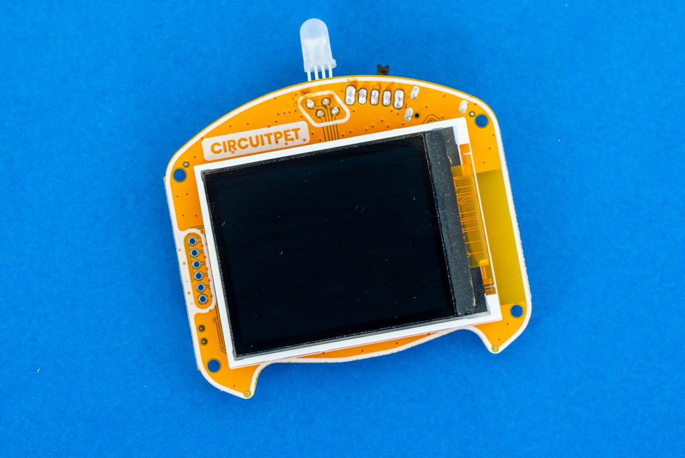
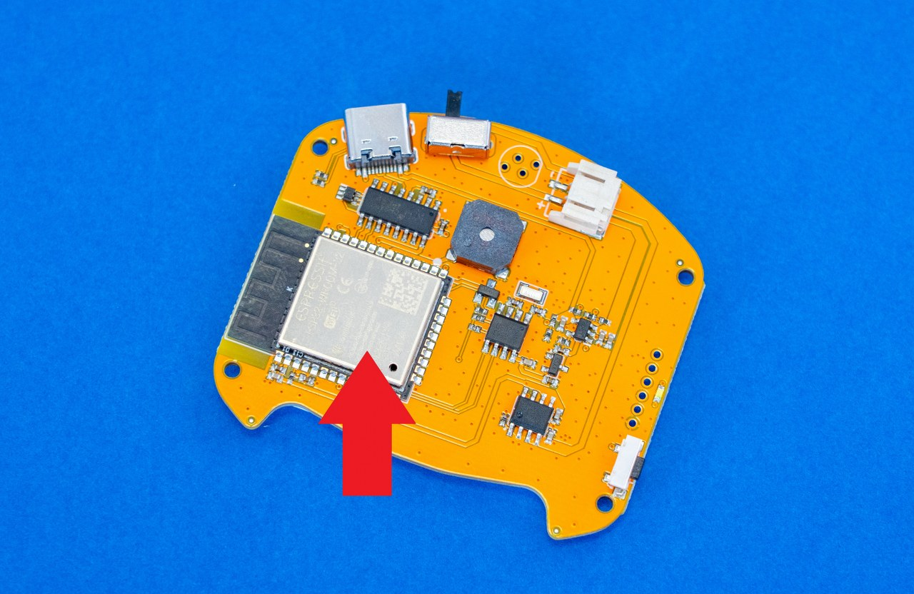
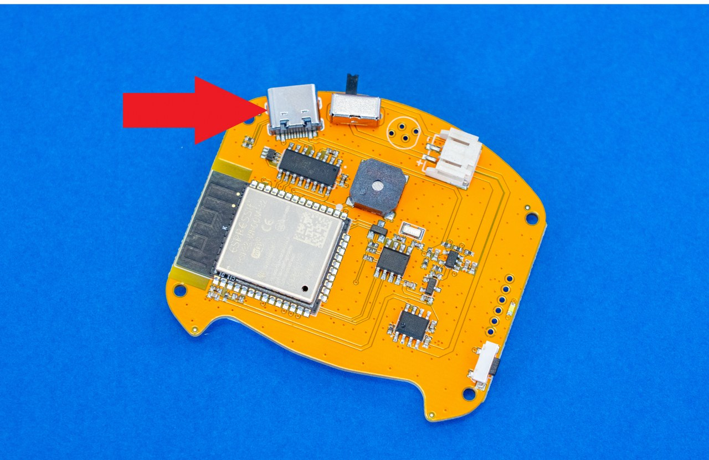
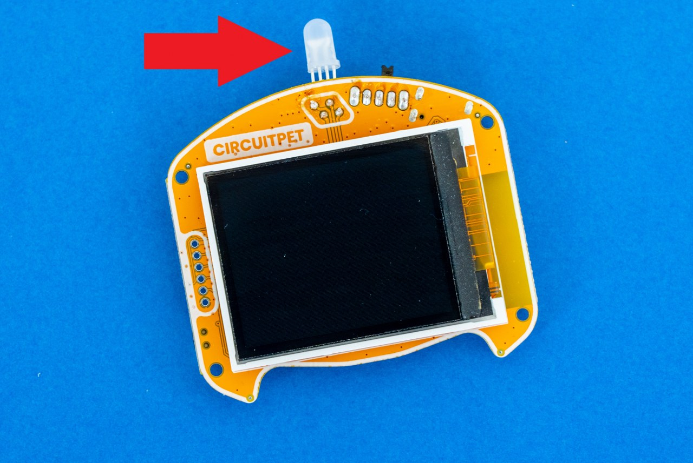
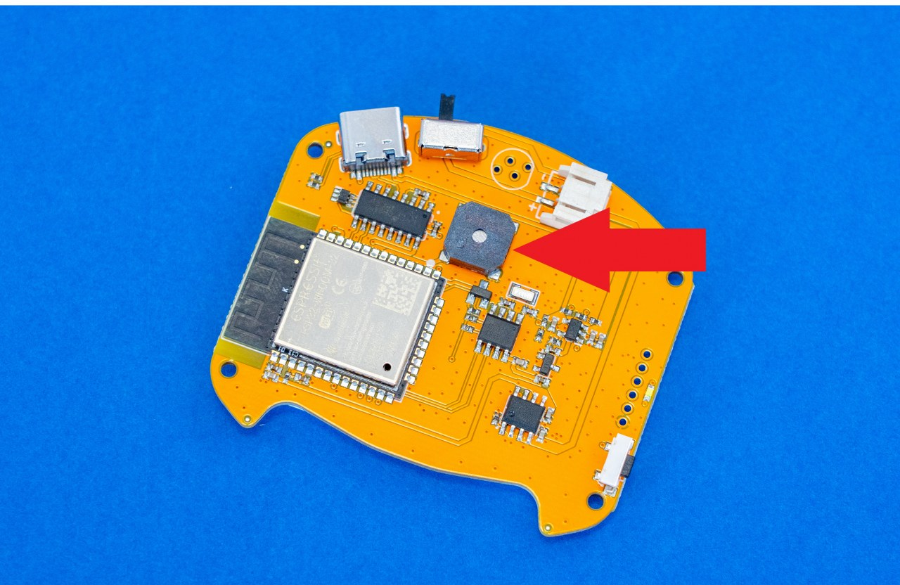
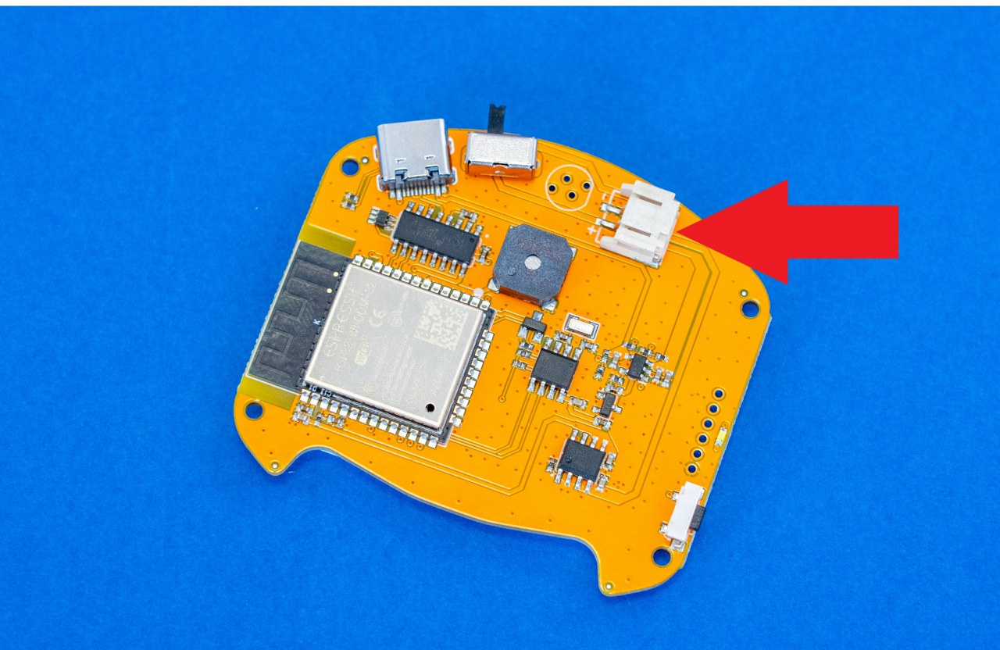
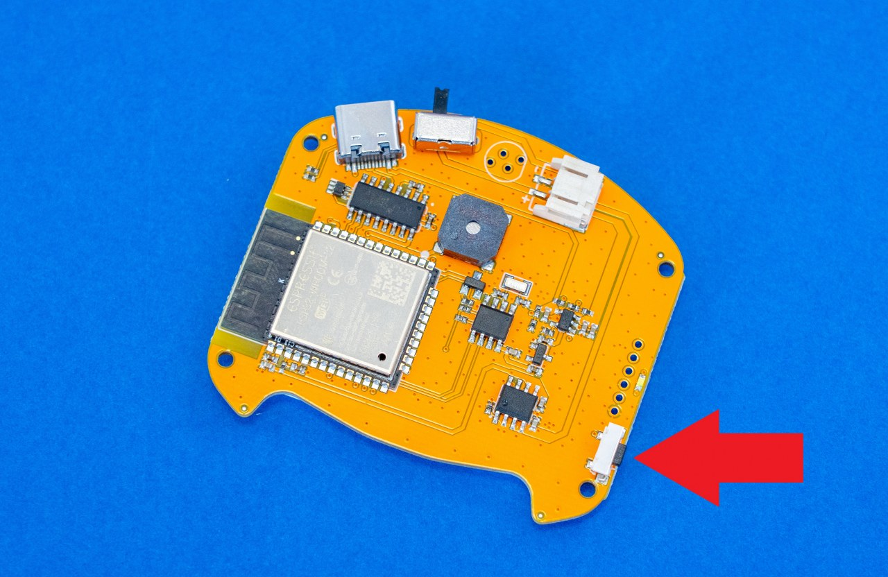
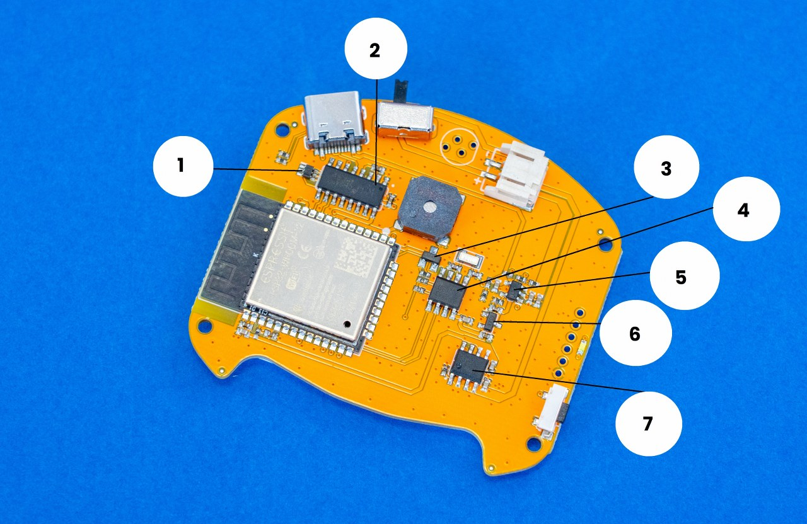
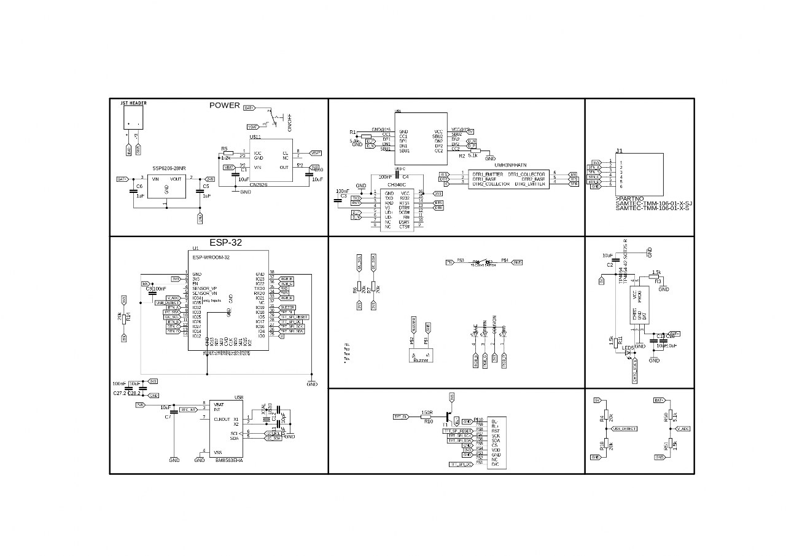

# CircuitPet Aufbau und Komponentenübersicht

* [Innerer Aufbau von CircuitPet](#innerer-aufbau-von-circuitpet)
* [Entdecke die Mikrochips](#entdecke-die-mikrochips)
* [CircuitPet Blockdiagramm](#circuitpet-blockdiagramm)

## Innerer Aufbau von CircuitPet

### Willkommen beim Handbuch zum inneren Aufbau von CircuitPet!

Unabhängig davon, ob du dein CircuitPet bereits zusammengebaut hast oder nicht, wird dies ein hilfreicher Leitfaden für dich sein, in welchem du etwas mehr über die verwendeten Komponenten, deren Verbindungen und Anschlüsse erfahren wirst.

Wir beginnen mit den größeren Bauteilen und gehen später auf die kleineren Bauteile ein.

### Erkunde die Hauptplatinen

Es wäre falsch, mit etwas anderem zu beginnen als mit den Hauptplatinen. Deshalb präsentieren wir dir den Star des Abends...

**PCB steht für Printed Circuit Board**. Diese Glasfaserplatine ist mit Kupferbahnen, Schutzlack und Isoliermaterial versehen.  

Dank der vielen Kupferleitungen auf der Platine können alle angeschlossenen oder aufgelöteten Bauteile miteinander kommunizieren.

Genau wie bei anderen CircuitMess-Geräten wie Nibble oder Spencer wollen wir, dass unsere Komponenten nicht nur wunderbar funktionieren, sondern auch cool aussehen! Deshalb haben wir ein paar lustige Muster entworfen, die du auf der Rückseite der Platine sehen kannst.

### Anzeigeplatine

### ESP-WROOM-32

Dieser Mikrocontroller steuert alles, und man könnte sagen, dass er das Gehirn von CircuitPet ist. Der ESP-WROOM-32 ist ein leistungsfähiges Modul, das hauptsächlich für Tonkodierung und Musik-Streaming verwendet wird. In Anbetracht seiner Fähigkeiten ist er sehr preisgünstig.

Neben der Ausgabe von Tönen kann der ESP-WROOM-32 auch zum Steuern von Schiebereglern, Encodern, Tastern und LEDs verwendet werden.

Aufgrund seiner Komplexität und Empfindlichkeit ist dieses Modul bereits mit der Hauptplatine von CircuitPet verbunden.

* [ESP-WROOM-32 Datenblatt](https://www.espressif.com/sites/default/files/documentation/esp32-wroom-32_datasheet_en.pdf) (englisch)

### USB-C Anschluss

Dieser Anschluss oben links auf der Hauptplatine wird verwendet, um CircuitPet mit dem Computer zu verbinden und den Akku aufzuladen. Sobald du ihn an deinen PC angeschlossen hast, kannst du in CircuitBlocks programmieren - einer grafischen Programmieroberfläche, die Neulingen den Einstieg in die Embedded-Programmierung erleichtert.

### RGB LED

**Was bewirken LEDs?**

**LED steht für Licht-emittierende Dioden.**

**LEDs** wandeln elektrische Energie in sichtbares Licht um.

**RGB im Namen steht für Rot, Grün und Blau.**

Das bedeutet, dass diese besonderen Leuchtdioden in drei verschiedenen Farben leuchten können.

Diese LEDs sind etwas ganz Besonderes, denn sie haben einen **winzigen eingebauten Chip, der die Farbe ändert**.

### Summer

Ein Buzzer oder Summer ist ein akustisches Signalgerät, das mechanisch, elektromechanisch oder piezoelektrisch sein kann.

Die Hauptfunktion des Summers besteht in der Umwandlung eines Audiosignals in Klang. Typischerweise werden sie in Alarmgeräten, Zeitschaltuhren usw. verwendet.

### JST-2P-Stecker

Dieser Stecker wird für den Anschluss des Akkus an die Anzeigeplatine verwendet.

### Reset-Knopf

Diese Taste ist ziemlich selbsterklärend - die Reset-Taste dient zum Zurücksetzen des gesamten Hauptprogramms. Das kann nützlich sein, falls die Anzeige auf dem Bildschirm "eingefroren" ist (was hoffentlich nie passiert).

## Entdecke die Mikrochips

### 1. UMH3N Chip

Mit diesem Chip kann CircuitPet zwischen dem Ausführungsmodus und dem Programmiermodus umschalten!

### 2. CH340C Chip

CircuitPet kann mit deinem Computer über USB kommunizieren, dank dieses kleinen Kerls!

### 3. Transistor S9015

Dieser Transistor ist hauptsächlich für die Verstärkung von Signalen mit geringer Signalstärke gedacht. Normalerweise, wenn ein Signal von geringer auf eine hohe Signalstärke verstärkt wird, wird auch das Rauschen zusammen mit dem Signal verstärkt. Dieser Transistor verfügt jedoch über eine Funktion, die das Rauschen aus dem verstärkten Signal herausfiltert, so dass wir ein rauscharmes Signal mit hoher Verstärkung am Ausgang erhalten.

### 4. BM8563EHA

Dies ist eine Echtzeituhr (englisch: RTC = Real Time Clock).

Ein RTC ist eine **batteriebetriebene Uhr, die in einem Mikrochip auf der Hauptplatine von Computern** enthalten ist. Ein kleiner Speicher auf diesem Mikrochip speichert Systembeschreibungen und eingestellte Werte - einschließlich von Zeitparametern, die von der Echtzeituhr verarbeitet werden.

### 5. TP4054 Chip

Dieser Chip hält deinen LiPo-Akku sicher geladen!

### 6. SSP6206-28 NR Chip

Dieser Chip wird als Spannungsregler verwendet.

### 7. CN2626 Chip

Dies ist ein linearer Regler, der für die Stromversorgung des CircuitPet verwendet wird. Der CN2626 verfügt außerdem über eine Temperaturregelung anstelle eines Übertemperaturschutzes, die den Ausgangsstrom regelt, um die Temperatur des Chips bei hoher Leistung oder hoher Umgebungstemperatur zu begrenzen.

## CircuitPet Blockdiagramm

**Dies ist das Blockdiagramm von CircuitPet.**

Wirf einen Blick auf die schematische Darstellung unten und untersuche sie im Detail.

Sie zeigt dir, wie die Komponenten wie EPS-WROOM-32, Bildschirm, Summer und Taster angeschlossen sind. Es wird auch erklärt, wie die Signale der verschiedenen Eingänge von den verschiedenen Treibern angenommen und verarbeitet werden und wie sie die Ausgänge beeinflussen.

