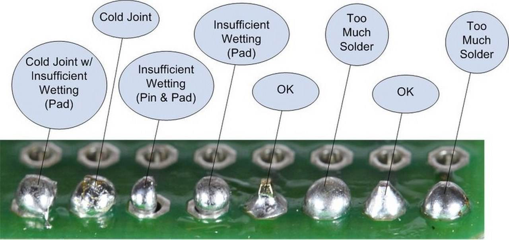
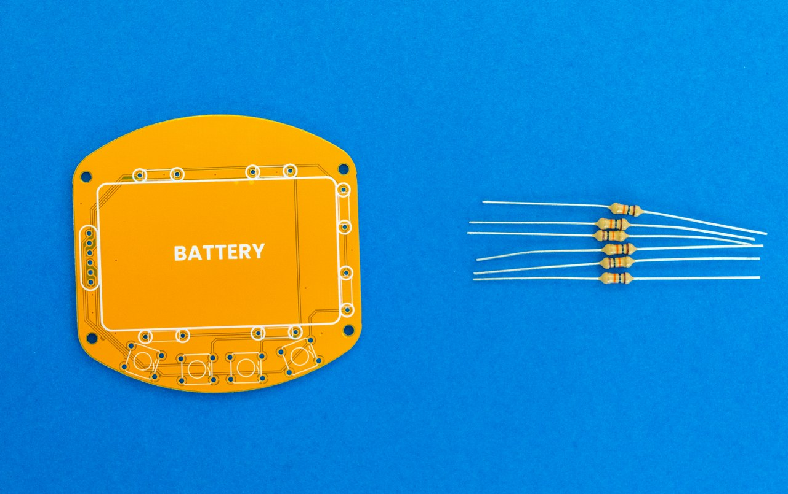
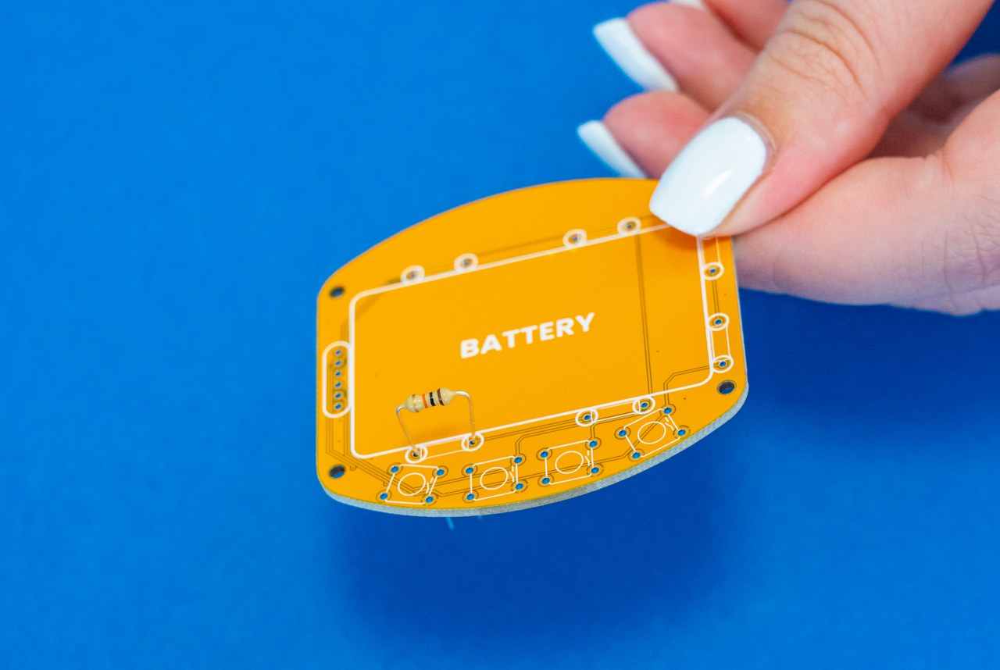
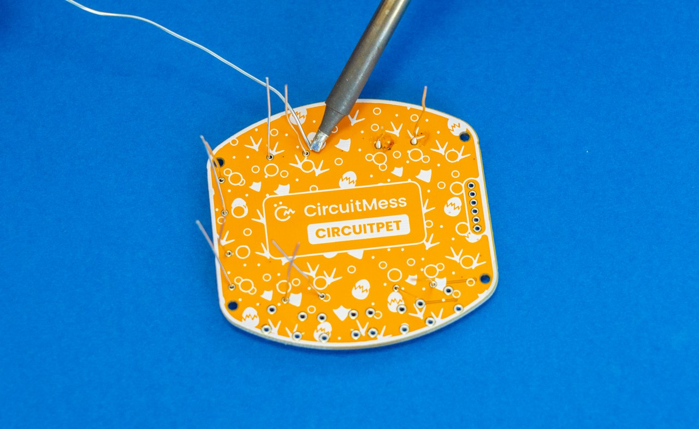
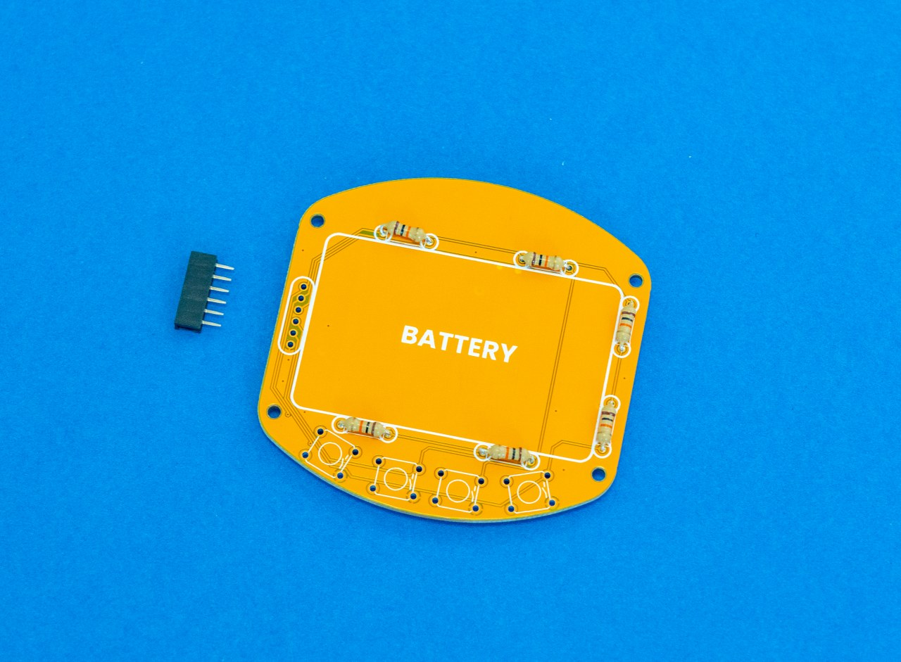
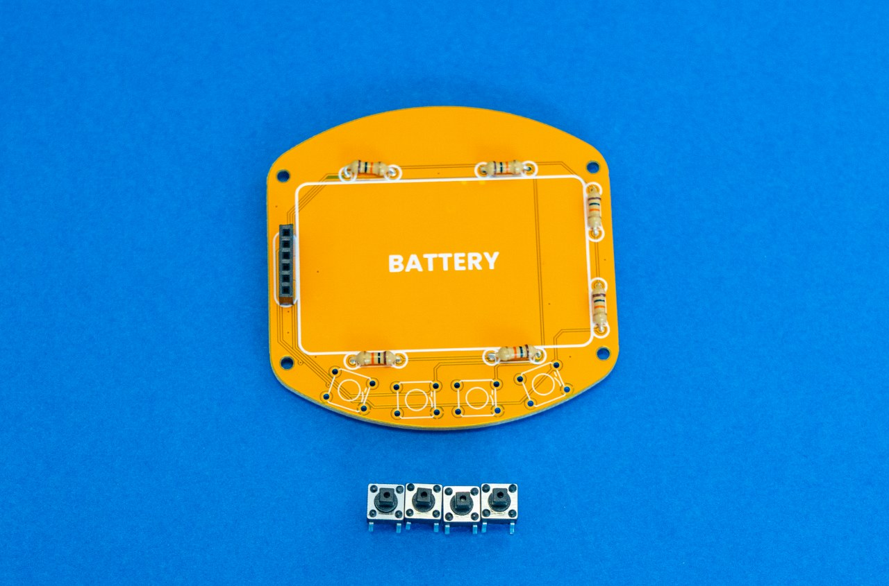
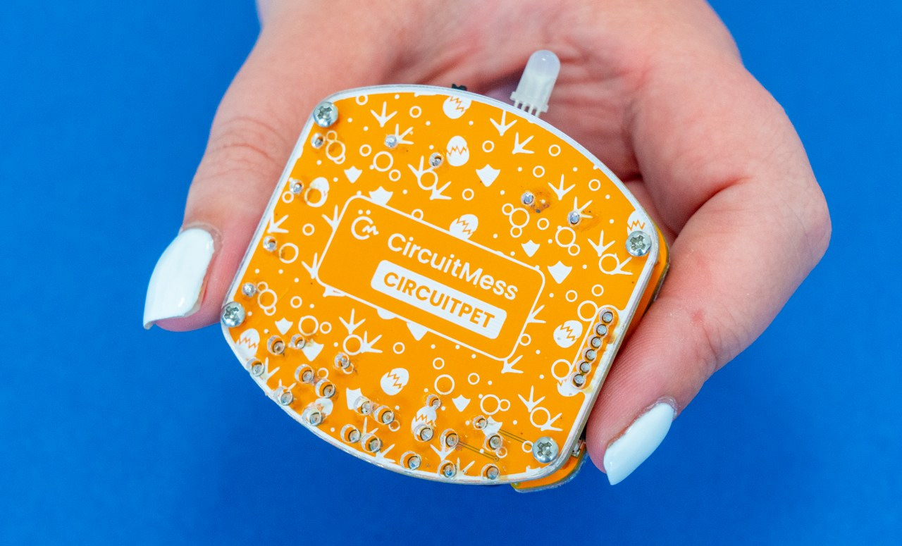

# CircuitPet Bauanleitung

Finde heraus, wie du dein neues CircuitPet - ein virtuelles Haustier Bastelkit - zusammenbaust.

**Dauer:** 2 Stunden  
**Schwierigkeit:** Mittel

* [Einführung](#einführung)
* [Hier sind die Werkzeuge](#hier-sind-die-werkzeuge)
* [Zusammenbau](#zusammenbau)
* [Wie geht's weiter?](#wie-gehts-weiter)

## Einführung

### Der Anfang

#### Willkommen zur CircuitMess CircuitPet-Bauanleitung!

In dieser Bauanleitung erfährst du, wie du deinen virtuelles mobiles Haustier zusammenbaust. Mit CircuitPet lernst du etwas über Echtzeituhren (RTC), Mikrocomputer und andere elektronische Komponenten, TFT-LCD-Displays, stromsparende und ständig eingeschaltete Schaltungen, die Mechanik von Videospielen und vieles mehr.

#### Altersgruppe

Wie auf der Schachtel angegeben, ist CircuitPet für alle **ab 11 Jahren** geeignet.

Du solltest einige der Montageschritte vorsichtig angehen, also sorge dafür, dass ein Erwachsener einspringt, wenn du später beim Löten oder Festziehen der Schrauben Hilfe brauchst. Es ist in Ordnung, wenn du um Hilfe bittest.

Aber keine Sorge! Wir gehen den Zusammenbau Schritt für Schritt durch und geben dabei einige nützliche Tipps. Wir geben dir einen Hinweis, wenn du beim Zusammenbau etwas Wichtiges beachten musst.

#### Aufbauzeit

Für den vollständigen Zusammenbau deines CircuitPet solltest du **etwa 2 Stunden** benötigen.

Natürlich hängt die Montagezeit von deinen Vorkenntnissen und deiner Erfahrung ab. Wenn du noch keine Erfahrung hast, mach' dir keine Sorgen! Du wirst nur etwas länger brauchen, um dich einzuarbeiten und die anfänglichen Schwierigkeiten zu überwinden.

#### Fertigkeiten

Du musst keine besonderen Fähigkeiten haben, um dich an diesem Heimwerkerprojekt versuchen zu können.

Das Hauptziel ist es, Spaß zu haben und etwas Neues zu lernen.

Also passt auf, lies alle Anweisungen und mach' dich bereit, Spaß zu haben!
Dies ist eine großartige Gelegenheit und dein erster Schritt in deiner großen Ingenieurskarriere.

#### Lernen mit CircuitPet

Wie bereits erwähnt, wird CircuitPet dir in den folgenden Stunden einige nützliche Dinge beibringen.

**Dies hier wirst du lernen:**

* Wie du dein eigenes elektronisches Gerät **lötest und zusammenbaust**
* **Echtzeituhren** (RTC)
* **Mikrocomputer und andere elektronische Komponenten**
* **TFT-LCD-Anzeigen**
* **Stromsparende und ständig eingeschaltete Komponenten**
* Mikrocontroller Programmierung
* **Mechanik von Videospielen**

### Was ist in der Schachtel?

#### Lernen wir alle Komponenten kennen, die in der Schachtel enthalten sind!

Öffne deine CircuitPet-Box und **überprüfe bitte, ob alle Komponenten enthalten sind**.
Lege alles auf eine saubere Oberfläche, auf der du überprüfen kannst, ob alles gemäß dem Foto und der Liste unten vorhanden ist.

Falls etwas fehlen sollte, kontaktiere uns bitte unter <contact@circuitmess.com>.
Schicke uns bitte ein Foto von allem, was im Karton war, und wir werden uns so schnell wie möglich bei dir melden, um das Problem zu lösen.

#### Hier ist die Liste der Komponenten:

1. Aufkleber
2. Gelbes Schlüsselband
3. Sammlerkarte
4. Li-Po-Akku
5. Ständer aus Acryl
6. Anzeigeplatine
7. Hauptplatine
8. Hinteres Acrylgehäuse
9. Vordere Acrylverkleidung
10. RGB-LED
11. Widerstände
12. USB-C-Kabel
13. Ein-Aus-Schalter
14. Stiftleisten und Buchsenleisten
15. Taster
16. Kappen für die Taster
17. Metallbolzen
18. Abstandshalter aus Messing

## Hier sind die Werkzeuge

### Nötige Werkzeuge

In diesem Kapitel erklären wir dir, welche Werkzeuge du für den Zusammenbau deines CircuitPet benötigst.

Wenn du dein **CircuitMess Tools-Paket** vor dir liegen hast, dann solltest du bereit sein und hast bereits alle benötigten Werkzeuge!

Falls du den CircuitPet-Bausatz ohne das Werkzeugpaket erhalten hast, ist dies ein guter Zeitpunkt, um sich einige der Werkzeuge auszuleihen oder sie zu kaufen.

Die benötigten Werkzeuge sind unverzichtbar, wenn du elektronische Geräte zusammenbaust, reparierst oder modifizierst - und sie sind das Handwerkszeug für jeden Maker, Hardware-Hacker, Modder oder Elektriker.

1. Lötkolben
2. Entlöt-Vakuumwerkzeug (Lötsauger)
3. Lötkolbenständer
4. Eine kleine Rolle mit kolophoniumhaltigem Lot
5. Reinigungsschwamm
6. Kreuzschlitzschraubendreher
7. Seitenschneider
8. Spitzzange

#### Lötkolben

Dies ist das wichtigste Werkzeug im Arsenal eines Bastlers.

Für den Zusammenbau von CircuitPet reicht jeder Lötkolben der Einstiegsklasse aus.

Wenn du vor hast, in die Welt der Heimwerkerprojekte einzutauchen, solltest du einen teureren Lötkolben mit mehr Funktionen in Betracht ziehen. Lötkolben mit austauschbaren Spitzen sind zum Beispiel besonders nützlich, wenn du viel mit kleineren Bauteilen arbeiten möchtest.

Im nächsten Kapitel findest du eine Anleitung zum richtigen Löten und zur Pflege deines Lötkolbens.

#### Lötschwamm

Dieses kleine Stück macht nicht viel her, bis man es in Wasser einweicht. Dann verwandelt es sich in einen super Lötzinn-Reinigungsschwamm! Benutze ihn, nachdem du ein paar Lötstellen gelötet hast, um das überschüssige Lot von der Spitze deines Lötkolbens zu entfernen. Achte darauf, dass der Schwamm weder tropfnass noch staubtrocken ist - er sollte feucht sein.

#### Seitenschneider

Mit einem Seitenschneider wie diesem kannst du die Beine von gelöteten Bauteilen abschneiden und Drähte kürzen.

Wir bevorzugen die auf dem Bild gezeigte Zange (Plato, Modell 170), aber auch jedes andere Modell ist geeignet.

#### Spitzzange

Eine solche Zange brauchst du beim Zusammenbau des Gehäuses oder beim Einstecken kniffliger Stecker!

Sie ist generell hilfreich bei feinmechanischen Arbeiten.

#### Kreuzschlitz - Schraubendreher

Für die Montage des Gehäuses benötigst du diesen Kreuzschlitzschraubendreher.

Ein handelsüblicher 2,0 mm - Kreuzschlitzschraubendreher sollte ausreichen.

#### Entlöt-Vakuumwerkzeug (Lötsauger)

Dieses Werkzeug ist nützlich, um Lötfehler zu beseitigen. Für die Montage selbst ist es nicht notwendig.

Wenn du vor hast, in Zukunft etwas zu hacken, zu modden oder Hardware zu reparieren, ist es immer eine gute Idee, dieses Werkzeug zu haben.

### Zusätzliche nützliche Werkzeuge

#### Helfende dritte Hand mit Lupe

Dies könnte deine Löterfahrung ein wenig angenehmer machen, besonders wenn du kompliziertere Projekte durchführen möchtest.

#### Multimeter

Ein Multimeter kann für viele Dinge verwendet werden: zum Prüfen kniffliger Verbindungen, zum Messen der Batteriespannung, zum Testen von Widerständen und Kondensatoren, zum Messen des Stromverbrauchs und vielem mehr.

Es ist ein nützliches Werkzeug, wenn du herausfinden willst, was bei einem Elektronik-Bausatz schief gelaufen ist.

#### Lötdocht

Du kannst den Lötdocht zusammen mit dem Entlöt-Vakuumwerkzeug verwenden, um Lötfehler zu beseitigen. Lege ihn einfach auf die fehlerhafte Lötstelle und drücke mit einem heißen Lötkolben darauf. Dann saugt er das überschüssige Lot auf wie ein Schwamm!

Nützlich zum Korrigieren von Lötstellen, die mit einem Lötsauger nicht leicht zu erreichen sind.

## Zusammenbau

### Einführung in das Löten

**Eines der Dinge, die du beim Zusammenbau deines CircuitPet tun wirst, ist löten!**

Hast du das schon einmal gemacht? Wenn nicht, empfehlen wir, dir die folgenden Links anzusehen, die zu nützlichen Anleitungen und Blogs zum Thema Löten führen. Du wirst nur 10 Minuten brauchen, um dich in die Materie einzuarbeiten und um zu verstehen, wie es gemacht wird.

Hier sind die Links (englisch):

* [Adafruits Video Tutorial mit Collin Cunningham](https://www.youtube.com/watch?v=QKbJxytERvg) - Ein Tutorial mit Collin Cunningham, einem super charismatischen Elektronik-Guru.
* [Adafruits Löt Tutorial](https://learn.adafruit.com/adafruit-guide-excellent-soldering?view=all) - Ein großartiges und ausführliches Video-Tutorial. Ein absolutes Muss, auch wenn Du schon weißt, wie man lötet. Besonders zu empfehlen ist der Abschnitt "Häufige Fehler beim Löten" am Ende.
* [Sparkfuns Video-Tutorial zum Löten](https://www.youtube.com/watch?v=f95i88OSWB4) - Ein weiteres gut gemachtes Video-Tutorial zum Thema Löten.
* [Sparkfuns Standard Soldering Tutorial](https://learn.sparkfun.com/tutorials/how-to-solder-through-hole-soldering) - Ein detailliertes Tutorial von Sparkfun.

#### Löt-Regeln

Es gibt einige Regeln für das Löten, die jeder, unabhängig von seinem Kenntnisstand, stets beachten sollte:

* **Atme niemals die Dämpfe ein, die der Lötkolben produziert!**
  Diese können gefährlich sein, also atme sie bitte nicht ein.

* **Berühre niemals die Spitze des Lötkolbens!**
  Auch wenn der Lötkolben ausgeschaltet oder ganz von der Stromquelle getrennt ist, kann er noch sehr heiß sein und daher bei Berührung sehr unangenehme Schmerzen verursachen.
  Halte den Lötkolben immer so, dass die Spitze von deinen Händen weg zeigt.
  Wenn du mit dem Löten fertig bist, trenne den Lötkolben von der Stromquelle und lasse ihn mindestens fünf Minuten abkühlen, bevor du ihn wieder verstaust.

* **Reinige den Lötkolben!**
  Der Schwamm ist dein bester Freund beim Löten. Verwende ihn häufig und reinige deinen Lötkolben, wenn du einfach und problemlos löten möchtest.
  Halte dazu ein Ende des Schwamms vorsichtig mit einer Hand fest und wische die Spitze des Lötkolbens am anderen Ende des Schwamms ab, um das überschüssige Lot zu entfernen. Wiederhole dies so lange bis die Spitze des Lötkolbens schön sauber ist.

* **Prüfe deine Lötstellen. Zweimal!** (mindestens)
  Die meisten Fehlfunktionen in der Welt der Elektronik sind auf schlechte Lötstellen zurückzuführen. Unabhängig davon, ob es sich um dein erstes oder 100. Lötprojekt handelt solltest du deine Lötstellen immer mehrmals überprüfen, bevor du zum nächsten Schritt übergehst.

* **Bewahre den Lötkolben auf dem Ständer auf**, wenn du ihn nicht benutzt.

* **Verwende die richtige Menge Lötzinn!**
  Achte darauf, dass du gerade genug Lot verwendest. Nicht zu viel, aber auch nicht zu wenig, denn beides kann dazu führen, dass dein Bausatz dann nicht funktioniert.

* **Lass keine Lot-Reste auf der Platine!**
  Das Lötzinn sollte sich nur auf den Teilen befinden, an denen die Stifte mit der Platine verbunden sind. Halte den Rest der Platine sauber! Kleine Löttropfen auf der ganzen Platine sind ein absolutes Tabu!

**Bitte lies dir diese Regeln jetzt noch ein paar Mal durch, damit du sie nicht vergisst!**

Verwende dieses Foto, um eine Vorstellung von guten und schlechten Lötstellen zu bekommen (Danke an Adafruit für dieses tolle Foto!):

* **Cold Joint** - Kalte Lötstelle
* **Insufficient Wetting** - Unzureichende "Benetzung" des Lötstelle; zu wenig Lot
* **Too Much Solder** - Zu viel Lot
* **OK** - Super. Alles richtig!

Wenn du diese Regeln befolgst, sollte dir das Löten leicht von der Hand gehen.

#### Verwendung des Lötkolbens

Der Lötkolben ist sehr einfach zu benutzen, aber nur, wenn er richtig benutzt wird.

Wenn du das CircuitMess-Werkzeugpaket mit deinem Chatter-Bausatz gekauft hast, hast du einen weißen Lötkolben mit einem Temperaturregler erhalten.

Erinnerst du dich an die zuvor erwähnten Regeln? Gut! Lass uns jetzt die Anweisungen zur Verwendung des Lötkolbens durchgehen...

Wenn du deinen Lötkolben zum ersten Mal benutzt oder Hilfe bei der Reinigung der Spitze brauchst, schau dir unser (englisches) [Video-Tutorial](https://www.youtube.com/watch?v=JPFH4m-Pa00) an.

##### Schritt 1 - Einstecken

Lege den Lötkolben auf den Lötkolbenständer - wie auf dem Bild gezeigt - und schließe ihn an eine Steckdose an.

##### Schritt 2 - Wähle die richtige Temperatur

Stelle die Temperatur auf **350 °C** ein, indem du den Temperaturregler am Lötkolben drehst.
Achte darauf, dass der kleine schwarze Pfeil auf die richtige Temperatur zeigt, wie auf dem Foto zu sehen.

Dein Lötkolben ist jetzt einsatzbereit, aber lass ihm ein bis zwei Minuten Zeit, damit er sich aufheizen kann.

##### Schritt 3 - Auszuschalten, wenn du fertig bist

Wenn du mit dem Löten fertig bist (keine Angst - wir sagen dir wenn's soweit ist), ziehe den Stecker aus der Steckdose, um den Lötkolben auszuschalten.

Bitte benutze den Metallständer immer dann, wenn du den Lötkolben nicht benutzt.
Damit stellst du sicher, dass deine Unterlage oder die Platine nicht verbrennen.

**Achte darauf, nach dem Ausschalten die Spitze des Lötkolbens mindestens fünf Minuten lang nicht zu berühren.**

### Teil Eins - Löten der Bauteile

Jetzt, wo du weißt, wie man lötet, können wir es gleich ausprobieren. Bist du bereit?

#### 1. Einlöten der Widerstände

Schau' dir vor dem Löten noch einmal unser [Video-Tutorial](https://www.youtube.com/watch?v=JPFH4m-Pa00) (englisch) an, um sicher zu gehen, dass du alles richtig machst.

Die ersten Komponenten, die wir verwenden werden, sind die **Platine** und die **Widerstände**.

Du benötigst **sechs Widerstände** für diesen Teil - du hast einen zusätzlichen Widerstand in der Schachtel, falls etwas schief geht.

Widerstände sind die grundlegendsten elektronischen Bauteile, die in fast jedem elektronischen Gerät zu finden sind.

Sie verändern den Fluss der elektrischen Energie auf ihre eigene Art und Weise.
Die Widerstände, die du in deinem Paket erhalten hast, haben eine zylindrische Form und zwei winzige Metallbeine. Wir nennen diese Beinchen **"Bauteilanschlüsse"**.

Zuerst musst du die Beine der Widerstände in Form des **Buchstabens U** biegen.
Sei vorsichtig, denn sie brechen leicht!

Du kannst sie entweder mit deinen **Fingern** oder mit einer **Spitzzange** biegen.

Wenn du fertig bist, sollten sie alle so aussehen:

Nimm sie einzeln und setze sie wie auf dem Foto gezeigt auf die Platine:

Achte bitte darauf, dass sie gut sitzen und dass der farbige Mittelteil des Widerstands die Platine berührt.

Drehe danach die Platine um. Sie sollten etwa so aussehen:

Jetzt ist es Zeit zu löten!

Gehe noch einmal die Tipps und Tricks zum Löten durch, schaue dir die Videos an und leg' los!

Stecke die restlichen Widerstände an ihren Platz und mach' dich wieder ans Löten!

Wenn du mit dem Einlöten der Widerstände fertig bist, sollte deine Platine wie folgt aussehen:

Vergewissere dich, dass es **keine Brücken** zwischen den Lötstellen gibt, da dies zu Problemen führt, sobald du dein Gerät einschaltest.

Um sicherzugehen, dass alles in Ordnung ist, gehe zurück zur ersten Seite dieses Kapitels und überprüfe das Bild **"gute und schlechte Lötpunkte"**.

**Sieht alles gut aus? Ausgezeichnet!**

Nimm nun die Abschneidezange und schneide die Beine der Widerstände ab.
Du solltest sie direkt über dem Lot abschneiden, aber - pass auf, dass du die Lötstelle nicht berührst.

**Sei vorsichtig! Richte die Beinchen beim Schneiden nicht nach oben!**  
**Sie könnten wegfliegen und jemanden verletzen!**

Nachdem du alle 12 Bauteilanschlüsse abgeschnitten hast, sollte dein CircuitPet wie folgt aussehen:

#### 2. Buchsenleiste

Jetzt brauchen wir die Buchsenleiste und die Platine.

Die Buchsenleiste wird auf der **rechten Seite der Platine** angebracht, wobei die Stifte durch die Platine auf die Rückseite geführt werden.

Genau so:

Drehe die Platine wieder um und beginne mit dem Löten der Stifte.

**Prüfe bitte, ob Brücken vorhanden sind**; wenn nicht, bist du startklar!

So sollte die Rückseite deiner Platine jetzt aussehen:

#### 3. Die Taster

Wir arbeiten noch immer an der Hauptplatine.

Der nächste Schritt ist das **Löten von vier Tastern**, mit denen man CircuitPet füttern, durch das Menü gleiten und Spiele spielen usw. kann.

Taster sind die am häufigsten verwendeten Eingabebausteine - und es gibt insgesamt 4 davon auf dem CircuitPet.

Die Tasten bestehen aus zwei Teilen - den **mechanischen Taster-Unterteilen und den Tastenkappen**. Die Taster können auch ohne die Kappen funktionieren, aber das Drücken mit den Kappen fühlt sich viel schöner an, und sie sehen viel cooler aus.

Wie auch immer, wir lassen die Kappen erst einmal beiseite und konzentrieren uns auf das Löten der mechanischen Taster.

Die Taster werden an den vier quadratischen Teilen **unten auf der Platine** angebracht.

Als Erstes musst du jeden einzelnen Taster auf der Platine platzieren. Sie sollten vertikal auf der Platine platziert werden.

**Vergewissere dich vor dem Einlöten der Taster, dass sie senkrecht auf der Platine stehen. Das ist sehr wichtig, denn wenn die Taster schief stehen, kannst du später die beiden Platinen nicht miteinander verbinden.**

Nachdem du die Bauteile an der richtigen Stelle platziert hast, lege die Hauptplatine vor dir auf die Arbeitsfläche und nimm den Lötkolben zur Hand.

Du kannst nun die restlichen Taster einsetzen und anlöten.

So sollte die Rückseite deines CircuitPet inzwischen aussehen:

Und so sollte die Vorderseite deiner Platine aussehen:

#### 4. Der Schalter

Nun legen wir die Hauptplatine beiseite und nehmen die **Anzeigeplatine** zur Hand.
Außerdem benötigst du in diesem Schritt einen Ein-Aus-Schalter.

Mit dem Schalter, den du im Bausatz hast, kannst du später das Gerät **ein- und ausschalten**.

Ein Schalter steuert den Stromfluss zu einem elektrischen Gerät - mit anderen Worten, er **verbindet und trennt einen Stromkreis**.

Der Schalter wird auf der **oberen Rückseite** der **Anzeigeplatine** angebracht.

Genau so:

Vergewissere dich, dass der Schalter **eingerastet** ist als du ihn in die Platine gesteckt hast.
Prüfe bitte auch, dass er **nicht verdreht** ist. Sonst funktioniert er nicht und lässt sich nur schwer wieder herausnehmen, wenn du ihn eingelötet hast.

Na dann. Nimm deinen Lötkolben und los geht's!

Ta-daa! Du hast es geschafft!

Du hast eines der wichtigsten Teile deines Geräts erfolgreich angelötet.

#### 5. RGB-LED

Jetzt ist es Zeit für den etwas kniffligen Teil der Montage.

**Was machen LEDs?**

**LED steht für Licht-emittierende Dioden.**  
**LEDs** wandeln elektrische Energie in sichtbares Licht um.

**RGB** im Namen steht für **Rot, Grün und Blau**.

Das bedeutet, dass diese besonderen Leuchtdioden in drei verschiedenen Farben leuchten können.
Diese LEDs sind etwas ganz Besonderes, denn sie haben einen winzigen **eingebauten Chip**, der die Farbe steuert. Wenn du genau hinschaust siehst du in der LED einen **kleinen schwarzen Punkt** - das ist der Chip für die Farbsteuerung.

**Achte bitte darauf, dass du die LEDs richtig in die Platine einsetzt!**

Hier ist, was du für diesen Teil brauchst:

Du musst die **Zange** und die LED nehmen und ihre **Beine biegen**.
Wir tun dies, damit die LED in den kleinen Kreis zwischen dem Schalter und dem Batteriefach passt.

**Bitte beachte, dass das erste und dritte Beinchen in die unteren Löcher und das zweite und vierte Beinchen in die oberen Löcher gehört.**

Schaue dir diese Fotos an:

**Du wirst sehen, wie stark du die Beine biegen musst, wenn du anfängst, die Beine durch die Löcher zu stecken.**

Hast du das geschafft? Prima!

**Vergiss auch nicht, die LED vor dem Löten ganz auf die Platine zu schieben.**

So sollte die Vorderseite jetzt aussehen:

Nimm den Lötkolben, und los geht's!

Achtung! Diese Pins sind etwas enger angeordnet als die, die du zuvor gelötet hast. Also achte bitte darauf sie nicht zu überbrücken.

Außerdem ist das Display sehr nah, also achte darauf, den **Lötkolben nicht auf das Display zu legen**.

Du wirst feststellen, dass die Beinchen **ein bisschen zu lang** sind, also sollten wir etwas dagegen tun.

Nimm die **Abschneidezange** und schneide sie direkt über den Stiften ab.

**Achtung!** Drehe den Teil, den du abschneiden möchtest, immer von dir weg, um deine Augen nicht zu verletzen.

Sieht ziemlich cool aus, oder?

#### 6. Stiftleiste

Das sind die Teile, die du jetzt brauchst:

**Die männlichen Stiftleisten werden auf der rechten Seite neben dem Display angebracht.**

Drehe die Anzeigetafel um und stecke die **kürzere Seite der Stifte** in die Löcher.

Nimm den Lötkolben in die Hand, und dann geht's los!

Auch hier sind die Stifte etwas näher als am Anfang, so dass man **etwas vorsichtiger sein** muss, um keine Brücken zu bilden!

**Herzlichen Glückwunsch! Du hast alle Bauteile erfolgreich verlötet! Der schwierige Teil ist geschafft.**

Wir hoffen, du hattest viel Spaß beim Löten der Bauteile.
Leider musst du jetzt **deinen Lötkolben ausschalten**, aber es liegen noch weitere lustige Schritte vor dir, und wir sind noch nicht ganz fertig!

Bitte schalte deinen Lötkolben aus, indem du den Stecker aus der Steckdose ziehst.
**Lasse ihn mindestens fünf Minuten auf dem Lötkolbenständer liegen, damit er abkühlt**, bevor du ihn weglegst.

Bereit, weiterzumachen?

#### 7. Tastenkappen

Lassen wir die Anzeigeplatine erst einmal beiseite.

Nimm die Hauptplatine und die vier schwarzen Kappen, die du in der Tüte mit den kleinen Bauteilen findest.

Dieser Teil ist nicht so zwingend notwendig wie die anderen Teile, aber er wird dir das Leben erleichtern.

Platziere die **Kappen oben auf jedem Taster** und achte darauf, dass sie klicken!

#### 8. Batterie

Für diesen Teil benötigst du einen **Li-Po-Akku** und die **Displayplatine**.

Stecke den Akku **in den weißen Schlitz** auf der Anzeigeplatine.
Drücke den Stecker dann vorsichtig hinein, **bis du ein Klicken spürst**.

**Wenn alles gut aussieht**, hast du alles erfolgreich gelötet und die wichtigsten Teile auf beiden Platinen platziert.

Jetzt schließen wir alles an und bringen es in einem Acrylgehäuse unter, um dein CircuitPet zu schützen.

**Weiter geht's mit dem nächsten Kapitel.**

### Teil Zwei - Gehäuse

**Willkommen zum zweiten Teil, in dem du sehen wirst, wie du das Gehäuse für dein CircuitPet zusammenbaust!**

Wir nehmen **zwei ovale** Acryl-Gehäuseteile.

Als Erstes musst du **die weißen Schutzfolien abziehen**.

Wie du sehen kannst, hat jedes Acrylgehäuseteil **auf beiden Seiten eine Schutzschicht**, die abgezogen werden muss. Aktuell sind sie noch nicht vollständig durchsichtig, aber das sollten sie sein, sobald du diesen Schritt beendet hast!

**Vergiss nicht, auch die zweite Schicht zu entfernen!**

So sollten die Gehäuseteile aussehen, nachdem alle Schutzschichten entfernt wurden:

Nimm die Hauptplatine, das größere Acrylgehäuse, vier goldene Abstandshalter, vier Metallschrauben und einen Schraubenzieher.

Zuerst nehmen wir das Gehäuse und die Platine und **setzen das Gehäuse auf die Rückseite** der Platine.

Bitte achte darauf, dass du es richtig anbringst - der Teil mit den vielen Löchern sollte unten sein.

Schaue dir die Fotos unten an, um es dir einfacher zu machen:

Nimm nun eine **Schraube** und einen **Abstandshalter** und stecke sie in eines der vier Löcher.

Wichtig ist, dass die Schraube von der Außenseite des Acrylgehäuses und der Abstandshalter von der Innenseite eingesetzt wird.

Du musst sie mit den Fingern befestigen. Es wird noch kein Werkzeug benötigt!

Wiederhole diesen Vorgang vier mal, bis deine Leiterplatte so aussieht:

Als Nächstes setzen wir die vordere Acrylverkleidung oben auf die Anzeigeplatine.

Für diesen Schritt benötigen wir die Anzeigeplatine, das vordere Gehäuse, vier Metallschrauben und den Schraubendreher.

Lege ihn so ab, dass der nicht angeschlossene Teil nach unten zeigt.

**Nimm die Hauptplatine und verbinden sie mit der Anzeigeplatine.**

Du musst die männliche Stiftleiste in die weibliche Buchsenleiste stecken.

Vergewissere dich, dass alles angeschlossen ist, bevor du mit dem nächsten Schritt fortfährst.

Prüfe auch, ob die Abstandshalter genau unter den Löchern der Anzeigeplatine platziert sind, um spätere Probleme zu vermeiden.

Wenn alles in Ordnung ist, nimm **eine der Metallschrauben** und den **Schraubendreher**.

Wiederhole diesen Schritt mit alle vier Schrauben.

Dein CircuitPet sollte am Ende so aussehen:

### Zusätzlicher Schritt

Zusammen mit den Komponenten, die du für dein CircuitPet benötigst, erhältst du auch **zwei zusätzliche Acrylgehäuseteile, Aufkleber und ein Schlüsselband**.

Wir zeigen dir gleich, wie du sie verwenden kannst.

Beginnen wir mit den beiden Gehäuseteilen.
Diese sind für den **CircuitPet-Ständer** gedacht!

Zuerst musst du wieder **zwei Schutzfolien entfernen**, wie du es bereits zu Beginn dieses Kapitels getan hast.

**Vergiss die andere Seite nicht!**

So sollten die Einzelteile aussehen, wenn du alle Folien entfernt hast:

Jetzt machen wir einen Ständer daraus.

**Die kürzere Seite kommt in das raketenförmige Gehäuse.**

Klebe ein paar Aufkleber darauf und schon hast du einen Ständer für dein CircuitPet.

Zum Schluss kann du noch das **gelbe Schlüsselband** anbringen - fertig!

**Herzlichen Glückwunsch! Du hast dein CircuitPet erfolgreich aufgebaut!**
