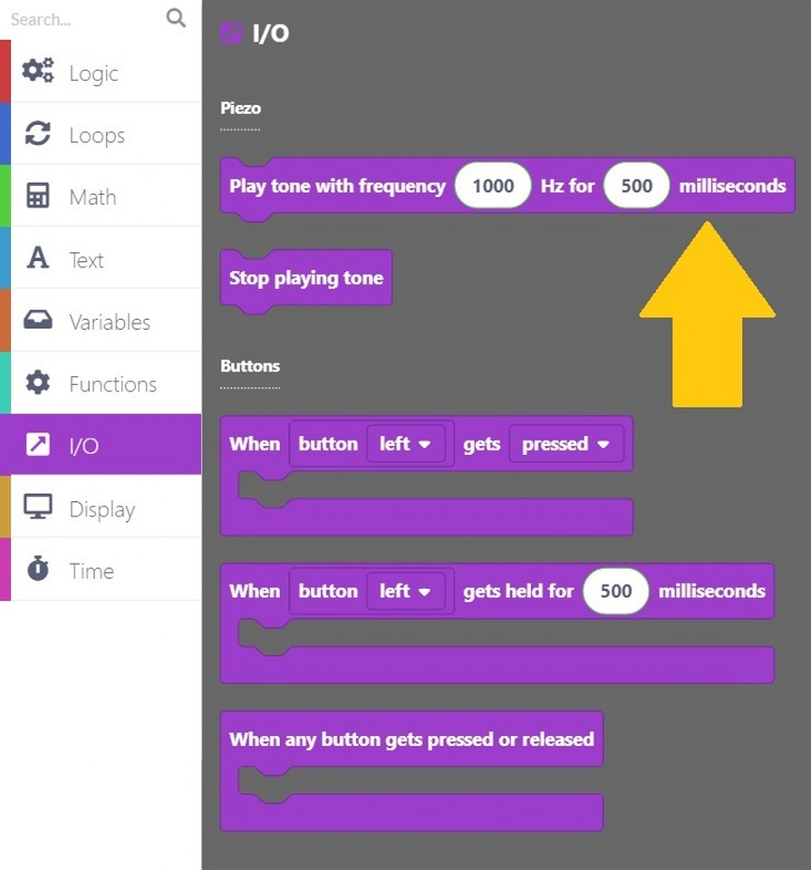
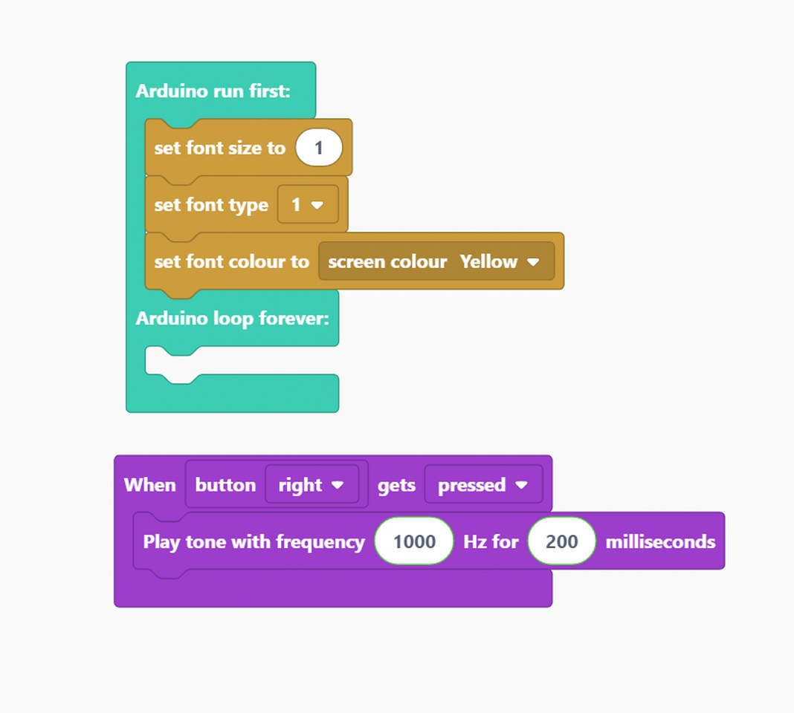

# CircuitPet Programmierung - Erste Schritte

In dieser Anleitung erfährst du, wie du dein CircuitPet mit CircuitBlocks programmierst.

* [Einführung](#einführung)
* [Los geht's! Schritt für Schritt](#los-gehts-schritt-für-schritt)
* [Wiederherstellen der Basis-Firmware von CircuitPet](#wiederherstellen-der-basis-firmware-von-circuitpet)

## Einführung

### Installation

#### Willkommen zum CircuitPet-Programmiertutorial

Vielen Dank für deine Unterstützung von CircuitMess und willkommen zum CircuitPet-Programmiertutorial.

Wir werden **CircuitBlocks** für die Programmierung deines neu zusammengebauten virtuellen Haustiers verwenden.

CircuitBlocks ist eine von uns entwickelte Programmier-App.

Du wirst dein CircuitPet in der grafischen, blockbasierten Programmieroberfläche von CircuitBlocks programmieren, die dir bei deinen ersten Schritten in der Welt der Hardwareprogrammierung helfen wird.

CircuitBlocks läuft derzeit auf Windows-, Linux- und Mac OS-Computern.

#### Wenn du einen Windows-Computer hast

1. **Gehe auf die [CircuitBlocks-Download-Seite](https://circuitmess.com/pages/download)**

2. **Lade die neueste Version für Windows herunter** - Prüfe dabei, ob du eine 32- oder 64-Version hast. Öffne dazu die "Einstellungen" App, klicke auf die Option "System" und suche den Abschnitt "Info". Hier siehst du den Systemtyp.

3. Starte die heruntergeladene Datei mit dem Namen "CircuitBlocks" durch einen Doppelklick.

4. CircuitBlocks wird automatisch installiert und eine neue Desktop-Verknüpfung wird erstellt.

**Dein PC ist nicht gefährdet!**

Es besteht die Möglichkeit, dass eine Meldung erscheint, die besagt, dass dein PC gefährdet ist, wenn du versuchst CircuitBlocks zu installieren. Mach' dir keine Sorgen! Diese Meldung wird manchmal angezeigt - unabhängig davon, ob CircuitBlocks sicher ist.

Wie du mit dieser Meldung umgehen kannst, erfährst du in den folgenden Anweisungen.

Diese Meldung erhältst du möglicherweise bei der Installation von CircuitBlocks auf deinem PC. Windows meldet eine Bedrohung, obwohl das Programm sicher heruntergeladen und ausgeführt werden kann. Bitte fahre mit der Installation fort, indem Du auf die Option *"Mehr Informationen"* (bzw. *"More info"* in englisch) klickst.

Nachdem du auf die Option *"Weitere Informationen"* geklickt hast, sollte am unteren Rand des Fensters die Option *"Trotzdem ausführen"* (in englisch: *"Run anyway"*) erscheinen.
Klicke auf die Option *"Trotzdem ausführen"* und fahre mit der Installation fort.

#### Wenn du einen Mac Computer hast

1. **Gehe auf die [CircuitBlocks-Download-Seite](https://circuitmess.com/pages/download)**

2. **Lade die neueste Version für MacOs herunter** - Eine Datei mit dem Namen "CircuitBlocks-1.0.1-Mac.dmg" oder ähnlichem sollte heruntergeladen werden.

3. Verschiebe die Datei in den Ordner "Programme".

4. CircuitBlocks wird automatisch installiert.

#### Wenn du einen Linux Computer hast

Es gibt zwei Möglichkeiten, CircuitBlocks unter Linux zu installieren.

**Linux 64-bit:**

1. **Gehe auf die [CircuitBlocks-Download-Seite](https://circuitmess.com/pages/download)**

2. Klicke auf den Download-Button **"Linux 64-bit"**

3. Unter Ubuntu startest du die Installation einfach per Doppelklick auf die Datei.  
   Bei anderen Linux-Distributionen öffne das Terminal und führe folgenden Befehl aus:  
   `sudo dpkg -i <Pfad zur heruntergeladenen Datei .deb>`

4. CircuitBlocks wird automatisch installiert und ein Desktop-Eintrag wird erstellt.

**Eigenständiges AppImage:**

1. **Gehe auf die [CircuitBlocks-Download-Seite](https://circuitmess.com/pages/download)**

2. Klicke auf den Download-Button **"Linux AppImage"**

3. Klicke mit der **rechten Maustaste** auf die Datei und wähle **"Eigenschaften"**

4. Gehen auf die Seite *"Berechtigungen"* (bzw. in englisch: *"Permissions"*) und setze ein Häkchen bei *"Ausführen der Datei als Programm zulassen"* (bzw. *"Allow executing file as program"*).

5. Doppelklicke die Datei und die Installation wird automatisch abgeschlossen.

Solltest du Probleme mit der Installation haben, wende dich bitte per E-Mail an contact@circuitmess.com und sende uns einen Screenshot des Problems sowie alle relevanten Informationen.

### Die Grundlagen

#### Benutzeroberfläche

Wenn du CircuitBlocks öffnest, siehst du ein Fenster, das wie oben gezeigt aussieht.

Es ist ziemlich einfach - Du kannst ein **neues Projekt (wir nennen Projekte auf englisch auch "Sketches")** beginnen, indem du auf die Schaltfläche "Neues Projekt" (englisch "New project") klickst.

**Gespeicherte Projekte** werden direkt neben dieser Schaltfläche angezeigt und du kannst jederzeit darauf zugreifen.

Wenn du auf ein Problem mit CircuitBlocks stößt, klicke bitte auf den Link "**Fehlerbericht senden**" (auf englisch "Send error report") am unteren Rand des Hauptbildschirms. Hierbei erhältst du dann eine Fehlermeldungsnummer. Bitte kontaktiere uns über contact@circuitmess.com und gib diese Fehlermeldungsnummer an, damit wir dir weiterhelfen können.

#### Erstellen eines neuen Projekts (Sketch)

Klicke auf die große Schaltfläche "Neues Projekt" (englisch "New project").

Nun bekommst du die Möglichkeit, das Gerät und den Projekttyp auszuwählen.

* Für das Gerät wähle bitte: **CircuitPet**.
* Für den Typ des Sketches wähle bitte: **Block**.

**Drücke die Schaltfläche "Erstellen" (englisch "Create").**

Es erscheint ein Bildschirm, der wie folgt aussieht:

Am oberen Rand des Bildschirms befindet sich eine **Symbolleiste** mit einigen Schaltflächen.

Die **Blockauswahlleiste** befindet sich ganz links - Du kannst Blöcke von dort nehmen und sie in den "Zeichenbereich" in der Mitte des Bildschirms ziehen.

In der Mitte des Bildschirms wirst du deinen Programmcode mit bunten Blöcken "zeichnen".

Auf der rechten Seite des Bildschirms siehst du, wie der in der **Programmiersprache C++** geschriebene Code auf magische Weise von selbst erscheint, wenn du die bunten Blöcke in die Mitte ziehst.

**C++** ist eine der beliebtesten Programmiersprachen, aber sie ist ziemlich komplex, wenn du noch nie programmiert hast.

Deshalb haben wir CircuitBlocks entwickelt - hier kannst du bunte Blöcke, die Teile des Codes darstellen, mit der Maus verschieben und ablegen und sehen, wie dein Programm in C++ aussehen würde. Wenn du erfahren genug bist, kannst du direkt zur textuellen Programmierung in C++ wechseln, ohne dass du bunte Blöcke benötigst.

#### Symbolleiste

Im Folgenden wird kurz erklärt, was die Schaltflächen in der Symbolleiste des Fensters bewirken:

1. **Zurück zum Hauptmenü** - bringt dich zum Startbildschirm zurück, ohne zu speichern.

2. **Speichern/Speichern unter** - speichert dein Projekt. Achte darauf, diese Schaltfläche von Zeit zu Zeit und vor dem Schließen von CircuitBlocks zu drücken.

3. **CircuitPet-Verbindungsanzeige** - Der rote Punkt wird grün, wenn dein CircuitPet über ein USB-Kabel mit deinem Computer verbunden ist.

4. **Sprite-Editor** - zum Zeichnen von Charakteren, die du in deinem CircuitPet haben möchtest.

5. **Exportieren in Binärform** - speichert eine Binärdatei deines Programmcodes auf deinem Computer. Dies ist eine fortgeschrittene Funktion, die du vorerst nicht brauchen wirst.

6. **Serieller Monitor** - Diese Schaltfläche öffnet ein Fenster, das wir den "Seriellen Monitor" nennen. "Seriell" ist ein Spitzname für eine Art der Kommunikation, die zwischen CircuitPet und deinem Computer stattfindet. In diesem Fenster kannst du später die Nachrichten sehen, die von CircuitPet an deinen Computer über den USB-Anschluss gesendet werden.

7. **Code schließen** - Mit dieser Schaltfläche kannst du das Code-Fenster auf der rechten Seite des Bildschirms schließen oder wieder öffnen. Dies ist nützlich, wenn du mehr Platz auf dem Bildschirm benötigst, um deine farbigen Blöcke zu sehen.

8. **Ausführen** (englisch "Run") - Diese Schaltfläche übersetzt den in CircuitBlocks erstellten Code in Maschinencode, den CircuitPet versteht (beep boop beep boop 1011100101) und sendet den Code über den USB-Anschluss an deinen CircuitPet.

#### Code-Fenster

Das so genannte "Code-Fenster" besteht aus den folgenden Teilen:

1. **Haupt-Code-Bildschirm** - in C++ geschriebener (Programm-)Code erscheint hier, wenn du bunte Blöcke auf der linken Seite des Bildschirms einfügst.
  Du wirst sehen, dass einige Teile des Codes in lustigen Farben eingefärbt sind.
  Programmierer nennen dies *Syntaxhervorhebung*. Im Grunde werden verschiedene Kategorien von Codebefehlen unterschiedlich eingefärbt, damit Programmierer den Code leichter verstehen können.

2. **Umschalter für helles/dunkles Farbschema** - mit dieser Schaltfläche kannst du die Hintergrund- und Textfarbe des Codefensters umschalten.

3. **Erweitern** - dehnt das Codefenster auf den gesamten Bildschirm aus. Drücke die Taste erneut, um es wieder auf den halben Bildschirm zu verkleinern.

4. **Schließen** - schließt das Code-Fenster, dieselbe Funktion wie die Schaltfläche "Code schließen" in der Symbolleiste.

#### Zeichenbereich

Auf dem Zeichenbereich geschieht die Magie.

Er besteht aus den folgenden Teilen:

1. **Suchleiste** - gib hier den Namen einer Komponente (in englisch) ein, nach der du suchst.

2. **Komponentenauswahl** - die Blöcke sind hier in verschiedene Kategorien unterteilt.
  Jeder Kategorie ist eine bestimmte Farbe zugewiesen.

3. **Zeichenfläche** - ziehe die Blöcke aus der Komponentenauswahl und lege sie in der Zeichenfläche ab. Auf diese Weise wird der Code erstellt. Kinderleicht!

4. **Zentrierwerkzeug** - wenn du dich beim Scrollen durch die Zeichenfläche verirrst, drücke diese Taste. Dadurch wird die Anzeige auf die Blöcke zentriert, die du auf der Zeichenfläche abgelegt hast.

5. **Zoom-Tasten** - zum Vergrößern und Verkleinern der Zeichenfläche.

### Arten von Blöcken

In CircuitBlocks gibt es insgesamt **neun** Blocktypen. Jeder von ihnen wird durch seine Farbe dargestellt. Jeder Block wird in Code übersetzt, der dann kompiliert und auf deinen CircuitPet hochgeladen wird, genau wie auf jeder Arduino-basierten Plattform.  

Jeden Blocktyp kannst du anklicken um einen Bereich zu öffnen, von dem du die zugehörigen Blöcke per Drag & Drop in die Zeichenfläche ziehen kannst.

Wenn du auf "Mehr" (englisch: "More") drückst, werden noch mehr Blöcke sichtbar, die nicht so häufig verwendet werden.

Es gibt zwei Hauptfunktionen in jedem Arduino-Code - `void setup()` und `void loop()`.

Alles, was in der Funktion `void setup()` enthalten ist, wird **nur einmal** ausgeführt. Sie wird hauptsächlich dazu verwendet, die Software zu starten, Variablen zu initialisieren und zu deklarieren und Funktionen auszuführen, die nur einmal ausgeführt werden müssen (z.B. der Intro-Bildschirm in einem Videospiel).

Die **Schleife** `void loop()` ist der Ort, an dem sich alles andere abspielt. Sie führt im Grunde jedes Stückchen Code darin wiederholt aus (die Geschwindigkeit hängt vom Gerät ab - stellen dir einfach vor, sie wäre ultraschnell!)

Jeder Block, den du einfügst, wird automatisch in die Funktion `void loop()` eingefügt.

Wenn du etwas in die Funktion `void setup()` einfügen möchtest, musst du den Hauptblock aus **Functions** herausziehen und deine Blöcke nach Belieben darin platzieren, aber dazu etwas später mehr.  

#### Elliptische Blöcke

Elliptische Blöcke stellen Variablen dar. Ob es sich nun um ganze Zahlen, Zeichenketten oder andere Variablentypen (außer Boolesche) handelt, sie alle sind an der gleichen Form zu erkennen.

Außerdem geben größere Blöcke mit elliptischer Form entweder Integer- oder Float-Werte zurück.

Wann immer du kreisförmige "Löcher" in einigen Blöcken findest, kannst du Variablen einfügen. Dies ist am häufigsten in Vergleichs- oder Aktionsblöcken zu finden.

#### Dreieckige Blöcke

Dreieckige Blöcke stellen boolesche Variablen dar.

Sowohl Variablen (wahr und falsch) als auch Funktionen, die boolesche Werte zurückgeben, haben die gleiche Form.

Unabhängig von der Farbe gibt jeder dieser Blöcke entweder `true` (wahr) oder `false` (falsch) zurück.

Für dreieckige "Löcher" müssen boolesche Blöcke eingefügt werden.

#### Programmbausteine

Alles andere sind im Grunde Programmbausteine (englisch "building blocks").
Das sind Funktionen, die keinen Rückgabewert haben.
Sowohl elliptische als auch dreieckige Blöcke müssen zunächst innerhalb der Programmbausteine platziert werden, um als Teil des Programms zu fungieren.

Sie haben eine bestimmte "Puzzle"-Form und können ineinander gestapelt werden.

Der **Hauptbaustein** befindet sich im Abschnitt "Funktionen" (englisch "Functions").

Es gibt im Grunde zwei Hauptbausteinabschnitte:

* "**Arduino run first**" für alles, was zuerst ausgeführt werden soll (der Code landet in `void setup()`) und
* "**Arduino loop forever**" für die Anteile, die innerhalb der Arduino-Schleife immer wieder wiederholt werden sollen (in `void loop()`).

#### Blöcke einfügen

Dies ist nun der wichtigste Teil.

Der ganze Sinn der blockbasierten Programmierumgebung ist das Verbinden von Blöcken und deren Platzierung in einem anderen Block.

Das alles geschieht durch einfaches **Drag-and-Drop**, also das Verschieben der Blöcke mit der Maus.

Hier ist ein Beispiel für ein Programm, welches die Variable `Var` auf `1` setzt und dann erhöht, solange sie kleiner als `10` ist.

Am Ende des Programms wird `Var`den Wert `10`haben.

Dies ist nur ein einfaches Beispiel, und die Blockbildung wird in den folgenden Kapiteln näher erläutert.

### Blocktypen

CircuitBlocks bietet insgesamt **neun** Blocktypen.
Wir haben sie so organisiert, dass du alles mit maximal zwei Klicks finden kannst.

Die Typen selbst sind ziemlich selbsterklärend, aber wir werden sie alle durchgehen, um ein besseres Verständnis für das ganze Konzept zu bekommen.

Einige der Typen bieten **zusätzliche Blöcke** (im Menü "Mehr", englisch "More"), mit Funktionen, die nicht so häufig verwendet werden, aber dennoch nützlich sein können.

#### Logik (Logic)

Hier befindet sich die Basis für jeden Code.

Jede **Wenn/Dann**-Funktion (if, if-else, else), Vergleiche, Und/Oder/Nicht, Wahr/Falsch und andere logische Operatoren.  

#### Schleifen (Loops)

Schleifen sind Funktionen, die alles, was sie enthalten, eine bestimmte Zeit lang wiederholen.

Sie können an Bedingungen geknüpft sein und so lange wiederholt werden, wie die Bedingung erfüllt ist, oder eine vorher festgelegte Anzahl von Wiederholungen haben.

#### Mathematik (Math)

So ziemlich jede mathematische Funktion ist hier zu finden. Von grundlegenden Operationen bis hin zum Runden von Zahlen und der Arbeit mit Winkeln wirst du in sekundenschnelle deinen inneren Einstein oder Pythagoras wecken!

#### Text

Zeichenketten, Zeichen und Zeichenkettenmanipulation. Ein großartiger Ort, um neuen Text zu erstellen und ihn in deinen Programme zu implementieren.

#### Variablen (Variables)

Erstelle eine Variable beliebigen Typs und lege ihren Namen und den gewünschten Wert fest. CircuitBlocks erkennt den Variablentyp (`int, double, string, boolean`) automatisch, so dass du dir darüber keine Gedanken machen musst.

#### Funktionen (Functions)

Die Arduino-Hauptfunktion (die wir [im vorherigen Kapitel](#programmbausteine) erklärt hatten) befindet sich hier.

Du kannst auch eigene Funktionen erstellen, die dann als einer der Hauptbestandteile deines Programms eingefügt werden können.

#### Eingabe/Ausgabe (Input/Output)

Alles, was die Komponenten von CircuitPet betrifft, befindet sich hier.

#### Bildschirm (Display)

Nun, all diese Blöcke sind wirklich nutzlos, solange man auf dem Bildschirm nichts sieht!

Hier wird die ganze Magie in farbige Pixel übersetzt. Mit diesen Blöcken kannst du so viel gestalten.

#### Zeit (Time)

Verzögerungen, Timer und andere zeitbezogene Dinge, ideal für die Erstellung cooler Animationen und Videospiele.

#### Suchleiste

Über den Blocktypen befindet sich eine **Suchleiste**, die dir die Suche nach einem bestimmten Block erleichtert, den du einfach nicht finden kannst.

Gib einfach (in englisch) ein, was dir in den Sinn kommt, und alle Blöcke, die etwas mit dem Suchbegriff zu tun haben, werden auf der rechten Seite angezeigt.

Nun kann man wirklich nicht sagen, dass es unmöglich ist, etwas zu finden.

Du hast alles über die Blöcke gelernt!
Es ist an der Zeit, zur nächsten Lektion überzugehen...

## Los geht's! Schritt für Schritt

### Blink, blink

Jetzt geht's zur Sache!

Zu Beginn musst du dein CircuitPet an den USB-Anschluss deines Computers **anschließen und einschalten**.

Wenn alles in Ordnung ist, sollte CircuitBlocks "CircuitPet connected" ("CircuitPet verbunden") und einen grünen Punkt anzeigen.

Wenn CircuitBlocks dein CircuitPet **nicht erkannt** hat, überprüfe bitte, ob das USB-Kabel richtig eingesteckt ist und ob du einen funktionierenden USB-Anschluss deines Computers verwendest.

Wenn CircuitBlocks dein CircuitPet dann immer noch nicht erkennt, ist möglicherweise etwas mit der Treiberinstallation auf deinem Computer schief gelaufen. Treiber sind diese kleinen Programme, die deinem Computer helfen, mit CircuitPet zu kommunizieren - und sie verhalten sich manchmal komisch.

Wende dich bitte per E-Mail an contact@circuitmess.com, wenn dein Computer CircuitPet nicht erkennt.

#### Spielen wir mit der LED!

Das erste, was wir lernen werden, ist zu programmieren, wie man die **LED in verschiedenen Farben blinken** lässt!

Der erste Block, den wir finden müssen, heißt "**set RGB LED color**" (übersetzt: "Setze die LED Farbe"). Dieser spezielle Block steuert, ob die LED ein- oder ausgeschaltet werden soll.

Da die LED eine der Ausgabekomponenten von CircuitPet ist, findest du den Block, den du brauchst, im Abschnitt **I/O** (Input/Output bzw. Eingabe/Ausgabe).

Wenn du auf "**off**" (= "Aus") klickst, werden dir die zur **Verfügung stehenden Farben** angezeigt.

Wir haben uns dieses Mal für Rot entschieden, aber du kannst jede beliebige Farbe verwenden.

Der Anfang deines Programms sollte jetzt wie folgt aussehen:

Da wir wollen, dass die LED blinkt, müssen wir die **Zeit einstellen, die zwischen dem Einschalten der LED und der nächsten Aktion vergehen soll**.

Suche dazu nach einem **Zeitblock**, der wie folgt aussieht:

Auch hier kannst du die Zeit frei wählen. Wir haben uns dafür entschieden, dass die Wartezeit eine Sekunde betragen sollte.

Damit es mehr Spaß macht, haben wir beschlossen, dass jedes Blinksignal **in einer anderen Farbe** leuchten soll.

Wiederhole dazu entweder die Schritte, die wir für die ersten beiden Blöcke durchgeführt haben - oder klicke einfach mit der rechten Maustaste und wähle die Option "duplicate" (= "Duplizieren").

Wie du sehen kannst, ist die zweite Farbe, die leuchten wird, Cyan.

Nun müssen wir die **Zeitspanne** zwischen dem ersten und dem zweiten Blinken festlegen.
Dazu duplizieren wir einfach den Block "**wait 1 seconds**".

Machen wir das noch einmal!

Dupliziere beide Blöcke (den Farb- und den Zeitblock), und fülle die Kreise mit `yellow` (also "gelb") und `1`.

So sollte dein Code jetzt aussehen:

Klicke nun auf die große rote Schaltfläche "**Run**" ("Ausführen") und beobachte, wie der Programmcode **kompiliert** wird.

Wenn du dies zum ersten Mal machst, kann es bis zu einer Minute dauern, bis der Code kompiliert ist. Aber keine Sorge, die Kompilierung sollte danach viel schneller sein.

Wenn du auf die Schaltfläche Run/Ausführen klickst, erscheint unter der Symbolleiste eine rote Linie, die den Anteil des bereits kompilierten Codes anzeigt. Sobald der Code fertig kompiliert ist, wird dein CircuitPet neu gestartet und die LED blinkt in den Farben Rot, Cyan und Gelb in Intervallen von einer Sekunde.

### Anzeigezeit

Du hast dein erstes Programm erfolgreich erstellt.

**Bist du bereit für mehr?**

Wir werden jetzt sehen, was wir mit den **Bildschirm** anstellen können.

Bei der Arbeit mit dem Display werden wir hauptsächlich den Bereich des **Display-Blocks** verwenden.

In diesem Teil der Anleitung werden wir versuchen, **den Bildschirm von CircuitPet zu beschreiben**. Es ist gut zu wissen, dass man, wenn man etwas darauf schreiben will, zuerst die Schriftgröße, die Schriftart und die Schriftfarbe einstellen muss.

**Also, los geht's!**

Suchen wir nach dem **Schriftgrößenblock**, der so aussieht:

Du kannst Buchstaben in jeder gewünschten Größe anzeigen.

Legen wir nun die **Schriftart** fest.

Sie befindet sich in gleichen Blockabschnitt wie der vorherige Block.

So sollte dein Programm jetzt aussehen:

Als Letztes müssen wir noch die **Schriftfarbe** festlegen.

Wir haben Marineblau (englisch: "Navy") als Schriftfarbe gewählt, aber du kannst jede **Farbe aus der Liste** verwenden.

Lass uns den Hauptteil des Programm einstellen - schreibe einen Satz (oder ein Wort), dass auf dem Display erscheinen soll, mit folgendem Block:

Wie du sehen kannst, gibt es drei weiße Kreise, die zum Schreiben von Text verwendet werden.

Das erste Feld direkt neben "print" (zu deutsch: "schreiben"), bestimmt den Satz, der auf dem Display erscheint.

Mit den Feldern **"x" und "y"** definierst Du die **Position**, an welcher der Text auf dem Bildschirm erscheinen soll.

Wir haben uns entschieden, "**Hello, world!**" auf den Bildschirm zu schreiben. Die Koordinaten haben wir dabei nicht verändert.

Das letzte, was du im Programm tun musst, ist auf den "draw sprite to display"-Block zu klicken.

Wir müssen diesen Block verwenden, um sicherzustellen, dass unser Programmcode auch auf dem Display angezeigt wird.

Klicke auf die große rote Schaltfläche "**Run**" zum Ausführen des Programms und warte auf die **Kompilierung** des Codes!

### Spiel mit den Tasten

Nun, da du schon ein paar Dinge über CircuitBlocks weißt, ist es Zeit für **ein etwas komplexeres Programm**.

Klicke im **Anzeige-Abschnitt** auf den Block zur Einstellung der **Schriftgröße**:

Ändere die **Größe auf 1**.

Jetzt ist es an der Zeit, die **Schriftart** festzulegen.

Ein weiterer Punkt, der geändert werden muss, ist die **Schriftfarbe**.

Wir haben rot ("red") gewählt, aber du kannst jede beliebige Farbe verwenden.

Hier ist ein Block, den wir noch nicht verwendet haben - ein "**Anzeige löschen**"-Block.

Du findest ihn auch im Abschnitt der **Anzeigeblöcke**.

Dieser Block wird den gesamten **Bildschirm mit einer bestimmten Farbe ausfüllen**. Damit können wir später den angezeigten Satz (oder das Wort) deutlicher sehen.

Jetzt kannst du auswählen, was du anzeigen willst.

Das funktioniert genauso wie im vorherigen Beispiel.

Suche zunächst diesen Block:

Dann schreibe nun den Text.

Da wir dir zeigen wollen, wie du mit den CircuitPet-Tasten coole Sachen machen kannst, fügen wir einen Text ein, der erklärt, was zu tun ist.

Du kannst die Anweisung auch in deutsch ausgeben. Dann würden die beiden Texte "**Drücke eine**" und "**der Tasten!**" lauten.

Wir haben den Text **in zwei Blöcke aufgeteilt**, damit er auf das Display von CircuitPet passt.

Jetzt kommt der wichtigste Teil - die Entscheidung, welche Taste welche Funktion ausführt.

Wenn du die Tasten von CircuitPet drückst, lösen wir ein bestimmtes Ereignis aus.

Glücklicherweise haben wir dafür einen speziellen Block definiert, der sich im Abschnitt **I/O** befindet.

I/O steht für "Input/Output", auf Deutsch: "**Eingabe/Ausgabe**". Die Knöpfe von CircuitPet sind die sogenannten Eingabegeräte, weil sie einen elektrischen Impuls an den CircuitPet-Computer senden, wenn sie gedrückt werden. Das Display von CircuitPet ist ein Beispiel für ein Ausgabegerät, weil CircuitPet Signale an es sendet, um Informationen anzuzeigen.

Du musst diesen lila Block mit dem Namen "**When button left gets pressed**" ("Wenn die linke Taste gedrückt wird") finden.
Platziere den Block im Programmierbereich.

Suche nach diesen beiden Blöcken im Abschnitt "**Display**".

Was wir hier programmiert haben, ist, dass wenn die linke Taste am CircuitPet gedrückt wird, das Display schwarz wird und man das Wort "links" darauf sehen kann.

Um diese Befehle auszuführen, müssen wir noch den Block "**draw sprite to display**" einfügen, welcher die Grafik auf den Bildschirm schreibt!

Jetzt müssen wir denselben Block erstellen, nur für die rechte Taste.

Du kannst entweder die **Schritte wiederholen** oder auf "**Duplizieren**" klicken und ein paar Änderungen vornehmen.

Stelle sicher, dass ein Block für die **linke** und der andere für die **rechte** Taste eingestellt ist.

Es sollte so aussehen:

Dupliziere den Block noch einmal, aber ändere dieses Mal die Bedingung auf das Drücken der Eingabetaste (englisch: "enter").

Ändere den Ausgabetext auf "Enter press" bzw. "**Enter gedrückt**" sowie die Variable **"x" auf 45** und die Variable **"y" auf 90**.

Lass uns eine weitere Kopie dieses Blocks erstellen!

Jetzt müssen wir programmieren, was passiert, wenn wir die Eingabetaste wieder loslassen.

In diesem Fall wollen wir den Ausgabetext "Enter release" (bzw. "**Enter losgelassen**") verwenden.

Duplizieren wir den Block ein letztes Mal.

Diesmal programmieren wir ihn für die Taste "Zurück" (englisch: "back").

Wie immer müssen wir den richtigen Text einfügen und sicherstellen, dass die Variablen gesetzt sind.

Wir sind fast fertig!

Zum Schluss ziehe bitte den Block "draw sprite to display" an's Ende des Abschnitts "Arduino run first", um sicherzustellen, dass du alles auf deinem CircuitPet sehen kannst.

Am Ende sollte dein Code wie folgt aussehen:

Drücke die Ausführen-Schaltfläche "Run" in der Toolleiste und beobachte, wie der Code kompiliert wird!

**Yaay!**

Du hast gelernt, wie man ein etwas schwierigeres Beispiel programmiert.

Keine Sorge, im nächsten Kapitel gibt es noch mehr coole Beispiele!

### Piepsen wir los

Wir wollen lernen, was man mit dem Summer machen kann, der an das CircuitPet angelötet ist.

Wie das Wort schon sagt, wird der Summer verwendet, um Summtöne oder Piepstöne zu erzeugen.

Wir werden eine sehr ähnliches Programm wie das vorherige erstellen,
aber dieses Mal wird das **Drücken der Tasten einen bestimmten Ton aus dem Summer** auslösen.

**Fangen wir an!**

Für den Anfang verwende den **Schriftgröße**-Block aus dem Abschnitt **Display**.

Wie bei den beiden vorherigen Programmen wird die Schriftgröße auf 1 gesetzt.

Als Nächstes musst du eine **Schriftart** auswählen, ein weiterer Block im Abschnitt **Display**.

Klicke auf den Block und ziehe ihn auf die Zeichenfläche.

Und jetzt legen wir die **Schriftfarbe** fest.

Diesmal wählen wir die Schriftart **Gelb** ("Yellow").

Nachdem wir nun eine Schrift eingestellt haben, wollen wir nun festlegen, **was mit dem Summer passiert, wenn eine bestimmte Taste gedrückt oder losgelassen wird**.

Wie im vorherigen Sketch verwenden wir **I/O-Blöcke**, um zu bestimmen, was passiert, wenn bestimmte Tasten gedrückt werden.

Wir stellen dir einen neuen Block mit der Bezeichnung "**Ton mit Frequenz 1000 Hz für 500 Millisekunden abspielen**" vor.

Klicke auf den Block und ziehe ihn in den **I/O-Block** im Zeichenbereich.

Wir haben die Dauer in **Millisekunden auf 200** geändert, aber du kannst sie so lang oder so kurz machen, wie du möchtest.

Wir **löschen die Anzeige** in lila ("**purple**"), sobald wir die rechte Taste drücken.

Du kannst auswählen, was auf dem Display angezeigt werden soll, sobald die Taste gedrückt wird.

Zum Beispiel kann auf dem Bildschirm "**boop**" stehen, wenn wir die rechte Taste drücken.

**Vergiss die Koordinaten nicht!**

Setzen wir "**x**" auf 65 und "**y**" auf 60.

Und zum Schluss ziehe noch den Block "**draw sprite to display**" hinein, damit das Programm funktioniert.

Erste Taste - FERTIG!

Da wir die gleichen Blöcke benötigen, können wir sie einfach **duplizieren**.

Lass' uns eine Taste nach der anderen programmieren.

Der neue I/O-Block soll aktiviert werden, wenn die **linke Taste** gedrückt wird.
Es soll einen Ton mit einer **Frequenz von 2000 Hz** abspielt werden. Die Dauer der Tonausgabe lassen wir gleich.

Die Farbe des Bildschirms bleibt lila, aber diesmal zeigen wir "**Beep**" an.

**Duplizieren wir den Block noch einmal.**

Jetzt verwenden wir die Taste "zurück" (englisch "back") um einen Ton mit einer Frequenz von **3000 Hz für 50 Millisekunden** abzuspielen.

Auf dem Bildschirm soll "**Ding**" angezeigt werden. Beachte dass wir die Koordinaten für alle Ausgaben gleich gehalten haben.

Ja, du hast es richtig erraten!

Es ist an der Zeit, weitere Blöcke zu duplizieren.

Die letzte Taste, die wir verwenden werden, ist die Eingabetaste ("**Enter**"). In diesem Beispiel werden wir nichts beim Loslassen dieser Taste machen.

Wenn du die Enter-Taste drückst, spielt der Summer **150 Millisekunden lang** einen Ton mit einer Frequenz von **100 Hz**.

Während der Ton abgespielt wird, erscheint auf dem Bildschirm die Meldung "**Buzz**".

**Großartig! Wir haben alle vier Tasten von CircuitPet verwendet.**

Wir sollten etwas mit dem Bildschirm machen, sobald CircuitPet sich einschaltet.

Das Beste, was wir tun können, ist zu schreiben, was als nächstes auf dem Bildschirm passieren wird.

Dazu müssen wir in den **Abschnitt Display** wechseln und einige Blöcke verwenden. Als Erstes müssen wir die Anzeige löschen.

Dazu verwenden wir diesen Block:

Dieser Block muss in den Bereich "Arduino run first" gezogen werden.

Da wir die Anzeige gelöscht haben, ist es an der Zeit, etwas darauf zu schreiben.

Ziehe den eingekreisten Block in den Abschnitt "Arduino run first".

Außerdem benötigst du zwei dieser Blöcke, damit der Text schön in der Mitte des Bildschirms platziert wird.

Der Text, der auf dem Display erscheint, sobald du dein CircuitPet einschaltest, lautet also: "**Drücke eine der Tasten!**".
Auf englisch also "Press one of the buttons!". Der Text ist auf 2 Zeilen aufgeteilt.

Im Grunde ist das wie eine Anleitung auf dem Bildschirm.

Und wir hoffen, du weißt, was am Ende jedes Programms stehen muss. Der "**draw sprite to display**" Block!

**Du hast es geschafft!**  
**Herzlichen Glückwunsch!**

Drücke den großen roten **Ausführen-Knopf "Run"**, warte, bis der Code kompiliert ist und überprüfe ihn.

Sobald der Code kompiliert ist, sollte dein CircuitPet neu starten, der Bildschirm sollte gelb werden und einen **lila Hinweistext** auf dem Bildschirm anzeigen.

## Wiederherstellen der Basis-Firmware von CircuitPet

Wenn du mit dem Programmieren fertig bist und deinen CircuitPet einfach wieder "normal" machen willst, musst du seine Basis-Firmware wiederherstellen.

Das ist ganz einfach: Schließe deinen CircuitPet an den USB-Anschluss deines Computers an und drücke die Schaltfläche "Firmware wiederherstellen" (englisch: Restore firmware) oben rechts.

Du wirst in einem Fenster aufgefordert, das Gerät auszuwählen, für das du die Firmware wiederherstellen möchtest.

Wähle hier natürlich **CircuitPet**.

Warte ein paar Sekunden, und dein CircuitPet wird wieder wie gewohnt funktionieren.

Du musst dies immer dann tun, wenn du mit der Programmierung von CircuitPet fertig bist und wenn du möchtest, dass er seine ursprünglichen Funktionalität zurück erhält.

### Wie geht's weiter?

**Du hast das Ende unseres CircuitPet-Tutorials erreicht, Herzlichen Glückwunsch!**

Wir hoffen, du bist genauso gespannt wie wir auf die **Zukunft von CircuitPet**, denn es gibt so viele coole Dinge, die wir in den zukünftigen Firmware- und CircuitBlocks-Updates damit machen wollen.

In der Zwischenzeit kannst du auf eigene Faust weiterforschen und uns zeigen, was du mit deinem CircuitPet gemacht hast, indem du es im [CircuitMess-Community-Forum](https://community.circuitmess.com/?_ga=2.166930871.840181958.1656360907-1260944362.1654289164) oder über unseren [Discord-Kanal](https://discord.com/channels/765164309655060480/771790668036833280) teilst.

Wenn du Hilfe mit deinem Gerät brauchst, wende dich wie immer an uns über contact@circuitmess.com, und wir werden dir so schnell wie möglich helfen.

Vielen Dank und mach' weiter so!
