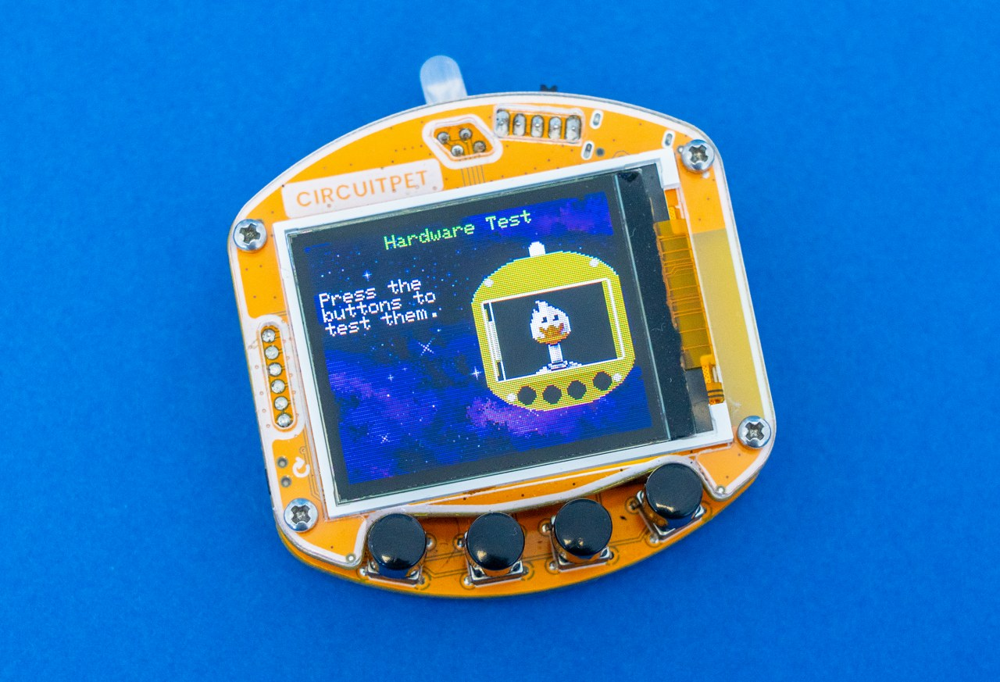
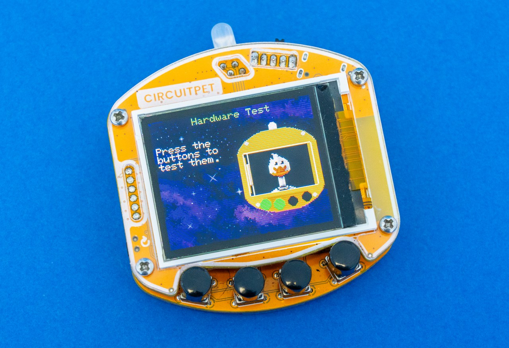
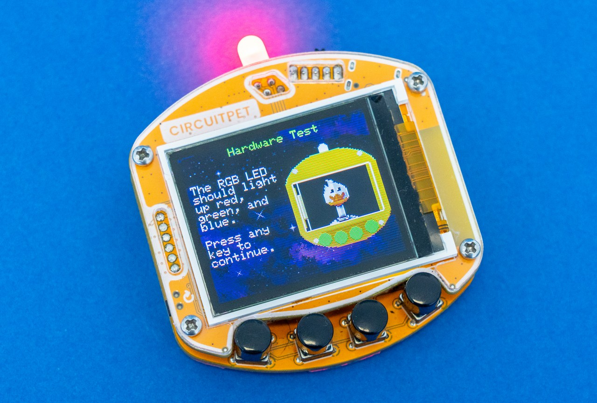
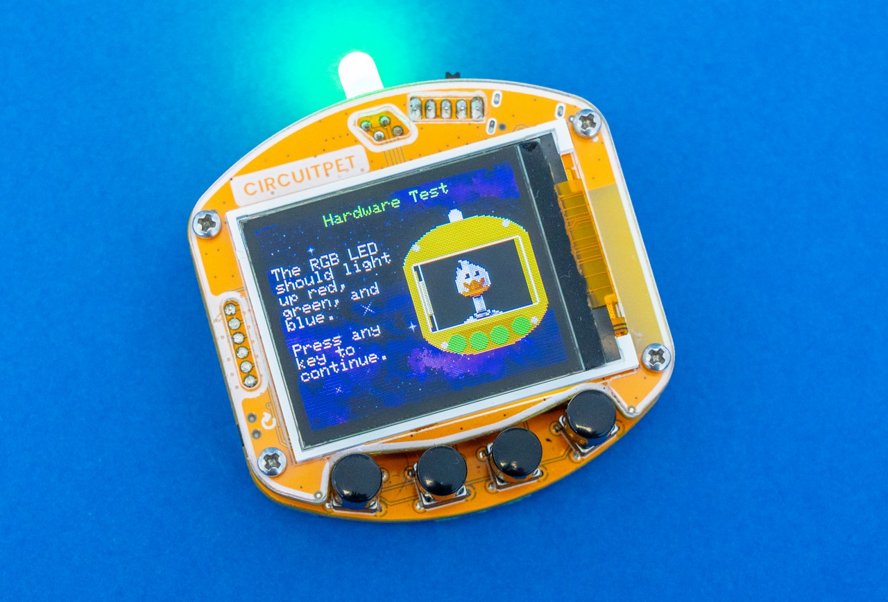
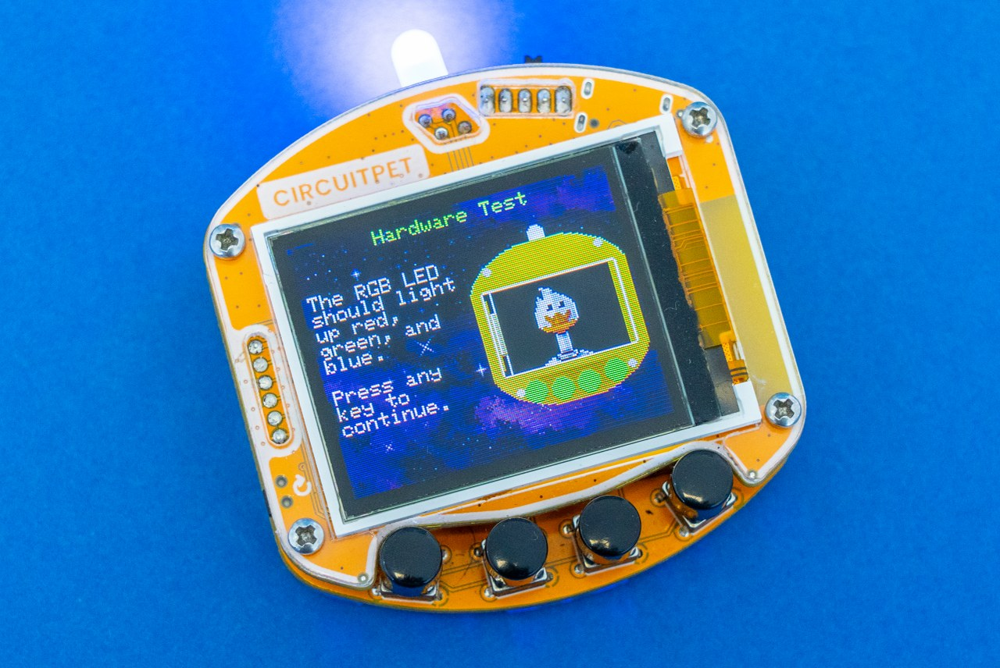
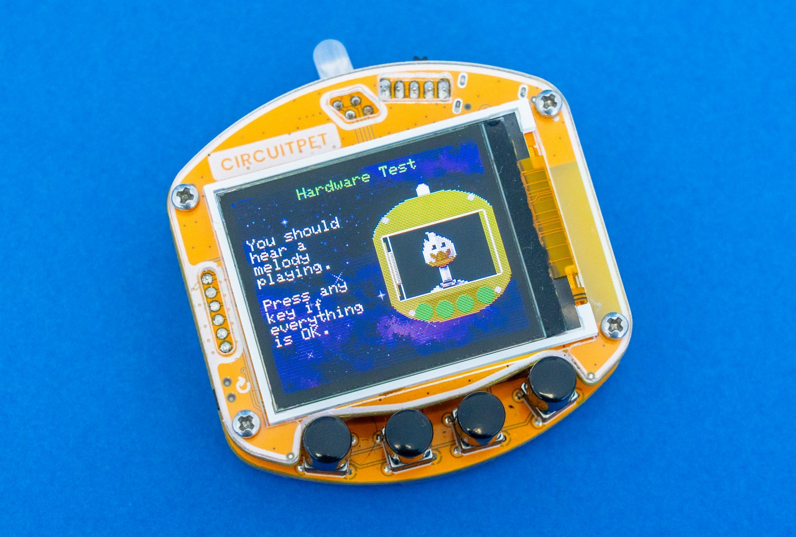
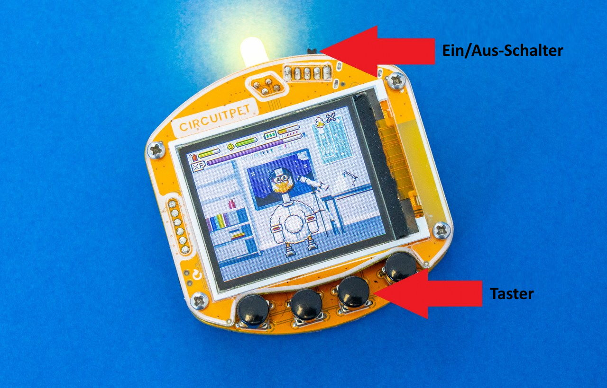
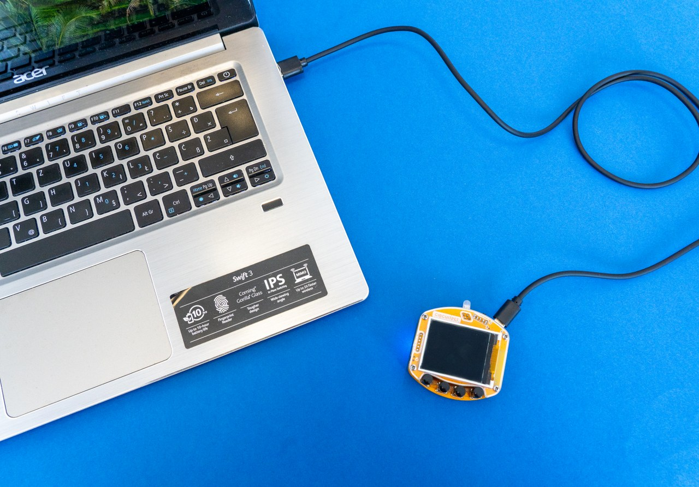
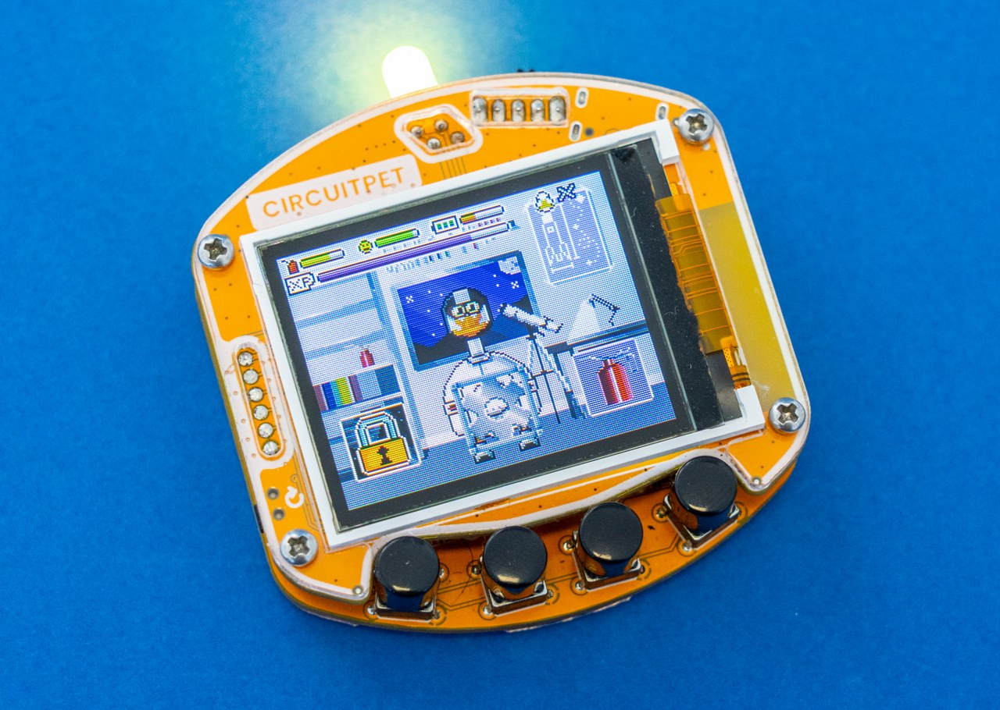
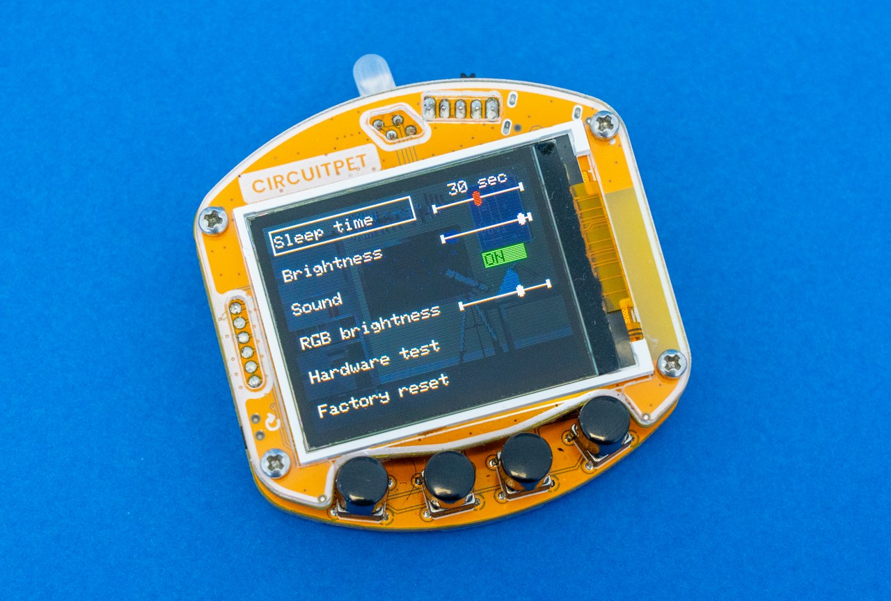

# CircuitPet Benutzerhandbuch

Hast du dein CircuitPet schon zusammengebaut? Wenn ja, dann ist dies die Anleitung, die du dir ansehen solltest! Hier erfährst du, wie du es verwendest, wie du Spiele spielst und wie du sicherstellst, dass deine Ente nicht rostet, und vieles mehr...

* [Finde dich zurecht...](#finde-dich-zurecht)
  * [Schalte es ein!](#schalte-es-ein)
  * [Einrichtung](#einrichtung)
  * [Einstellungen](#einstellungen)
* [Die Spiele können beginnen!](#die-spiele-können-beginnen)

## Finde dich zurecht...

### Schalte es ein!

#### Hardware-Test

Wenn du **CircuitPet** zum **ersten Mal einschaltest**, solltest du den **Hardwaretest** sehen. Dies ist eine coole Software, mit der du sicherstellen kannst, dass du dein CircuitPet richtig zusammengebaut hast! Befolge die **Anweisungen auf dem Bildschirm** in jeder Phase, und wenn du irgendwelche Probleme hast, **überprüfe deine Lötarbeiten**!

Wenn du CircuitPet einschaltest, ist dies das erste, was du sehen wirst. Dieser spezielle Test soll sicherstellen, dass **alle Tasten richtig verlötet** sind.

Bitte **drücke alle vier Tasten** die du gerade an CircuitPet angelötet hast. Wenn die Taste **richtig funktioniert**, sollte der Kreis, der sie darstellt, **grün** werden. Wenn einer der Kreise nicht grün wird, ist einer der Knöpfe defekt. In diesem Fall solltest du die Lötstellen der Tasten überprüfen.

Die RGB-LED leuchtet rot, grün und blau auf, nachdem alle Tasten-Kreise auf dem Bildschirm grün geworden sind.
Auf der rechten Seite des Bildschirms findest du eine englische Nachricht, die dir erklärt, was du sehen und als nächstes tun solltest.

**Wenn du alle drei Farben der RGB-LED sehen konntest, klicke auf eine der Tasten um fortzufahren.**

Der letzte Schritt des Hardwaretests ist der **Soundtest**. Du solltest einen Piepton aus deinem CircuitPet hören.

**Wenn du Töne hörst, klicke auf eine der Tasten um fortzufahren.**

Es scheint alles richtig gelötet zu sein, so dass du mit deinem virtuellen Haustier weiterspielen kannst.

### Einrichtung

Schalte CircuitPet mit dem **Schalter** oben rechts ein, indem du den Schalter nach oben schiebst.

Hier ist das Foto, welches dir erklärt, was die einzelnen Tasten und Schalter bedeuten.

#### Akku leer? Lass uns CircuitPet aufladen!

Das **USB-C-Kabel** wird zum **Aufladen und Programmieren** deines Geräts verwendet.

Stecke das kleinere Ende des Kabels in CircuitPet, das andere Ende in ein USB Netzteil.
Schließe danach das Netzteil an eine Steckdose an, um dein CircuitPet einzuschalten.

Du kannst CircuitPet auch über den PC oder Laptop aufladen.

### Einstellungen

Wenn du den Einstellungsmodus im Menü deines CircuitPet aufrufst, kannst du die Lautstärke des Piepsers und die Helligkeit der LED ändern. Du kannst auch den Hardwaretest nochmals starten so wie am Anfang der Anleitung beschrieben.

Wenn Du später den Verdacht hast, dass mit einem der Bauteile, die du auf die Platine gelötet hast, etwas nicht in Ordnung ist, kannst du überprüfen, ob alles richtig funktioniert, indem du den Hardwaretest aktivierst.

**Klicke auf das Zahnradsymbol, um den Einstellungsmodus zu öffnen:**

Das Einstellungsmenü sieht wie folgt aus:

1. **Sleep time** - Nach welcher Zeit soll der Bildschirm ausgeschaltet werden? Das spart Energie. Du kannst eine Ruhezeit einstellen oder sie deaktivieren. Wenn dein Bildschirm dunkel wird, drücke eine beliebige Taste, um ihn wieder zum Leben zu erwecken.

2. **Brightness** - Zum Einstellen der Helligkeit des Bildschirms.

3. **Sound** - Hier kannst du den Ton ein- und ausschalten.

4. **RGB Brightness** - Zum Einstellen der Helligkeit der LED.

5. **Hardware test** - Führe diesen Test durch, wenn du den Verdacht hast, dass eine Komponente nicht richtig funktioniert. Wenn der Test nicht erfolgreich war, solltest du deine Lötstellen überprüfen. Wenn du Hilfe benötigst, um dein CircuitPet zum Laufen zu bringen, kontaktiere uns bitte unter contact@circuitmess.com.

6. **Factory reset** - Wie bei einem Handy kannst du mit dieser Einstellung alles aus dem Gerät löschen und auf die Werkseinstellungen zurücksetzen.

7. **Save** - Um die Änderungen zu speichern.

## Die Spiele können beginnen!