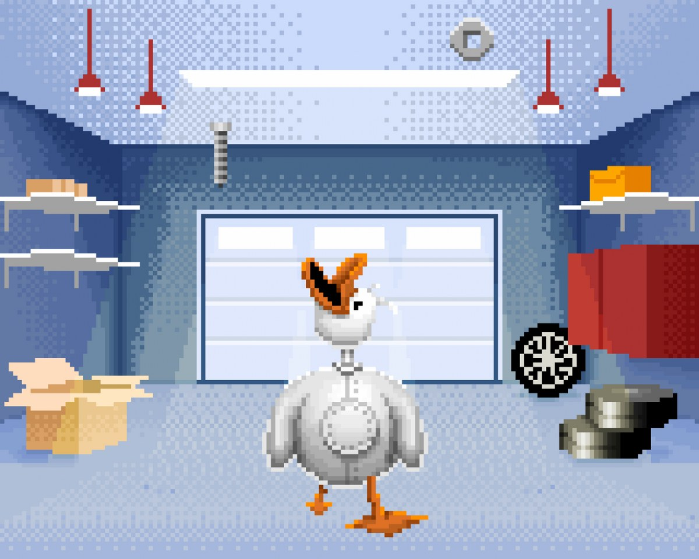

# CircuitPet Benutzerhandbuch

Hast du dein CircuitPet schon zusammengebaut? Wenn ja, dann ist dies die Anleitung, die du dir ansehen solltest! Hier erfährst du, wie du es verwendest, wie du Spiele spielst und wie du sicherstellst, dass deine Ente nicht rostet, und vieles mehr...

* [Finde dich zurecht...](#finde-dich-zurecht)
  * [Schalte es ein!](#schalte-es-ein)
  * [Einrichtung](#einrichtung)
  * [Einstellungen](#einstellungen)
* [Die Spiele können beginnen!](#die-spiele-können-beginnen)
  * [Kümmere dich um CircuitPet!](#kümmere-dich-um-circuitpet)
  * [Schauen wir uns alle Spiele an!](#schauen-wir-uns-alle-spiele-an)
  * [Zimmerverschönerung](#zimmerverschönerung)

## Finde dich zurecht...

### Schalte es ein!

#### Hardware-Test

Wenn du **CircuitPet** zum **ersten Mal einschaltest**, solltest du den **Hardwaretest** sehen. Dies ist eine coole Software, mit der du sicherstellen kannst, dass du dein CircuitPet richtig zusammengebaut hast! Befolge die **Anweisungen auf dem Bildschirm** in jeder Phase, und wenn du irgendwelche Probleme hast, **überprüfe deine Lötarbeiten**!

Wenn du CircuitPet einschaltest, ist dies das erste, was du sehen wirst. Dieser spezielle Test soll sicherstellen, dass **alle Tasten richtig verlötet** sind.

Bitte **drücke alle vier Tasten** die du gerade an CircuitPet angelötet hast. Wenn die Taste **richtig funktioniert**, sollte der Kreis, der sie darstellt, **grün** werden. Wenn einer der Kreise nicht grün wird, ist einer der Knöpfe defekt. In diesem Fall solltest du die Lötstellen der Tasten überprüfen.

Die RGB-LED leuchtet rot, grün und blau auf, nachdem alle Tasten-Kreise auf dem Bildschirm grün geworden sind.
Auf der rechten Seite des Bildschirms findest du eine englische Nachricht, die dir erklärt, was du sehen und als nächstes tun solltest.

**Wenn du alle drei Farben der RGB-LED sehen konntest, klicke auf eine der Tasten um fortzufahren.**

Der letzte Schritt des Hardwaretests ist der **Soundtest**. Du solltest einen Piepton aus deinem CircuitPet hören.

**Wenn du Töne hörst, klicke auf eine der Tasten um fortzufahren.**

Es scheint alles richtig gelötet zu sein, so dass du mit deinem virtuellen Haustier weiterspielen kannst.

### Einrichtung

Schalte CircuitPet mit dem **Schalter** oben rechts ein, indem du den Schalter nach oben schiebst.

Hier ist das Foto, welches dir erklärt, was die einzelnen Tasten und Schalter bedeuten.

#### Akku leer? Lass uns CircuitPet aufladen!

Das **USB-C-Kabel** wird zum **Aufladen und Programmieren** deines Geräts verwendet.

Stecke das kleinere Ende des Kabels in CircuitPet, das andere Ende in ein USB Netzteil.
Schließe danach das Netzteil an eine Steckdose an, um dein CircuitPet einzuschalten.

Du kannst CircuitPet auch über den PC oder Laptop aufladen.

### Einstellungen

Wenn du den Einstellungsmodus im Menü deines CircuitPet aufrufst, kannst du die Lautstärke des Piepsers und die Helligkeit der LED ändern. Du kannst auch den Hardwaretest nochmals starten so wie am Anfang der Anleitung beschrieben.

Wenn Du später den Verdacht hast, dass mit einem der Bauteile, die du auf die Platine gelötet hast, etwas nicht in Ordnung ist, kannst du überprüfen, ob alles richtig funktioniert, indem du den Hardwaretest aktivierst.

**Klicke auf das Zahnradsymbol, um den Einstellungsmodus zu öffnen:**

Das Einstellungsmenü sieht wie folgt aus:

1. **Sleep time** - Nach welcher Zeit soll der Bildschirm ausgeschaltet werden? Das spart Energie. Du kannst eine Ruhezeit einstellen oder sie deaktivieren. Wenn dein Bildschirm dunkel wird, drücke eine beliebige Taste, um ihn wieder zum Leben zu erwecken.

2. **Brightness** - Zum Einstellen der Helligkeit des Bildschirms.

3. **Sound** - Hier kannst du den Ton ein- und ausschalten.

4. **RGB Brightness** - Zum Einstellen der Helligkeit der LED.

5. **Hardware test** - Führe diesen Test durch, wenn du den Verdacht hast, dass eine Komponente nicht richtig funktioniert. Wenn der Test nicht erfolgreich war, solltest du deine Lötstellen überprüfen. Wenn du Hilfe benötigst, um dein CircuitPet zum Laufen zu bringen, kontaktiere uns bitte unter contact@circuitmess.com.

6. **Factory reset** - Wie bei einem Handy kannst du mit dieser Einstellung alles aus dem Gerät löschen und auf die Werkseinstellungen zurücksetzen.

7. **Save** - Um die Änderungen zu speichern.

## Die Spiele können beginnen!

### Kümmere dich um CircuitPet!

CircuitPet muss wie jedes andere Haustier **gefüttert**, **geölt** und **bespielt** werden, damit es **nicht rostet**.

Auf deinem CircuitPet findest du **sechs vorinstallierte Minispiele**, mit denen du dringend benötigte **Erfahrungspunkte** sammeln kannst. Die Erfahrungspunkte helfen dir, dein CircuitPet bei Laune zu halten und zu füttern. Außerdem kannst du neue Level erreichen und **neue Spiele freischalten**.

Wenn du dein CircuitPet zum ersten Mal einschaltest, sind **alle Spiele gesperrt**, und du siehst folgendes:

**Zuerst** musst du **deine Ente mehrmals ölen**, bis du **genug Erfahrungspunkte** (XP) hast, um das **erste Spiel freizuschalten**.

Dies ist eine Vorschau auf das, was du sehen wirst, sobald Sie das Öl-Spiel beginnst:

Du erhältst auch eine **Anleitung**, wie du die angezeigte Ente sofort einölen kannst.

Wenn du das Öl-Spiel öffnest, befindet sich die Ente im Raum mit einer Ölkanne. Auf der rechten Seite siehst du eine **Leiste**.

Das Ziel ist es, die Schaltfläche "Ölen" (englisch: "Oil") auf dem schwarz umrandeten Teil der Leiste anzuklicken. Wenn du die richtige Stelle triffst, wird deine Ente eingeölt.

Der Einölvorgang sieht folgendermaßen aus:

Wie bereits erwähnt, musst du die Ente mehrmals ölen, bis der Rost entfernt ist.

Nach jedem Ölen wird ein **Statistikfenster** angezeigt.

Wenn du deine Ente erfolgreich vom Rost befreit hast, **steigst du einen Level auf**.

Damit schaltest du dein erstes Spiel frei - **Flop Away**!

Wir werden im nächsten Kapitel mehr über Flop Away und andere Spiele erzählen.

Hier ist ein Überblick darüber, wie die einzelnen Level-Bildschirme aussehen werden.

Du steigst auf, indem du mehr und mehr Erfahrungspunkte (XP) sammelst und deine Ente geölt und glücklich hältst.

Im folgenden Kapitel werden wir jedes Spiel durchgehen und sehen, wie sich deine Ente und ihr Zimmer im Laufe der Zeit entwickeln.

### Schauen wir uns alle Spiele an!

#### 1. Flop Away

Wie du bereits weißt, wird dein erstes freigeschaltetes Spiel **Flop Away** sein.

Flop Away ist eine Art "Flappy Bird" Spiel, in dem du die Ente **so weit wie möglich fliegen musst**, ohne die Hindernisse zu treffen.

Wie bei dem Spiel "Ölen" siehst du die Anweisungen auf dem Bildschirm, sobald du das Spiel einschaltest.

So sieht das Spiel aus:

Außerdem ist es gut zu wissen, dass du **drei Leben** hast, bis das Spiel zu Ende ist.

Du wirst bemerken, dass deine **LED in verschiedenen Farben blinkt**. Wenn du ein Hindernis ohne Probleme passierst, wird die LED grün leuchten. Falls du gegen ein Hindernis stößt leuchtet die LED rot.

#### 2. Quack Snack

Sobald du genug Erfahrungspunkte gesammelt hast, schaltest du dein zweites Spiel namens **Quack Snack** frei.

Hier sind die Anweisungen:

Da es sich um eine **mechanische Ente** handelt, muss sie **Metallteile fressen**, um zu überleben.

Das Ziel dieses Spiels ist es, **so viele mechanische Teile wie möglich zu fressen** und dabei Bomben und Kerzen auszuweichen.

Wie in Flop Away hast du auch hier **drei Leben** zur Verfügung.

Wenn du das Spiel gewinnst, **reibt sich die Ente den Bauch**; wenn du das Spiel verlierst, übergibt sie sich.

So sieht ein Spiel aus:

#### 3. Duck and Jump

Dies ist das dritte Spiel!

Und hier sind die **Anweisungen**:

Wir sind am Strand, und deine Aufgabe ist es, über die Hindernisse zu **springen** oder sich unter ihnen hindurch zu **ducken**.

Auch in diesem Spiel gibt es **drei Leben**.

Wenn du das Spiel gewinnst, **springt deine Ente auf den Thron**; wenn du das Spiel verlierst, prallt die Ente gegen ein Hindernis und fällt herunter.

So sieht das Spiel aus:

#### 4. So You Think You Can Waddle

Hast du jemals die Fernsehsendung "Denkst Du, Du kannst tanzen?" ("So You Think You Can Dance") gesehen?
Dies Spiel ist die Entenversion davon.

Hier sind die Anweisungen:

Hier musst du **deine besten Tanzschritte zeigen**, um zu gewinnen!

Wenn du das Spiel gewinnst, bekommt die Ente eine **Krone**; wenn du das Spiel verlierst, **fällt die Ente um**.

Wie immer hast du **3 Leben** zur Verfügung!

Hier gibt es einen kleinen Vorgeschmack auf das Spiel:

#### 5. Spaceduck

Und zu guter Letzt, hier ist ein **Spaceduck**!

Wenn du es in den **Weltraum** geschafft hast, bedeutet das, dass du dich wirklich gut um deine Ente gekümmert hast. Dies ist die letzte Etappe in der Entwicklung deiner Ente und ihres Zuhauses!

Hier ist wie immer die Anleitung:

Wenn du schon einmal "Space Invaders" gespielt hast, wirst du mit diesem Spiel keine Probleme haben.

Das Konzept ist dasselbe: **Asteroiden** kommen auf dich zu, und du musst **schießen**, um sie zu zerstören und zu verhindern, dass sie mit dir **zusammenstoßen**.

Du hast **3 Leben** zur Verfügung, und wenn du gewinnst, fliegt die Ente von deinem Bildschirm.
Wenn du jedoch verlierst, wird deine Ente explodieren.

### Zimmerverschönerung

**Das Zimmer deiner Ente wird sich mit jedem Level verbessern, und neue Spiele werden freigeschaltet.
**

Du beginnst in einem **leeren Raum**, in dem nur eine Ölkanne, ein Tisch mit einer Lampe und ein Schrank stehen.

Mit jedem Levelaufstieg erhältst du eine neue coole Sache.

Mit dem ersten Levelaufstieg erhältst du einen **Bauplan für deine Weltraumrakete**.

Nach einer Weile wird sich dein ganzer Raum verändern und wie ein richtiges Labor aussehen.

Du kannst die **Sterne**, zu denen du fliegen willst, von deinem Fenster aus sehen, und es gibt alle möglichen **Werkzeuge** im Raum, die dir beim Bau deiner Weltraumrakete helfen.

Du bekommst **Bücher** und ein **Teleskop** mit dem neuen Level aufwärts.

Und die letzte große Veränderung: **Du bist im Weltraum!**

**Du hast es geschafft!**

Aus dem Fenster deiner Rakete kannst du sogar **die Erde sehen**.

Vielleicht bemerkst du auch einige rote Kreise auf deinem Plan, die zeigen, welche Planeten du bereits besucht hast und welche du als nächstes besuchen wirst.

**Du hast das Ende der CircuitPet-Anleitung erreicht! Herzlichen Glückwunsch!**

Der nächste große Schritt für dich und dein CircuitPet ist es, alle möglichen coolen Sachen zu **programmieren**.

Wir haben das in der Programmieranleitung beschrieben, die du auf unserer Homepage findest.

**In der Zwischenzeit kannst du die Ente ölen, ein paar Schrauben essen lassen und den Tanzwettbewerb gewinnen.**

