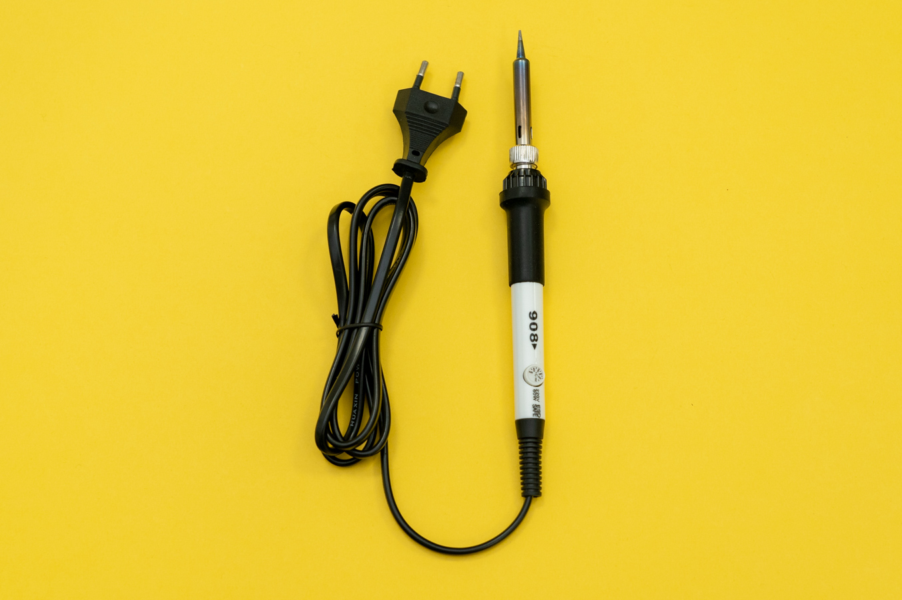
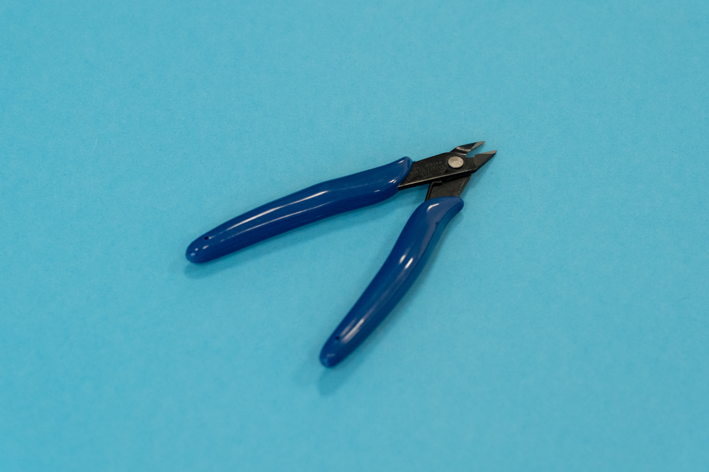
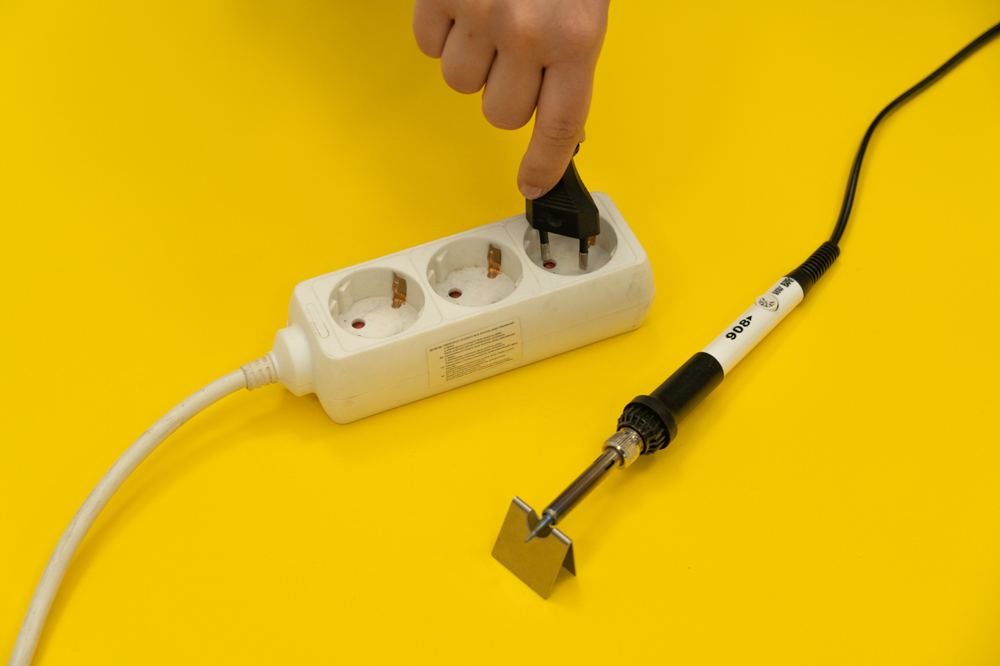
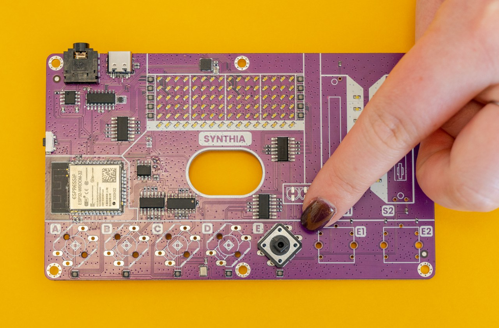
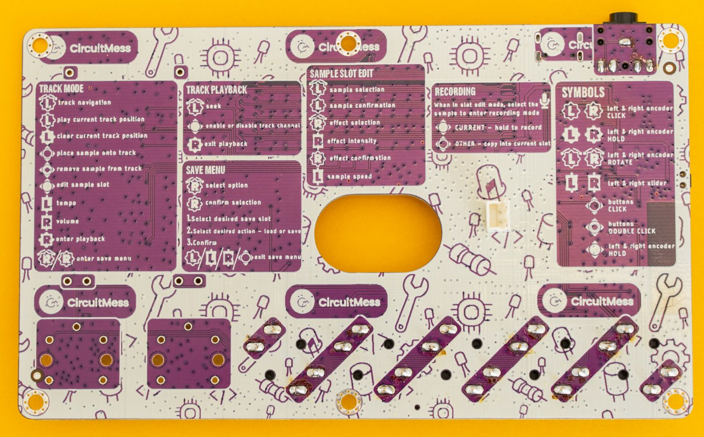
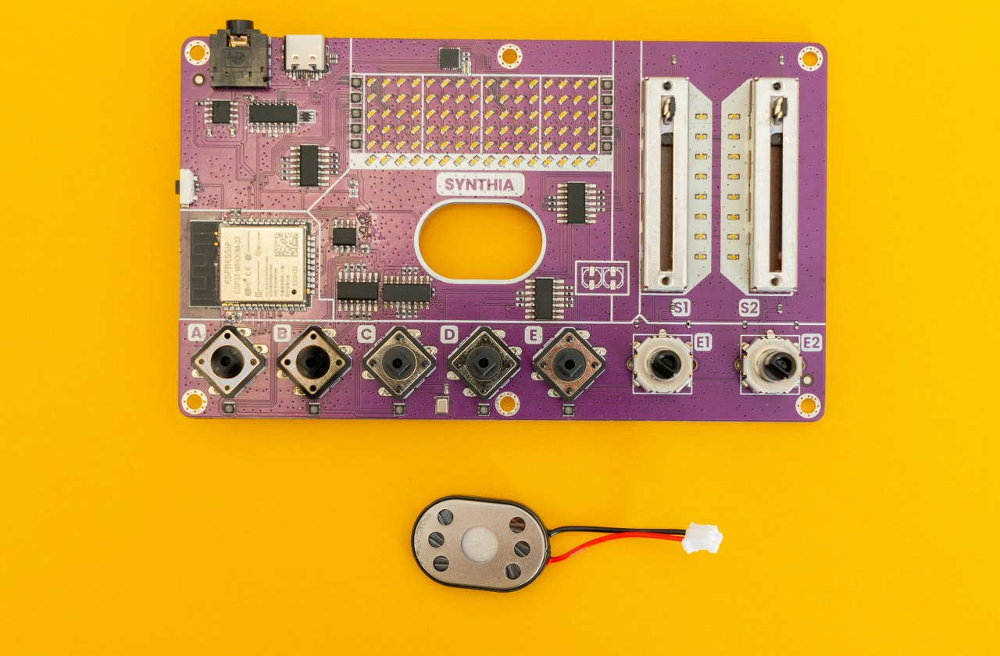
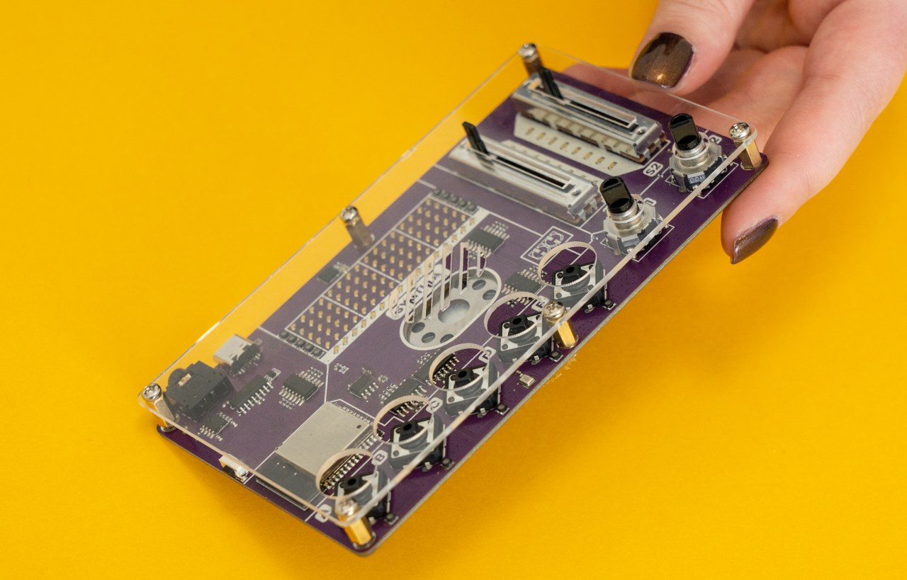

# Synthia Bauanleitung

* [Einführung](#einführung)
* [Hier sind die Werkzeuge](#hier-sind-die-werkzeuge)
* [Zusammenbau](#zusammenbau)
* [Wie geht's weiter?](#wie-gehts-weiter)

## Einführung

### Der Anfang

#### Willkommen zur CircuitMess Synthia-Bauanleitung!

In dieser Bauanleitung erfährst du, wie du deinen digitalen Sound-Sampler zusammenbaust. Mit Synthia lernst du, wie Mikrocomputer und andere elektronische Komponenten zur Klangerzeugung eingesetzt werden. Du kannst einzigartige Musik kreieren, indem du mit den vorinstallierten Klangbeispielen spielst oder deine eigenen Klangbeispiele mit dem eingebauten Mikrofon aufnimmst und vieles mehr.

#### Altersgruppe

Wie auf der Schachtel angegeben, ist Synthia für alle **ab 11 Jahren** geeignet.

Du solltest einige der Montageschritte vorsichtig angehen, also sorge dafür, dass ein Erwachsener einspringt, wenn du später beim Löten oder Festziehen der Schrauben Hilfe brauchst. Es ist in Ordnung, wenn du um Hilfe bittest.

Aber keine Sorge! Wir gehen den Zusammenbau Schritt für Schritt durch und geben dabei einige nützliche Tipps. Wir geben dir einen Hinweis, wenn du beim Zusammenbau etwas Wichtiges beachten musst.

#### Aufbauzeit

Für den vollständigen Zusammenbau deines Synthia solltest du **etwa 2 Stunden** benötigen.

Natürlich hängt die Montagezeit von deinen Vorkenntnissen und deiner Erfahrung ab. Wenn du noch keine Erfahrung hast, mach' dir keine Sorgen! Du wirst nur etwas länger brauchen, um dich einzuarbeiten und die anfänglichen Schwierigkeiten zu überwinden.

#### Fertigkeiten

Du musst keine besonderen Fähigkeiten haben, um dich an diesem Heimwerkerprojekt versuchen zu können.

Das Hauptziel ist es, Spaß zu haben und etwas Neues zu lernen.

Also passt auf, lies alle Anweisungen und mach' dich bereit, Spaß zu haben!
Dies ist eine großartige Gelegenheit und dein erster Schritt in deiner großen Ingenieurskarriere.

#### Lernen mit Synthia

Wie bereits erwähnt, wird Synthia dir in den folgenden Stunden einige nützliche Dinge beibringen.

Dies hier wirst du lernen:

* Wie du dein eigenes elektronisches Gerät **lötest und zusammenbaust**
* Welche **elektronischen Bauteile** für die digitale Klangerzeugung benötigt werden
* Wie man ein **digitales Signal in ein analoges umwandelt**
* Was **Schallwellen** sind und wie man sie mit elektronischen Schaltkreisen erzeugt
* Wie man **eigene Lichtshows** für das eingebaute LED-Gitter programmiert
* Wie **digitale Sound-Sampler** funktionieren
* Wie man Töne und Geräusche **aufnimmt** und bearbeitet

### Was ist in der Schachtel?

#### Lernen wir alle Komponenten kennen, die in der Schachtel enthalten sind!

Öffne deine Synthia-Box und überprüfe bitte, ob alle Komponenten enthalten sind.
Lege alles auf eine saubere Oberfläche, auf der du überprüfen kannst, ob alles gemäß dem Foto und der Liste unten vorhanden ist.

Falls etwas fehlen sollte, kontaktiere uns bitte unter <contact@circuitmess.com>.
Schicke uns bitte ein Foto von allem, was im Karton war, und wir werden uns so schnell wie möglich bei dir melden, um das Problem zu lösen.

#### Hier ist die Liste der Komponenten:

1. Acryl-Gehäuse
2. Platine
3. Kunststoffkappen für die Schieberegler
4. Tastenkappen
5. Kappen für die Drehgeber
6. Anschluss für den Lautsprecher
7. Lautsprecher
8. Selbstklebende Gummifüße
9. Rundkopf-Schrauben M3 x 12mm
10. Abstandshalter aus Messing
11. Rundkopf-Schrauben M3 x 5mm
12. USB-C-Kabel
13. Schieberegler
14. Drehgeber (engl. Encoder)
15. Taster
16. Kopfhörerbuchse

## Hier sind die Werkzeuge

### Nötige Werkzeuge

In diesem Kapitel erklären wir dir, welche Werkzeuge du für den Zusammenbau deines Synthia benötigst.

Wenn du dein **CircuitMess Tools-Paket** vor dir liegen hast, dann solltest du bereit sein und hast bereits alle benötigten Werkzeuge!

Falls du den Synthia-Bausatz ohne das Werkzeugpaket erhalten hast, ist dies ein guter Zeitpunkt, um sich einige der Werkzeuge auszuleihen oder sie zu kaufen.

Die benötigten Werkzeuge sind unverzichtbar, wenn du elektronische Geräte zusammenbaust, reparierst oder modifizierst - und sie sind das Handwerkszeug für jeden Maker, Hardware-Hacker, Modder oder Elektriker.

1. Lötkolben
2. Entlöt-Vakuumwerkzeug (Lötsauger)
3. Lötkolbenständer
4. Eine kleine Rolle mit kolophoniumhaltigem Lot
5. Reinigungsschwamm
6. Kreuzschlitzschraubendreher
7. Seitenschneider
8. Spitzzange

#### Lötkolben

Dies ist das wichtigste Werkzeug im Arsenal eines Bastlers.

Für den Zusammenbau von Synthia reicht jeder Lötkolben der Einstiegsklasse aus.

Wenn du vor hast, in die Welt der Heimwerkerprojekte einzutauchen, solltest du einen teureren Lötkolben mit mehr Funktionen in Betracht ziehen. Lötkolben mit austauschbaren Spitzen sind zum Beispiel besonders nützlich, wenn du viel mit kleineren Bauteilen arbeiten möchtest.

Im nächsten Kapitel findest du eine Anleitung zum richtigen Löten und zur Pflege deines Lötkolbens.

#### Lötschwamm

Dieses kleine Stück macht nicht viel her, bis man es in Wasser einweicht. Dann verwandelt es sich in einen super Lötzinn-Reinigungsschwamm! Benutze ihn, nachdem du ein paar Lötstellen gelötet hast, um das überschüssige Lot von der Spitze deines Lötkolbens zu entfernen. Achte darauf, dass der Schwamm weder tropfnass noch staubtrocken ist - er sollte feucht sein.

#### Seitenschneider

Mit einem Seitenschneider wie diesem kannst du die Beine von gelöteten Bauteilen abschneiden und Drähte kürzen.

Wir bevorzugen die auf dem Bild gezeigte Zange (Plato, Modell 170), aber auch jedes andere Modell ist geeignet.

#### Spitzzange

Eine solche Zange brauchst du beim Zusammenbau des Gehäuses oder beim Einstecken kniffliger Stecker!

Sie ist generell hilfreich bei feinmechanischen Arbeiten.

#### Kreuzschlitz - Schraubendreher

Für die Montage des Gehäuses benötigst du diesen Kreuzschlitzschraubendreher.

Ein handelsüblicher 2,0 mm - Kreuzschlitzschraubendreher sollte ausreichen.

#### Entlöt-Vakuumwerkzeug (Lötsauger)

Dieses Werkzeug ist nützlich, um Lötfehler zu beseitigen. Für die Montage selbst ist es nicht notwendig.

Wenn du vor hast, in Zukunft etwas zu hacken, zu modden oder Hardware zu reparieren, ist es immer eine gute Idee, dieses Werkzeug zu haben.

### Zusätzliche nützliche Werkzeuge

#### Helfende dritte Hand mit Lupe

Dies könnte deine Löterfahrung ein wenig angenehmer machen, besonders wenn du kompliziertere Projekte durchführen möchtest.

#### Multimeter

Ein Multimeter kann für viele Dinge verwendet werden: zum Prüfen kniffliger Verbindungen, zum Messen der Batteriespannung, zum Testen von Widerständen und Kondensatoren, zum Messen des Stromverbrauchs und vielem mehr.

Es ist ein nützliches Werkzeug, wenn du herausfinden willst, was bei einem Elektronik-Bausatz schief gelaufen ist.

#### Lötdocht

Du kannst den Lötdocht zusammen mit dem Entlöt-Vakuumwerkzeug verwenden, um Lötfehler zu beseitigen. Lege ihn einfach auf die fehlerhafte Lötstelle und drücke mit einem heißen Lötkolben darauf. Dann saugt er das überschüssige Lot auf wie ein Schwamm!

Nützlich zum Korrigieren von Lötstellen, die mit einem Lötsauger nicht leicht zu erreichen sind.

## Zusammenbau

### Einführung in das Löten

**Eines der Dinge, die du beim Zusammenbau deines Synthia tun wirst, ist löten!**

Hast du das schon einmal gemacht? Wenn nicht, empfehlen wir, dir die folgenden Links anzusehen, die zu nützlichen Anleitungen und Blogs zum Thema Löten führen. Du wirst nur 10 Minuten brauchen, um dich in die Materie einzuarbeiten und um zu verstehen, wie es gemacht wird.

Hier sind die Links (englisch):

* [Adafruits Video Tutorial mit Collin Cunningham](https://www.youtube.com/watch?v=QKbJxytERvg) - Ein Tutorial mit Collin Cunningham, einem super charismatischen Elektronik-Guru.
* [Adafruits Löt Tutorial](https://learn.adafruit.com/adafruit-guide-excellent-soldering?view=all) - Ein großartiges und ausführliches Video-Tutorial. Ein absolutes Muss, auch wenn Du schon weißt, wie man lötet. Besonders zu empfehlen ist der Abschnitt "Häufige Fehler beim Löten" am Ende.
* [Sparkfuns Video-Tutorial zum Löten](https://www.youtube.com/watch?v=f95i88OSWB4) - Ein weiteres gut gemachtes Video-Tutorial zum Thema Löten.
* [Sparkfuns Standard Soldering Tutorial](https://learn.sparkfun.com/tutorials/how-to-solder-through-hole-soldering) - Ein detailliertes Tutorial von Sparkfun.

#### Löt-Regeln

Es gibt einige Regeln für das Löten, die jeder, unabhängig von seinem Kenntnisstand, stets beachten sollte:

* **Atme niemals die Dämpfe ein, die der Lötkolben produziert!**
  Diese können gefährlich sein, also atme sie bitte nicht ein.

* **Berühre niemals die Spitze des Lötkolbens!**
  Auch wenn der Lötkolben ausgeschaltet oder ganz von der Stromquelle getrennt ist, kann er noch sehr heiß sein und daher bei Berührung sehr unangenehme Schmerzen verursachen.
  Halte den Lötkolben immer so, dass die Spitze von deinen Händen weg zeigt.
  Wenn du mit dem Löten fertig bist, trenne den Lötkolben von der Stromquelle und lasse ihn mindestens fünf Minuten abkühlen, bevor du ihn wieder verstaust.

* **Reinige den Lötkolben!**
  Der Schwamm ist dein bester Freund beim Löten. Verwende ihn häufig und reinige deinen Lötkolben, wenn du einfach und problemlos löten möchtest.
  Halte dazu ein Ende des Schwamms vorsichtig mit einer Hand fest und wische die Spitze des Lötkolbens am anderen Ende des Schwamms ab, um das überschüssige Lot zu entfernen. Wiederhole dies so lange bis die Spitze des Lötkolbens schön sauber ist.

* **Prüfe deine Lötstellen. Zweimal!** (mindestens)
  Die meisten Fehlfunktionen in der Welt der Elektronik sind auf schlechte Lötstellen zurückzuführen. Unabhängig davon, ob es sich um dein erstes oder 100. Lötprojekt handelt solltest du deine Lötstellen immer mehrmals überprüfen, bevor du zum nächsten Schritt übergehst.

* **Bewahre den Lötkolben auf dem Ständer auf**, wenn du ihn nicht benutzt.

* **Verwende die richtige Menge Lötzinn!**
  Achte darauf, dass du gerade genug Lot verwendest. Nicht zu viel, aber auch nicht zu wenig, denn beides kann dazu führen, dass dein Bausatz dann nicht funktioniert.

* **Lass keine Lot-Reste auf der Platine!**
  Das Lötzinn sollte sich nur auf den Teilen befinden, an denen die Stifte mit der Platine verbunden sind. Halte den Rest der Platine sauber! Kleine Löttropfen auf der ganzen Platine sind ein absolutes Tabu!

**Bitte lies dir diese Regeln jetzt noch ein paar Mal durch, damit du sie nicht vergisst!**

Verwende dieses Foto, um eine Vorstellung von guten und schlechten Lötstellen zu bekommen (Danke an Adafruit für dieses tolle Foto!):

* Cold Joint - Kalte Lötstelle
* Insufficient Wetting - Unzureichende "Benetzung" des Lötstelle; zu wenig Lot
* Too Much Solder - Zu viel Lot
* OK - Super. Alles richtig!

Wenn du diese Regeln befolgst, sollte dir das Löten leicht von der Hand gehen.

#### Verwendung des Lötkolbens

Der Lötkolben ist sehr einfach zu benutzen, aber nur, wenn er richtig benutzt wird.

Wenn du das CircuitMess-Werkzeugpaket mit deinem Chatter-Bausatz gekauft hast, hast du einen weißen Lötkolben mit einem Temperaturregler erhalten.

Erinnerst du dich an die zuvor erwähnten Regeln? Gut! Lass uns jetzt die Anweisungen zur Verwendung des Lötkolbens durchgehen...

Wenn du deinen Lötkolben zum ersten Mal benutzt oder Hilfe bei der Reinigung der Spitze brauchst, schau dir unser (englisches) [Video-Tutorial](https://www.youtube.com/watch?v=JPFH4m-Pa00) an.

##### Schritt 1 - Einstecken

Lege den Lötkolben auf den Lötkolbenständer - wie auf dem Bild gezeigt - und schließe ihn an eine Steckdose an.

##### Schritt 2 - Wähle die richtige Temperatur

Stelle die Temperatur auf **350 °C** ein, indem du den Temperaturregler am Lötkolben drehst.
Achte darauf, dass der kleine schwarze Pfeil auf die richtige Temperatur zeigt, wie auf dem Foto zu sehen.

Dein Lötkolben ist jetzt einsatzbereit, aber lass ihm ein bis zwei Minuten Zeit, damit er sich aufheizen kann.

##### Schritt 3 - Auszuschalten, wenn du fertig bist

Wenn du mit dem Löten fertig bist (keine Angst - wir sagen dir wenn's soweit ist), ziehe den Stecker aus der Steckdose, um den Lötkolben auszuschalten.

Bitte benutze den Metallständer immer dann, wenn du den Lötkolben nicht benutzt.
Damit stellst du sicher, dass deine Unterlage oder die Platine nicht verbrennen.

**Achte darauf, nach dem Ausschalten die Spitze des Lötkolbens mindestens fünf Minuten lang nicht zu berühren.**

### Teil Eins - Löten der Bauteile

Jetzt, wo du weißt, wie man lötet, können wir es gleich ausprobieren. Bist du bereit?

#### 1. Die Kopfhörerbuchse

Schau' dir vor dem Löten noch einmal unser [Video-Tutorial](https://www.youtube.com/watch?v=JPFH4m-Pa00) (englisch) an, um sicher zu gehen, dass du alles richtig machst.

Die ersten Komponenten, die wir verwenden werden, sind die **Platine** und die **Kopfhörerbuchse**.

Die Kopfhörerbuchse befindet sich im **oberen linken Teil** der Platine. Du kannst das kleine Quadrat auf der Platine selbst suchen - oder du schaust dir einfach die folgenden Fotos an:

Achte darauf, dass der runde Teil der Kopfhörerbuchse nach oben zeigt. Hierkannst du später die Kopfhörerbuchse mit deinen Kopfhörern verbinden.

Prüfe beim Aufsetzen auf die Platine, ob alles richtig eingesteckt ist, bevor du lötest.

Dein Synthia sollte jetzt so aussehen:

Jetzt ist es an der **Zeit, den Lötkolben zu nehmen** und sich an die Arbeit zu machen.

Drehe die Platine um, suche die Pins, die zur Kopfhörerbuchse gehören und löte Sie sie an.

Löte alle Pins der Kopfhörerbuchse an und achte darauf, dass das Bauteil senkrecht auf der Platine steht.

**Toll gemacht!** Du hast dein erstes Bauteil erfolgreich gelötet! Wir haben noch viele andere Dinge einzulöten, also machen wir am besten mit dem nächsten Bauteil weiter.

#### 2. Der Lautsprecheranschluss

Als Nächstes werden wir den Lautsprecheranschluss anlöten. Das ist das kleine weiße Ding, das du in einer der Plastiktüten bekommen hast.

Hier musst du den Lautsprecheranschluss anbringen:

Nimm deinen Lötkolben, drehe die Platine um und beginne zu löten.

**Achte darauf, dass du nicht auf dem Chip in der Nähe der Pins auf der Vorderseite lötest.**

#### 3. Taster

Jetzt ist es an der Zeit, **die Taster** zu verlöten!

Taster werden am häufigsten verwendet - und es gibt insgesamt 5 von ihnen.

Die Taster bestehen aus zwei Teilen - **den mechanischen Tastenteilen und den Tastenkappen**. Die Tasten funktionieren auch ohne die Kappen, aber wenn man sie mit den Kappen drückt, fühlt sich das viel schöner an und sie sehen viel cooler aus.

Wie auch immer, wir lassen die Kappen erst einmal beiseite und konzentrieren uns auf das Löten der mechanischen Unterteile.

Die fünf Taster werden auf den fünf weiß markierten Feldern am unteren Rand der Platine angebracht.

Auf dem Foto unten kannst du den genauen Platz für die Taster sehen:

Als Erstes musst du jeden einzelnen Taster auf der Platine platzieren.

**Vergewissere dich vor dem Einlöten der Taster, dass sie senkrecht auf der Platine stehen. Dies ist sehr wichtig, denn wenn die Taster schief sind wird du sonst Probleme haben, das Gehäuse auf die Platine zu setzen.**

Nachdem du die Bauteile an der richtigen Stelle platziert hast (Stifte durch die kleinen Löcher), lege die Hauptplatine vor dir auf die Oberfläche und nimm den Lötkolben in die Hand.

Löte alle fünf Taster ein und achte darauf, dass sie senkrecht auf der Platine stehen.

**Jetzt ist auch ein guter Zeitpunkt, um zu prüfen, ob es irgendwelche Lötbrücken gibt.**

Nachdem du die fünf Taster fertig eingelötet hast, sollte die Rückseite der Platine wie folgt aussehen:

Und die Vorderseite:

#### 4. Encoder

Als nächstes werden wir **zwei Encoder (bzw. Drehgeber)** einlöten.

Sie ähneln den Tastern, aber sie sind rund und etwas größer.

Hier sind die Bauteile, die du für diesen Schritt brauchst. Hast du alles? Cool, dann kann's ja losgehen!

Beginne mit dem Einsetzen des ersten Encoders. Wie du auf dem Foto sehen kannst, kommt jedes Bauteil dorthin, wo das weiße Quadrat auf der Platine abgebildet ist - es ist schwer, es zu übersehen.

Denke auch daran, dass alle Stifte in die Löcher gesteckt werden müssen, um den Encoder später an die Platine zu löten. Sollte sich einer der Stifte beim Einstecken verbiegen, richte ihn einfach mit den Fingern aus und versuche es erneut.

Jeder Encoder hat sieben Stifte, die so angeordnet sind, dass es nur eine Möglichkeit gibt, ihn einzustecken. Nach dem Einsetzen des ersten Encoders wiederhole den Schritt noch einmal für das 2. Bauteil.

Vergewissere dich vor dem Löten, dass die Encoder senkrecht auf der Platine stehen.

Wenn alles in Ordnung zu sein scheint, beginne mit dem Löten!

#### 5. Schieberegler

Es ist an der Zeit, die **Schiebepotentiometer** einzulöten. Das sind wichtige Bauteile, die später beim Abspielen der Klänge verwendet werden.

Es gibt zwei Schieberegler, und jeder Schieberegler hat drei Stifte, die auf die Platine gelötet werden müssen. Ein Stift befindet sich an einem Ende des Schiebereglers und zwei am anderen, so dass du dir keine Sorgen machen musst, sie falsch herum auszurichten.

Sie sollten sich über den Encodern befinden.

Setze sie an der richtigen Stelle ein und beginne mit dem Löten!

Wie bereits erwähnt, befinden sich an jedem Schieberegler drei Stifte. Setze den Schieberegler so ein, dass die beiden Stifte auf der einen Seite in die beiden Löcher auf der Platine passen - und ein Stift in das einzelne Loch auf der anderen Seite der Platine.

Nachdem du den ersten Schieberegler eingesetzt hast, drehe die Platine um und verlöte die drei Stifte.

So sollte deine Platine nach dem Einlöten der Schieberegler aussehen:

Und hier die Rückseite:

**Herzlichen Glückwunsch! Du hast alle Bauteile erfolgreich verlötet!**

**Der schwierige Teil ist geschafft.** Das Einzige, was noch zu tun ist, bevor du Synthia an den PC anschließt, um zu prüfen, ob alles richtig gelötet ist, ist der Anschluss des Lautsprechers!

Wir hoffen, du hattest viel Spaß beim Löten der Bauteile. Leider musst du jetzt **deinen Lötkolben ausschalten**, aber es liegen noch weitere lustige Schritte vor dir, und wir sind noch nicht ganz fertig!
Bitte schalte deinen Lötkolben aus, indem du den Stecker aus der Steckdose ziehst.
**Lass den Lötkolben mindestens fünf Minuten auf dem Ständer stehen, damit er abkühlt, bevor du ihn aufräumst.**

Bereit zum Weitermachen?  

#### 6. Anschluss des Lautsprechers

Bevor wir den Hardware-Test durchführen, müssen wir **den Lautsprecher anschließen**, denn ohne ihn können wir die wichtigste Funktion von Synthia nicht überprüfen - den Klang!

Du weißt wahrscheinlich schon, wie der Lautsprecher aussieht - aber wenn nicht, sieh dir das folgende Foto an:

Eine der ersten Komponenten, die du gelötet hast, war der Lautsprecheranschluss.
Das ist das kleine weiße Ding auf der Rückseite der Platine.

Nimm den weißen Teil des Lautsprechers und drücke ihn in den Anschluss.
Wenn der Lautsprecher richtig angeschlossen ist, solltest du ein Klicken spüren!

So sollte Synthia im Moment aussehen:

Im nächsten Kapitel werden wir dich durch den Hardwaretest führen.

### Teil Zwei - Erster Hardwaretest

Willkommen zu einem der spannendsten Teile des Zusammenbaus - dem Hardwaretest!

Mit ihm kannst du überprüfen, ob alles richtig verlötet ist und ob alles so funktioniert, wie es soll.

**Erst danach sollten wir mit dem Zusammenbau des Gehäuses fortfahren! Es wäre eine Menge Arbeit, das Gehäuse zu zerlegen, wenn wir feststellen, dass etwas nicht funktioniert!**

Deshalb ist es wichtig, diese einfache Kontrolle durchzuführen.
Fangen wir also an...

#### Schritt 1

In der Verpackung solltest du ein USB-C-Kabel finden, welches zum Laden und Programmieren von Synthia verwendet wird.

Wenn du es aus irgendeinem Grund nicht hast, genügt auch jedes andere USB-C-Kabel.

Verwende das Kabel, um Synthia mit deinem PC zu verbinden.

Synthia sollte sich sofort einschalten!

Wie bei jedem anderen CircuitMess-Gerät ist es am wichtigsten zu prüfen, ob alle Taster, Encoder und Schieberegler richtig funktionieren. Ein weiterer wichtiger Punkt sind die LEDs.

#### Schritt 2

**Wenn du Synthia zum ersten Mal an den PC anschließt, hörst du die Stimme von Spencer.**
(Falls du hier neu bist und nicht weißt, wer Spencer ist: Das ist unser Selbstbau-Sprachassistent.)

Spencer beglückwünscht dich zu deinem Erfolg und führt dich durch die erste Prüfung, so dass du nichts verpassen kannst.

In dieser Anleitung stellen wir die nötigen Schritte zur Sicherheit noch einmal schriftlich vor, damit du sie gut nachverfolgen kannst.

#### Schritt 3

**Als erstes musst du die Taster überprüfen**.
Wenn sie richtig funktionieren, sollte das **grüne Licht** unter ihnen aufleuchten.

Funktioniert alles? Erstaunlich!

Jetzt musst du **auf die Encoder klicken und sie ein wenig drehen**. Wenn die Encoder funktionieren, sollten die LEDs auf der **LED-Matrix aufleuchten**, je nachdem, wo du dich auf der Matrix befindest.

Und zum Schluss musst du die **Schieberegler überprüfen**. Schiebe sie einfach nach oben und unten. Wenn alles in Ordnung ist, **leuchten die LEDs an der Seite** eine nach der anderen auf.

**Nachdem du alles überprüft hast, sagt dir Spencer, dass alles in Ordnung ist!**
Klicke auf den Encoder und du hörst Spencer sagen: **"Spencer out!"**.

Jetzt, da du sicher bist, dass alles richtig verlötet ist, kannst du das Gehäuse von Synthia zusammenbauen.

### Teil Drei - Das Gehäuse

Wenn du bis hierher gekommen bist, hat dein Gerät den Hardware-Test erfolgreich bestanden!

Das bedeutet, dass du auf dem besten Weg bist, ein professioneller Bastler zu werden!

Jetzt müssen wir die beiden Acryl-Gehäuseteile verwenden, um die Platine zu schützen und dein Gerät professioneller aussehen zu lassen.

Für diesen Abschnitt der Anleitung werden diese Teile die wichtigsten sein.

Jedes Acryl-Gehäuseteil hat auf beiden Seiten eine Schutzschicht, die abgezogen werden muss. Sie sind noch nicht vollständig durchsichtig, aber das sollten sie sein, wenn du diesen Schritt abgeschlossen hast!

Vergiss nicht, die Schutzschicht von beiden Seiten der Gehäuseteile abzuziehen!
Nachdem du alles abgezogen hast, sollten die Teile so aussehen:

Wir werden das obere Gehäuseteil zuerst zu montieren (das ist das mit den vielen Löchern)!

Dafür brauchst du die größeren Schrauben und die goldenen Abstandshalter.

Wie du sehen kannst, gibt es sechs Schrauben und sechs Abstandshalter.

Sie werden in die sechs kleinen Löcher am Rand des Acrylgehäuses und der Leiterplatte eingesetzt.

Wir empfehlen dir, eine Schraube und einen Abstandshalter einzusetzen, sicherzustellen, dass alles fest sitzt, und erst dann zur nächsten Schraube und zum nächsten Abstandshalter zu gehen.

Wichtig ist, dass du die Schraube von der Außenseite des Acrylgehäuses und den Abstandshalter von der Innenseite anbringst.

Du musst die Teile mit den Fingern fest ziehen. Es wird noch kein Werkzeug benötigt!

Tue dies nun für alle sechs Schrauben und Abstandshalter.

Am Ende sollte es so aussehen:

Setze nun dieses Gehäuse auf die Vorderseite der Platine.

Weiter geht's mit der anderen Gehäuseseite!

Dafür brauchst du: das Acrylgehäuse, das noch übrig ist, sechs Abstandshalter und sechs kleinere Schrauben.

Der Vorgang ist der selbe wie bei der vorderen Verkleidung.

Nimm eine Schraube und einen Abstandshalter und befestige sie. Die Schrauben müssen an der Außenseite des Gehäuses und die Abstandshalter an der Innenseite angebracht werden.

Du erkennst die Seiten an den sechs Kreisen! Auf der Außenseite kannst du die Kanten der Kreise spüren!

Wiederhole dies für alle sechs Schrauben und Abstandshalter:

Nimm nun die Platine sowie dieses Gehäuseteil und verbinde beide!

Nun kannst du mit dem Schraubenzieher die Schrauben fest ziehen!

Achte darauf, dass du die Schrauben nicht zu fest anziehst, da dies zum Bruch des Gehäuses führen kann!

Alles ist jetzt verbunden! Super!

Jetzt ist es an der Zeit, Knöpfe und Kappen für die Taster und Encoder anzubringen, um die spätere Verwendung noch angenehmer zu gestalten.

Wir beginnen mit den Kappen der Encoder. Das sind die beiden größten Kappen aus der Box.

Setze sie hier auf:

Achte darauf, die Kappe auf den Encoder zu drücken, bis sie einrastet.

Nachdem du die Kappen auf die Encoder aufgesetzt hast, versuche sie zu benutzen, sie ein wenig nach rechts und links zu drehen, um zu sehen, ob alles richtig zusammengesetzt ist.

Als nächstes brauchen wir die Kappen für die Taster.

Drücke die Kappen auf den Taster, bis sie einrasten.

Stell' sicher, dass alles reibungslos funktioniert, bevor du zum nächsten Schritt übergehst.

So sollte Synthia im Moment aussehen:

Als Nächstes musst du die Schieberegler mit Kappen versehen.

Schiebe sie nach dem Anbringen ein wenig, um sicherzustellen, dass alles richtig funktioniert!

Gute Arbeit!

Wir sind am Ende der Montage angelangt.

Das Einzige, was noch zu tun ist, ist das Anbringen von selbstklebenden Gummifüßen an der Unterseite des Geräts, um es zu sichern.

Das sind die Teile, die du brauchst:

Wie du sehen kannst, befinden sich unter jedem der Gummifüße weiße Aufkleber.
Du musst den Aufkleber entfernen, bevor du sie auf das Gehäuse setzt.

Setze die klebrige Seite der Gummifüße auf die Unterseite des Geräts.

So sollte Synthia nach dem Aufkleben der Gummifüße aussehen!

## Wie geht's weiter?

Herzlichen Glückwunsch! Du hast erfolgreich deinen digitalen Musik-Sampler, Synthia, zusammengebaut.

**Als Nächstes** wirst du herausfinden, wie man ihn benutzt, **welche tollen Funktionen wir für dich vorbereitet haben und wie man ihn programmiert**!

Diese Informationen findest Du in den Anleitungen zur Benutzung bzw. zur Programmierung, die du von [unserer Homepage](https://learn.circuitmess.com/resources/guides) herunterladen kannst.

In der Zwischenzeit laden wir dich ein, unserem
**[Discord-Kanal](https://discord.gg/wdKa8AP7)**
und unserer
**[Facebook-Gruppe](https://www.facebook.com/groups/circuitmesscommunity)**
beizutreten, wo du Ideen, Fotos und Feedback mit anderen Makern austauschen kannst und exklusive Neuigkeiten von CircuitMess erhältst.
