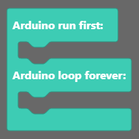
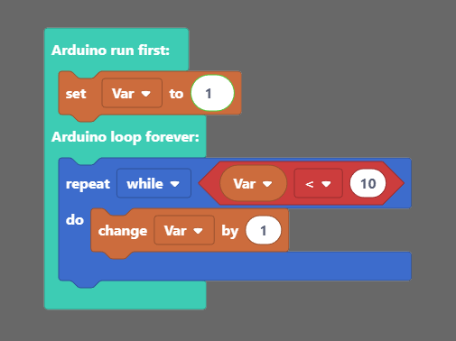
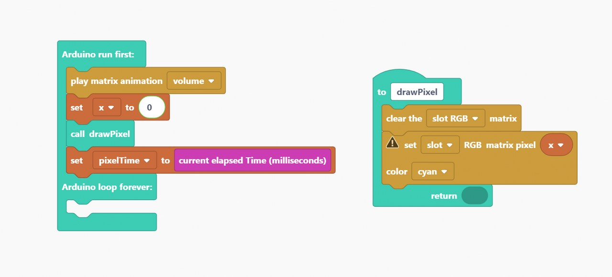
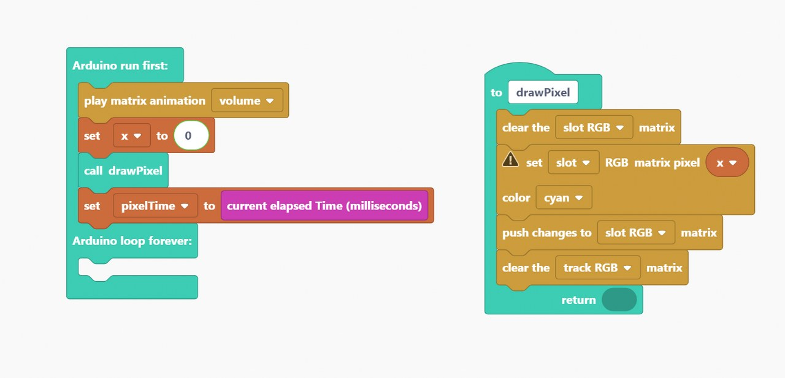

# Synthia Programmierung - Erste Schritte

* [Einführung](#einführung)
* [Los geht's! Schritt für Schritt](#los-gehts-schritt-für-schritt)
* [Wiederherstellen der Basis-Firmware von Synthia](#wiederherstellen-der-basis-firmware-von-synthia)

## Einführung

### Installation

#### Willkommen zum Synthia-Programmiertutorial

Vielen Dank für deine Unterstützung von CircuitMess und willkommen zum Synthia-Programmiertutorial.

Wir werden **CircuitBlocks** für die Programmierung deines neu zusammengebauten digitalen Musik Samplers verwenden.

CircuitBlocks ist eine von uns entwickelte Programmier-App.

Du wirst deinen Synthia in der grafischen, blockbasierten Programmieroberfläche von CircuitBlocks programmieren, die dir bei deinen ersten Schritten in der Welt der Hardwareprogrammierung helfen wird.

CircuitBlocks läuft derzeit auf Windows-, Linux- und Mac OS-Computern.

#### Wenn du einen Windows-Computer hast

1. **Gehe auf die [CircuitBlocks-Download-Seite](https://circuitmess.com/pages/download)**

2. **Lade die neueste Version für Windows herunter** - Prüfe dabei, ob du eine 32- oder 64-Version hast. Öffne dazu die "Einstellungen" App, klicke auf die Option "System" und suche den Abschnitt "Info". Hier siehst du den Systemtyp.

3. Starte die heruntergeladene Datei mit dem Namen "CircuitBlocks" durch einen Doppelklick.

4. CircuitBlocks wird automatisch installiert und eine neue Desktop-Verknüpfung wird erstellt.

**Dein PC ist nicht gefährdet!**

Es besteht die Möglichkeit, dass eine Meldung erscheint, die besagt, dass dein PC gefährdet ist, wenn du versuchst CircuitBlocks zu installieren. Mach' dir keine Sorgen! Diese Meldung wird manchmal angezeigt - unabhängig davon, ob CircuitBlocks sicher ist.

Wie du mit dieser Meldung umgehen kannst, erfährst du in den folgenden Anweisungen.

Diese Meldung erhältst du möglicherweise bei der Installation von CircuitBlocks auf deinem PC. Windows meldet eine Bedrohung, obwohl das Programm sicher heruntergeladen und ausgeführt werden kann. Bitte fahre mit der Installation fort, indem Du auf die Option *"Mehr Informationen"* (bzw. *"More info"* in englisch) klickst.

Nachdem du auf die Option *"Weitere Informationen"* geklickt hast, sollte am unteren Rand des Fensters die Option *"Trotzdem ausführen"* (in englisch: *"Run anyway"*) erscheinen.
Klicke auf die Option *"Trotzdem ausführen"* und fahre mit der Installation fort.

#### Wenn du einen Mac Computer hast

1. **Gehe auf die [CircuitBlocks-Download-Seite](https://circuitmess.com/pages/download)**

2. **Lade die neueste Version für MacOs herunter** - Eine Datei mit dem Namen "CircuitBlocks-1.0.1-Mac.dmg" oder ähnlichem sollte heruntergeladen werden.

3. Verschiebe die Datei in den Ordner "Programme".

4. CircuitBlocks wird automatisch installiert.

#### Wenn du einen Linux Computer hast

Es gibt zwei Möglichkeiten, CircuitBlocks unter Linux zu installieren.

**Linux 64-bit:**

1. **Gehe auf die [CircuitBlocks-Download-Seite](https://circuitmess.com/pages/download)**

2. Klicke auf den Download-Button **"Linux 64-bit"**

3. Unter Ubuntu startest du die Installation einfach per Doppelklick auf die Datei.  
   Bei anderen Linux-Distributionen öffne das Terminal und führe folgenden Befehl aus:  
   `sudo dpkg -i <Pfad zur heruntergeladenen Datei .deb>`

4. CircuitBlocks wird automatisch installiert und ein Desktop-Eintrag wird erstellt.

**Eigenständiges AppImage:**

1. **Gehe auf die [CircuitBlocks-Download-Seite](https://circuitmess.com/pages/download)**

2. Klicke auf den Download-Button **"Linux AppImage"**

3. Klicke mit der **rechten Maustaste** auf die Datei und wähle **"Eigenschaften"**

4. Gehen auf die Seite *"Berechtigungen"* (bzw. in englisch: *"Permissions"*) und setze ein Häkchen bei *"Ausführen der Datei als Programm zulassen"* (bzw. *"Allow executing file as program"*).

5. Doppelklicke die Datei und die Installation wird automatisch abgeschlossen.

Solltest du Probleme mit der Installation haben, wende dich bitte per E-Mail an contact@circuitmess.com und sende uns einen Screenshot des Problems sowie alle relevanten Informationen.

### Die Grundlagen

#### Benutzeroberfläche

Wenn du CircuitBlocks öffnest, siehst du ein Fenster, das wie oben gezeigt aussieht.

Es ist ziemlich einfach - Du kannst ein **neues Projekt (wir nennen Projekte auf englisch auch "Sketches")** beginnen, indem Sie auf die Schaltfläche "Neues Projekt" (englisch "New project") klickst.

**Gespeicherte Projekte** werden direkt neben dieser Schaltfläche angezeigt und du kannst jederzeit darauf zugreifen.

Wenn du auf ein Problem mit CircuitBlocks stößt, klicke bitte auf den Link "**Fehlerbericht senden**" (auf englisch "Send error report") am unteren Rand des Hauptbildschirms. Hierbei erhältst du dann eine Fehlermeldungsnummer. Bitte kontaktiere uns über contact@circuitmess.com und gib diese Fehlermeldungsnummer an, damit wir dir weiterhelfen können.

#### Erstellen eines neuen Projekts (Sketch)

Klicke auf die große Schaltfläche "Neues Projekt" (englisch "New project").

Nun bekommst du die Möglichkeit, das Gerät und den Projekttyp auszuwählen.

* Für das Gerät wähle bitte: **Synthia**.
* Für den Typ des Sketches wähle bitte: **Block**.

**Drücke die Schaltfläche "Erstellen" (englisch "Create").**

Es erscheint ein Bildschirm, der wie folgt aussieht:

Am oberen Rand des Bildschirms befindet sich eine **Symbolleiste** mit einigen Schaltflächen.

Die **Blockauswahlleiste** befindet sich ganz links - Du kannst Blöcke von dort nehmen und sie in den "Zeichenbereich" in der Mitte des Bildschirms ziehen.

In der Mitte des Bildschirms wirst du deinen Programmcode mit bunten Blöcken "zeichnen".

Auf der rechten Seite des Bildschirms siehst du, wie der in der **Programmiersprache C++** geschriebene Code auf magische Weise von selbst erscheint, wenn du die bunten Blöcke in die Mitte ziehst.

**C++** ist eine der beliebtesten Programmiersprachen, aber sie ist ziemlich komplex, wenn du noch nie programmiert hast.

Deshalb haben wir CircuitBlocks entwickelt - hier kannst du bunte Blöcke, die Teile des Codes darstellen, mit der Maus verschieben und ablegen und sehen, wie dein Programm in C++ aussehen würde. Wenn du erfahren genug bist, kannst du direkt zur textuellen Programmierung in C++ wechseln, ohne dass du bunte Blöcke benötigst.

#### Symbolleiste

Im Folgenden wird kurz erklärt, was die Schaltflächen in der Symbolleiste des Fensters bewirken:

1. **Zurück zum Hauptmenü** - bringt dich zum Startbildschirm zurück, ohne zu speichern.

2. **Speichern/Speichern unter** - speichert dein Projekt. Achte darauf, diese Schaltfläche von Zeit zu Zeit und vor dem Schließen von CircuitBlocks zu drücken.

3. **Synthia-Verbindungsanzeige** - Der rote Punkt wird grün, wenn dein Synthia über ein USB-Kabel mit deinem Computer verbunden ist.

4. **Exportieren in Binärform** - speichert eine Binärdatei deines Programmcodes auf deinem Computer. Dies ist eine fortgeschrittene Funktion, die du vorerst nicht brauchen wirst.

5. **Serieller Monitor** - Diese Schaltfläche öffnet ein Fenster, das wir den "Seriellen Monitor" nennen. "Seriell" ist ein Spitzname für eine Art der Kommunikation, die zwischen Synthia und deinem Computer stattfindet. In diesem Fenster kannst du später die Nachrichten sehen, die von Synthia an deinen Computer über den USB-Anschluss gesendet werden.

6. **Code schließen** - Mit dieser Schaltfläche kannst du das Code-Fenster auf der rechten Seite des Bildschirms schließen oder wieder öffnen. Dies ist nützlich, wenn du mehr Platz auf dem Bildschirm benötigst, um deine farbigen Blöcke zu sehen.

7. **Ausführen** (englisch "Run") - Diese Schaltfläche übersetzt den in CircuitBlocks erstellten Code in Maschinencode, den Synthia versteht (beep boop beep boop 1011100101) und sendet den Code über den USB-Anschluss an deinen Synthia.

#### Code-Fenster

Das so genannte "Code-Fenster" besteht aus den folgenden Teilen:

1. **Haupt-Code-Bildschirm** - in C++ geschriebener (Programm-)Code erscheint hier, wenn du bunte Blöcke auf der linken Seite des Bildschirms einfügst.
  Du wirst sehen, dass einige Teile des Codes in lustigen Farben eingefärbt sind.
  Programmierer nennen dies *Syntaxhervorhebung*. Im Grunde werden verschiedene Kategorien von Codebefehlen unterschiedlich eingefärbt, damit Programmierer den Code leichter verstehen können.

2. **Umschalter für helles/dunkles Farbschema** - mit dieser Schaltfläche kannst du die Hintergrund- und Textfarbe des Codefensters umschalten.

3. **Erweitern** - dehnt das Codefenster auf den gesamten Bildschirm aus. Drücke die Taste erneut, um es wieder auf den halben Bildschirm zu verkleinern.

4. **Schließen** - schließt das Code-Fenster, dieselbe Funktion wie die Schaltfläche "Code schließen" in der Symbolleiste.

#### Zeichenbereich

Auf dem Zeichenbereich geschieht die Magie.

Er besteht aus den folgenden Teilen:

1. **Suchleiste** - gib hier den Namen einer Komponente (in englisch) ein, nach der du suchst.

2. **Komponentenauswahl** - die Blöcke sind hier in verschiedene Kategorien unterteilt.
  Jeder Kategorie ist eine bestimmte Farbe zugewiesen.

3. **Zeichenfläche** - ziehe die Blöcke aus der Komponentenauswahl und lege sie in der Zeichenfläche ab. Auf diese Weise wird der Code erstellt. Kinderleicht!

4. **Zentrierwerkzeug** - wenn du dich beim Scrollen durch die Zeichenfläche verirrst, drücke diese Taste. Dadurch wird die Anzeige auf die Blöcke zentriert, die du auf der Zeichenfläche abgelegt hast.

5. **Zoom-Tasten** - zum Vergrößern und Verkleinern der Zeichenfläche.

### Arten von Blöcken

In CircuitBlocks gibt es insgesamt **neun** Blocktypen. Jeder von ihnen wird durch seine Farbe dargestellt. Jeder Block wird in Code übersetzt, der dann kompiliert und auf deinen Synthia hochgeladen wird, genau wie auf jeder Arduino-basierten Plattform.  

Jeden Blocktyp kannst du anklicken um einen Bereich zu öffnen, von dem du die zugehörigen Blöcke per Drag & Drop in die Zeichenfläche ziehen kannst.

Wenn du auf "Mehr" (englisch: "More") drückst, werden noch mehr Blöcke sichtbar, die nicht so häufig verwendet werden.

Es gibt zwei Hauptfunktionen in jedem Arduino-Code - `void setup()` und `void loop()`.

Alles, was in der Funktion `void setup()` enthalten ist, wird **nur einmal** ausgeführt. Sie wird hauptsächlich dazu verwendet, die Software zu starten, Variablen zu initialisieren und zu deklarieren und Funktionen auszuführen, die nur einmal ausgeführt werden müssen (z.B. der Intro-Bildschirm in einem Videospiel).

Die **Schleife** `void loop()` ist der Ort, an dem sich alles andere abspielt. Sie führt im Grunde jedes Stückchen Code darin wiederholt aus (die Geschwindigkeit hängt vom Gerät ab - stellen dir einfach vor, sie wäre ultraschnell!)

Jeder Block, den du einfügst, wird automatisch in die Funktion `void loop()` eingefügt.

Wenn du etwas in die Funktion `void setup()` einfügen möchtest, musst du den Hauptblock aus **Functions** herausziehen und deine Blöcke nach Belieben darin platzieren, aber dazu etwas später mehr.  

#### Elliptische Blöcke

Elliptische Blöcke stellen Variablen dar. Ob es sich nun um ganze Zahlen, Zeichenketten oder andere Variablentypen (außer Boolesche) handelt, sie alle sind an der gleichen Form zu erkennen.

Außerdem geben größere Blöcke mit elliptischer Form entweder Integer- oder Float-Werte zurück.

Wann immer du kreisförmige "Löcher" in einigen Blöcken findest, kannst du Variablen einfügen. Dies ist am häufigsten in Vergleichs- oder Aktionsblöcken zu finden.

#### Dreieckige Blöcke

Dreieckige Blöcke stellen boolesche Variablen dar.

Sowohl Variablen (wahr und falsch) als auch Funktionen, die boolesche Werte zurückgeben, haben die gleiche Form.

Unabhängig von der Farbe gibt jeder dieser Blöcke entweder `true` (wahr) oder `false` (falsch) zurück.

Für dreieckige "Löcher" müssen boolesche Blöcke eingefügt werden.

#### Programmbausteine

Alles andere sind im Grunde Programmbausteine (englisch "building blocks").
Das sind Funktionen, die keinen Rückgabewert haben.
Sowohl elliptische als auch dreieckige Blöcke müssen zunächst innerhalb der Programmbausteine platziert werden, um als Teil des Programms zu fungieren.

Sie haben eine bestimmte "Puzzle"-Form und können ineinander gestapelt werden.

Der **Hauptbaustein** befindet sich im Abschnitt "Funktionen" (englisch "Functions").

Es gibt im Grunde zwei Hauptbausteinabschnitte:

* "**Arduino run first**" für alles, was zuerst ausgeführt werden soll (der Code landet in `void setup()`) und
* "**Arduino loop forever**" für die Anteile, die innerhalb der Arduino-Schleife immer wieder wiederholt werden sollen (in `void loop()`).

#### Blöcke einfügen

Dies ist nun der wichtigste Teil.

Der ganze Sinn der blockbasierten Programmierumgebung ist das Verbinden von Blöcken und deren Platzierung in einem anderen Block.

Das alles geschieht durch einfaches **Drag-and-Drop**, also das Verschieben der Blöcke mit der Maus.

Hier ist ein Beispiel für ein Programm, welches die Variable `Var` auf `1` setzt und dann erhöht, solange sie kleiner als `10` ist.

Am Ende des Programms wird `Var`den Wert `10`haben.

Dies ist nur ein einfaches Beispiel, und die Blockbildung wird in den folgenden Kapiteln näher erläutert.

### Blocktypen

CircuitBlocks bietet insgesamt **neun** Blocktypen.
Wir haben sie so organisiert, dass du alles mit maximal zwei Klicks finden kannst.

Die Typen selbst sind ziemlich selbsterklärend, aber wir werden sie alle durchgehen, um ein besseres Verständnis für das ganze Konzept zu bekommen.

Einige der Typen bieten **zusätzliche Blöcke** (im Menü "Mehr", englisch "More"), mit Funktionen, die nicht so häufig verwendet werden, aber dennoch nützlich sein können.

#### Logik (Logic)

Hier befindet sich die Basis für jeden Code.

Jede **Wenn/Dann**-Funktion (if, if-else, else), Vergleiche, Und/Oder/Nicht, Wahr/Falsch und andere logische Operatoren.  

#### Schleifen (Loops)

Schleifen sind Funktionen, die alles, was sie enthalten, eine bestimmte Zeit lang wiederholen.

Sie können an Bedingungen geknüpft sein und so lange wiederholt werden, wie die Bedingung erfüllt ist, oder eine vorher festgelegte Anzahl von Wiederholungen haben.

#### Mathematik (Math)

So ziemlich jede mathematische Funktion ist hier zu finden. Von grundlegenden Operationen bis hin zum Runden von Zahlen und der Arbeit mit Winkeln wirst du in sekundenschnelle deinen inneren Einstein oder Pythagoras wecken!

#### Text

Zeichenketten, Zeichen und Zeichenkettenmanipulation. Ein großartiger Ort, um neuen Text zu erstellen und ihn in deinen Programme zu implementieren.

#### Variablen (Variables)

Erstelle eine Variable beliebigen Typs und lege ihren Namen und den gewünschten Wert fest. CircuitBlocks erkennt den Variablentyp (`int, double, string, boolean`) automatisch, so dass du dir darüber keine Gedanken machen musst.

#### Funktionen (Functions)

Die Arduino-Hauptfunktion (die wir [im vorherigen Kapitel](#programmbausteine) erklärt hatten) befindet sich hier.

Du kannst auch eigene Funktionen erstellen, die dann als einer der Hauptbestandteile deines Programms eingefügt werden können.

#### Eingabe/Ausgabe (Input/Output)

Alles, was die Komponenten von Synthia betrifft, befindet sich hier.

#### LED-Matrix

Nun, da wir so viele LEDs in Synthia eingebaut haben, wäre es doch cool, wenn du etwas mit ihnen machen könntest!

Hier kommt die ganze Magie dieser kleinen LEDs auf der Vorderseite der Platine zum Tragen.
Mit diesen Blöcken kannst du so viel machen.

#### Zeit (Time)

Verzögerungen, Timer und andere zeitbezogene Dinge, ideal für die Erstellung cooler Animationen und Videospiele.

#### Suchleiste

Über den Blocktypen befindet sich eine **Suchleiste**, die dir die Suche nach einem bestimmten Block erleichtert, den du einfach nicht finden kannst.

Gib einfach (in englisch) ein, was dir in den Sinn kommt, und alle Blöcke, die etwas mit dem Suchbegriff zu tun haben, werden auf der rechten Seite angezeigt.

Nun kann man wirklich nicht sagen, dass es unmöglich ist, etwas zu finden.

Du hast alles über die Blöcke gelernt!
Es ist an der Zeit, zur nächsten Lektion überzugehen...

## Los geht's! Schritt für Schritt

### Ausprobieren der LED-Matrix

Im den nächsten Kapiteln stellen wir dir drei Beispiele vor, die dich in die Welt des Programmierens einführen werden!

Verbinde deinen Synthia mit deinem PC, öffne CircuitBlocks und folge diesen Schritten.

Normalerweise sind unsere Geräte mit Displays ausgestattet, aber wir haben uns entschlossen, das ein wenig zu ändern und Synthia mit einer LED-Matrix zu versehen.

**Das Wichtigste zuerst!**

Wir wollen dir ein paar wichtige Begriffe erklären:

1. **Track monochrome** -> Die zahlreichen einfarbigen LEDs in der Mitte von Synthia
2. **Cursor monochrome** -> Name für die Reihe weißer LEDs unter den Track LEDs
3. **Slider monochrome** -> Einfarbige LEDs neben den Schiebereglern
4. **Track RGB** -> farbige LEDs links und rechts neben den Spuren
5. **Slot RGB** -> farbige LEDs unter den Druckknöpfen

Klicke auf **[New Sketch]** in CircuitBlocks und wähle "Synthia", da dies das Gerät ist, das wir heute programmieren werden.

Danach sollte der Zeichenbereich so aussehen:

Wie du sehen kannst, gibt es in diesem Hauptblock zwei Abschnitte - "Arduino run first" und "Arduino loop forever". Blöcke, die du in den Abschnitt "**Arduino run first**" setzt werden **sofort** ausgeführt, sobald du das Gerät einschaltest. Die Blöcke im Abschnitt "**Loop forever**" werden danach ausgeführt - immer und immer wieder - in einer Art Endlosschleife.

Als erstes schauen wir uns den Abschnitt "**LED matrix**" auf der linken Seite an und suchen nach dem Block "**play matrix animation**" (spiele Matrix Animation).

Dieser Abschnitt enthält eine Gruppe von Blöcken, die für die Anzeige von Animationen und auf der LED-Matrix von Synthia verwendet werden können.

Klicke einfach auf den Block und ziehe ihn in den Block.

Wir wollen den Block "**play matrix animation**" am Anfang des Hauptblocks einfügen, damit die Animation nur einmal beim Start des Geräts abgespielt wird.

Ändere die Art der Animation von "pitch" nach "volume".

Jetzt müssen wir unsere erste Variable für diesen Sketch erstellen. Nennen wir sie "**x**".

In der Computerprogrammierung ist eine Variable ein Speicherplatz, der einen Wert enthält. Jede Variable hat einen bestimmten Namen. Du kannst den Wert einer Variablen setzen und ändern.

Lass uns zunächst eine Variable erstellen. Suche den Abschnitt "Variables" und klicke auf die Schaltfläche [**Create variable ...**] (Variable erstellen).

Es wird ein Fenster wie dieses angezeigt:

Speichere den Namen mit [Save] und schon bist du startklar!

Im Variablenbereich gibt es nun zwei neue Blöcke mit den Namen "Set x to" und "Change x by (1)". Für den Moment brauchen wir den ersten Block "Setze x auf".

Wenn wir eine Variable erstellen, ist sie undefiniert - **sie hat keinen Wert**. Wir müssen für jede Variable einen Wert festlegen, wenn unser Computerprogramm startet. Deshalb brauchst du den Block "**set variable**" (Variable setzen).

Es gibt einen Block, in den du einen beliebigen numerischen Wert schreiben kannst, und er befindet sich im Abschnitt "**Math**".

Setze die Variable "**x**" auf **0**.

Warum auf 0, wirst du sich fragen...

Die Variable "x" enthält als Wert die Ordnungszahl der LED, die gerade leuchtet.

Da sich unter jedem der 5 Taster eine LED befindet und PCs beim Zählen bei 0 beginnen, müssen wir für den Wert der **ersten LED** eine **0*** einsetzen.

Jetzt ist es an der Zeit, die erste Funktion zu erstellen.

Genau wie bei den Variablen kannst du eine Funktion erstellen, indem du im Abschnitt "Functions" auf die Schaltfläche [Create a Function] klickst. Es erscheint ein Popup-Fenster.

Du kannst deiner Funktion einen beliebigen Namen geben. Wir haben sie "**drawPixel**" genannt, da in den meisten Programmen die Funktionen englische Namen haben.

Sobald du auf die Schaltfläche [Done] ("Fertig") klickst, erhältst du einen neuen bläulichen Block auf der Zeichenfläche. Wir heben uns diesen Teil für später auf und verwenden jetzt den neuen Block "**call drawPixel**".

Mit dieser Funktion wird die LED, die durch die Variable "**x**" ausgewählt wird, zum leuchten gebracht.

Zunächst schaltet die Funktion "drawPixel" alle LEDs aus, ändert den aktuellen Pixel auf Cyan und überträgt die Änderungen auf die Matrix.

Erstellen wir eine weitere Variable und nennen sie "**pixelTime**".

Wir brauchen diese Variable, um die Zeit zu verfolgen, die seit dem letzten Aufleuchten der LED vergangen ist.

Du weißt bereits, wie man das macht, oder?

Klicken Sie also auf den Abschnitt "**Variables**" und dann auf die Schaltfläche [Create variable...].

Gib einen Namen an.

Ziehe den Block "**Set variable to**" (Variable setzen auf) unter den Block "**call drawPixel**" (Funktion "drawPixel" aufrufen).

Genau wie auf dem Foto unten:

Du siehst, dass wir wieder einmal keinen Wert für die Variable haben, also müssen wir das ändern.

Diesmal werden wir der Variablen keinen numerischen Wert geben.

Gehe zum Abschnitt "Time" (Zeit) und wähle "**current elapsed time (milliseconds)**" (aktuell verstrichene Zeit in Millisekunden".

Setze diesen Block an die Stelle des Kreises im Variablenblock.

Jetzt ist es an der Zeit, den Funktionsblock "**drawPixel**" zu verwenden.

Dieser Block bestimmt, was auf der LED-Matrix angezeigt wird.

Als Erstes musst du **die gesamte Matrix löschen**.

Dazu benötigst du den Block mit der Anweisung "**clear the track monochrome matrix**".

Nachdem wir es in den "**drawPixel**"-Block eingefügt haben, ändern wir den Bereich "track monochrome" in "slot RGB".

Der nächste Block, den wir benötigen, stammt ebenfalls aus dem Bereich der **LED-Matrix-Blöcke**.

Suche nach diesem speziellen Block:

Ändere "track" in "**slot**", da wir gerade an mit den LEDs unter den Druckknöpfen arbeiten, und setze die Farbe auf **cyan** (oder eine andere Farbe, die du magst).
Du musst auch die 0 in eine **Variable "x"** ändern.

Das Endprodukt sollte wie folgt aussehen:

Wir befinden uns immer noch im Bereich der LED-Matrix-Blöcke.

Suche nach dem Block mit der Aufschrift "**push changes to track monochrome matrix**".

Da wir mit den Slot-RGB LEDs arbeiten, müssen wir "track monochrome" in "**slot RGB**" ändern.

Auch hier werden wir den Block "**clear the matrix**" (Matrix löschen) verwenden.
Du kannst ihn entweder auf die gleiche Weise erstellen wie den ersten Block, oder du kannst einfach den bereits vorhandenen Block **kopieren**.

**Zum Kopieren** klickst du einfach auf die rechte Maustaste und wählst "duplicate" (Duplizieren). Die rechte Maustaste kannst du auch zum **Löschen** von Blöcken verwenden.

**Jetzt werden wir mit den Track RGB LEDs arbeiten.**

Du kannst die nächsten beiden Blöcke mit den Namen "**set RGB matrix pixel color**" und "**push changes to matrix**" ebenfalls kopieren.

Das einzige, was du ändern musst, ist "**slot RGB**" in "**track RGB**".

So sollte der Zeichenbereich jetzt aussehen:

Wir haben die Funktion "**drawPixel**" erfolgreich abgeschlossen.

Das Einzige, was noch fehlt, ist der Teil der **Arduino-Endlosschleife**.

Lass uns auch das fertigstellen!

Der Abschnitt **Logic** ist der nächste Abschnitt, den wir verwenden werden.

Wir ersetzen den "**true**"-Teil des Blocks durch diesen Block:

Dies ist eine Vergleichsfunktion, die beide Seiten vergleicht. Wir müssen einen mathematischen Block anstelle der linken Zahl verwenden.

Nachdem du einige Änderungen vorgenommen hast, sollte der Zeichenbereich nun so aussehen:

Wir werden die Variable "**x**" um 1 erhöhen (change by 1).

Diese Änderung bedeutet, dass sich "x" alle 500 Millisekunden um 1 (bis zu 4) erhöht.

Und nun benötigen wir einen "Wenn-dann-Block" (**if - do**).

Nimm einen weiteren **Vergleichsblock** und platziere ihn anstelle des "true" Teils.

Hier haben wir festgelegt, dass die **Variable "x" auf 0 gesetzt wird**.

**Alle 500 Millisekunden erhöht sich die Variable "x" um 1**. Das geht bis 4, da es 5 RGB-LEDs in der Reihe gibt.

**Sobald "x" den Wert 4 erreicht hat, wird sie wieder auf 0 gesetzt.**

Nun müssen wir die Funktion "**drawPixel**" aufrufen, um die LED zum Leuchten zu bringen und die aktuelle Zeit speichern.

Nachdem du nun dein Programm fertiggestellt hast und verstehst, was vor sich geht, klicke auf die große rote Schaltfläche **Run** (Ausführen) und warte, bis der Code **kompiliert** ist!

Wenn du dies zum ersten Mal machst, kann es bis zu einer Minute dauern, bis der Code kompiliert ist.
Aber keine Sorge, danach sollte das Kompilieren schneller gehen.

**Hier sind ein paar Fotos, die zeigen, wie es nach dem Kompilieren des Codes aussehen sollte.**

So sieht Synthia aus, wenn du es einschaltest. Die erste LED unter dem Taster wird aufleuchten (diejenige, die wir als 0 eingestellt haben).

Alle 500 Millisekunden schaltet das Licht auf eine andere LED um.

Außerdem wird die Animation die ganze Zeit über auf der LED-Matrix abgespielt.

### Klicken, Schieben und Drehen

Willkommen zum **zweiten Tutorial** in Synthias Programmierhandbuch.

**In diesem Tutorial werden wir alle verfügbaren Eingänge verwenden und ein bisschen mit ihnen spielen.**

**Eingänge** bei Synthia sind **Taster, Schieberegler und Encoder** - also die Teile, die du gelötet hast!

Das Erste, was wir tun werden, ist **zwei Variablen** zu erstellen, "x" und "y", die die Achsen darstellen werden.

Nimm die "set to"-Blöcke für beide Variablen und füge sie in den Abschnitt "Arduino run first" ein.

Du kannst die Variablen auf jede beliebige Zahl setzen, aber wir wählen diese Zahlen so, dass der Startpunkt nicht am Anfang oder Ende liegt.

Diese Zahlen **geben die Position der LED, die auf der Hauptmatrix aufleuchtet, sobald wir das Gerät einschalten**.

Jetzt ist es an der Zeit für eine weitere Sache, mit der du vertraut sind: Erstelle eine **Funktion**.
Wir werden sie "**drawPixel**" nennen, wie im vorherigen Beispiel.

Nimm den "**call drawPixel**"-Block und platziere ihn unter den Variablen.

Mit dieser Funktion bringen wir die LED zum Leuchten, die durch die Variablen "**x**" und "**y**" bestimmt wird.
Jetzt müssen wir sicherstellen, dass die Funktion "**drawPixel**" diese spezielle LED zum Leuchten bringen kann.
Der erste Schritt besteht darin, die Matrix zu löschen, bevor irgendetwas anderes beginnt.

Verwende dazu den Block "**clear the matrix**" aus dem Abschnitt **LED-Matrix**.

Wir benötigen den Block "**set track monochrome matrix pixel brightness to**" aus der LED-Matrix.

Setze die Helligkeit auf **255** (das ist das Maximum), und "**x**" und "**y**" als die Variablen dieser Koordinaten.

Zum Schluss müssen die Änderungen, die du vorgenommen hast, an die Matrix übertragen werden.

Verwende dazu den Block "**push changes to matrix**" aus dem Abschnitt **LED matrix**.

**Super!**

Gehen wir nun zurück zum Teil **Arduino-Run-First** des Hauptblocks, erstellen eine weitere **Variable** und nennen sie **RGB**.

Wir verwenden den Block "**set RGB to**", genau wie bei den Variablen "**x**" und "**y**", und platzieren ihn unter dem Block "**call drawPixel**".

Die RGB-Variable definiert die Ordnungszahl der LED, die aufleuchtet. Setze den numerischen Wert der RGB-Variable auf **0**.

Der Grund, warum wir bei 0 beginnen, ist der gleiche wie im letzten Programm. Es gibt fünf RGB-LEDs in der Reihe, und der PC beginnt mit der Zählung bei 0, also müssen wir den Zahlenwert 0 eingeben, damit die erste RGB-LED aufleuchtet.

Lass uns eine Funktion für diese Variable erstellen.

Diese Funktion wird genau dasselbe tun wie die letzte, aber für die RGB-Variable.

Als Nächstes musst du also den "**call drawRGB**"-Block unter dem "**set RGB to**"-Block im Abschnitt "**Arduino run first**" platzieren.

**Die Funktion drawRGB wird eine bestimmte RGB-LED auf der Grundlage der "RGB"-Variablen zum Leuchten bringen.**

In der Funktion "**drawRGB**" werden wir die Farbe der LED bestimmen und die Variable in RGB ändern. Der Unterschied ist, dass alles **zweimal gemacht** wird - da wir es für die **Slot-RGB- und die Track-RGB-Matrix** machen.

Zuerst musst du die Slot- und Track-RGB-Matrix **löschen**. Dann setzt du die **Farbe auf Cyan** für Track und Slot RGB und stellst sicher, dass du den **Wert für die RGB-Variable setzt**.

Zum Schluss musst du die Änderungen, die du vorgenommen hast, **an die Matrix übertragen**.

Dies war die Vorbereitung und dies ist sehr wichtig für den endgültigen Code.

**Jetzt ist es an der Zeit, die Eingänge zu verwenden!**

Wir fangen mit den **Encodern** an.

Um mit den Drehgebern/Encodern zu arbeiten, gehe zum Abschnitt **I/O** und suche den lila Block mit der Aufschrift "Encoders".

Ziehe diesen Block per Drag & Drop in den Zeichenbereich.

Jetzt müssen wir bestimmen, was mit der Variable "**x**" passiert, wenn wir den **linken Encoder** bewegen.

Dazu benötigen wir einen "**constrain**"-Block aus dem Mathematik Bereich "**Math**".

Die Variable "**amount**" enthält einen Wert, der davon abhängt, in welche Richtung wir den Encoder drehen. Wenn wir ihn nach **rechts** drehen, ist der Wert der Variablen **1**, und wenn wir ihn nach **links** drehen, ist der Wert **-1**.

Mit dem **Constrain**-Block **begrenzen** wir den Wert der Variablen **zwischen 0 und 15** (denn 16 ist die maximale Anzahl der horizontal angeordneten LEDs).

Wir haben also den Block aus dem Math-Bereich genommen, die Summe von "x" und "amount" ermittelt und mit dem Constrain-Block diese Summe auf einen Wert zwischen 0 und 15 begrenzt.

Wenn wir den Encoder nach rechts drehen, wird x um 1 erhöht, und wenn wir ihn nach links drehen, wird x um 1 verringert.

Nachdem wir alles eingestellt haben, rufen wir die Funktion "**drawPixel**" auf.

Jetzt machen wir das Gleiche für den rechten Encoder.

Da wir die gleichen Blöcke verwenden, kannst du einfach alles duplizieren, was wir für den linken Encoder getan haben - und es ein wenig ändern.

Gib also anstelle von "left" "right encoder" ein und ändere "x" in die Variable "y".

Außerdem muss die **Begrenzung zwischen 0 und 4** liegen, da es 5 LEDs gibt, die vertikal auf der Matrix angeordnet sind.

**Jetzt ist es an der Zeit für die Drucktasten!**

Wir werden nur mit den ersten beiden Drucktasten (von links) arbeiten.
**Die ganz linke wird als Taste A bezeichnet, die rechte als Taste B.**

Du findest den Block im Abschnitt **I/O**:

Zuerst richten wir alles für die Taste A, die ganz links ist, ein.

Wie du sehen kannst, wird der Wert der RGB-Variablen um -1 geändert.

**Sobald wir auf die Taste A klicken, ändert sich der Wert um -1.**

Mit dem **Logikblock** legen wir fest, dass, wenn der Wert der LED auf 0 fällt, der Wert auf 4 zurückgeht (die LED unter der Taste ganz rechts leuchtet dann auf).

Zum Schluss müssen wir den "**call drawRGB**"-Block in den großen lila Block einfügen.

Duplizieren wir alles für den Taster B.

Ändere es ein wenig, damit es wie der Block auf dem Foto aussieht:

Bei der Taste B verhält es sich genau umgekehrt.

**Wenn wir also auf die Drucktaste B klicken, ändert sich der Wert um 1, und sobald wir bei 4 angekommen sind, geht der Wert wieder auf 0 zurück (die LED ganz links leuchtet auf).**

**Und zu guter Letzt, die Schieberegler!**

Zuerst müssen Sie diesen Block im Abschnitt **I/O** finden:

**Während wir die Schieberegler bewegen, ändert sich ihr Wert in Abhängigkeit von der Position der Pixel auf der Matrix.**

Die Variable "**value**" wird zwischen **0 und 255** eingestellt. Die **Y-Achse reicht von 0 bis 7** (die Anzahl der LEDs an der Seite des Schiebereglers).

Wir haben also 256 Werte für den Schieberegler und 8 für die LED-Matrix.

Um den **Schieberegler auf eine Pixelkoordinate abzubilden**, musst du seinen Wert durch 32 teilen (die Zahl, die wir erhalten, wenn wir den Wert des Schiebereglers durch den Wert der LED-Matrix teilen) und die Zahl runden.

Der Wert des Schiebereglers ist in der niedrigsten Position 0 und in der höchsten 255.

Schließlich müssen wir den Block "**push changes to slider monochrome matrix**" innerhalb des lila Blocks platzieren.

Wir können nun alles für den rechten Schieberegler duplizieren.

**Das Einzige, was wir ändern werden, ist der Wert des Parameters "x" auf 1.**

**Klicke auf die Ausführen-Schaltfläche "Run", warte bis der Code kompiliert ist und genieße das Ergebnis!**

Du kannst deine Programm testen, indem du die Drehgeber drehst, die Schieberegler verschiebst und auf die Drucktasten klickst.

Sieht doch toll aus, oder?

Nur noch ein weiteres Beispiel, und du bist bereit, selbst zu programmieren.

**Hier sind ein paar Fotos, die zeigen, wie es aussehen wird, wenn du den Code kompiliert hast!**

Wenn du die Encoder drehst, verschiebst du die Position des Punktes auf der LED-Matrix.

Wenn du die Taster A und B drückst, leuchten weitere LEDs unter den Tastern auf.

### Lass uns malen!

Willkommen bei der Anleitung zum letzten Programmierbeispiel, das wir für dich vorbereitet haben.

Klicke noch einmal auf "New Sketch" und wähle "Synthia" aus.

Zunächst erstellen wir drei **Variablen** und nennen sie **"x", "y" und "lifted"**.

Wie du bereits weißt, bestimmen die Variablen "x" und "y" die aktuelle **Position der LED in der Matrix**.

Die Variable "**lifted**" (die auf deutsch "angehoben" bedeutet) ist neu. Mit ihr bestimmst du, ob der "Zeichenstift" angehoben oder bereit zum Zeichnen ist. Dies ist eine **boolesche Variable**, d.h. sie kann **true** (wahr) oder **false** (falsch) sein.

Lass uns die Werte für diese Variablen festlegen.

Dazu verwenden wir den "set to"-Block aus dem Abschnitt "Variables".

Die Variable "X" wird auf 2 gesetzt, genau wie die Variable "y", und die Variable "lifted" wird auf false gesetzt.

**Wenn die Variable "lifted" auf false gesetzt ist, bedeutet das, dass der Stift nicht angehoben wurde (bereit zum Zeichnen), und wenn sie auf true gesetzt ist, ist der Stift angehoben und nicht bereit zum Zeichnen.**

Ein weiterer wichtiger Punkt ist, die Matrix jedes Mal zu löschen, wenn das Gerät eingeschaltet wird, damit man darauf zeichnen kann.

Wir brauchen die Funktion "**clear the track monochrome matrix**", um die Matrix zu löschen.

Nachdem wir nun die Hauptvariablen gesetzt haben, erstellen wir eine neue Funktion und nennen sie "drawDot".

Diese Funktion zeichnet die aktuelle Position des Punktes auf der Matrix.

Nimm den "**if-not**"-Block aus dem Abschnitt "**Logic**" und füge ihn in die Funktion "**drawDot**" ein.

Eine weitere wichtige Einstellung ist, die **Helligkeit** der Matrixpixel auf das Maximum zu setzen - **255**!

Ziehe abschließend den Block "**push changes to matrix**" in den if-Block, um sicherzustellen, dass deine Änderungen gespeichert werden.

Wir werden **Encoder zum Zeichnen auf der Matrix verwenden**. Deshalb ist es jetzt an der Zeit, die lila Blöcke aus dem Abschnitt **I/O** zu verwenden.

Mit dem **linken Encoder (x-Variable)** ändern wir die **horizontale Position** des Punktes auf der Matrix. Mit dem **rechten Encoder (y-Variable)** ändern wir die **vertikale Position** des Punktes.

Erinnerst du dich an das vorherige Beispiel?

Wir werden hier die gleichen Schritte durchführen.

Wir stellen also sicher, dass wir die Variable **amount** (-1, wenn wir den Encoder nach links drehen, oder 1, wenn wir den Encoder nach rechts drehen) **zu "x" oder "y" hinzufügen**, und diese von 0 bis 15 **begrenzen**.

Dupliziere diesen Block für den rechten Encoder!

**Vergiss nicht, die "x"-Variable auf den linken Encoder zu legen, die "y"-Variable aber auf den rechten Encoder.**

Denke auch daran, dass mit dem linken Encoder die **Spaltenposition** in der Matrix geändert wird, so dass die Grenze zwischen 0 und 15 liegt. Andererseits änderst du die **Zeilenposition** in der Matrix mit dem rechten Encoder, so dass die Grenze von 0 bis 4 gesetzt ist.

Auch hier wiederholen wir dieselben Werte und Grenzen wie im vorherigen Beispiel.

Jetzt müssen wir die Funktion "**drawDot**" unter allen Blöcken aufrufen, um sicherzustellen, dass sich der Punkt in der Matrix bewegt.

Dein Programm sollte jetzt wie folgt aussehen:

Als Letztes stellen wir ein, was passieren soll, wenn einer der **Encoder gedrückt** wird.

**E1 symbolisiert den linken Encoder, und E2 den rechten.**

Dazu benötigst du diesen Block aus dem Abschnitt **I/O**-Block**:

**Durch drücken der Encoder wollen wir die Variable "lifted" ändern.**

Wie in den Blöcken beschrieben, wechselt die Variable von "angehoben" (lifted) zu "nicht angehoben" (not lifted), wenn du den linken Encoder drückst

Duplizieren wir die Blöcke für den rechten Encoder.

Wie du sehen kannst, bewirkt das Drücken des rechten Encoders das Gleiche.

Wenn die Variable also angehoben war, wird sie in nicht angehoben geändert. Das gilt natürlich auch in beide Richtungen, d.h. wenn die Variable nicht angehoben ist, wird sie durch Drücken der Encoder in angehoben umgewandelt.

**Herzlichen Glückwunsch!**

Du hast alle Beispiele erfolgreich abgeschlossen und bist auf dem Weg, ein echter Programmierer zu werden!

Wir sind fast fertig mit dieser Anleitung, aber schaue unbedingt im nächsten Kapitel nach, denn dort zeigen wir dir, wie du alle vorgenommenen Änderungen löschen und dein Gerät neu starten kannst.

**Hier sind ein paar Fotos, die zeigen, wie es aussehen sollte, wenn du den Code kompiliert hast.**

Sobald du den Code ausführst und das Gerät eingeschaltet wird, siehst du dies auf Synthia.

Der kleine Punkt (LED auf der LED-Matrix), der aufleuchtet, ist der Punkt, den wir zu Beginn des Programms gesetzt haben. Das ist dein Ausgangspunkt beim Zeichnen auf der Matrix.

Wenn du den linken Encoder drehst, kannst du horizontal zeichnen, und wenn du den rechten Encoder drehst, kannst du vertikal zeichnen.

Wenn du auf einen der Encoder klickst, zeichnet der Stift nicht mehr.
Wenn du ihn erneut anklickst, beginnt er wieder zu zeichnen.

## Wiederherstellen der Basis-Firmware von Synthia

Wenn du mit dem Programmieren fertig bist und deinen Synthia einfach wieder "normal" machen willst, musst du seine Basis-Firmware wiederherstellen.

Das ist ganz einfach: Schließe deinen Synthia an den USB-Anschluss deines Computers an und drücke die Schaltfläche "Firmware wiederherstellen" (englisch: Restore firmware) oben rechts.

Du wirst in einem Fenster aufgefordert, das Gerät auszuwählen, für das du die Firmware wiederherstellen möchtest.

Wähle hier natürlich **Synthia**.

Warte ein paar Sekunden, und dein Synthia wird wieder wie gewohnt funktionieren.

Du musst dies immer dann tun, wenn du mit der Programmierung von Synthia fertig bist und wenn du möchtest, dass er seine ursprünglichen Funktionalität zurück erhält.

### Wie geht's weiter?

Du hast das Ende unseres Synthia-Tutorials erreicht, Herzlichen Glückwunsch!

Wir hoffen, du bist genauso gespannt wie wir auf die Zukunft von Synthia, denn es gibt so viele coole Dinge, die wir in den zukünftigen Firmware- und CircuitBlocks-Updates damit machen wollen.

In der Zwischenzeit kannst du auf eigene Faust weiterforschen und uns zeigen, was du mit deinem Synthia gemacht hast, indem du es im [CircuitMess-Community-Forum](https://community.circuitmess.com/?_ga=2.166930871.840181958.1656360907-1260944362.1654289164) oder über unseren [Discord-Kanal](https://discord.com/channels/765164309655060480/771790668036833280) teilst.

Wenn du Hilfe mit deinem Gerät brauchst, wende dich wie immer an uns über contact@circuitmess.com, und wir werden dir so schnell wie möglich helfen.

Vielen Dank und mach' weiter so!
