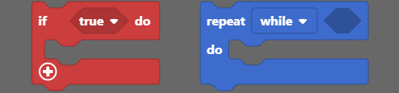

# Synthia Programmierung - Erste Schritte

* [Einführung](#einführung)
* [Los geht's! Schritt für Schritt](#los-gehts-schritt-für-schritt)
* [Wiederherstellen der Basis-Firmware von Synthia](#wiederherstellen-der-basis-firmware-von-synthia)

## Einführung

### Installation

#### Willkommen zum Synthia-Programmiertutorial

Vielen Dank für deine Unterstützung von CircuitMess und willkommen zum Synthia-Programmiertutorial.

Wir werden **CircuitBlocks** für die Programmierung deines neu zusammengebauten digitalen Musik Samplers verwenden.

CircuitBlocks ist eine von uns entwickelte Programmier-App.

Du wirst deinen Synthia in der grafischen, blockbasierten Programmieroberfläche von CircuitBlocks programmieren, die dir bei deinen ersten Schritten in der Welt der Hardwareprogrammierung helfen wird.

CircuitBlocks läuft derzeit auf Windows-, Linux- und Mac OS-Computern.

#### Wenn du einen Windows-Computer hast

1. **Gehe auf die [CircuitBlocks-Download-Seite](https://circuitmess.com/pages/download)**

2. **Lade die neueste Version für Windows herunter** - Prüfe dabei, ob du eine 32- oder 64-Version hast. Öffne dazu die "Einstellungen" App, klicke auf die Option "System" und suche den Abschnitt "Info". Hier siehst du den Systemtyp.

3. Starte die heruntergeladene Datei mit dem Namen "CircuitBlocks" durch einen Doppelklick.

4. CircuitBlocks wird automatisch installiert und eine neue Desktop-Verknüpfung wird erstellt.

**Dein PC ist nicht gefährdet!**

Es besteht die Möglichkeit, dass eine Meldung erscheint, die besagt, dass dein PC gefährdet ist, wenn du versuchst CircuitBlocks zu installieren. Mach' dir keine Sorgen! Diese Meldung wird manchmal angezeigt - unabhängig davon, ob CircuitBlocks sicher ist.

Wie du mit dieser Meldung umgehen kannst, erfährst du in den folgenden Anweisungen.

Diese Meldung erhältst du möglicherweise bei der Installation von CircuitBlocks auf deinem PC. Windows meldet eine Bedrohung, obwohl das Programm sicher heruntergeladen und ausgeführt werden kann. Bitte fahre mit der Installation fort, indem Du auf die Option *"Mehr Informationen"* (bzw. *"More info"* in englisch) klickst.

Nachdem du auf die Option *"Weitere Informationen"* geklickt hast, sollte am unteren Rand des Fensters die Option *"Trotzdem ausführen"* (in englisch: *"Run anyway"*) erscheinen.
Klicke auf die Option *"Trotzdem ausführen"* und fahre mit der Installation fort.

#### Wenn du einen Mac Computer hast

1. **Gehe auf die [CircuitBlocks-Download-Seite](https://circuitmess.com/pages/download)**

2. **Lade die neueste Version für MacOs herunter** - Eine Datei mit dem Namen "CircuitBlocks-1.0.1-Mac.dmg" oder ähnlichem sollte heruntergeladen werden.

3. Verschiebe die Datei in den Ordner "Programme".

4. CircuitBlocks wird automatisch installiert.

#### Wenn du einen Linux Computer hast

Es gibt zwei Möglichkeiten, CircuitBlocks unter Linux zu installieren.

**Linux 64-bit:**

1. **Gehe auf die [CircuitBlocks-Download-Seite](https://circuitmess.com/pages/download)**

2. Klicke auf den Download-Button **"Linux 64-bit"**

3. Unter Ubuntu startest du die Installation einfach per Doppelklick auf die Datei.  
   Bei anderen Linux-Distributionen öffne das Terminal und führe folgenden Befehl aus:  
   `sudo dpkg -i <Pfad zur heruntergeladenen Datei .deb>`

4. CircuitBlocks wird automatisch installiert und ein Desktop-Eintrag wird erstellt.

**Eigenständiges AppImage:**

1. **Gehe auf die [CircuitBlocks-Download-Seite](https://circuitmess.com/pages/download)**

2. Klicke auf den Download-Button **"Linux AppImage"**

3. Klicke mit der **rechten Maustaste** auf die Datei und wähle **"Eigenschaften"**

4. Gehen auf die Seite *"Berechtigungen"* (bzw. in englisch: *"Permissions"*) und setze ein Häkchen bei *"Ausführen der Datei als Programm zulassen"* (bzw. *"Allow executing file as program"*).

5. Doppelklicke die Datei und die Installation wird automatisch abgeschlossen.

Solltest du Probleme mit der Installation haben, wende dich bitte per E-Mail an contact@circuitmess.com und sende uns einen Screenshot des Problems sowie alle relevanten Informationen.

### Die Grundlagen

#### Benutzeroberfläche

Wenn du CircuitBlocks öffnest, siehst du ein Fenster, das wie oben gezeigt aussieht.

Es ist ziemlich einfach - Du kannst ein **neues Projekt (wir nennen Projekte auf englisch auch "Sketches")** beginnen, indem Sie auf die Schaltfläche "Neues Projekt" (englisch "New project") klickst.

**Gespeicherte Projekte** werden direkt neben dieser Schaltfläche angezeigt und du kannst jederzeit darauf zugreifen.

Wenn du auf ein Problem mit CircuitBlocks stößt, klicke bitte auf den Link "**Fehlerbericht senden**" (auf englisch "Send error report") am unteren Rand des Hauptbildschirms. Hierbei erhältst du dann eine Fehlermeldungsnummer. Bitte kontaktiere uns über contact@circuitmess.com und gib diese Fehlermeldungsnummer an, damit wir dir weiterhelfen können.

#### Erstellen eines neuen Projekts (Sketch)

Klicke auf die große Schaltfläche "Neues Projekt" (englisch "New project").

Nun bekommst du die Möglichkeit, das Gerät und den Projekttyp auszuwählen.

* Für das Gerät wähle bitte: **Synthia**.
* Für den Typ des Sketches wähle bitte: **Block**.

**Drücke die Schaltfläche "Erstellen" (englisch "Create").**

Es erscheint ein Bildschirm, der wie folgt aussieht:

Am oberen Rand des Bildschirms befindet sich eine **Symbolleiste** mit einigen Schaltflächen.

Die **Blockauswahlleiste** befindet sich ganz links - Du kannst Blöcke von dort nehmen und sie in den "Zeichenbereich" in der Mitte des Bildschirms ziehen.

In der Mitte des Bildschirms wirst du deinen Programmcode mit bunten Blöcken "zeichnen".

Auf der rechten Seite des Bildschirms siehst du, wie der in der **Programmiersprache C++** geschriebene Code auf magische Weise von selbst erscheint, wenn du die bunten Blöcke in die Mitte ziehst.

**C++** ist eine der beliebtesten Programmiersprachen, aber sie ist ziemlich komplex, wenn du noch nie programmiert hast.

Deshalb haben wir CircuitBlocks entwickelt - hier kannst du bunte Blöcke, die Teile des Codes darstellen, mit der Maus verschieben und ablegen und sehen, wie dein Programm in C++ aussehen würde. Wenn du erfahren genug bist, kannst du direkt zur textuellen Programmierung in C++ wechseln, ohne dass du bunte Blöcke benötigst.

#### Symbolleiste

Im Folgenden wird kurz erklärt, was die Schaltflächen in der Symbolleiste des Fensters bewirken:

1. **Zurück zum Hauptmenü** - bringt dich zum Startbildschirm zurück, ohne zu speichern.

2. **Speichern/Speichern unter** - speichert dein Projekt. Achte darauf, diese Schaltfläche von Zeit zu Zeit und vor dem Schließen von CircuitBlocks zu drücken.

3. **Synthia-Verbindungsanzeige** - Der rote Punkt wird grün, wenn dein Synthia über ein USB-Kabel mit deinem Computer verbunden ist.

4. **Exportieren in Binärform** - speichert eine Binärdatei deines Programmcodes auf deinem Computer. Dies ist eine fortgeschrittene Funktion, die du vorerst nicht brauchen wirst.

5. **Serieller Monitor** - Diese Schaltfläche öffnet ein Fenster, das wir den "Seriellen Monitor" nennen. "Seriell" ist ein Spitzname für eine Art der Kommunikation, die zwischen Synthia und deinem Computer stattfindet. In diesem Fenster kannst du später die Nachrichten sehen, die von Synthia an deinen Computer über den USB-Anschluss gesendet werden.

6. **Code schließen** - Mit dieser Schaltfläche kannst du das Code-Fenster auf der rechten Seite des Bildschirms schließen oder wieder öffnen. Dies ist nützlich, wenn du mehr Platz auf dem Bildschirm benötigst, um deine farbigen Blöcke zu sehen.

7. **Ausführen** (englisch "Run") - Diese Schaltfläche übersetzt den in CircuitBlocks erstellten Code in Maschinencode, den Synthia versteht (beep boop beep boop 1011100101) und sendet den Code über den USB-Anschluss an deinen Synthia.

#### Code-Fenster

Das so genannte "Code-Fenster" besteht aus den folgenden Teilen:

1. **Haupt-Code-Bildschirm** - in C++ geschriebener (Programm-)Code erscheint hier, wenn du bunte Blöcke auf der linken Seite des Bildschirms einfügst.
  Du wirst sehen, dass einige Teile des Codes in lustigen Farben eingefärbt sind.
  Programmierer nennen dies *Syntaxhervorhebung*. Im Grunde werden verschiedene Kategorien von Codebefehlen unterschiedlich eingefärbt, damit Programmierer den Code leichter verstehen können.

2. **Umschalter für helles/dunkles Farbschema** - mit dieser Schaltfläche kannst du die Hintergrund- und Textfarbe des Codefensters umschalten.

3. **Erweitern** - dehnt das Codefenster auf den gesamten Bildschirm aus. Drücke die Taste erneut, um es wieder auf den halben Bildschirm zu verkleinern.

4. **Schließen** - schließt das Code-Fenster, dieselbe Funktion wie die Schaltfläche "Code schließen" in der Symbolleiste.

#### Zeichenbereich

Auf dem Zeichenbereich geschieht die Magie.

Er besteht aus den folgenden Teilen:

1. **Suchleiste** - gib hier den Namen einer Komponente (in englisch) ein, nach der du suchst.

2. **Komponentenauswahl** - die Blöcke sind hier in verschiedene Kategorien unterteilt.
  Jeder Kategorie ist eine bestimmte Farbe zugewiesen.

3. **Zeichenfläche** - ziehe die Blöcke aus der Komponentenauswahl und lege sie in der Zeichenfläche ab. Auf diese Weise wird der Code erstellt. Kinderleicht!

4. **Zentrierwerkzeug** - wenn du dich beim Scrollen durch die Zeichenfläche verirrst, drücke diese Taste. Dadurch wird die Anzeige auf die Blöcke zentriert, die du auf der Zeichenfläche abgelegt hast.

5. **Zoom-Tasten** - zum Vergrößern und Verkleinern der Zeichenfläche.

### Arten von Blöcken

In CircuitBlocks gibt es insgesamt **neun** Blocktypen. Jeder von ihnen wird durch seine Farbe dargestellt. Jeder Block wird in Code übersetzt, der dann kompiliert und auf deinen Synthia hochgeladen wird, genau wie auf jeder Arduino-basierten Plattform.  

Jeden Blocktyp kannst du anklicken um einen Bereich zu öffnen, von dem du die zugehörigen Blöcke per Drag & Drop in die Zeichenfläche ziehen kannst.

Wenn du auf "Mehr" (englisch: "More") drückst, werden noch mehr Blöcke sichtbar, die nicht so häufig verwendet werden.

Es gibt zwei Hauptfunktionen in jedem Arduino-Code - `void setup()` und `void loop()`.

Alles, was in der Funktion `void setup()` enthalten ist, wird **nur einmal** ausgeführt. Sie wird hauptsächlich dazu verwendet, die Software zu starten, Variablen zu initialisieren und zu deklarieren und Funktionen auszuführen, die nur einmal ausgeführt werden müssen (z.B. der Intro-Bildschirm in einem Videospiel).

Die **Schleife** `void loop()` ist der Ort, an dem sich alles andere abspielt. Sie führt im Grunde jedes Stückchen Code darin wiederholt aus (die Geschwindigkeit hängt vom Gerät ab - stellen dir einfach vor, sie wäre ultraschnell!)

Jeder Block, den du einfügst, wird automatisch in die Funktion `void loop()` eingefügt.

Wenn du etwas in die Funktion `void setup()` einfügen möchtest, musst du den Hauptblock aus **Functions** herausziehen und deine Blöcke nach Belieben darin platzieren, aber dazu etwas später mehr.  

#### Elliptische Blöcke

Elliptische Blöcke stellen Variablen dar. Ob es sich nun um ganze Zahlen, Zeichenketten oder andere Variablentypen (außer Boolesche) handelt, sie alle sind an der gleichen Form zu erkennen.

Außerdem geben größere Blöcke mit elliptischer Form entweder Integer- oder Float-Werte zurück.

Wann immer du kreisförmige "Löcher" in einigen Blöcken findest, kannst du Variablen einfügen. Dies ist am häufigsten in Vergleichs- oder Aktionsblöcken zu finden.

#### Dreieckige Blöcke

Dreieckige Blöcke stellen boolesche Variablen dar.

Sowohl Variablen (wahr und falsch) als auch Funktionen, die boolesche Werte zurückgeben, haben die gleiche Form.

Unabhängig von der Farbe gibt jeder dieser Blöcke entweder `true` (wahr) oder `false` (falsch) zurück.

Für dreieckige "Löcher" müssen boolesche Blöcke eingefügt werden.

#### Programmbausteine

Alles andere sind im Grunde Programmbausteine (englisch "building blocks").
Das sind Funktionen, die keinen Rückgabewert haben.
Sowohl elliptische als auch dreieckige Blöcke müssen zunächst innerhalb der Programmbausteine platziert werden, um als Teil des Programms zu fungieren.

Sie haben eine bestimmte "Puzzle"-Form und können ineinander gestapelt werden.

Der **Hauptbaustein** befindet sich im Abschnitt "Funktionen" (englisch "Functions").

Es gibt im Grunde zwei Hauptbausteinabschnitte:

* "**Arduino run first**" für alles, was zuerst ausgeführt werden soll (der Code landet in `void setup()`) und
* "**Arduino loop forever**" für die Anteile, die innerhalb der Arduino-Schleife immer wieder wiederholt werden sollen (in `void loop()`).

#### Blöcke einfügen

Dies ist nun der wichtigste Teil.

Der ganze Sinn der blockbasierten Programmierumgebung ist das Verbinden von Blöcken und deren Platzierung in einem anderen Block.

Das alles geschieht durch einfaches **Drag-and-Drop**, also das Verschieben der Blöcke mit der Maus.

Hier ist ein Beispiel für ein Programm, welches die Variable `Var` auf `1` setzt und dann erhöht, solange sie kleiner als `10` ist.

Am Ende des Programms wird `Var`den Wert `10`haben.

Dies ist nur ein einfaches Beispiel, und die Blockbildung wird in den folgenden Kapiteln näher erläutert.

### Blocktypen

CircuitBlocks bietet insgesamt **neun** Blocktypen.
Wir haben sie so organisiert, dass du alles mit maximal zwei Klicks finden kannst.

Die Typen selbst sind ziemlich selbsterklärend, aber wir werden sie alle durchgehen, um ein besseres Verständnis für das ganze Konzept zu bekommen.

Einige der Typen bieten **zusätzliche Blöcke** (im Menü "Mehr", englisch "More"), mit Funktionen, die nicht so häufig verwendet werden, aber dennoch nützlich sein können.

#### Logik (Logic)

Hier befindet sich die Basis für jeden Code.

Jede **Wenn/Dann**-Funktion (if, if-else, else), Vergleiche, Und/Oder/Nicht, Wahr/Falsch und andere logische Operatoren.  

#### Schleifen (Loops)

Schleifen sind Funktionen, die alles, was sie enthalten, eine bestimmte Zeit lang wiederholen.

Sie können an Bedingungen geknüpft sein und so lange wiederholt werden, wie die Bedingung erfüllt ist, oder eine vorher festgelegte Anzahl von Wiederholungen haben.

#### Mathematik (Math)

So ziemlich jede mathematische Funktion ist hier zu finden. Von grundlegenden Operationen bis hin zum Runden von Zahlen und der Arbeit mit Winkeln wirst du in sekundenschnelle deinen inneren Einstein oder Pythagoras wecken!

#### Text

Zeichenketten, Zeichen und Zeichenkettenmanipulation. Ein großartiger Ort, um neuen Text zu erstellen und ihn in deinen Programme zu implementieren.

#### Variablen (Variables)

Erstelle eine Variable beliebigen Typs und lege ihren Namen und den gewünschten Wert fest. CircuitBlocks erkennt den Variablentyp (`int, double, string, boolean`) automatisch, so dass du dir darüber keine Gedanken machen musst.

#### Funktionen (Functions)

Die Arduino-Hauptfunktion (die wir [im vorherigen Kapitel](#programmbausteine) erklärt hatten) befindet sich hier.

Du kannst auch eigene Funktionen erstellen, die dann als einer der Hauptbestandteile deines Programms eingefügt werden können.

#### Eingabe/Ausgabe (Input/Output)

Alles, was die Komponenten von Synthia betrifft, befindet sich hier.

#### LED-Matrix

Nun, da wir so viele LEDs in Synthia eingebaut haben, wäre es doch cool, wenn du etwas mit ihnen machen könntest!

Hier kommt die ganze Magie dieser kleinen LEDs auf der Vorderseite der Platine zum Tragen.
Mit diesen Blöcken kannst du so viel machen.

#### Zeit (Time)

Verzögerungen, Timer und andere zeitbezogene Dinge, ideal für die Erstellung cooler Animationen und Videospiele.

#### Suchleiste

Über den Blocktypen befindet sich eine **Suchleiste**, die dir die Suche nach einem bestimmten Block erleichtert, den du einfach nicht finden kannst.

Gib einfach (in englisch) ein, was dir in den Sinn kommt, und alle Blöcke, die etwas mit dem Suchbegriff zu tun haben, werden auf der rechten Seite angezeigt.

Nun kann man wirklich nicht sagen, dass es unmöglich ist, etwas zu finden.

Du hast alles über die Blöcke gelernt!
Es ist an der Zeit, zur nächsten Lektion überzugehen...

## Los geht's! Schritt für Schritt

### Ausprobieren der LED-Matrix

Im den nächsten Kapiteln stellen wir dir drei Beispiele vor, die dich in die Welt des Programmierens einführen werden!

Verbinde deinen Synthia mit deinem PC, öffne CircuitBlocks und folge diesen Schritten.

[Todo](https://learn.circuitmess.com/resources/guides/en/synthia-coding-guide/synthia-coding-guide-2-1)

### Klicken, Schieben und Drehen

[Todo](https://learn.circuitmess.com/resources/guides/en/synthia-coding-guide/synthia-coding-guide-2-2)

### Lass uns malen!

[Todo](https://learn.circuitmess.com/resources/guides/en/synthia-coding-guide/synthia-coding-guide-2-3)

## Wiederherstellen der Basis-Firmware von Synthia

Wenn du mit dem Programmieren fertig bist und deinen Synthia einfach wieder "normal" machen willst, musst du seine Basis-Firmware wiederherstellen.

Das ist ganz einfach: Schließe deinen Synthia an den USB-Anschluss deines Computers an und drücke die Schaltfläche "Firmware wiederherstellen" (englisch: Restore firmware) oben rechts.

Du wirst in einem Fenster aufgefordert, das Gerät auszuwählen, für das du die Firmware wiederherstellen möchtest.

Wähle hier natürlich **Synthia**.

Warte ein paar Sekunden, und dein Synthia wird wieder wie gewohnt funktionieren.

Du musst dies immer dann tun, wenn du mit der Programmierung von Synthia fertig bist und wenn du möchtest, dass er seine ursprünglichen Funktionalität zurück erhält.

### Wie geht's weiter?

Du hast das Ende unseres Synthia-Tutorials erreicht, Herzlichen Glückwunsch!

Wir hoffen, du bist genauso gespannt wie wir auf die Zukunft von Synthia, denn es gibt so viele coole Dinge, die wir in den zukünftigen Firmware- und CircuitBlocks-Updates damit machen wollen.

In der Zwischenzeit kannst du auf eigene Faust weiterforschen und uns zeigen, was du mit deinem Synthia gemacht hast, indem du es im [CircuitMess-Community-Forum](https://community.circuitmess.com/?_ga=2.166930871.840181958.1656360907-1260944362.1654289164) oder über unseren [Discord-Kanal](https://discord.com/channels/765164309655060480/771790668036833280) teilst.

Wenn du Hilfe mit deinem Gerät brauchst, wende dich wie immer an uns über contact@circuitmess.com, und wir werden dir so schnell wie möglich helfen.

Vielen Dank und mach' weiter so!
