# Synthia Benutzerhandbuch

* [Finde dich zurecht...](#finde-dich-zurecht)
  * [Wozu können die Knöpfe verwendet werden?](#wozu-können-die-knöpfe-verwendet-werden)
* [Aufnehmen, mischen, abspielen!](#aufnehmen-mischen-abspielen)
  * [Track-Modus und Wiedergabe!](#track-modus-und-wiedergabe)
  * [Wie speichert man die vorgenommenen Änderungen?](#wie-speichert-man-die-vorgenommenen-änderungen)
  * [Bearbeiten des Sample Slots](#bearbeiten-des-sample-slots)
  * [Zeit für die Aufnahme!](#zeit-für-die-aufnahme)
  * [Was kommt als Nächstes?](#was-kommt-als-nächstes)

## Finde dich zurecht...

### Wozu können die Knöpfe verwendet werden?

Wenn Du diese Anleitung liest, hast du Synthia erfolgreich zusammengebaut! Herzlichen Glückwunsch!

**Hier erfährst du, was du damit machen kannst, wie du deinen eigenen Sound oder deine Stimme aufnimmst, sie mischst und alles in verschiedenen Samples speicherst.**

Eines der coolsten Dinge an Synthia ist, dass alles, was du wissen musst, um mit ihm zu spielen, auf seiner Rückseite steht.

Wir haben uns entschieden, eine Kurzanleitung auf die Platine zu drucken, damit du diese Anleitung nicht ständig aufschlagen musst, sondern Synthia einfach umdrehen und dir merken kannst, wofür jeder Knopf da ist!

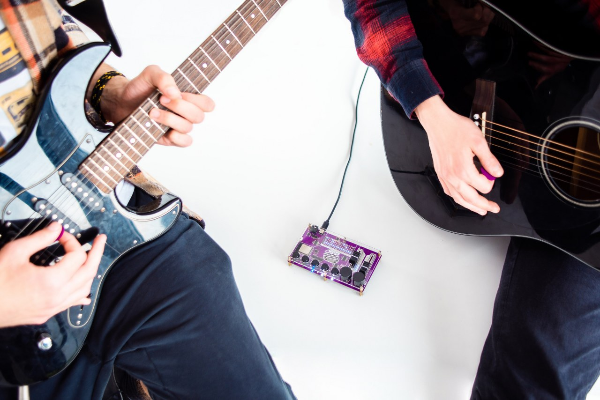

#### Schauen wir uns die Encoder an

In diesem Kapitel werden wir dich nicht durch jede einzelne Aktion führen, die du mit all den Tasten, Schiebereglern und Encodern ausführen kannst. Wir werden nur die Grundlagen erwähnen!

Fangen wir mit den Encodern (bzw. den "Drehgebern") an!

Mit Synthia kannst du einzelne Tonschnipsel (wir nennen sie "Sounds") auf verschiedenen Tonspuren (die wir "Tracks" nennen) zu Liedern kombinieren. Synthia bietet mehrere Bereiche ("Slots") zum Speichern von Tracks und Sounds an.

Mit dem **linken Encoder** kannst du deine Tracks und Sounds in einem der vier verfügbaren Slots **speichern** und entscheiden, welchen **vorinstallierten Sound** du bearbeiten möchtest.

Mit dem **rechten Encoder** navigierst du im Track, startest und beendest die Wiedergabe und wählst einen Effekt aus, wenn du etwas bearbeitest.

Wenn du **beide Encoder** gleichzeitig drückst, wird der **Hardware-Test** neu gestartet.

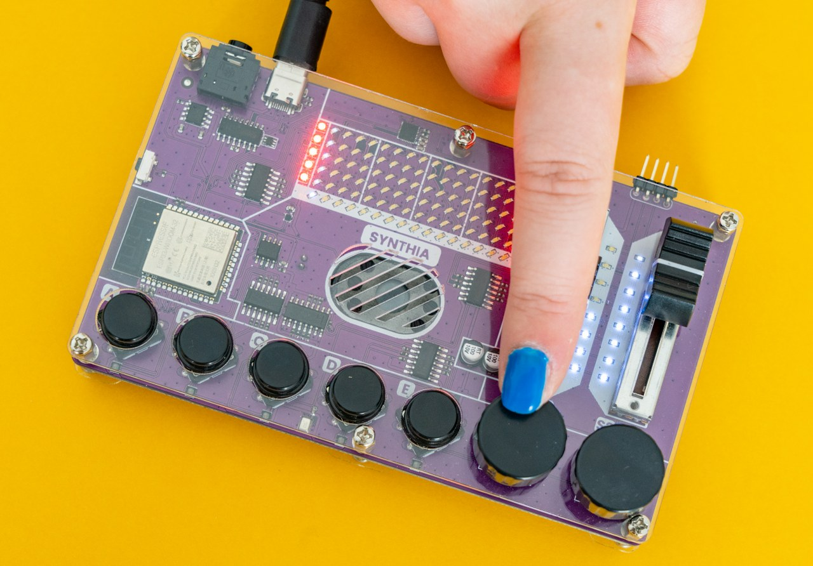

#### Jetzt ist die Zeit für die Schieberegler gekommen!

Auch hier haben wir zwei davon - den linken und den rechten.

Mit dem **rechten Schieberegler** kannst du die **Lautstärke** und **Effektintensität** des bearbeiteten Samples ändern, während du mit dem **linken Schieberegler** die **Geschwindigkeit** des Samples und das **Tempo** des Tracks ändern kannst.

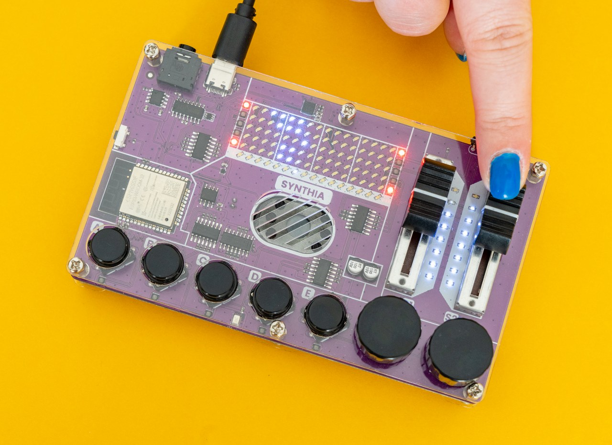

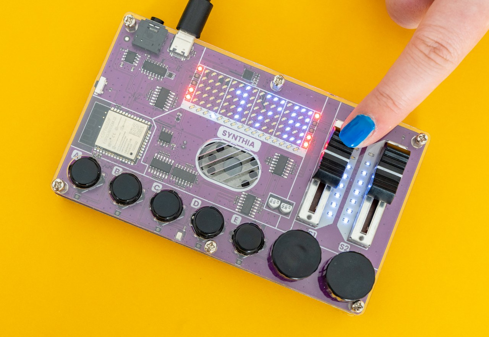

#### Und schließlich - die Druckknöpfe!

Es gibt fünf Druckknöpfe bzw. Taster, die im Grunde alle das Gleiche tun.

Jeder von ihnen hat seinen eigenen Klang. Es ist sehr einfach, sie zu benutzen - wenn du lernst, was einer von ihnen tun kann, hast du gelernt, wofür sie alle da sind.

**Sie werden verwendet für:**

* Platzieren von Samples auf der Tonspur/Track
* Samples aus dem Track entfernen
* Bearbeiten der Sample-Slots
* Aktivieren oder Deaktivieren von Tonspuren
* Verlassen des Speichermenüs
* Aufnehmen deiner Sounds & Kopieren von Sounds in den aktuellen Slot

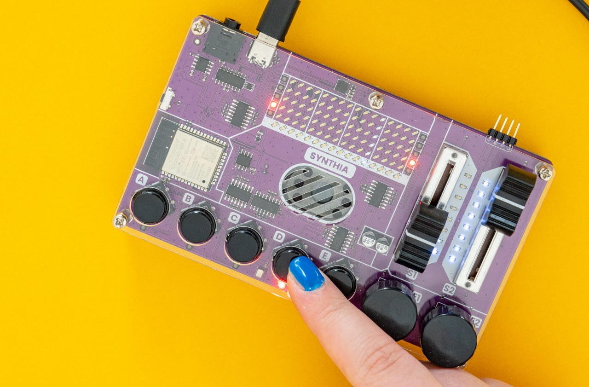

Du hast gelernt, was jeder Teil von Synthia macht.
Jetzt bist du bereit, sie zu benutzen!

## Aufnehmen, mischen, abspielen!

### Track-Modus und Wiedergabe!

Jetzt, wo du weißt, wofür die einzelnen Tasten da sind, ist es an der Zeit, sich an die eigentliche Arbeit zu machen!

#### Zuerst führen wir dich durch den Track-Modus!

Um durch die Tonspur bzw. den Track zu **navigieren**, benutzt du den **rechten Encoder**.

Während du den rechten Encoder **drehst**, kannst du deine **Position** im Track auf der **LED-Matrix** sehen - die leuchtenden LEDs ändern ihre Position, während du den Encoder drehst, je nachdem, wo du dich gerade im Track befindest.

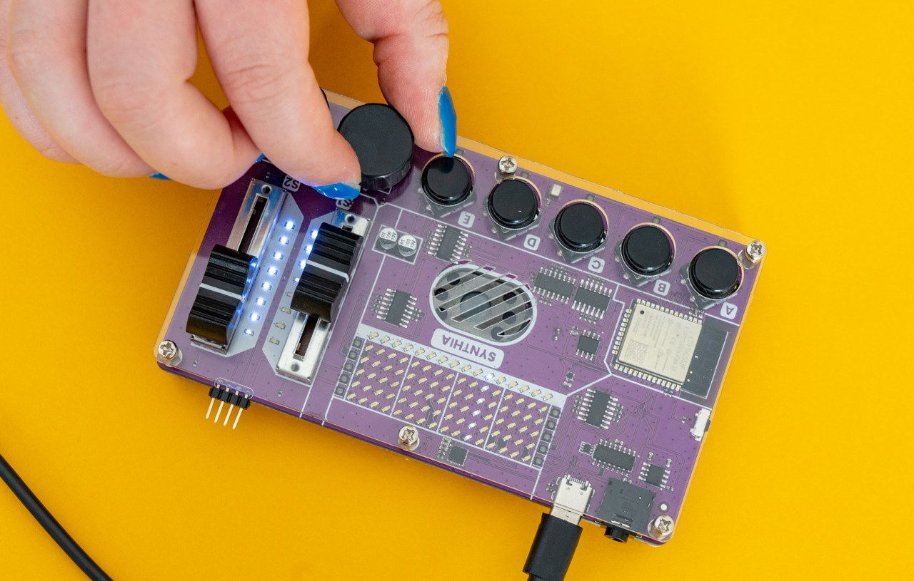

**Drücke den rechten Encoder**, um alle Samples an der aktuellen Position **abzuspielen**.

Halte den rechten Encoder etwas **länger gedrückt**, um die aktuelle Spurposition zu **löschen**.

Während du den **Track bearbeitest**, kannst du eines der Samples an der aktuellen Position **platzieren, entfernen oder bearbeiten**. Dazu verwendest du die **Druckknöpfe**.

Möchtest du zum Beispiel das vierte Sample in den Track einfügen, musst du auf den vierten Taster klicken, während du dich in der gewünschten Tonspur befindest. Die LED in der vierten Reihe des Tracks leuchtet auf und zeigt damit an, dass ein Sample an dieser Stelle platziert wurde.

#### Ändern des Samples im Track-Modus

**Klicke einfach doppelt** auf den entsprechenden Druckknopf und das Sample wird aus dem Track **entfernt**.

Du kannst auch die **Lautstärke** und das **Tempo** des Tracks, der gerade abgespielt wird, ändern.
Hierfür verwendest du die **Schieberegler**!

Wenn du die **Lautstärke** einstellen möchtest, schiebe den **rechten Schieberegler**, und wenn du das **Tempo** ändern willst, schiebe den **linken**.

An der Seite der Schieberegler befinden sich **LEDs**, die die Lautstärke und das Tempo anzeigen.

Wenn **alle LEDs** neben dem rechten Schieberegler aufleuchten, bedeutet das, dass die **maximale** Lautstärke eingestellt ist. Das Gleiche gilt für das Tempo!

Durch Klicken oder Drehen des linken Encoders gelangst du in das **Speichermenü**, in dem du die erstellten Beats und synthetisierten Sounds speichern kannst.

**Wenn du mit dem Track fertig bist und deinen Mix abspielen willst, musst du die Wiedergabe aufrufen!**

#### Halte den linken Encoder ein paar Sekunden lang gedrückt, um die Wiedergabe zu starten!

Drehst du während der Wiedergabe den rechten Encoder, kannst du dich **durch deinen Track bewegen**.
Du kannst die Druckknöpfe verwenden, um die Wiedergabe der Samples der jeweiligen Taste zu aktivieren oder zu deaktivieren.

Halte den linken Encoder gedrückt, um die **Wiedergabe zu beenden** - wie beim Starten der Wiedergabe.

### Wie speichert man die vorgenommenen Änderungen?

**Du wirst wahrscheinlich einige Änderungen vornehmen, die du speichern möchtest.**

Wie bereits im vorigen Kapitel erwähnt, musst du auf den **linken Encoder klicken**, um das **Speichermenü** zu öffnen.

Sobald du dich im Speichermenü befindest, drehe den linken Encoder, um den Speicherbereich ("Slot") auszuwählen, den du speichern oder von dem du laden möchtest. Sobald du ihn gefunden hast, klicke auf den linken Encoder, um die Auswahl zu bestätigen.

Synthia verfügt über **vier Slots zum Speichern** deiner Tracks und Sounds, und du musst auswählen, in welchem Slot du den Track speichern möchtest.

Dabei wird die LED-Matrix wie folgt aussehen:

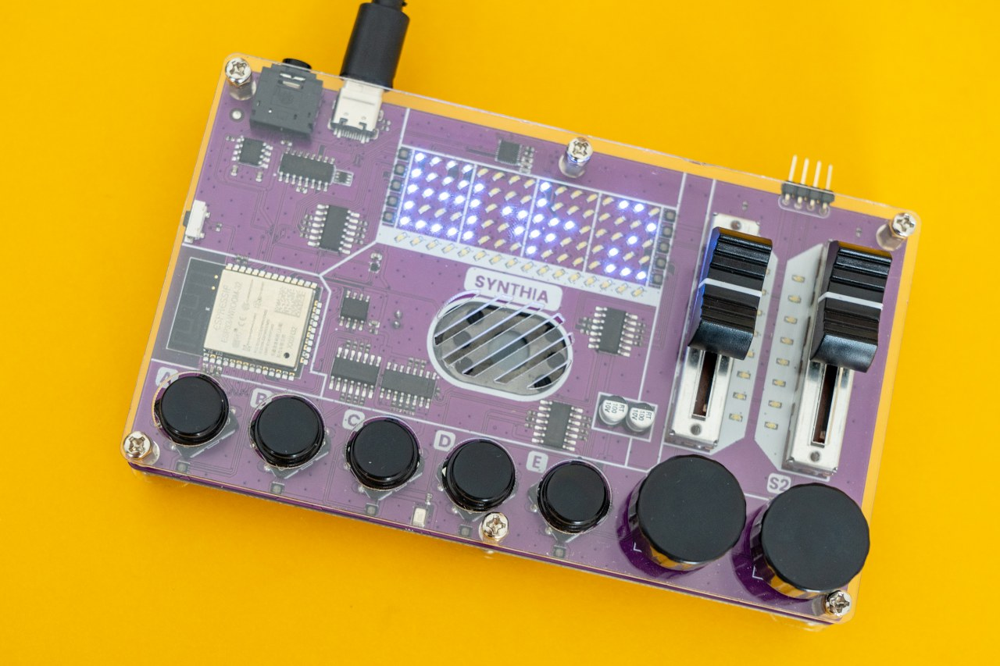

Wähle nun die gewünschte Aktion - **Laden oder Speichern**.

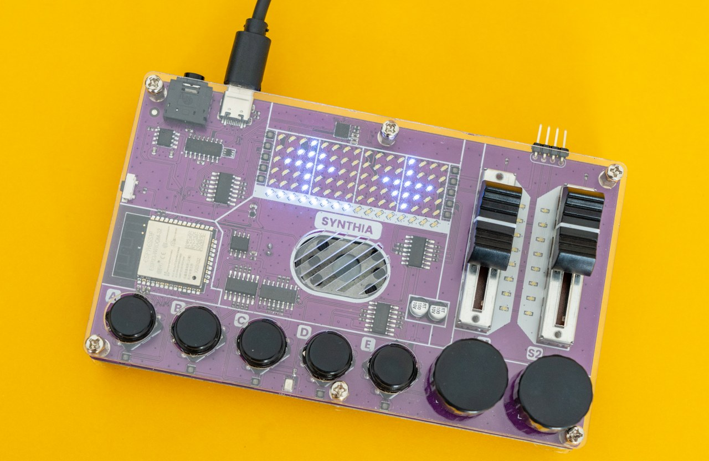

Nun bestätige oder verwerfe deine Auswahl.

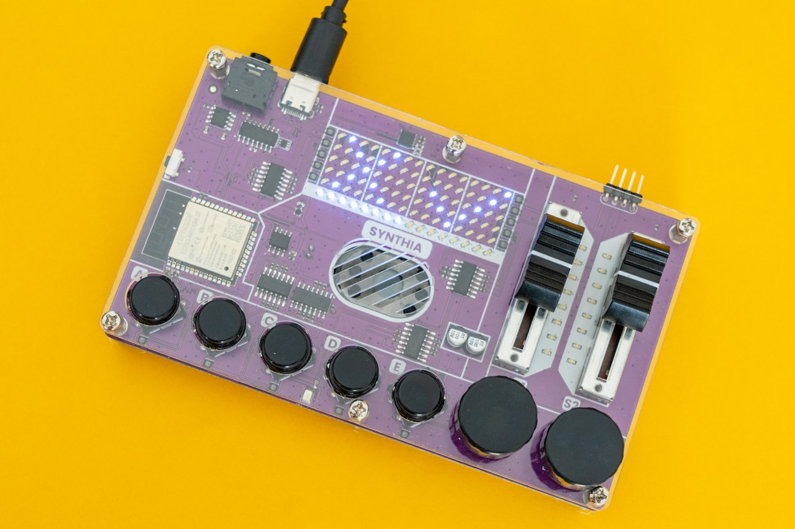

Um das **Speichermenü zu verlassen**, drücke einfach einen der Druckknöpfe, drehe oder klicke auf den rechten Encoder oder bewege einen der beiden Schieberegler.

### Bearbeiten des Sample Slots

Wenn du den **Sample-Slot bearbeiten** möchtest, musst du ein paar Dinge wissen!

Um in den Sample-Editiermodus zu gelangen, **halte den Druckknopf des Slots gedrückt**, den du bearbeiten möchtest.

Wenn du den Sound des vierten Slots bearbeiten möchtest, halte den entsprechenden Druckknopf "D" einfach eine Sekunde lang gedrückt. Synthia wechselt in den Sample-Editiermodus und die LED unter dem Slot, den du bearbeitest, leuchtet gelb.

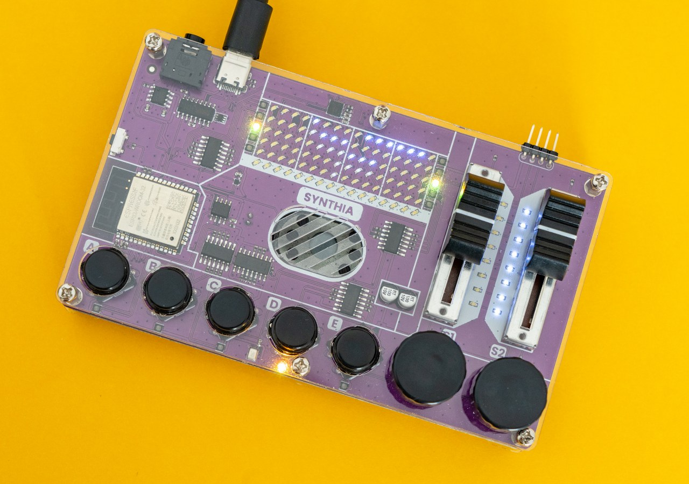

Während du einen **Slot bearbeitest**, kannst du wählen, welches **vordefinierte Sample** abgespielt wird, wenn der entsprechende Druckknopf gedrückt wird. Du kannst auch die Intensität aller auf den Sound angewendeten Effekte ändern.

Verwende den linken Encoder, um das Sample zu ändern, das in diesem Slot gespielt wird. Du hörst sofort den Sound dieses Samples, und die LED-Matrix zeigt eine visuelle Darstellung des Instruments, das diesen Sound erzeugt.

**Synthia wird mit fünf Klängen ausgeliefert**, die du auswählen kannst. Die letzte Option beim Drehen des linken Encoders dient dazu, eigene Samples aufzunehmen - mehr dazu im nächsten Kapitel!

Drehe den rechten Encoder, um den gewünschten **Effekt auszuwählen**, und bewege dann den rechten Schieberegler, um die Intensität des Effekts zu ändern. Du kannst auch den linken Schieberegler verwenden, um die **Tonhöhe des Samples zu ändern**.

Drücke jederzeit die Taste des Slots, den du gerade bearbeitest, um zu hören, wie das Sample klingt. Du kannst auch eine der anderen Tasten drücken, um diese Samples abzuspielen.

Synthia bietet wie erwähnt fünf vorinstallierte Sounds und fünf Effekte.

**Schauen wir uns die Effekte an:**

1. **Lautstärke / Volume** - selbsterklärend - ändert die Lautstärke des Samples.
2. **Bit Crusher / Roboter** - der kleine Roboter-Effekt reduziert die Auflösung oder Bandbreite digitaler Audiodaten und lässt sie wie einen Roboter klingen.
3. **Circles / Kreise** - fügt dem Sound ein Echo hinzu.
4. **Hochpassfilter** - konzentriert sich auf die hohen Frequenzen wie Gesang und reduziert die Bässe.
5. **Tiefpassfilter** - konzentriert sich auf die tiefen Frequenzen und macht den Ton tiefer und bassreicher.

### Zeit für die Aufnahme!

Jetzt ist es an der Zeit für den wahrscheinlich aufregendsten Teil dieser Anleitung, nämlich die **Aufnahme**!

**Um dein eigenes Sample aufzunehmen**, musst du den Slot-Editiermodus aufrufen und mit dem linken Encoder den letzten Eintrag auswählen (das ist das Aufnahme-Sample).

Sobald du dich im **Aufnahmemodus** befindest, sollte die kleine **LED unter dem Slot**, den du gerade bearbeitest, **rot aufleuchten**, um dir zu zeigen, dass du gerade aufnimmst.
Genau wie bei einer Videokamera, richtig?

Zum Aufnehmen halte den Druckknopf, die du gerade bearbeitest, gedrückt. In dem Moment, in dem du die Taste drückst, beginnt Synthia mit der Aufnahme - solange bis du die Taste wieder loslässt. Maximal eine Sekunde lang.

Nachdem du mit der Aufnahme fertig bist, muss Synthia die Aufnahme verarbeiten und speichern, was ein oder zwei Sekunden dauern kann. Vielleicht denkst du, dass Synthia blockiert ist, aber keine Sorge, es arbeitet nur an der Aufnahme.

**Anmerkung:**  
Wenn du dich im Aufnahmemodus befindest und eine der **LEDs** unter den Drucktasten **blau leuchtet**, bedeutet dies, dass du in diesem Slot eigene Samples aufgenommen hast.

Du kannst auf einen der blau leuchtenden Druckknöpfe drücken, um die Aufnahme von diesem Slot in den Slot zu kopieren, den du gerade bearbeitest.

### Was kommt als Nächstes?

**Der Spaß ist hier noch nicht zu Ende!**

Es wartet immer noch die **Programmierung** auf dich!

Im Programmierleitfaden findest du hierzu weitere Informationen.

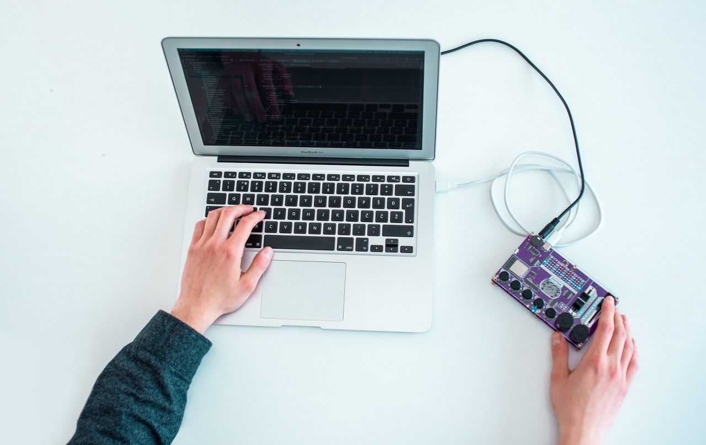

Wir laden dich außerdem ein, unserem [Discord-Kanal](https://discord.gg/wdKa8AP7) und unserer [Facebook-Gruppe](https://www.facebook.com/groups/circuitmesscommunity) beizutreten, wo du Ideen, Fotos und Feedback mit anderen Bastlern austauschen kannst und exklusive Neuigkeiten von CircuitMess erhältst.
